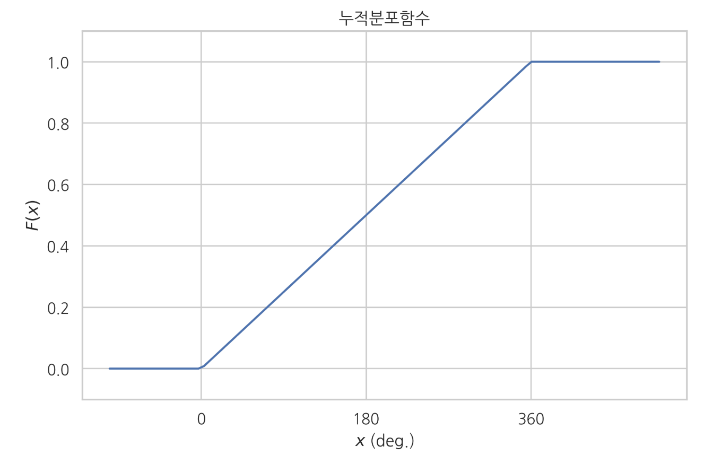

# 확률분포함수

### Summary

- 확률분포는 어떤사건에 어느 정도의 확률이 할당되었는지 묘사한 정보이다. 
- 확률분포함수에는 확률질량함수, 누적분포함수, 확률밀도함수가 있다. 확률질량함수는 유한개의 사건이 존재하는 경우 각 단순사건에 대한 확률만 정의하는 함수이다. 누적분포함수는 숫자 하나만으로 정의하는 방법으로 시작점을 음의무한대로 통일시켜 정의한 함수이다. 확률밀도함수는 누적분포함수를 미분한 도함수이다. 
- 누적분포함수의 단점은 하나는 어떤 값이 더 자주 나오든가 혹은 더 가능성이 높은지에 대한 정보를 알기 힘들다는 점이다. 이를 알기 위해서는 확률 변수가 나올 수 있는 전체 구간 ($$-\infty$$ ~ $$\infty$$)을 아주 작은 폭을 가지는 구간들로 나눈 다음 각 구간의 확률을 살펴보는 것이 편리하다. 이 때 사용할 수 있는 수학적 방법이 바로 미분(differentiation)이다. 미분은 함수의 구간을 무한대 갯수로 쪼개어 각 구간의 변화으 정도 즉, 기울기를 계산하는 방법이다. 누적 밀도 함수를 미분하여 나온 도함수(derivative)를 확률 밀도 함수(probability density function)라고 한다.

___________

### 확률분포 Probability distribution

**확률분포(probability distribution)** 는 어떤 사건에 어느 정도의 확률이 할당되었는지 묘사한 정보이다.

확률분포함수

- 확률질량함수
- 누적분포함수
- 확률밀도함수

### 단순사건과 확률질량함수

**단순사건(elementary event, atomic event)** 은 표본을 1개만 가지는 사건이다.

단순사건끼리는 서로 교집합을 가지지 않으므로 유한개의 사건만 있는 경우, 모든 단순사건의 확률값을 알면 콜모고로프의 세번째 공리에 의해 다른 모든 사건의 확률값을 계산할 수 있다. 단 모든 단순사건의 확률의 합은 1이어야 한다.

**확률질량함수(probability mass function)** 는 유한개의 사건이 존재하는 경우 각 단순사건에 대한 확률만 정의하는 함수이다. 소문자 $$p$$ 로 표시한다.  $$p(a)$$ 에서 $$a$$ 는 표본이다. 
$$
p(a) = P(\{a\})
$$

예) 원소가 하나뿐인 사건 {1}에 대한 확률은 확률함수로 정의할 수 있다.  $$P(\{1\}) = 0.2$$ 

같은 내용을 확률질량함수로 나타내면 다음과 같다. $$p(1) =0.2$$  

확률함수가 원소 2개 이상인 사건에 대해서도 확률을 정의할 수 있는데($$P({1, 2}) = 0.3$$) 확률질량함수는 사건이 아닌 원소(그 원소만을 가진 단순사건)에 대해서만 정의 된다.

### 표본의 수가 무한한 경우

**표본의 수가 무한하고 모든 표본에 대해 표본 하나만을 가진 사건의 확률이 동일하다면, 표본 하나에 대한 사건의 확률은 언제나 0이다.**

### 구간

표본공간이 실수의 집합이라면 대부분의 사건(부분집합)은 시작점과 끝점이라는 두 개의 숫자로 이루어진 구간(interval)으로 표현된다. 𝑎는 구간의 시작점이고 𝑏는 구간의 끝점이다.
$$
A = \{ a < x \leq b \}
$$

구간을 입력받아 확률값을 출력하는 함수는 다음처럼 이차원 함수 𝑃(𝑎,𝑏)로 표현할 수 있다.
$$
P(A) = P(\{ a < x \leq b \}) = P(a, b)
$$

구간의 확률만 표현할 수 있다면 여러개의 구간으로 이루어진 복잡한 사건은 콜모고로프의 공리에 따라 각 구간의 확률값의 더하기나 빼기로 표현할 수 있다.

예를 들어 다음과 같은 사건 $$B = \{ -2 < x \leq 1 \text{ or } 2 < x \leq 3 \}$$

확률 𝑃(𝐵)는 다음 두 구간의 확률의 합이다. 

$$P(B) = P(\{ -2 < x \leq 1\}) + P(\{2 < x \leq 3\}) = P(-2, 1) + P(2, 3)$$

### 누적분포함수 cumulative distribution, cdf

**누적분포함수(cumulative distribution), cdf** 는 숫자 하나만으로 구간을 정의하는 방법으로 시작점을 모두 똑같이 음의 무한대로 통일한 특수한 구간 $$S_x$$ 을 사용하는 것이다. 이 사건의 확률분포를 묘사하는 함수이다. 함수 기호로는 $$F(x)$$ 등 대문자 기호로 표시한다. 독립변수 $$x$$ 는 구간의 끝점을 뜻한다. 
$$
F(x) = P(S_x) = P(\{X < x\})
$$

누적분포함수와 콜모고로프의 세번째 공리를 이용하여 사건 $$S_x$$ 의 확률값으로부터 대부분의 복잡한 구간사건에 대한 확률값을 계산할 수 있다.

$$\{ a < x \leq b \}$$라는 구간사건의 확률를 콜모고로프의 공리에서 
$$
A \cap B = \emptyset \;\;\; \rightarrow \;\;\; P(A \cup B) = P(A) + P(B)
$$

$$
P(-\infty, b) = P(-\infty, a) + P(a, b)
$$

$$
F(b) = F(a) + P(a, b)
$$

$$
P(a, b) = F(b) - F(a) 
$$

단변수 함수로 되었다. 그러나 함수를 두번 호출해야한다.

누적분포함수 cdf는 다음과 같은 특징을 가진다.

- 음의 무한대에 대한 누적분포함수값은 0이다.

$$
F(-\infty) = 0
$$

-  양의 무한대에 대한 누적분포함수값은 1이다.

$$
F(+\infty) = 1
$$

-  입력이 크면 누적분포함수값은 커딘다. (단조증가)

$$
x > y \;\; \rightarrow \;\; F(x) \geq F(y)
$$

위의 세가지 특성에 따라 누적분포함수는 0에서 시작하여 천천히 증가하면서 1로 다가서는 형태 를 가진다. 단조증가 성질에 의해 절대로 내려가지 않는다. 어디에 확률이 많이 할당 됐는지는 알수없다.(기울기를 알아야한다.)

### 확률밀도함수 probability density function, pdf

확률밀도함수(probability density function)는 누적분포함수를 미분하여 구한 도함수이다.

$$
p(x) = \dfrac{dF(x)}{dx} 
$$

확률밀도함수는 특정한 구간의 확률이 다른 구간에 비해 상대적으로 얼마나 높은가를 나타내는 것이며 그 값 자체의 확률은 아니라는 점을 명심해야 한다. 

미적분학의 기본 원리에 의하면 $$𝑥=𝑥_1$$부터 $$𝑥=𝑥_2$$ 사이에서 도함수인 확률밀도함수의 면적(정적분)은 적분함수인 누적분포함수의 값을 이용하여 구할 수 있다.

$$
F(x_2) - F(x_1) = \int_{x_1}^{x_2} p(u) du
$$

누적분포함수와 확률밀도함수의 관계를 적분으로 나타내면 다음과 같다.

$$
F(x) = \int_{-\infty}^{x} p(u) du
$$

확률밀도함수는 다음과 같은 특징을 가진다.

적분함수인 누적분포함수의 기울기가 음수가 될 수 없기 때문에 확률밀도함수는 0보다 같거나 크다.

$$
p(x) \geq 0 
$$

$$-\infty$$ 부터 $$\infty$$ 까지 적분하면 표본공간 $$(-\infty, \infty)$$ 의 확률이 되므로 값은 1이다.

$$
\int_{-\infty}^{\infty} p(u)du = 1
$$

