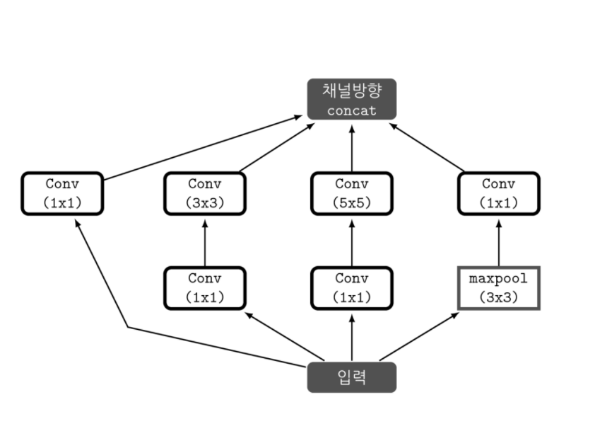

# GoogLeNet

### Summary

- Inception module은 노드간의 연결을 줄이면서(sparse connectivity) 행렬연산은 Dense 연산을 하도록 처리한 것이다.
__________

convolution 연산으로 Densely하게 연결되어 있는 것을 높은 관련성(correlation)을 가진 노드끼리만 연결하도록(연결을 sparse하도록) 바꾸면 연산량과 파라미터 수가 줄고 overfitting 또한 개선될 것이라는 생각에서 출발하였다. Fully connected network에서 사용되는 Dropout과 비슷한 기능을 할 것이라고 본 것이다.  요약하면 어떻게 노드 간의 연결을 줄이면서(sparse connectivity) 행렬 연산은 Dense 연산을 하도록 처리하도록 하는 것이다. 이 고민의 결과가 Inception module이다.

### Inception module

위의 그림에서 알 수 있듯이 입력값에 대해 4가지 종류의 연산을 수행하고 4개의 결과를 채널방향으로 합친다. 이러한 Inception module이 모델에 총 9개가 있다. 

##### Inception module의 4가지 연산

- 1x1 convolution
- 1x1 convolution -> 3x3 convolution
- 1x1 convolution -> 5x5 convolution
- 3x3 maxpooling -> 1x1 convolution
- 위의 결과를 Channel-wise concat(feature map을 쌓는 것)

1x1 convolution 연산은 Inception module에서 핵심 역할을 한다. 

- 첫번째 기능은 채널의 수를 조절하는 기능이다. 채널 간의 Correlation을 연산한다는 의미이다. 기존의 convolution연산은 3x3 커널을 이용해 연산할 경우 3x3크기의 지역정보 뿐 아니라 커널 간의 정보 또한 같이 고려하여 하나의 값으로 나타내었다. 즉 하나의 커널이 2가지 역할(지역정보, 커널간 정보)을 모두 수행하였다. 

  3x3 커널 이전에 1x1 convolution을 사용한다면 1x1은 채널을 조절하는 역할을 하기 때문에 최적화 과정에서 채널 간의 특징을 추출할 것이고 3x3은 이미지의 지역정보에만 집중하여 특징을 추출하려 할 것이다. 즉 역할을 세분화 해준 것이다. 

  1x1 convolution에 사용되는 파라미터들 끼리, 이미지의 지역 정보는 3x3 convolution에 사용되는 파라미터들 끼리 연결된다는 점에서 노드 간의 연결을 줄였다고 볼 수 있다.

- 두번째는 1x1 convolution 연산으로 이미지의 채널을 줄여준다면, 3x3, 5x5 convolution레이어에서의 파라미터 개수를 절약할 수 있다. 그래서 망을 기존의 CNN 구조보다 깊게 만들어도 파라미터가 크지 않다. 

Reference
- https://datascienceschool.net/