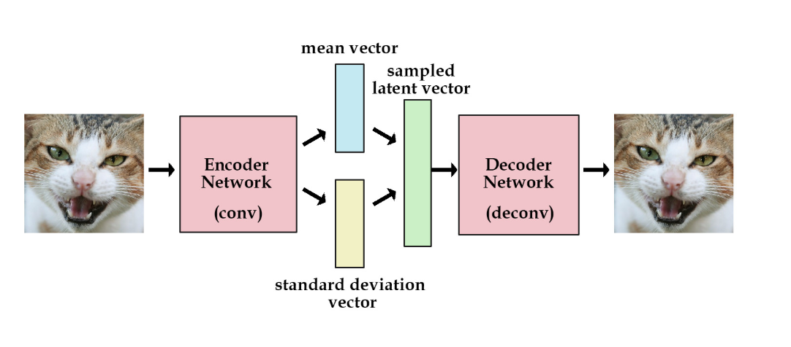
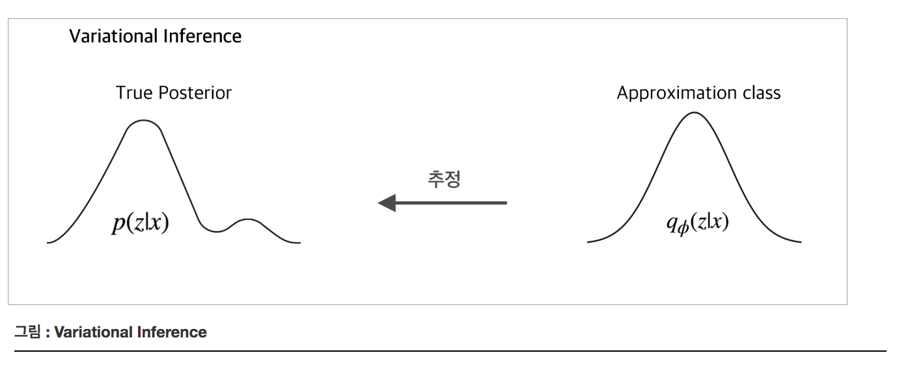
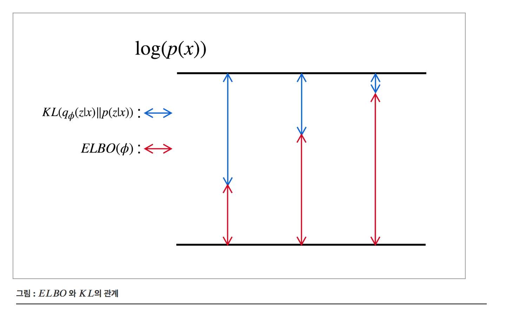
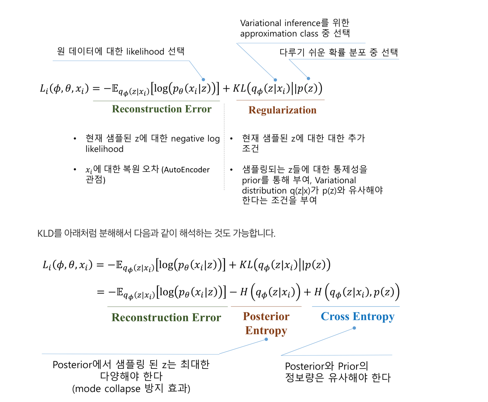

# Variational AutoEncoder (VAE)

### Summary

- Encoder 네트워크는 학습용 데이터를 입력으로 받고 잠재 변수의 확률분포에 대한 파라미터를 출력한다.(정규분포의 경우, $$\mu, \sigma^2$$) Decoder는 잠재변수에 대한 확률 분포 p(z) 에서 샘플링한 벡터를 입력받아 이를 이용해 원본 이미지를 복원한다. 

- VAE 인코더 부분에서 변분추론을 이용해서 이상적인 확률분포와 근사한 확률 분포(모수)를 찾아서 출력하고 디코더에서는 인코더에서 찾은 사후확률분포에서 샘플링해서 원본과 비슷하게 복원하는 것이다. 
- 변분추론(Variational Inference)는 계산이 어려운 확률분포를 다루기 쉬운 분포 $$q(x)$$ 로 근사하는 방법입니다.
- 장점은 데이터뿐 아니라 데이터에 내재한 잠재변수 $$z$$ 도 함께 학습할 수 있다. 
- Reparameterization trick은 노이즈를 zero-mean Gaussian에서 하나 뽑아 $$f_\mu, f_\sigma$$ 가 산출한 평균과 분산을 더하고 곱해줘서 sampled latent vector $$z$$ 를 만든다. 
______

### VAE

VAE는 데이터가 생성되는 과정, 즉 데이터의 확률분포를 학습하기 위한 두 개의 뉴럴네트워크로 구성되어 있다. Generative Model 중 하나로 확률분포 p(x)를 학습함으로써 데이터를 생성하는 것이 목적이다. 

VAE는 잠재변수(Latent variable) $$z$$ 를 가정하고 있다. 

Encoder라 불리는 뉴럴네트워크는 관측된 데이터 $$x$$ 를 받아서 잠재변수 $$z$$ 를 만들어 낸다. decoder라 불리는 뉴럴네트워크는 encoder가 만든 $$z$$ 를 활용해 $$x$$ 를 복원해내는 역할을 합니다. 

encoder는 입력 데이터를 추상화하여 잠재적인 특징을 추출하는 역할, decoder는 이러한 잠재적인 특징을 바탕으로 원 데이터로 복원하는 역할을 한다고 볼 수 있습니다. 실제로 잘 학습된 VAE는 임의의 $$z$$ 값을 decoder에 넣으면 다양한 데이터를 생성할 수 있다고 한다. 

VAE는 최적화를 통해 아래의 두가지 문제를 푼다.
- 주어진 데이터를 잘 설명하는 잠재변수의 분포를 찾는 것(Encoder), 잠재변수로 부터 원본 이미지와 같은 이미지를 잘 복원하는 것(Decoder)

### Encoder

데이터가 주어졌을 때 Decoder가 원래의 데이터로 잘 복원할 수 있는 $$z$$ 를 샘플링 할 수 있는 이상적인 확률분포 $$p(z|x)$$ 를 찾는 것이다. 하지만 어떤 것이 이상적인 확률분포 $$p(z|x)$$ 인지는 아무도 모른다. VAE 방법론에서는 이 문제를 해결하기 위해 **Variational inference**를 사용한다.

##### Variational inference

우리가 이상적인 확률분포를 모르지만, 이를 추정하기 위해서 다루기 쉬운 분포(approximation class, 대표적으로 Gaussian distribution)를 가정하고 이 확률분포의 모수를 바꿔가며, 이상적인 확률분포에 근사하게 만들어 그 확률분포를 대신 사용하는 것이다. 이 다루기 쉬운 분포를 $$q\phi$$ 라고 한다면, Encoder는 $$\phi$$라는 파라미터들을 바꾸어가며, $$q_\phi(z|x)$$ 확률 분포를 이상적인 확률 분포 $$p(z|x)$$에 근사시키는 역할을 수행한다. 보통 $$q\phi(\cdot)$$은 Gaussian 정규 분포라고 가정한다. 이유는 뒤에서 설명 할 것이다. 그리고 이때, $$z$$의 marginal distribution은 평균이 0이고 분산이 1인 표준 정규분포로 가정한다. 아래의 코드가 encoder부분을 구현 한 것이다.

#### The reparametrization trick

Encoder가 출력하는 것은 $$q\phi(z|x)$$ 확률 분포의 모수이다. 우리는 $$q\phi(z|x)$$ 를 정규 분포라고 가정하기 때문에 이 경우에는 평균과 분산이다. 다음 단계는 이 확률분포로 부터 샘플링을 하는 것이다. 이 때, 그냥 샘플링을 한다면 Back propagation이 불가능하다. Back propagation은 편미분을 구함으로써 Gradient를 구하는 것인다. z를 확률분포에서 그냥 샘플링 한다면 체인룰이 중간에 끊기가 된다. 여기서는 이를 극복하기 위해서 Reparameterization trick을 사용했다. 

Reparameterization trick이란, 가우시안 정규 분포의 샘플을 추출하고 싶을 때, 아래의 식과 같이 샘플링 하는 것을 말한다. 이렇게 샘플을 추출 하더라도 원래의 특성을 보존한다. z는 확률분포의 모수인 분산과 평균이 더해진 형태이므로 Back propagation이 가능하다. 

$$
z={ \mu  }{ (x) }+{ \sigma  }{ (x) } \times\epsilon ,\quad \epsilon \sim N\left( 0,1 \right)
$$

### Decoder

추출한 샘플을 입력으로 받아, 다시 원본으로 재구축하는 역할을 수행한다. 

#### Evidence LaowerBOund(ELBO)

우리가 궁극적으로 알고 싶은 것은 $$p(x)$$ 즉 실제 데이터의 분포를 알고 싶은 것이다. 앞서 나온 $$p(z|x), q\phi(z|x), p(z)$$ 는 p(x)를 추정하기 위해 사용한 도구들이다. 

##### Jensen's Inequality

log(p(x)) 는 확률의 전체확률 법칙에 의해 아래와 같다. 

$$
\log(p(x)) = \log  \left ( \int p(x, z)dz \right ) = \log  \left ( \int p(x|z)p(z)dz \right )
$$

$$q\phi(z|x)$$ 를 넣어서 수식을 만들 수 있다

$$
\log(p(x)) = \log \left ( \int p(x|z)\dfrac{p(z)}{q_\phi(z|x)}q_\phi(z|x)dz \right )\\
$$

이 때 Jenson's Inequality 에 의해 아래의 부등식이 성립한다.

$$
\log(p(x)) \geq \int \log \left ( p(x|z)\dfrac{p(z)}{q_\phi(z|x)} \right ) q_\phi(z|x)dz
$$

이 부등식을 다시 정리하면 아래와 같이 나타낼 수 있다.

$$
\log(p(x)) \geq  \int \log(p(x|z))q_\phi(z|x)dz \ - \int \log \left ( \dfrac{q_\phi(z|x)}{p(z)} \right ) q_\phi(z|x)dz
$$

이 우변의 식을 Evidence LowerBOund 줄여서 *ELBO* 라고 부른다. 이 $$ELBO(\phi)$$ 값을 최대화 하는 $$\phi$$ 를 찾으면 위 식의 우변과 좌변은 같게 된다. 

이 식을 자세히 보면,

$$
\begin{eqnarray}
\int \log(p(x|z))q_\phi(z|x)dz \ &=& \mathbb{E}_{q_\phi(z|x)}[\log(p(x|z))]\\
\int \log \left ( \dfrac{q_\phi(z|x)}{p(z)} \right ) q_\phi(z|x)dz &=& KL(q_\phi(z|x)\|p(z))
\end{eqnarray}
$$

$$ELBO(\phi)$$ 는 아래와 같이 정의할 수 있다.

$$
ELBO(\phi) = \mathbb{E}_{q_\phi(z|x)}[\log(p(x|z))] - KL(q_\phi(z|x)\|p(z))
$$

##### Kullback-Leibler divergence

log(p(x)) 부터 식을 전개한다. $$\int q_\phi(z|x)dz = 1$$ 이기 때문에 아래의 식이 성립한다. 

$$
\log(p(x)) = \int \log(p(x))q_\phi(z|x)dz
$$

베이즈 룰을 이용해 log(p(x)) 를 아래와 같이 표현할 수 있다.
  $$
  \begin{eqnarray}
  \log(p(x)) &=& \int \log \left ( \dfrac{p(x, z)}{p(z|x)} \right )q_\phi(z|x)dz \\
  &=& \int \log \left ( \dfrac{p(x,z)}{q_\phi(z|x)} \cdot \dfrac{q_\phi(z|x)}{p(z|x)} \right ) q_\phi(z|x) dz \\
  &=& \int \log \left ( \dfrac{p(x, z)}{q_\phi(z|x)} \right ) q_\phi(z|x)dz + \int \log \left ( \dfrac{q_\phi(z|x)}{p(z|x)} \right ) q_\phi(z|x)dz 
  \end{eqnarray}
  $$

이 때, $$\int \log \left ( \dfrac{p(x, z)}{q_\phi(z|x)} \right ) q_\phi(z|x)dz$$

$$\int \log \left ( \dfrac{q_\phi(z|x)}{p(z|x)} \right ) q_\phi(z|x)dz$$ 은 $$q\phi(z|x)$$ 와 $$p(z|x)$$ 간의 Kullback-Leibler divergence 값이다.(위의 KL식과는 다름)

log(p(x)) 는 bound되어 있는 값이고, 이는 $$ELBO(\phi)$$ 와 $$KL(q\phi(z|x)||p(z|x))$$ 의 합이다. 따라서 아래의 그림처럼 $$ELBO(\phi)$$ 를 최대화하는 것이 곧, $$KL(q\phi(z|x)||p(z|x))$$ 를 최소화 하는 것이다. 

결론적으로 이상적인 확률 분포 p(x|z) 를 찾는 것은 $$ELBO(\phi)$$ 를 최대화하는 것과 같다.

다시 $$ELBO(\phi)$$ 를 써보면, 

$$
ELBO(\phi) = \mathbb{E}_{q_\phi(z|x)}[\log(p(x|z))] - KL(q_\phi(z|x)\|p(z))
$$

이때, log(p(x|z)) 는 z를 입력으로 받아 x를 출력하는 함수로 Decoder 목적과 동일하다. 이를 $$log(p\theta(x|z))$$ 로 바꾸어 표현하면, $$\theta$$ 를 조정하여 이를 최대화 하는 것 또한 ELBO를 최대화 하는 것이다.  

최종  VAE의 Loss 함수는 

$$
\mathcal{L}_{(\theta, \phi ; x^i)} = - \ \mathbb{E}_{q_\phi(z|x^i)}[\log(p_\theta(x^i|z))] + KL(q_\phi(z|x^i)\|p(z))
$$

### latent vector 

VAE의 decoder 파트는 다음과 같이 정규분포를 전제로 하고 있습니다. encoder가 만들어낸 $$z$$ 의 평균과 분산을 모수로 하는 정규분포이다. 

$$
p\left( { x }|{ z } \right) =N\left( { x }|{ { f }_{ \mu  }\left( z \right)  },{ { f }_{ \sigma  }\left( z \right)  }^{ 2 }\times I \right)
$$

MLE방식으로 VAE 모델의 파라미터를 추정하려면 다음과 같이 정의된 marginal log-likelihood $$logp(x)$$ 를 최대화하면 된다. 

$$
\log { p\left( x \right)  } =\log { \sum _{ z }^{  }{ p\left( { x }|{ { { f }_{ \mu  }\left( z \right)  },{ { f }_{ \sigma  }\left( z \right)  }^{ 2 }\times I } \right)  } p\left( z \right)  }
$$

위 식은 최적화가 어렵다. 그 이유는 z는 무수히 많은 경우가 존재할 수 있는데 가능한 모든 z에 대해서 고려해야 하기 때문이다. 이 때 변분추론(Variational Inference)를 사용합니다. 

변분추론(Variational Inference)는 계산이 어려운 확률분포를 다루기 쉬운 분포 $$q(x)$$ 로 근사하는 방법입니다.  한편 $$p(x)$$ 는 베이즈 정리에서 evidence의 하한(ELBO)를 다음과 같이 구할 수 있다.계산이 쉬운 위 부등식 우변, 즉 ELBO를 최대화 하면 logp(x)를 최대화 할 수 있다.

$$
\log { p\left( x \right)  } \ge { E }_{ z\sim q\left( z \right)  }\left[ \log { p(x|z) }  \right] -{ D }_{ KL }\left( q\left( z \right) ||p\left( z \right)  \right)
$$

변분추론에서는 q(z) 를 정규분포로 정한다. $$q(z) = N(\mu_q, \sigma^2_q)$$ 

그런데 데이터 x가 고차원일 때는 q를 정규분포로 정하면 학습이 어렵다 그 이유는 모든 데이터에 대해 동일한 평균, 분산 즉 단 하나의 정규분포를 가정하게 되는 셈이니 데이터가 복잡한데 비해 모델이 너무 단순하기 때문이다. VAE에서는 이 문제를 해결하기 위해 q의 파라미터를 x에 대한 함수로 둔다. 

$$
q\left( z|x \right) =N\left( { \mu  }_{q}\left( x \right) ,\Sigma_{q} \left( x \right) \right)
$$
q를 위와 같이 설정하고 ELBO를 최대화하는 방향으로 q를 잘 학습하면 x가 달라질때마다 q의 분포도 계속 달라지게 된다. x에 따라 q의 모수(평균,분산)가 바뀌기 때문이다. 

VAE의 encoder에는 x를 받아서 z의 평균과 분산을 만들어 내는 뉴럴네트워크 두개($$f_\mu, f_\sigma$$) 가 포함되어 있다. 이 덕분에 복잡한 데이터에 대해서도 모델이 적절하게 대응할 수 있다. 

노이즈를 zero-mean Gaussian에서 하나 뽑아 $$f_\mu, f_\sigma$$ 가 산출한 평균과 분산을 더하고 곱해줘서 sampled latent vector $$z$$ 를 만든다. 이같은 과정을 reparameterization trick이라고 부른다. $$z$$ 를 직접 샘플링하는게 아니고 노이즈를 샘플링하는 방식이다. 이렇게 되면 역전파를 통해 encoder가 산출하면 평균과 분산을 업데이트 할 수 있다.

$$
z={ \mu  }{ (x) }+{ \sigma  }{ (x) } \times\epsilon ,\quad \epsilon \sim N\left( 0,1 \right)
$$

VAE는 latent vector zz를 위와 같이 만들기 때문에 데이터 xx가 동일하다 하더라도 zz는 얼마든지 달라질 수 있고, *decoder*의 최종 결과물 역시 변종이 발생할 가능성이 있습니다. zz 생성 과정에 *zero-mean Gaussian*으로 뽑은 노이즈가 개입되기 때문입니다. 데이터 xx를 넣어 다시 xx가 출력되는 구조의 *autoencoder*이지만, 맨 앞에 *variational*이 붙은 이유가 바로 여기에 있는 것 같습니다.

### VAE의 목적함수

VAE의 decoder는 데이터의 사후확률 $$p(z|x)$$ 를 학습합니다. 하지만 사후 확률은 계산이 어렵기 때문에 다루기 쉬운 분포 $$q(z)$$ 로 근사하는 변분추론 기법을 적용하게 된다. 변분추론은 $$p(z|x)$$ 와 $$q(z)$$ 사이의 KL Divergence를 계산하고, KLD가 줄어드는 쪽으로 $$q(z)$$ 를 조금씩 업데이트해서 $$q(z)$$ 를 얻어낸다. 

### VAE의 장단점

##### 장점

- GAN에 비해 학습이 안정적인 편이다. 
- reconstruction error와 같이 평가 기준이 명확하다 
- 데이터뿐 아니라 데이터에 내재한 잠재변수 $$z$$ 도 함께 학습할 수 있다. 

##### 단점

- 출력이 선명하지 않고 평균값 형태로 표시된다. 
- reparameterization trick이 모든 경우에 적용되지 않을 수 있다. 

Reference
- https://datascienceschool.net/
- https://ratsgo.github.io/generative%20model/2018/01/27/VAE/