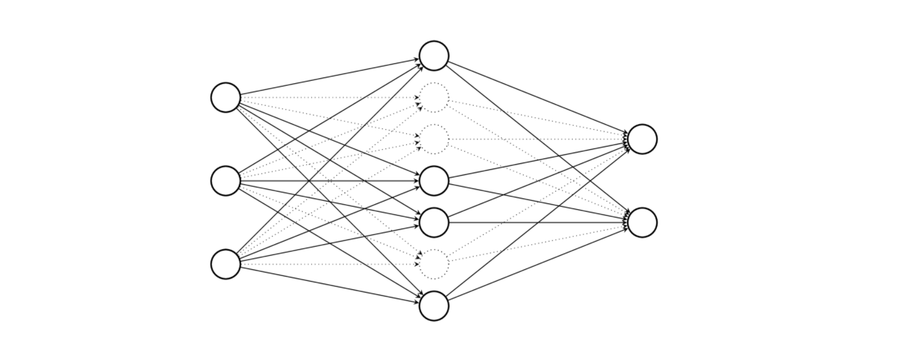
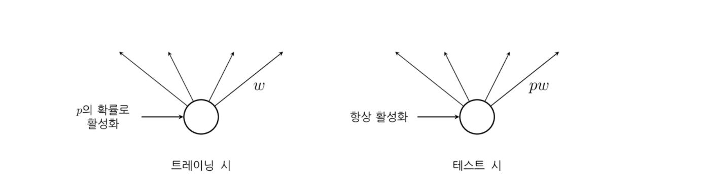
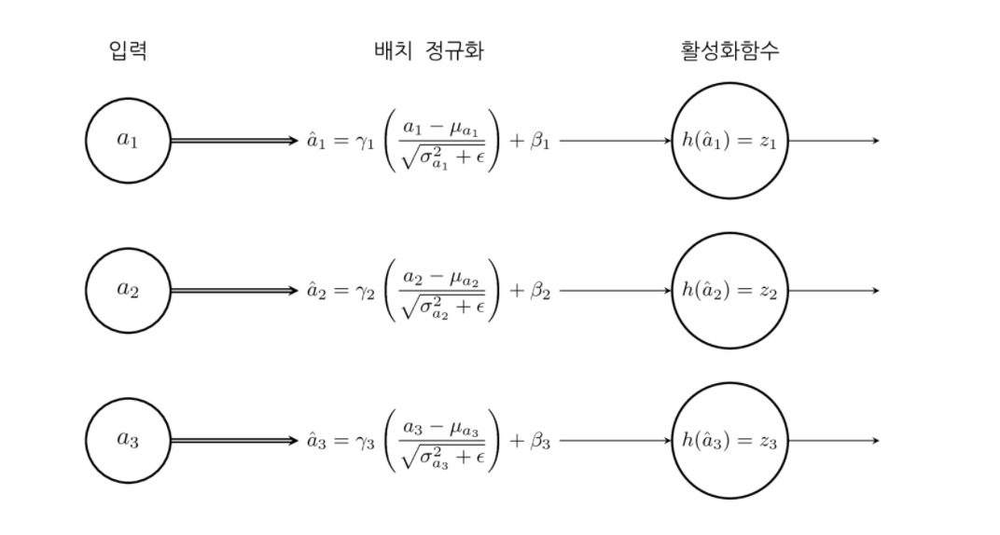

# 신경망 성능 개선

### Summary

- 크로스엔트로피는 출력레이어에서 활성화 함수의 도함수에 의한 영향을 제거할 수 있다.
- 하이퍼탄젠트 활성화 함수는 도함수의 최댓값이 로지스틱 함수의 4배인 1이 되어 그레디언트 감소 현상이 줄어든다. 
- ReLu 활성화 함수가 가장 좋은 방법이다. 가중치 총합이 커져도 기울기가 1로 유지되어 그레디언트 감소 현상이 발생하지 않는다. CNN 같이 레이어의 수가 많은 경우 유용하다. 
- 입력벡터가 크면 활성화값의 표준편차도 증가한다. 표준편차가 크면 수렴이 느려지기 때문에 초기화 값 조정이 필요하다. 
- Dropout 정규화 방법은 과최적화 문제를 해결하기 위해 에포크 마다 임의의 은닉계층 뉴런을(보통 절반) dropout 하여 최적화 과정에 포함하지 않는 방법이다. 이 방법을 사용하면 가중치 값들이 특정한 뉴런에만 집중되는 것을 방지하여 정규화 효과를 가져다 준다. 
- 소프트맥스 함수는 최고 출력의 위치를 변화하지 않으면서 출력의 합이 1이 되도록 조정하기 때문에 출력에 확률론적 의미를 부여할 수 있다. 
- 배치 정규화는 미니배치 만큼의 트레이닝이 끝날 때마다 a의 평균과 분산을 계산해서 평균 0, 분산 1이 되도록 스케일링 해준다.
_____________

### 크로스 엔트로피 오차함수

크로스 엔트로피 형태의 오차함수를 사용하면 출력 레이어에서 활성화 함수의 도함수에 의한 영향을 제거할 수 있다. 

$$
\begin{eqnarray} 
  C = y \log z^{(L)} + (1-y) \log (1-z^{(L)})
\end{eqnarray}
$$

이 경우 출력 레이어의 가중치에 대한 미분값은 다음과 같아진다.

$$
\begin{eqnarray}
\frac{\partial C}{\partial w_j^{(L)}} 
&=& \left(\frac{y }{z^{(L)}} - \frac{(1-y)}{1-z^{(L)}} \right) \frac{\partial z^{(L)}}{\partial w_j^{(L)}} \\
&=& \left(\frac{y}{\sigma(a)} - \frac{(1-y)}{1-\sigma(a)} \right)\sigma'(a) z^{(l-1)}_j \\
&=& \frac{\sigma'(a) }{\sigma(a) (1-\sigma(a))} (\sigma(a)-y) z^{(l-1)}_j  \\
&=& (\sigma(a)-y) z^{(l-1)}_j \\ 
&=& (z^{(L)}-y) z^{(l-1)}_j \\ 
\\
\frac{\partial C}{\partial b^{(L)}} &=&  z^{(L)} - y
\end{eqnarray}
$$

### 하이퍼탄젠트 활성화 함수

활성화 함수로 로지스틱 함수 대신 하이퍼탄젠트(Hypertangent)를 사용하면 도함수의 최댓값이 로지스틱 함수의 4배인 1이 되므로 그레디언트 감소 현상이 줄어든다.

$$
\begin{eqnarray}
  \tanh(a) \equiv \frac{e^a-e^{-a}}{e^a+e^{-a}} = 2\sigma(2a) - 1
\end{eqnarray}
$$

### Rectified Linear Unit(ReLu) 활성화 함수

가장 좋은 방법은 ReRu 활성화 함수를 사용하는 것이다. ReLu는 가중치총합 a가 큰 경우에도 기울기(gradient)가 1로 유지되므로 a가 커도 그레디언트 감소 현상이 발생하지 않는다. CNN과 같이 레이어의 수가 많은 경우 유용하다. 

$$
max(0, a)
$$

a가 음수인 경우에도 기울기가 0이 되지 않도록 하는 Leaky ReLu도 사용한다. 

$$
max(\alpha a, a) (0 < \alpha < 1)
$$

### 초기 가중치 정규화

활성화값 a는 입력변수 벡터 x와 가중치 벡터 w의 내적이다. ($$a=w^Tx$$)

가중치 벡터 w의 초기값은 가우시안 정규 분포 또는 유니폼 분포에 따라 무작위로 설정하는데 정규분포 표본의 합의 표준편차는 표본 수의 제곱근에 비례하므로 입력변수 벡터 x의 차원 $$n_{in} $$ 이 증가하면 활성화값 a값의 표준편차(standard deviation)도 증가한다.  

$$
\text{std}(a) \propto \sqrt{n_{in}}
$$

표준편차가 크면 수렴이 느려지기 때문에 입력 수에 따라 초기화 가중치의 표준편차를 감소하는 초기화값 조정이 필요하다.  2010년 Xavier Glorot는 반복실험을 통해 다음과 같은 폭을 가진 유니폼 분포를 추천하였다.

$$
w \sim \text{uniform}(-\text{limit},\text{limit}) \\
\text{limit} = \sqrt{\dfrac{6}{(n_{\text{in}} + n_{\text{out}})}}
$$

### 과최적화 문제

신경망 모형은 파라미터의 수가 다른 모형에 비해 많다. 이렇게 파라미터의 수가 많으면 과최적화 발생 가능성이 증가한다. 즉, 정확도가 나아지지 않거나 나빠져도 오차함수는 계속 감소하는 현상이 발생한다. 

#### L1, L2 정규화

L1 정규화는 오차 함수에 가중치 행렬의 L1 놈을 추가하는 방법이다. 

$$
C = - (y \log z+(1-y) \log(1-z)) + \lambda \sum_i |w_i|
$$

L2 정규화는 오차 함수에 가중치 행렬의 L2 놈을 추가하는 방법이다. 

$$
C = - (y \log z+(1-y) \log(1-z)) + \lambda \sum_i w_i^2
$$

### Dropout 정규화

Dropout 정규화 방법은 과최적화 문제를 해결하기 위해 에포크 마다 임의의 은닉계층 뉴런의 p%를(보통 절반) dropout 하여 최적화 과정에 포함하지 않는 방법이다. 이 방법을 사용하면 가중치 값들이 특정한 뉴런에만 집중되는 것을 방지하여 정규화 효과를 가져다 준다. 

테스트 시점에는 가중치에 p를 곱하여 스케일링 한다. 

### 소프트맥스 softmax 출력

소프트맥스 함수는 입력과 출력이 다변수(multiple variable)인 함수이다. 최고 출력의 위치를 변화하지 않으면서 출력의 합이 1이 되도록 조정하기 때문에 출력에 확률론적 의미를 부여할 수 있다. 보통 신경망의 최종 출력단에 적용한다. 

### 배치 정규화 Batch Normalization

배치 정규화는 미니배치 만큼의 트레이닝이 끝날 때마다 a의 평균과 분산을 계산해서 평균 0, 분산 1이 되도록 스케일링을 해주고 학습하는 파라미터 $$\gamma, \beta$$ 를 각각 곱하고 더해준다.

Reference
- https://datascienceschool.net/