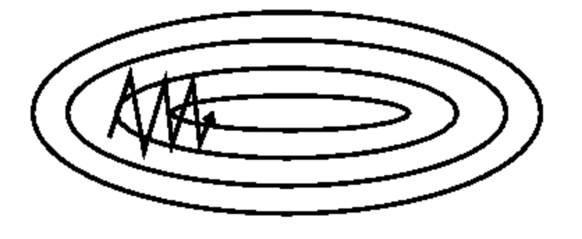
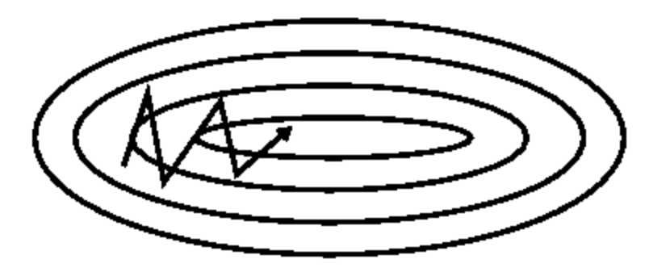
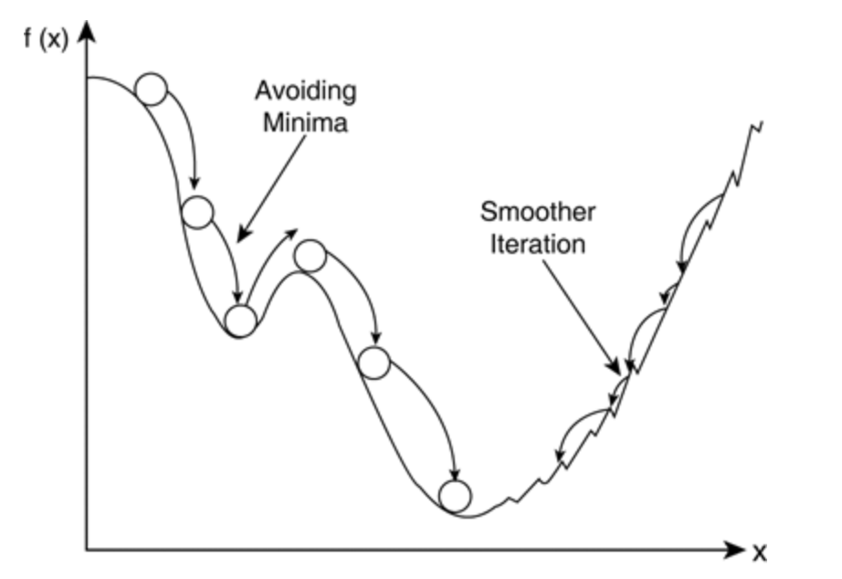

# Gradient Descent Optimization Algorithms

### Summary

- Gradient Descnet방법은 $$\theta$$ (신경망의 parameter들)에 대해 gradient의 반대방향으로 일정크기만큼 이동해내는 것을 반복하여 오차함수의 값을 최소화하는 $$\theta$$ 값을 찾는것이다. 
- Full Batch Gradient Descent 한번 step을 내딛을 때 전체 데이터에 대해 계산하는 것으로 너무 많은 계산량이 필요하다. 
- Stocahstic Gradient Descent(SGD)는 일부 조그만한 데이터의 모음(mini-batch)에 대해서만 계산한다. full batch gradient descent보다 다소 부정확할 수 있지만 계산 속도가 훨신 빠르다. 여러번 반복할 경우 보통 batch의 결과와 유사한 결과로 수렴한다. 또한 local minima에 빠지지 않고 더 좋은 방향으로 수렴할 가능성이 있다.
- Momentum 방식은 현재 Gradient를 통해 이동하는 방향과는 별개로 과거에 이동했던 방식을 기억하면서 그 방향으로 일정 정도 추가적으로 이동하는 방식이다.
- Adagrad는 변수들을 update할 때 각각의 변수마다 step size를 다르게 설정해서 이동하는 방식이다. 이 알고리즘의 핵심은 지금까지 많이 변화하지 않은 변수들은 step size를 크게하고, 많이 변화했던 변수들은 step size를 작게 하는 것이다. 자주 등장하거나 변화를 많이 한 변수들의 경우 optimum에 가까이 있을 확률이 높기 때문에 작은 크기로 이동하면서 세밀한 값을 조정하고, 적게 변화한 변수들은 optimum 값에 도달하기 위해서는 많이 이동해야할 확률이 높기 때문에 먼저 빠르게 loss 값을 줄이는 방향으로 이동하려는 방식이라고 생각할 수 있다.
- RMSProp은 Adagrad의 단점을 해결하기 위한 방법이다. Adagrad의 식에서 gradient의 제곱값을 더해나가면서 구한 $$G_t$$ 부분을 합이아니라 지수평균으로 바꾸어서 대체한 방법이다. 이렇게 대체를 할 경우 Adagrad처럼 $$G_t$$ 가 무한정 커지지 않으면서 최근 변화량의 변수간 상대적인 크기 차이는 유지할 수 있다. 
- Adam은 RMSProp과 Mementum 방식을 합친 것 같은 알고리즘이다. Momentum 방식과 유사하게 지금까지 계산해온 기울기의 지수평균을 저장하며 RMSProp과 유사하게 기울기의 제곱값의 지수평균을 저장한다. 

___________

### Gradient Desent & Stochastic Gradient Descent

신경망의 가중치를 조절하는 과정에는 보통 Gradient Descent 방법을 사용한다. 이 방법은 신경망의 parameter들을 $$\theta$$ 라고 했을 때 신경망에서 나오는 결과값과 실제값 사이의 차이를 정의하는 함수 Loss function $$J(\theta)$$ 의 값을 최소화하기 위해 기울기(gradient) $$\nabla_{\theta}J(\theta)$$ 를 이용하는 방법이다. Gradient Descent에서는 $$\theta$$ 에 대해 gradient의 반대방향으로 일정 크기만큼 이동해내는 것을 반복하여 Loss function $$J(\theta)$$ 의 값을 최소화 하는 $$\theta$$ 값을 찾는 것이다. 한 반복(iteration)에서의 변화식은 다음과 같다. 이 때 $$\eta$$ 는 미리 정해진 걸음의 크기 step size로서 보통 0.01 ~ 0.001 정도의 적당한 크기를 사용한다.

$$
\theta = \theta - \eta \nabla_{\theta} J(\theta)
$$

Loss function을 계산할 때 전체 train set을 사용하는 것을 **Full Batch Gradient Descent** 라고 한다. 한번 step을 내딛을 때 전체 데이터에 대해 Loss Function을 계산해야하므로 너무 많은 계산량이 필요하다. 

이를 방지하기 위해 보통은 **Stochastic Gradient Descent(SGD)** 방법을 사용한다. loss function을 계산한 때 일부 조그만한 데이터의 모음(mini-batch)에 대해서만 계산한다. full batch gradient descent보다 다소 부정확할 수 있지만 계산 속도가 훨신 빠르고 같은 시간에 더 많은 step을 갈 수 있으며 여러번 반복할 경우 보통 batch의 결과와 유사한 결과로 수렴한다. 또한 local minima에 빠지지 않고 더 좋은 방향으로 수렴할 가능성이 있다. 

### SGD의 변형 알고리즘

#### Momentum

Momentum 방식을 Gradient Descent를 통해 이동하는 과정에 일종의 '관성'을 주는 것이다. 현재 Gradient를 통해 이동하는 방향과는 별개로 과거에 이동했던 방식을 기억하면서 그 방향으로 일정 정도를 추가적으로 이동하는 방식이다. $$v_t$$ 를 time step t에서의 이동벡터라고 할 때, 다음과 같은 식으로 이동을 표현할 수 있다. 

$$
v_t = \gamma v_{t-1} + \eta \nabla_{\theta}J(\theta) \\
\theta = \theta - v_t
$$

$$\gamma$$ 는 얼마나 momentum을 줄것인지에 대한 momentum term(관성항)로서 보통 0.9정도의 값을 사용한다. 식을 보면 과거에 얼마나 이동했는지에 대한 이동항 v를 기억하고 새로운 이동항을 구할 경우 과거에 이동했던 정도에 관성항만큼 곱해준 후 Gradient을 이용한 step 항을 더해준다. Gradient들의 지수평균을 이용하여 이동한다고도 해석할 수 있다. 

$$
v_t = \eta \nabla_{\theta}J(\theta)_t + \gamma \eta \nabla_{\theta}J(\theta)_{t-1} +\gamma^2 \eta \nabla_{\theta}J(\theta)_{t-2} + ....
$$

momentum 방식은 SGD가 oscilation(진동)현상을 겪을 때 더욱 빛을 발한다. 

다음은 SGD가 진동현상을 겪고 있는 상황이다. 

SGD는 중앙의 최적점으로 이동해야되는데 한번의 step에서 움직일 수 있는 step size는 한계가 있으므로 이러한 진동현상이 일어날 때 좌우로 계속 진동하면서 이동이 난항을 겪는다.

다음은 Momentum 방식을 사용할 경우이다.

Momentum 방식은 자주 이동하는 방향에 관성이 걸리게 되고 진동을 하더라도 중앙으로 가는 방향에 힘을 얻기 때문에 SGD에 비해 상대적으로 빠르게 이동할 수 있다. 

Momentum 방식은 아래의 그림과 같이 local minima를 빠져나오는 효과가 있을 것이라고 기대할 수 있다. 기존의 SGD를 이용할 경우 좌측의 local minima에 빠지면 gradient가 0이 되어 이동할 수가 없지만 momentum 방식의 경우 기존에 이동했던 방향에 관성이 있어 이 local minima를 빠져나오고 더 좋은 minima로 이동할 것을 기대할 수 있다. 반면 momentum 방식을 이용할 경우 기존의 변수들 $$\theta$$ 외에도 과거에 이동했던 양을 변수로 저장해야하기 때문에 변수에 대한 메모리가 기존의 두배가 필요하다. 

#### Adagrad(Adaptive Gradient)

Adagrad는 변수들을 update할 때 각각의 변수마다 step size를 다르게 설정해서 이동하는 방식이다. 이 알고리즘의 핵심은 지금까지 많이 변화하지 않은 변수들은 step size를 크게하고, 많이 변화했던 변수들은 step size를 작게 하는 것이다. 자주 등장하거나 변화를 많이 한 변수들의 경우 optimum에 가까이 있을 확률이 높기 때문에 작은 크기로 이동하면서 세밀한 값을 조정하고, 적게 변화한 변수들은 optimum 값에 도달하기 위해서는 많이 이동해야할 확률이 높기 때문에 먼저 빠르게 loss 값을 줄이는 방향으로 이동하려는 방식이라고 생각할 수 있다. 특히 word2vec에서 word representation을 학습시킬 경우 단어의 등장 확률에 따라 변수의 사용 비율이 확연하게 차이나기 때문에 Adagrad와 같은 학습방식을 이용하면 훨씬 더 좋은 성능을 낼 수있다. 

Adagrad의 한 스텝을 수식화 하면 다음과 같다.

$$
G_{t} = G_{t-1} + (\nabla_{\theta}J(\theta_t))^2 \\
\theta_{t+1} = \theta_t - \frac{\eta}{\sqrt{G_t + \epsilon}} \cdot \nabla_{\theta}J(\theta_t)
$$

신경망의 파라미터가 k개라고 할 때, $$G_t$$ 는 k차원 벡터로서 time step t까지 각 변수가 이동한 gradient의 제곱을 저장한다. $$\theta$$ 를 업데이트하는 상황에서는 기존 step size $$\eta$$ 에 $$G_t$$ 의 루트값에 반비례한 크기로 이동을 진행하여 지금까지 많이 변화한 변수일 수록 적게 이동하고 적게 변화한 변수일수록 많이 이동하도록 한다. 이때 $$\epsilon$$ 은 $$10^{-4}~10^{-8}$$ 정도의 작은값으로서 0으로 나누는 것을 방지하기 위한 작은 값이다. 여기에서 $$G_t$$ 를 업데이트하는 식에서 제곱은 element-wise(두 벡터와 행렬에서 같은 위치에 있는 원소끼리 덧셈과 뺄셈을 하면 된다. 이러한 연산을 요소별(element-wise) 연산)제곱을 의미하며 $$\theta$$ 를 업데이트하는 식에서도 $$\cdot$$ 은 element-wise 연산을 의미한다.

Adagrad를 사용하면 학습을 진행하면서 굳이 step size decay등을 신경써주지 않아도 된다. 보통 adagrad에서 step size로는 0.01 정도를 사용한 뒤, 그 이후로는 바꾸지 않는다. 그러나 Adagrad에는 학습을 계속 진행하면 G에는 계속 제곱한 값을 넣어주기 때문에 G의 값들은 계속해서 증가해서 학습을 오래 진행될 경우 step size가 너무 작아져서 결국 거의 움직이지 않게 된다. 이를 보완하여 고친 알고리즘이 RMSProp과 AdaDelta이다.

#### RMSProp

Adagrad의 단점을 해결하기 위한 방법이다. Adagrad의 식에서 gradient의 제곱값을 더해나가면서 구한 $$G_t$$ 부분을 합이아니라 지수평균으로 바꾸어서 대체한 방법이다. 이렇게 대체를 할 경우 Adagrad처럼 $$G_t$$ 가 무한정 커지지 않으면서 최근 변화량의 변수간 상대적인 크기 차이는 유지할 수 있다. 

$$
G = \gamma G + (1-\gamma)(\nabla_{\theta}J(\theta_t))^2 \\
\theta = \theta - \frac{\eta}{\sqrt{G + \epsilon}} \cdot \nabla_{\theta}J(\theta_t)
$$

#### Adam (Adaptive Moment Estimation)

RMSProp과 Mementum 방식을 합친 것 같은 알고리즘이다. Momentum 방식과 유사하게 지금까지 계산해온 기울기의 지수평균을 저장하며 RMSProp과 유사하게 기울기의 제곱값의 지수평균을 저장한다. 

$$
m_t = \beta_1 m_{t-1} + (1-\beta_1)\nabla_\theta J(\theta) \\
v_t = \beta_2 v_{t-1} + (1-\beta_2)(\nabla_\theta J(\theta))^2
$$

다만 Adam에서는 m,v가 처음에 0으로 초기화되어 있기 때문에 학습 초반부에서는 $$m_t,v_t$$ 가 0에 가깝게 bias 되어있을 것이라고 판단하여 이를 unbiased하게 만들어주는 작업을 거친다. $$m_t, v_t$$ 의 식을 $$\sum$$ 형태로 펼친 후 양변에 기댓값(expectation)을 씌워서 정리하면 unbiased된 기댓값을 얻을 수 있다. gradient가 들어갈 자리에 $$\hat m_t$$ $$G_t$$ 가 들어갈 자리에 $$\hat v_t$$ 를 넣어 계산을 진행한다. 

$$
\hat m_t = \dfrac {m_t}{1-\beta^t_1} \\
\hat v_t = \dfrac {v_t}{1-\beta^t_2} \\
\theta = \theta - \frac{\eta}{\sqrt{\hat{v_t}+\epsilon}}\hat{m_t}
$$

보통 $$\beta_1$$ 로는 0.9, $$\beta_2$$ 로는 0.999, $$\epsilon$$ 으로는 $$10^{-8}$$ 정도의 값을 사용한다고 한다. 

#### etc

위에서 설명한 알고리즘들은 SGD로 단순한 first-order optimization의 변형들이다. 이외에도 Newton's Method등 second-order optimizaion을 기반으로 한 알고리즘들도 있다. 단순한 second-order optimizaion을 사용하기 위해서는 Hessian Matrix라는 2차 편미분 행렬을 계산한 후 역행렬을 구해야는데 계산과정이 비싼 작업이여서 보통 잘 사용되지 않는다. 이러한 계산량을 줄이기 위해 hessian matrix를 근사하거나 추정해나가면서 계산을 진행하는 BFGS/L-BFGS 등의 알고리즘, 그리고 hessian matrix를 직접 계산하지 않으면서 second-order optimization인 Hessian-Free Optimization 등도 존재한다.

Reference
- https://datascienceschool.net/
- http://shuuki4.github.io/deep%20learning/2016/05/20/Gradient-Descent-Algorithm-Overview.html
