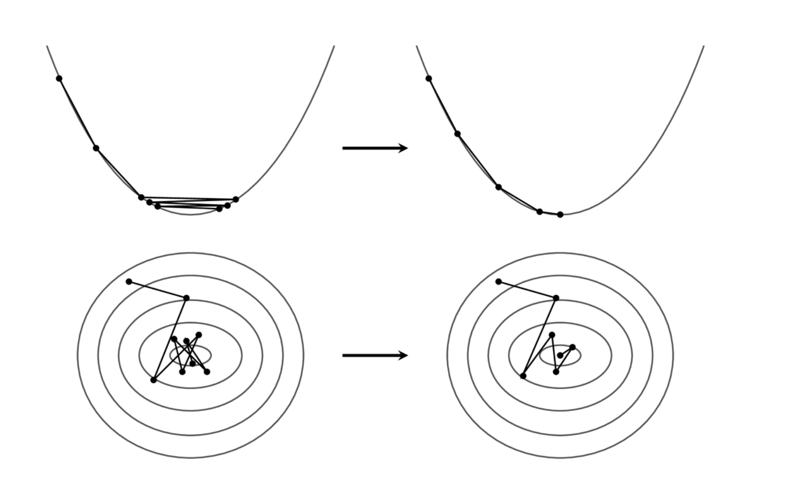
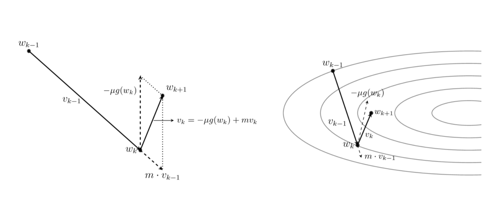
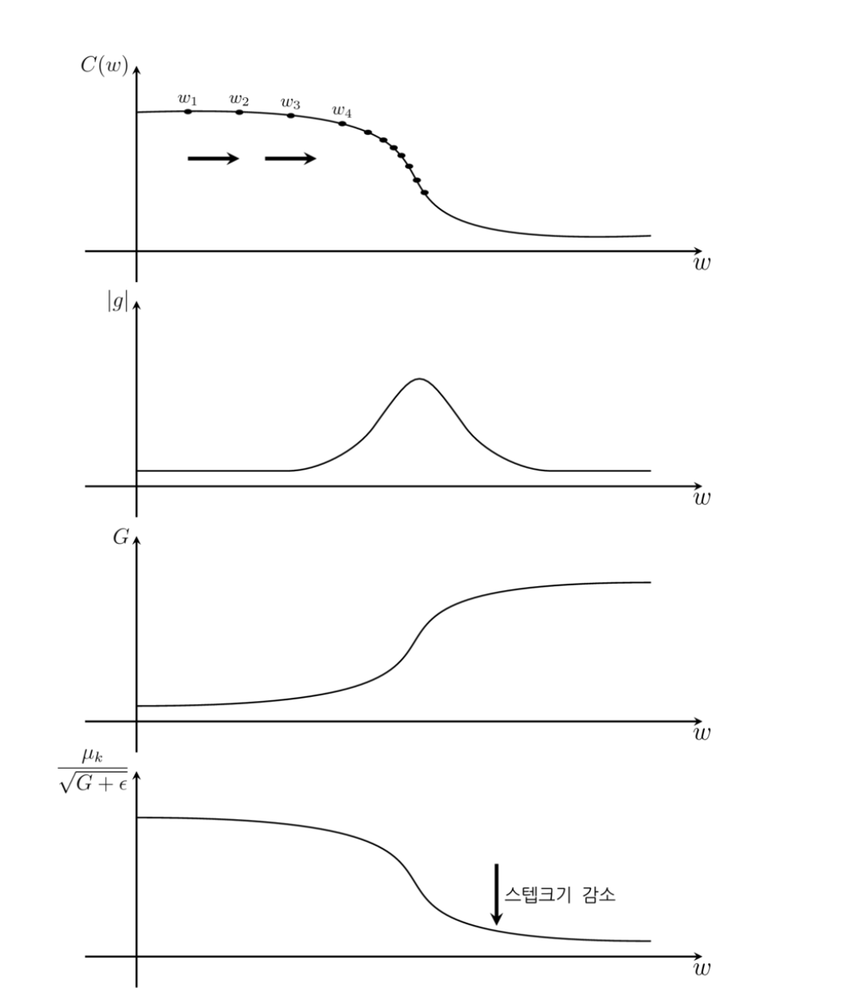
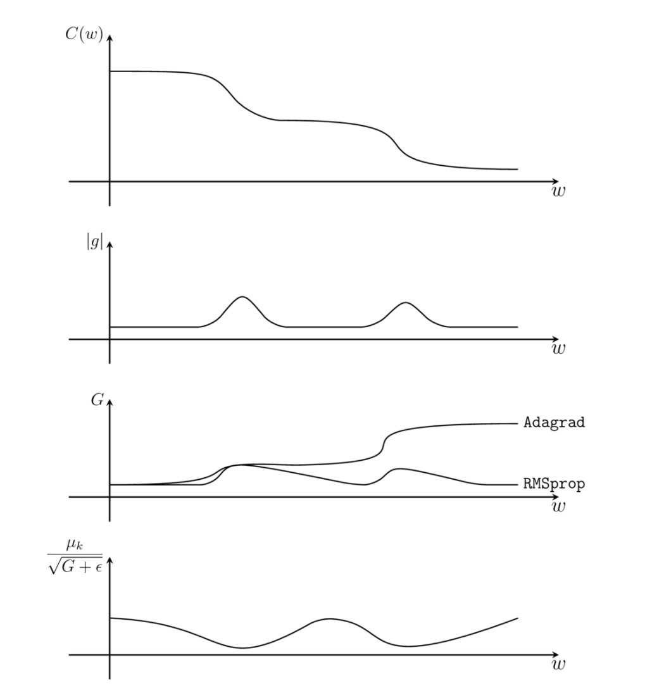
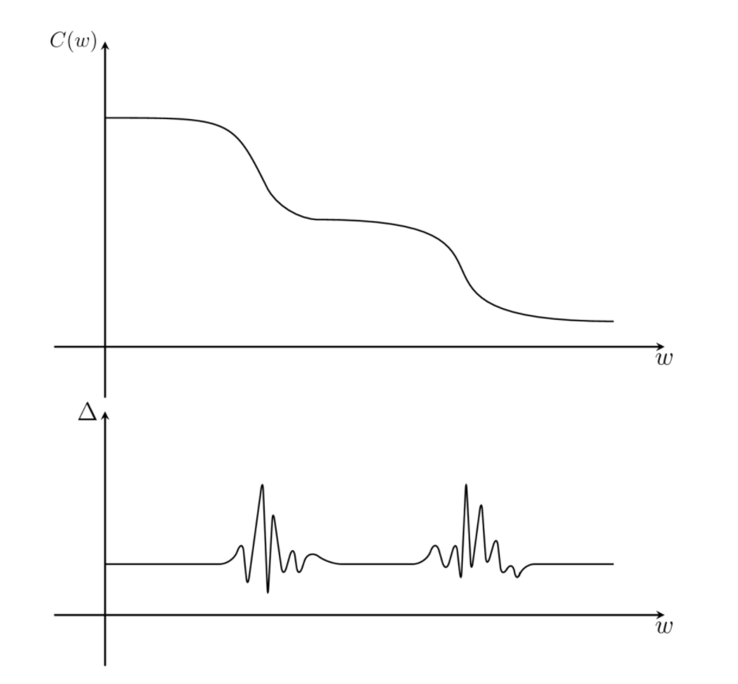

# 신경망 최적화 방법

### Summary

- Decay 는 스텝사이즈를 감소한다.
- Momentum은 진행하던 방향으로 계속 진행한다.
- Adagrad는 많이 이동한 가중치는 적게 변화한다. 
- RMSProp은 누적변화를 지수 평균으로 계산한다.
- Adam = Adagrad + RMSProp의 장점을 섞어 놓은것이다.
________

### 기본 Gradient 방법

$$
w_{k+1} = w_k - \mu_k g(w_k) = w_k - v_k
$$

### Decay

스텝사이즈를 감소한다.

$$
\mu_{k+1} = \mu_{k} \dfrac{1}{1 + \text{decay}}
$$

### Momentum

진행하던 방향으로 계속 진행한다.

$$
v_{k+1} = \text{momentum} \cdot v_k - \mu_k g(w_k)
$$

### Nesterov momentum

Momentum 방식으로 이동한 후의 그레디언트를 이용한다.

$$
v_{k+1} = \text{momentum} \cdot v_k - \mu_k g(w_k + \text{momentum} \cdot v_k)
$$

### Adagrad

Adaptive gradient 방법으로 많이 이동한 가중치는 적게 변화이다.

$$
G_{k+1} = G_k + g^2 \\
w_{k+1} = w_k - \dfrac{\mu_k}{\sqrt{G_k + \epsilon}} g(w_k)
$$

### RMSProp

누적변화를 지수 평균으로 계산한다.

$$
G_{k+1} = \gamma G_k + (1 - \gamma) g^2 \\
w_{k+1} = w_k - \dfrac{\mu_k}{\sqrt{G_k + \epsilon}} g(w_k)
$$

### AdaDelta

스텝사이즈도 가중치의 누적변화에 따라 감소한다.

$$
G_{k+1} = \gamma G_k + (1 - \gamma) g^2 \\
\mu_{k+1} = \gamma \mu_k + (1 - \gamma) \Delta_k^2 \\
\Delta_k = \dfrac{\sqrt{\mu_k + \epsilon}}{\sqrt{G_k + \epsilon}} g(w_k) \\
w_{k+1} = w_k - \Delta_k
$$

### Adam

Adaptive momentum 방법이다. Adam method의 의 주요 장점은 stepsize가 gradient의 rescaling에 영향 받지 않는다는 것이다. gradient가 커져도 stepsize는 bound되어 있어서 어떠한 objective function을 사용한다 하더라도 안정적으로 최적화를 위한 하강이 가능하다. 게다가 stepsize를 과거의 gradient 크기를 참고하여 adapted시킬 수 있다.

$$
G_{k+1} = \gamma G_k + (1 - \gamma) g^2 \\
v_{k+1} = \gamma_v v_k + (1 - \gamma_v) g_k^2 \\
\hat{G}_k = \dfrac{G_k}{1 - \beta_1} \\
\hat{v}_k = \dfrac{v_k}{1 - \beta_2} \\
w_{k+1} = w_k - \dfrac{\mu_k}{\sqrt{\hat{G}_k + \epsilon}} \hat{v}_k
$$

