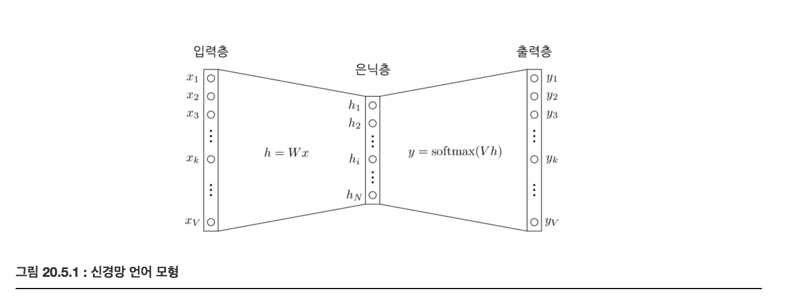
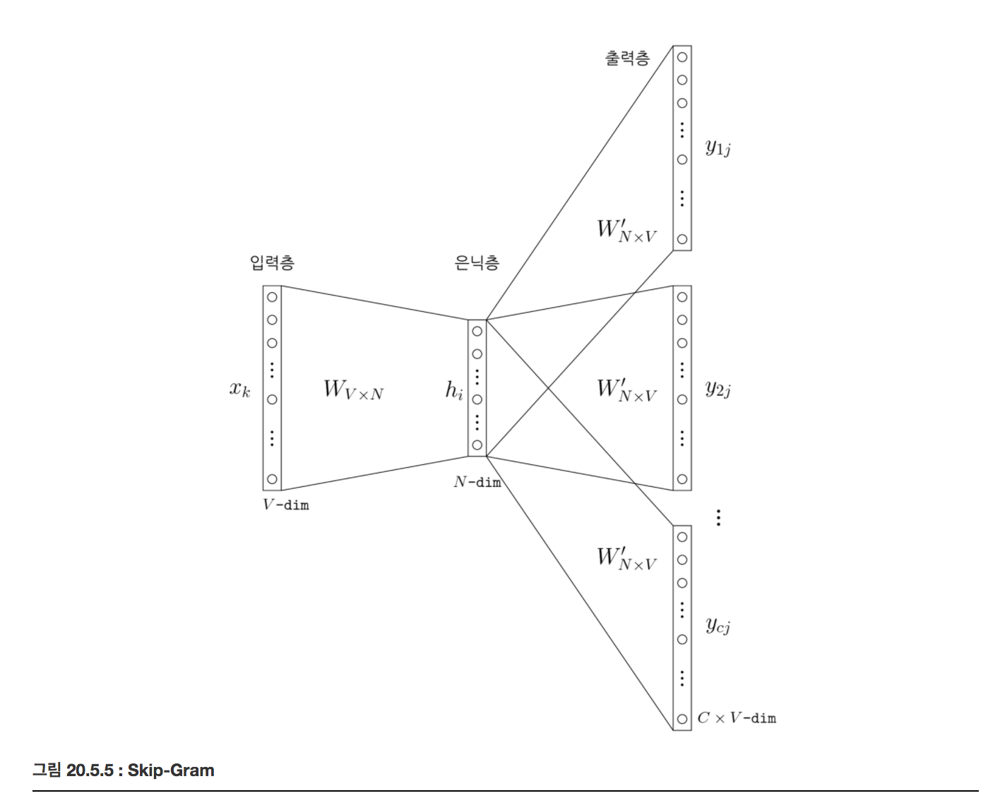

# 단어 임베딩과 word2vec

### 단어 임베딩 Word Embedding

단어 임베딩이란 텍스트를 구성하는 하나의 단어를 수치화하는 방법의 일종이다. 하나의 단어를 하나의 인덱스 정수가 아니라 실수 벡터로 나타낸다. 단어 임베딩이 된 경우에는 각 단어 벡터를 합치거나(concatenation) 더하는(averaging, normalized Bag of Words) 방식으로 전체 문서의 벡터 표현을 구한다.

Bag of words(BOW)는 텍스트 분석에서 사용하는 방식으로 단어 하나에 인덱스 정수를 할당하는 방법이다. 이 방법을 사용하면 문서는 단어장에 있는 단어의 갯수와 같은 크기의 벡터가 되고 단어장의 각 단어가 그 문서에 나온 횟수만큼 벡터의 인덱스 위치의 숫자를 증가시킨다. 

### Feed-Forward 신경망 언어 모형(Neural Net Language Model)

하나의 단어로부터 다음에 오는 단어를 예측하는 문제이다. 단어 하나짜리 문맥(single-word context)을 가진다고 한다. 

V개의 단어를 가지는 단어장이 있을 때, 단어를 BOW 방식으로 크기 V인 벡터로 만든 다음 그림과 같이 하나의 은닉층(Hidden Layer)을 가지는 신경망을 사용하여 특정 단어 열(word sequence)이 주어졌을 때 다음에 나올 단어를 예측하는 문제를 생각해 보자. 입력과 출력은 모두 BOW 방식으로 인코딩되어 있다. 

입력 x가 들어가면 입력 가중치 행렬 W이 곱해져서 은닉층 벡터 h가 되는데 x가 one-hot-encoding 된 값이므로 h 벡터는 입력 가중치 행렬 W의 행 하나 $$w_i$$ 이 대응된다. $$h = \sigma(Wx)$$ 여기에서 i 는 입력 벡터 x의 값이 1인 원소의 인덱스이다. 즉 BOW 단어장에서 i번째 단어를 뜻한다. 이 $$w_i$$ 벡터 값을 해당 단어에 대한 분산 표현(distributed representation), 벡터 표현(vector representation) 또는 단어 임베딩(word embedding)이라고 한다. 

### CBOW (Continuous Bag of Words) Embedding

복수 단어 문맥(multi-word context)에 대한 문제 즉, 여러개의 단어를 나열한 뒤 이와 관련된 단어를 추정하는 문제이다. 즉, 문자에서 나오는 n개의 단어 열로부터 다음 단어를 예측하는 문제가 된다. 

예로 'the quick brown fox jumped over the lazy dog' 라는 문장에서 (the, quick, brown)이라는 문맥이 주어지면 fox라는 단어를 예측해야 한다.

CBOW는 다음과 같은 신경망 구조를 가진다. 여기에서 각 문맥 단어를 은닉층으로 투사하는 가중치 행렬은 모든 단어에 대해 공통으로 사용한다. 

### Skip-Gram Embedding

CBOW방식과 반대로 특정한 단어로부터 문맥이 될 수 있는 단어를 예측한다. 보통 입력 단어 주변의 k개 단어를 문맥으로 보고 예측모형을 만드는데 이 k값을 window size라고 한다. 

예로 'the quick brown fox jumped over the lazy dog' 라는 문장에서 window size k=1인 경우, quick->the, quick->brown, brown->quick, brown->fox 와 같은 관계를 예측할 수 있어야 한다. 

### Word2vec

CBOW 방식과 Skip-Gram 방식의 단어 임베딩을 구현한 C++라이브러리다. 기본적인 임베딩 모형에 subsampling, negative sampling 등의 기법을 추가하여 학습 속도를 향상하였다. 

Reference
- https://datascienceschool.net/