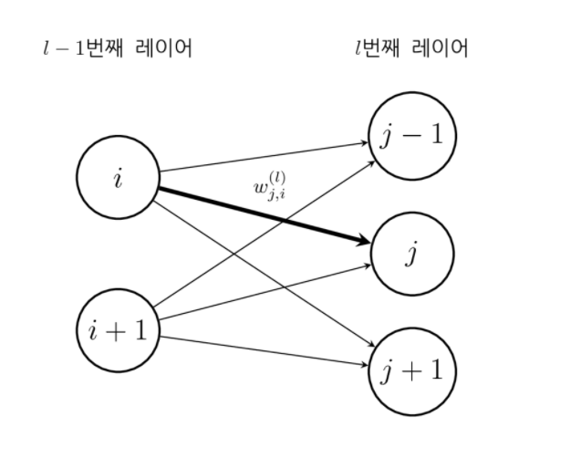
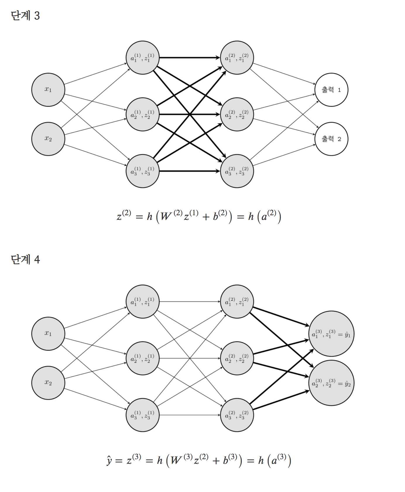

# 신경망 기초 이론

### Summary

- 일반적으로 활성화 함수로는 로지스틱 함수를 가장 많이 사용한다. 
- 기저함수의 형태를 추가적인 모수 $$\theta$$ 를 사용하여 다양한 모양의 기저함수를 시도할 수 있다. 
- MLP의 특징은 출력 계층에 복수개의 출력 뉴런를 가지고 각 뉴런값으로 출력 클래스의 조건부 확률을 반환하도록 설계하여 멀티 클래스 문제를 해결할 수도 있다는 점이다.
- 신경망의 오차함수는 조건부 확률이라는 실수 값을 출력해야 하므로 제곱합 오차함수를 사용한다. 
- SGD 이용해서 가중치 업데이트 한다. 

#### 신경망 정리 (신경망 계수 찾기)

1. 초기화(initialize) : 모든 $$w, b$$ 값을 임의의 값으로 초기화
2. 입력데이터(input) : 하나의 표본데이터 $$x_i$$ 로 입력 계층 설정 
3. 순방향전파(feedforward propagation) : 모든 뉴런데 애해 a(활성화값), z(레이터 출력 값) 값 계산
4. 오차 계산(output adn error calculation) : 최종 출력 계층의 값 $$z^{(L)}$$ 및 오차 $$\delta^{(L)}$$ 계산
5. 오차 역전파(backpropagation) : 반대 방향으로 오차 $$\delta$$ 전파
6. 그레디언트 계산(gradient calculation) : 표본데이터에 의한 오차함수의 미분값(그레디언트) $$\frac{\partial C_i}{\partial w}=z \, \delta$$ , $$\frac{\partial C_i}{\partial b}=\delta$$계산
7. 반복(minibatch-size iteration) : 표본데이터를 미니배치크기 만큼 2~6단계 반복
8. 가중치 갱신(weight update) : 미니배치크기 만큼의 데이터를 사용한 후 그레디언트 $$\dfrac {\delta C_i} {\delta w}, \dfrac {\delta C_i} {\delta b}$$ 계산하고 이 그레디언트 값으로 w, b값을 업데이트 
____________________

신경망(neural network)모형은 기저 함수(basis function)의 형태를 모수(parameter)값으로 변화시킬 수 있는 적응형 기저 함수 모형(adaptive basis function model)이며 구조적으로는 복수의 퍼셉트론을 쌓아놓은 형태이므로 MLP(multi-layer perceptron)로도 불린다. 

### 시그모이드 활성화 함수

일반적으로 활성화 함수 h로는 위와 아래가 막혀있는(bounded) 시그모이드 함수 $$\sigma$$ 를 사용하는데 가장 많이 사용하는 활성화 함수는 다음과 같은 로지스틱 함수이다. 

$$
h(a) = \sigma(a) = \dfrac {1}{1+e^{-a}}
$$

시그모이드 함수의 미분은 다음처럼 쉽게 계산할 수 있다.

$$
\dfrac{d\sigma(a)}{da} = \sigma(a)(1-\sigma(a)) = \sigma(a)\sigma(-a)
$$

활성화 함수로 로지스틱 함수를 사용할 때는 z=h(a) 값으로부터 최종 클래스 결정값 $$\hat y$$ 를 다음식으로 구한다.

$$
\hat{y} = \text{sign}\left(z - \dfrac{1}{2}\right) = \text{round}(z)
$$

### 비선형 기저 함수

퍼셉트론에서 x대신 기저함수 $$\phi(x)$$ 를 사용하면 XOR 문제 등의 비선형 문제를 해결할 수 있다. 그러나 고정된 기저 함수를 사용해야 하므로 문제에 맞는 기저함수를 찾아야 한다는 단점이 있다. 따라서 J개의 많은 기저 함수를 사용하는 것이 보통이다. 

$$
z = h \left( \sum_{j=1}^J w_j \phi_j(x) + b \right) = h \left( w^T \phi(x) + b \right)
$$

### 하이퍼 파라미터에 의해 모양이 바뀌는 비선형 기저함수

만약 기저함수 $$\phi(x)$$ 의 형태를 추가적인 모수 $$\theta$$ 를 사용하여 조절할 수 있다면 즉, 기저함수 $$\phi(x;\theta)$$ 를 사용하면 $$\theta$$ 값을 바꾸는 것만으로 다양한 모양의 기저함수를 시도할 수 있다.

$$
z=h(w^T\phi(x;\theta)+b)
$$

신경망 즉, MLP(Multi-Layer Perceptron) 은 퍼셉트론이 사용하고 있는 로지스틱 시그모이드 함수를 기저 함수로 사용하는 모형이다. 기저 함수의 형태는 하이퍼 파라미터 $$w^{(1)}, b^{(1)}$$ 의 값에 따라서 바꿀 수 있다. 

$$
\phi_j(x ; \theta_j) = \phi_j(x ; w^{(1)}_j, {b}^{(1)}_j) 
= h \left(w_{j}^{(1)} x + b_j^{(1)} \right)
$$

최종 출력값은 다음과 같다.

$$
z = h \left( \sum_{j=1}^M w_j h \left(w_{j}^{(1)} x + b_j^{(1)} \right)  + b \right)
$$

위의 식에서 각각의 계수의 역할은 $$w^{(1)}, b^{(1)}$$ 은 기저함수의 모양조절, $$w, b$$ 는 결정함수, 즉 졍계면 직선의 모양 조절이다. 

### Universal Approximation Theorem

Universal Approximation Theorem에 따르면 위와 같은 적응형 기저 함수 $$h(w_j^{(1)}x +b_j^{(1)})$$ 를 충분히 많이 사용하면 어떠한 형태의 함수와도 유사한 형태의 함수 $$z(x)$$ 를 만들 수 있다. 

### 다계층 퍼셉트론 (MLP)

신경망은 퍼셉트론을 여러개 연결한 것으로 다계층 퍼셉트론이라고도 한다. 신경망에 속한 퍼셉트론은 뉴론(neuron) 또는 노두(node)라고 불린다. 각 계층(layer)은 다음 계층에 대해 적응형 기저 함수의 역할을 한다. 최초의 계층은 입력 계층(input layer), 마지막 계층은 출력계층(output layer)이라고 하며 중간은 은닉계층(hidden layer)라고 한다. 

MLP의 특징은 출력 계층에 복수개의 출력 뉴런을 가지고 각 뉴런값으로 출력 클래스의 조건부 확률을 반환하도록 설계하여 멀티 클래스 문제를 해결할 수 있다. 

### 신경망 가중치 표기법

신경망의 가중치는 $$w_{j,i}^{(l)}$$ 과 같이 표기한다. 이 가중치는 $$l-1$$ 번째 계층의 $$i$$ 번째 뉴런과 $$l$$ 번째 계층의 $$j$$ 번째 뉴런을 연결하는 가중치를 뜻한다. 

이러한 방식을 사용하면 $$l-1$$ 번째 레이어의 출력값 벡터 $$z^{(l-1)}$$ 과 $$l$$ 번째 레이어의 입력값 벡터 $$a^{(l)}$$ 간에는 다음과 같은 식이 성립한다.

$$
a^{(l)} = {W^{(l)}} z^{(l-1)} + b^{(l)}
$$

위의 식에서 $$W^{(l)}$$ 는 $$l-1$$ 번째 레이어와 $$l$$ 번째 레이어의 사이를 연결하는 가중치 값 행렬이고 $$b^{(l)}$$ 은 $$l $$ 번째 레이어의 뉴런의 바이어스 값 벡터이다. 

### 순방향 전파 feedforward propagation

$$l-1$$ 번째 계층의 출력과 $$l$$ 번째 계층의 출력은 다음과 같은 관계를 가진다. 

$$
a^{(l)} = {W^{(l)}} z^{(l-1)} + b^{(l)} \\
z^{(l)} = h(a^{(l)})
$$

하나의 식으로 붙이면 다음과 같다.

$$
z^{(l)} = h\left({W^{(l)}} z^{(l-1)} + b^{(l)}\right)
$$

가장 첫번째 레이어 즉, 0번째 레이어의 출력은 입력 데이터 그 자체이다. $$z^{(0)} = x$$

가장 마지막 레이어 즉, L번째 레이어의 출력은 최종 출력이 된다. $$\hat y = z^{(L)}$$

아래에 순방향 전파의 예를 보였다.

### 오차함수

신경망의 오차함수는 조건부 확률이라는 실수 값을 출력해야 하므로 제곱합 오차함수를 사용한다. 

$$
\begin{eqnarray}  C(w,b) = \sum_{i=1}^N C_i(w,b) =  \sum_{i=1}^N \| y_i - z_i^{(L)}(w,b) \|^2 
\end{eqnarray}
$$

위의 식에서 N은 훈련용 데이터의 갯수이다. 로지스틱 활성 함수를 이용한 분류 문제를 풀 때는 정답 $$y$$가 클래스 $$k$$에 속하는 데이터에 대해 $$k$$번째 값만 1이고 나머지는 0인 원핫인코딩(one-hot-encoding) 벡터이다.

### 가중치 최적화

오차함수를 최소화하는 최적의 가중치를 찾기 위해 다음과 같이 미분(gradient)을 사용한 최급강하법(Steepest Gradient Descent)을 적용한다. 가중치 갱신 공식은 다음과 같다. 여기에서 $$\mu$$는 최적화 스텝사이즈(step size)이다.

$$
\begin{eqnarray}
  w_{k+1}  &=& w_{k} - \mu \frac{\partial C}{\partial w} \\
  b_{k+1} &=& b_{k} - \mu \frac{\partial C}{\partial b}
\end{eqnarray}
$$

### 역전파 back propagation

단순하게 수치적으로 미분을 계산한다면 모든 가중치에 대해서 개별적으로 미분을 계산해야 한다. 그러나 역전파 방법을 사용하면 모든 가중치에 대한 미분값을 한번에 계산할 수 있다.

역전파 방법을 수식으로 표현하면 다음과 같다.

(1) 우선 $$\delta$$ 는 오차함수 C를 a로 미분한 것으로 정의한다.

$$
\delta_j^{(l)} = \dfrac{\partial C}{\partial a_j^{(l)}}
$$

(2) 가장 최종단의 $$\delta$$ 를 구한다. 

최종단의 $$\delta$$ 는 다음과 같이 예측 오차 자체다. 따라서 역전파를 오차 역전파(error back propagation)라고도 한다. 

$$
\delta^{(L)}_j = y_j - z_j
$$

(3) 아래의 식을 사용하여 $$\delta$$ 를 뒤에서 앞으로 전파한다. 

$$
\delta^{(l-1)}_j = h'(a^{(l-1)}_j) \sum_{i=1}^{N_{(l)}} w^{(l)}_{ij} \delta^{(l)}_i
$$

위의 식에서 $$N_{(l)}$$ 는 $$l$$ 번째 레이어의 노드의 갯수이다. 이 식을 벡터-행렬 식으로 쓰면 다음과 같다. 

$$
\delta^{(l-1)} = h'(a^{(l-1)}) \odot ({W^T}^{(l)} \delta^{(l)})
$$

여기에서 $$\odot$$ 연산 기호는 Hadamard Product, Schur product, 혹은 element-wise product 라고 불리는 연산으로 정의는 다음과 같다. 즉 NumPy의 일반적인 배열 곱과 같다.

$$
x \odot y = 
\left(\begin{array}{c} x_1 \\ x_2 \\ x_3 \end{array}\right) \odot
\left(\begin{array}{c} y_1 \\ y_2 \\ y_3 \end{array}\right) 
= \left(\begin{array}{c} x_1 y_1 \\ x_2 y_2 \\ x_3 y_3 \end{array}\right)
$$

(4) 가중치에 대한 미분은 $$\frac{\partial C}{\partial w^{(l)}_{ji}} = \delta^{(l)}_j z^{(l-1)}_i$$ 으로 구한다. 

따라서 오차값을 위 식에 따라 앞쪽으로 다시 전파하면 전체 가중치에 대한 미분을 구할 수 있다. 

바이어스에 대한 미분은 $$\delta$$ 와 같다.  $$\frac{\partial C}{\partial b^{(l)}_{j}} = \delta^{(l)}_j$$

### SGD

위에서 구한 오차함수 값의 그레디언트는 데이터 한 쌍 즉 ($$x_i, y_i$$) 만을 이용하여 구한 값이다. 실제 오차함수 C는 모든 개별 데이터에 대해 구한 오차함수 값 $$C_i$$ 의 합니다. 

따라서 전체 오차함수 값에 대한 그레디언트 값은 각각의 개별 데이터에 대해 구한 그레디언트 값의 합이다. 

이 그레디언트 값이 구해지면 가중치를 업데이트 할 수 있다. 

그런데 트레이닝 데이터의 수가 많은 경우 모든 데이터를 다 사용하여 그레디언트를 구하면 그레디언트를 한 번 구하는데, 즉, 가중치를 한 번 업데이트하는데 드는 계산 시간이 너무 길어지므로 자주 업데이트를 할 수 없고 따라서 최종 가중치 값을 구하는데 시간이 너무 오래 걸린다.

따라서 일부 데이터만 사용하여 일단 그레디언트의 근사값을 구하고 이 근사값을 이용하여 가중치를 업데이트하는 방법 즉 SGD(Stochastic Gradient Descent)방법을 사용한다.

SGD방법에서 그레디언트를 한 번 바꾸기 위해 사용하는 데이터의 갯수 M을 미니배치크기(mini-batch size)라고 한다. 그리고 그레디언트를 업데이트한 뒤에는 이미 사용한 데이터가 아닌 다른 데이터에서 미니배치크기 만큼의 데이터를 뽑아서 사용한다. 이렇게 하면 전체 데이터가 N개, 미니배치크기가 M일 때 $$\dfrac{N}{M}$$M번 그레디언트를 업데이트하면 모든 데이터를 사용하게 된다. 이것을 1 에포크(epoch)라고 한다.

