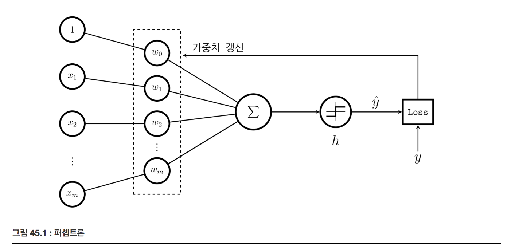

# 퍼셉트론 Perceptron

퍼셉트론은 가장 오래되고 단순한 형태의 판별함수기반 분류모형 중 하나이다.

퍼셉트론은 입력 $$x=(1, x_1, \dots , x_m)$$에 대해 1 또는 -1의 값을 가지는 $$y$$를 출력하는 비선형 함수이다. 1을 포함하는 입력 요소 $$x_i$$에 대해 가중치 $$w_i$$를 곱한 값 $$a=w^Tx$$을 활성화값(activations)이라고 하며 이 값이 판별함수의 역할을 한다. 

판별 함수 값이 활성화함수(activation function) $$h(a)$$를 지나면 분류결과를 나타내는 출력 $$\hat y$$ 가 생성된다.

$$
\hat y = h(w^Tx)
$$

퍼셉트론의 활성화 함수는 부호함수(sign function) 또는 단위계단함수(Heaviside step function) 라고 부르는 함수이다.

$$
h(a) = \begin{cases} -1, & a < 0, \\ 1, & a \ge 0 \end{cases}
$$

### 퍼셉트론 손실함수

독립변수 $$x$$로부터 종속변수 $$y$$를 예측하는 예측 모형이므로 학습데이터에 대해 예측 오차를 최소화하는 가중치 $$w$$를 계산해야 한다. 가중치 $$w$$에 따라 달라지는 전체 예측 오차 $$L$$는 개별 데이터에 대한 손실함수 $$L_i(\hat y_i, y_i)$$의 합으로 표현할 수 있다.

$$
L = \sum^{N}_{i=1} L_i(y_i, \hat y_i) 
$$

손실함수 $$L_i(\hat y_i, y_i)$$는 실제값 $$y$$와 예측값 $$\hat y$$의 차이를 나타내는 함수이다. 

제로-원 손실함수(zero-one loss function)는 $$\hat y$$ 와 $$y$$ 가 같으면 0이고 다르면 1이다. 

$$
L_i(y_i, \hat{y}_i) = \max(0, -y_i\hat{y}_i) \\
L_i(\hat{y}) =
\begin{cases}
\frac{1}{2}(\text{sgn}(-\hat{y}) + 1) & \text{ if } y = 1 \\
\frac{1}{2}(\text{sgn}(\hat{y}) + 1)& \text{ if } y = -1 \\
\end{cases}
$$

전체 손실함수는 아래와 같다.

$$
L = \sum_{i=1}^N \max(0, -y_i\hat{y}_i) = - \sum_{i \in M}  y_i\hat{y}_i
$$

$$M$$은 오분류(misclassification)된 데이터의 집합이다. $$y$$와 $$\hat y$$값이 다르면 오분류된 것이다. 

제로-원 손실함수는 $$\hat y(x)$$가 $$x$$에 대한 계단형 함수이므로 대부분의 영역에서 기울기가 0이 되어 미분값으로부터 최소점의 위치를 구할 수 없다.
퍼셉트론에서는 $$\hat y$$ 대신 활성화값 $$w^Tx$$를 손실함수로 사용한다.

퍼셉트론 손실함수(perceptron loss function) 또는 0-힌지 손실함수(zero-hinge loss function)이다.
- 손실값은 오분류된 표본에 대해서만 계산한다. 
- $$y$$ 와 $$sgn(\hat y)$$ 값이 다르면 오분류된 것이다. 

$$
L_P(w) = - \sum_{i \in M} y_i \cdot w^Tx_i \\
L_{P,i}(\hat{y}) =
\begin{cases}
-\frac{1}{2}w^Tx\,(\text{sgn}(-\hat{y}) + 1) & \text{ if } y = 1 \\
\frac{1}{2}w^Tx\,(\text{sgn}(\hat{y}) + 1)& \text{ if } y = -1 \\
\end{cases}
$$

### 가중치 계산

퍼셉트론 손실함수 $$L_p(w)$$를 최소화하는 $$w$$를 찾기 위해 $$L_p(w)$$를 $$w$$로 미분하여 그레디언트를 구하면 다음과 같다.

$$
\dfrac{dL_P}{dw} = - \sum_{i \in M} x_i y_i
$$

그레디언트 디센트(gradient descent)방법을 사용하면 다음과 같이 $$w$$를 갱신할 수 있다.

- $$\eta_k$$ 는 스텝사이즈(step size) 또는 학습속도(learning rate)라고 한다.

$$
\begin{eqnarray}
w_{k+1} 
&=& w_{k} + \eta_k \sum_{i \in M} x_i y_i \\
\end{eqnarray}
$$

실제로는 계산량을 줄이기 위해 전체 오분류 데이터 집합 $$M$$중에서 하나만 골라서 사용한다. 다음 식에서 $$m$$은 오분류된 데이터 중의 하나를 무작위로 고른 것이다. ($$m \in M$$)

$$
w_{k+1} = w_{k} + \eta_k  x_m y_m
$$

또, $$\hat y$$ 이 1 또는 -1의 값만 가질 수 있으므로 실제로는 다음과 같은 식이 된다.

$$
w_{k+1} =
\begin{cases} 
w_{k} + \eta_k x_m  & \text{ if } \hat{y}_m = 1 \neq y_m \\ 
w_{k} - \eta_k x_m, & \text{ if } \hat{y}_m = -1 \neq y_m \\ 
\end{cases}
$$

퍼셉트론 손실함수는 원래의 손실함수와 정확하게 같지 않기 때문에 이러한 방식으로 학습 했을 때 매 단계마다 반드시 원래의 손실함수가 감소한다는 보장은 없다. 다만 퍼셉트론 수렴 정리(perceptron convergence theorem)로부터 데이터가 선형분리(linearly separable)가능한 경우에는 완전분류모형으로 수렴한다는 것이 증명되어 있다.

### Stochastic Gradient Descent (SGD)

전체 손실함수 $$L$$는 개별 데이터의 손실함수 $$L_i(\hat y_i, y_i)$$의 합이다. 개별데이터의 손실함수의 평균을 최소화 하는것이다.

$$
E = \sum_{i} L_i(\hat{y}_i, y_i) \\
\text {arg min} \ \text {E}[L]
$$

SGD 최적화 방법은 그레디언트의 기댓값의 추정치를 이용한다.

$$
\begin{eqnarray}
w_{k+1} 
&=& w_{k} + \text{E}[\nabla L] \\
\end{eqnarray}
$$

그레디언트의 기댓값의 추정치는 표본 평균이다. 즉 모든 학습용 데이터를 다 사용하여 그레디언트를 구하는 것이 아니라 미니배치(minibatch)라고 부르는 일부의 데이터만 사용하여 그레디언트 추정치를 구한다. 딥러닝에 사용된다. 

퍼셉트론은 오분류된(mis-classified) 데이터만 이용하는 SGD의 일종이다.

SGD 방법이 기댓값이 최소화되도록 수렴한다는 것은 다양한 논문에서 증명이 되어 있다. 다만 손실함수 자체를 최적화하는 것이 아니라 손실함수의 기댓값의 추정치를 최대화하기 때문에 손실함수값이 전반적으로 감소하는 추세를 보이는 것 뿐이고 항상 절대적으로 감소한다는 보장은 없다.

SGD에서는 제로-원이나 퍼셉트론 손실함수 이외에도 손실함수가 볼록함수(convex fuction)이면 모두 개별 데이터 손실함수로 사용할 수 있다.