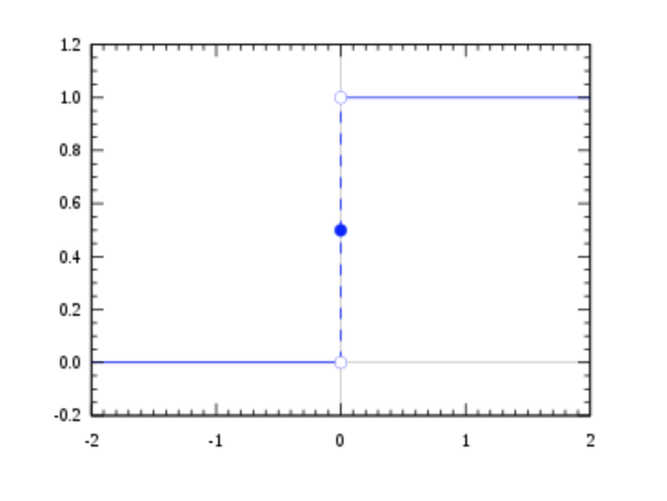

# 기계학습과 인공신경망 정리

## 기계학습 machine learning

### 모형 model

모형이란 데이터의 패턴을 일정한 수학적 형태로 표현한 것이다. 기계학습은 이러한 모형을 바탕으로 이뤄진다. 모형에 따라 잘 학습할 수 있는 패턴과 그렇지 않은 패턴이 다르기 때문에 데이터의 종류에 따라 서로 다른 모형을 적용하거나 여러 가지 모형을 테스트 해보고 가장 성능이 좋은 모형을 사용하게 된다.

선형모형(linear model)은 데이터의 패턴이 직선적인 형태를 가지고 있다는 가정에 바탕을 둔다. 단순한 모형이지만 결과가 안정적이고 해석이 쉽기 때문에 널리 쓰인다.

최근접이웃(nearest neighbor)는 새로운 사례가 입력으로 들어왔을 때 기존의 사례 중에서 가장 유사한(최근접)사례들(이웃)을 찾아 이들의 평균을 내거나 다수결하여 출력한다. 간단하지만 정확한 방법이다. 다만 기존 사례가 너무 많거나 복잡한 데이터의 경우에는 사용하기 어렵다는 단점이 있다.

인공신경망(artificial neural network)은 생물의 신경망, 인간의 두뇌와 같은 것을 모방하는 방법이다. 학습이 느리고 많은 데이터가 필요하다는 단점이 있었으나 빅데이터의 등장과 컴퓨터 속도의 향상으로 최근 각광을 받게 되었다. 흔히 말하는 딥러닝(deaplearning)이 인공 신경망에 바탕을 둔 것이다. 인공 신경망은 특히 언어, 소리, 이미지 같은 비정형(unstructured)데이터에 강점이 있다. 

의사결정나무(decision tree)는 스무고개와 같은 식으로 예/아니오로 답할 수 있는 질문들을거쳐 예측할 수 있는 방법이다. 데이터를 바탕으로 이러한 질문의 종류와 순서를 결정하는데 정확성이 매우 높다. 최근의 경향은 수백개의 의사결정나무를 합쳐서 예측 능력을 높이는 앙상블(ensemble)방법을 사용한다. 의사결정나무는 표의 형태로 나타낼 수 있는 정형(structured)데이터에 강점이 있다. 

### 손실 함수 loss function, 비용함수(cost function)

모형에 학습된 패턴이 실제 데이터와 얼마나 떨어졌는지를 측정하는 함수이다. 기계학습은 손실을 최소화하도록 학습된 패턴 조정하는 방식으로 이뤄진다. 

손실함수의 예는 평균제곱오차(mean squared error:MSE)이다. MSE는 모든 사례에 대한 실제값(y)과 모형에 의한 예측값 $$(\hat y)$$ 의 오차를 제곱해서 평균낸 것이다. 

$$
\frac 1 N \sum_i (y_i - \hat y_i)^2
$$

### 최적화 optimization

주어진 제약 조건 아래서 목적 함수의 값을 최대화 또는 최소화하는 것을 말한다. 

주어진 모형과 데이터 아래서 손실 함수를 최소화 하는 것이므로 최적화 문제로 바꿔서 풀 수 있다. 대부분의 기계학습 문제는 문제를 넣으면 바로 답이 나오는 공식이 없게 때문에 점진적으로 해를 개선해나가는 방식의 최적화 알고리즘들이 널리 쓰인다. 

### 기계학습 종류

컴퓨터는 입력된 자료를 바탕으로 계산한 결과를 출력한다. 출력되는 결과의 성격에 따라 기계학습은 지도 학습, 비지도 학습, 강화 학습으로 구분된다.

#### 지도학습 supervised learning

지도학습은 출력되는 결과의 올바른 답을 알고 있는 문제이다. 기계 번역, 추천시스템, 이미지 인식 등이 지도학습에 속한다. 지도학습은 출력의 형태에 따라 회귀(regression)와 분류(classification)로 나뉜다. 회귀는 연속적인 값을 분류는 이산적인 값을 출력한다. 

#### 비지도 학습 unsupervised learning

비지도 학습은 출력되어야 할 결과의 답을 모르는 문제이다. 비지도학습은 출력의 형태에 따라 차원 축소(dimensionality reduction)와 군집(clustering)으로 나눈다. 차원 축소는 연속적인 값을 군집은 이산적인 값을 출력한다. 비지도학습은 지도학습의 전처리 과정으로 활용되기도 한다. 차원을 축소하면 입력의 크기가 줄어들기 때문에 지도학습을 할 때 패턴을 파악하기가 더 쉬워질 수 있기 때문이다. 

#### 강화 학습 reinforcement learning

강화학습은 원래 심리학 용어로 동물에게 보상과 처벌을 통해 학습을 시키는 것을 말한다. 기계학습에서 강화 학습은 이러한 심리학적 과정을 컴퓨터로 흉내낸 것이다. 강화학습은 지도 학습과 비슷하지만 정답 대신 그 답이 얼마나 '좋은 지'만 아는 경우에 활용한다. 

예를 들어 인터넷 쇼핑몰에 똑같은 버튼에 "지금 구매하세요"와 "주문하기" 두 가지 문구를 쓸 수 있다고 해보자. 어떤 버튼이 더 좋은지는 처음부터 알 수 없다. 하지만 고객들에게 버튼을 보여주었을 때 고객들이 그 버튼을 누른다면 그 버튼은 '좋다'고 말할 수 있다.

강화학습을 적용하면 컴퓨터가 시행착오를 거쳐 더 나은 문구의 버튼을 선택하게 할 수 있다. 

### 기계학습의 과정

기계 학습의 과정은 다음과 같은 순서로 진행된다.
- 데이터 분할
- 다양한 모형과 하이퍼 파라미터로 훈련
- 테스트
- 모형 선택

데이터 분할은 데이터를 훈련용(training)과 테스트용(test)으로 나누는 것이다. 컴퓨터가 데이터를 모두 '외워' 버리면 우리가 가진 데이터에서는 성능이 높아 보일 수도 있으나 실제에 적용하면 성능이 떨어질 수 있다. 따라서 컴퓨터가 단순히 데이터를 '외웠'는지 아니면 데이터의 패턴을 잘 깨우쳤는지 구별하기 위해 데이터 중 일부를 테스트용으로 나눠놓는 것이다.

데이터를 나눈 후에는 다양한 모형에 학습 또는 훈련을 시킨다. 대부분의 기계학습 모형들은 모형의 특성을 조절하는 하이퍼 파라미터(hyperparameter)를 가지고 있다. 같은 모형이라도 하이퍼파라미터에 따라 성격이 달라진다. 따라서 다양한 모형과 또 모형마다 다양한 하이퍼 파라미터로 훈련을 시킨다. 이렇게 다양한 모형/하이퍼파라미터를 시도하는 이유는 실제로 학습을 시켜보기 전에는 어떤 것이 잘 작동할지 알 수 없기 때문이다. 모형이 잘 작동하려면 모형의 형태와 데이터가 가진 패턴의 형태가 맞아야 한다. 그런데 데이터가 가진 패턴의 형태는 매우 복잡해서 우리가 파악하기 어렵기 때문에 일단 학습을 시켜보고 잘 작동하는 모형을 고른다.

테스트는 말 그대로 앞에서 훈련시킨 다양한 모형들을 테스트 데이터로 테스트 하는 것이다.

모형 선택은 테스트에서 성능이 가장 좋은 모형을 선택한다. 여기서는 여러 가지 비즈니스적인 고려가 들어가기도 한다. 예를 들면 예측 자체는 잘하지만 계산이 오래 걸리는 모형보다 조금 예측이 부정확하더라도 계산이 빠른 모형을 선택할 수도 있다.

### 기계학습과 통계학의 차이

기계학습과 통계학은 모두 데이터에서 패턴을 발견하는데 초점을 맞춘 학문이다. 둘의 내용은 거의 비슷하지만 접근 방식에 약간의 차이가 있다. 간단히 말하자면 통계학은 수학 또는 과학의 하위 분과이고, 기계학습은 공학의 하위 분과라고 할 수 있다. 현대적인 통계학은 19세기 후반에서 20세기 초반에 성립한 수학의 응용 분야이다. 주로 데이터의 패턴을 **해석**하고 인과관계를 이해하는데 많은 비중을 두고 발전해왔다. 기계학습은 20세기 후반에 발전한 인공지능의 한 분야로 통계학에서 많은 영향을 받았다. 혹자는 **통계적 학습**(statistical learning)이라고 부르기도 한다. 기계학습은 통계학을 인공지능을 만들기 위한 수단으로서 활용하기 때문에 데이터에 나타낸 패턴을 해석하거나 인과 관계를 이해하는데는 큰 비중을 두지 않는다.

### 감정 분석 sentiment analysis

감정 분석(sentiment analysis)은 텍스트에 나타난 긍/부정 형태의 감정을 분석하는 방법이다. 감정 분석을 할 수 있으면 단어의 빈도를 넘어 어떤 사안에 대한 사람들의 의견과 감정을 분석할 수 있게 된다.

#### 감정 분석 방법

감정 분석에는 크게 사전에 의한 방법과 기계 학습에 의한 방법 2가지가 있다. 단어 중에는 긍/부정의 감정을 나타내는 단어들이 있다. 이런 단어를 감정 단어라 한다. 사전에 의한 방법은 전문가가 감정 단어를 수집하여 감정 사전을 만들고, 이 사전을 이용해 텍스트의 감정을 분석하는 것이다. 예를 들어 낮은 가격을 나타낼 때 '합리적 가격'이라고 하면 긍정적 표현이지만, '싸구려'는 부정적 표현이다. 이와 같은 표현들을 수집하여 사전으로 만든다. 감정 사전을 만들기 위해서는 높은 전문성과 많은 노력이 필요하다. 기계학습에 의한 방법은 미리 긍/부정으로 분류된 문장들을 수집하여 기계학습 모형에 학습시킨다. 그리고, 새로운 텍스트에 학습된 모형을 적용하여 긍/부정을 예측한다. 기계학습에 의한 방법은 대량의 데이터가 필요하다는 단점이 있다.

### 로지스틱 회귀 losistic regressor

로지스틱 함수는 다음과 같은 형태의 함수이다. 

$$
\sigma(z) = \frac{1}{1 + e^{-z}}
$$

로지스틱 함수는 ($$-\infin, \infin$$) 범위의 y를 (0, 1)까지 범위로 찌그러트린다(squash). 그래서 스쿼시 함수라고도 하고 S자 형태로 생겼다 해서 시그모이드(sigmoid) 함수라고도 한다. 확률이 [0, 1]범위의 값이기 때문에 확률로 해석할 수 있게 된다 . 

참고로 범위를 나타낼 때 둥근 괄호는 범위의 양쪽 끝을 포함하지 않는다는 의미이고 각 괄호는 범위의 양쪽 끝을 포함한다는 의미이다. 

#### 로지스틱 회귀

로지스틱 회귀는 선형모형과 로지스틱 함수를 결합시킨 형태다. 이름은 회귀지만 실제로는 분류에 쓰이는 모형이다. 독립변수(x)에 가중치(w)를 곱하는 방식이고 출력이 (0,1) 사이의 확률형태이므로 해석이 간편하다는 장점이 있다.

$$
\sigma(wx + b)
$$

#### 크로스 엔트로피

로지스틱 회귀분석의 손실함수는 대표적인 방법으로 최대우도법(maximum likelihood)을 이용한다. 우도(likelihood)란 모형의 파라미터를 정했을 때, 학습용 데이터의 확률을 말한다. 최대우도법은 이 우도를 가장 크게 만드는 파라미터를 찾는 방법이다. 

로지스틱 회귀 분석은 각각의 x에 대해 한 클래스에 속할 확률 p를 알려주므로 그 확률들을 모두 곱하면 우도를 구할 수 있다. 

$$
\prod_k \bigg[ \sigma^y  (1 - \sigma)^{1 - y} \bigg]
$$

그런데 확률의 곱샘은 번거로우므로 로그(log)를 사용해서 덧셈으로 바꿔서 로그 우도를 사용한다. 마이너스를 붙인 이유는 로그 우도를 최소화했을 때 확률이 최대화되도록 만들기 위해서 이다. 
- y : k번째 데이터 클래스(0 또는 1)
- $$\sigma$$ : k번째 데이터의 클래스가 1일 확률
- 크로스 엔트로피라고도 불린다. 

$$
-\sum_k \bigg[ y\log \sigma + (1 - y)\log(1 -\sigma) \bigg]
$$

## 인공신경망 artificial neural network

### 퍼셉트론

인공신경망은 생물의 신경망을 흉내낸 모형이다. 신경망은 신경 세포, 뉴런(neuron)의 네트워크다. 뉴런의 기본 작동 방식은 이렇다
1. 뉴런은 다른 뉴런들로부터 신호를 받는다.
2. 뉴런 사이의 연결 강도에 따라 신호는 크고 작게 변한다
3. 받아들인 신호의 총량이 역치(threshold)를 넘어서면 뉴런은 활성화되어 다른 뉴런들로 신호를 전단한다. 
이런한 뉴런의 특성을 따른 최초의 모형은 퍼셉트론(perceptron)이다. 뉴런의 작동방식에서 첫째와 둘째를 수식으로 나타내면 선형 모형과 똑같다. 

$$
y =wx + b
$$

고전적인 퍼셉트론은 y > 0이면 활성화되어 1의 신호를 내보내고 이외의 경우에는 0의 신호를 내보냈다.

#### 활성화 함수 

고전적 퍼셉트론의 활성화 함수는 계단함수(step function)이다.

이러 함수는 기울기가 모든 점에서 0이고 0에서 불연속이기 때문에 경사하강법을 쓸 수가 없다. 그래서 매끄럽게 변하는 로지스틱 함수를 활성화 함수로 쓴다. 

퍼셉트론에 로지스틱 함수를 활성화 함수로 적용하면 로지스틱 회귀분석과 완전히 동일한 형태가 된다. 로지스틱 함수는 출력값이 0에서 1사이의 범위를 갖는다. 신경망의 맥락에서는 로지스틱 함수는 시그모이드(sigmoid) 함수라는 이름으로 더 많이 부른다. 시그모이드는 그리스어로 "S자 모양의"라는 뜻이다.

이와 비슷하게 쌍곡 탄젠트 함수를 사용하기도 한다. 쌍곡 탄젠트는 출력값이 -1에서 1사이의 범위를 갖는다. 쌍곡탄젠트는 시그모이드에 비해 몇 가지 장점이 있다. 첫째, 출력값이 +, -로 나오기 때문에 편향되지 않는다. 둘째, 0 주변에서 기울기가 더 급해서 사라지는 경사 문제가 적다.

최근에는 ReLU라는 활성화 함수도 많이 사용된다. ReLU는 max(0,x) 형태의 함수로 입력값이 0보다 크면 그대로 출력값으로 내보내고 0보다 작으면 0을 내보내는 함수다.

#### 다층 퍼셉트론 Multi-Layer Perceptron : MLP

퍼셉트론을 여러 겹으로 덧붙인 것이 다층 퍼셉트론이다. 앙상블에서 스택킹과도 비슷한 구조가 된다.

MLP에서는 입력층(input layer)과 출력층(output layer) 사이에 여러 겹의 은닉층이 들어가게 된다. 입력층의 신호가 은닉층으로, 은닉층의 신호가 출력층으로 앞으로 앞으로 전달되는 방식이기 때문에 앞먹임 신경망(feedforward network)라고도 한다.

$$
h = a(W_1x + b_1) \\
y = a(W_2h + b_2)
$$

$$a(w \cdot + b)$$ 를 간단히 $$f$$ 라고 쓴다면 다음과 같다. 

$$
h = f_1(x) \\
y = f_2(x)
$$

더 간단히 쓰면 

$$
y=f_2(f_1(x))
$$

#### 보편적 근사 정리 (universal approximation theorem)

충분히 큰 은닉층을 가진 인공 신경망은 파라미터만 잘 조정하면 우리가 흔히 다루는 거의 모든 형태의 모형과 비슷하게 만들 수 있다. 이를 **보편적 근사 정리**(universal approximation theorem)라고 한다.

멋진 정리지만 2가지 함정이 숨어 있다. 하나는 '잘 조정하면'이다. 즉, 어떤 파라미터가 존재한다는 것이지 그걸 반드시 찾을 수 있다는 것은 아니다. 경사하강법이든 어떤 학습 알고리즘든 항상 국소최적에 빠지거나 과적합될 수 있다.

또 다른 함정은 '충분히 큰'(sufficiently large)이다. 수학에서 이 말은 어떤 명제가 어떤 크기 N에서 참이면 N+1이든 N+2이든 NN보다 더 큰 크기에서도 참이라는 말이다. 예를 들면 충분히 큰 nn에 대해 다음 식이 성립한다.

보편적 근사 정리를 다시 풀어서 써보면 은닉층의 크기가 N인 신경망을 어떤 모형과 비슷하게 만들 수 있으면, 그 신경망보다 은닉층이 더 큰 신경망도 그 모형과 비슷하게 만들 수 있다. 실제로는 N은 다룰 수 없을 정도로 매우 클 수도 있다.

#### 심층 신경망(deep neural network) 또는 딥러닝(deep learning)

경험적으로 작은 은닉층을 여러 층으로 겹쳐 쌓으면 큰 은닉층 하나와 비슷한 성능을 보인다. 이를 심층 신경망(deep neural network) 또는 딥러닝이라고 한다. 은닉층이 몇 개부터 심층인가에 대해서는 명확한 기준이 있는 것은 아니다.

시그모이드 함수의 기울기는 최대가 .25, 쌍곡탄젠트도 1이다. 위에서 봤듯이 신경망에 경사하강법을 적용하면 뒤쪽의 기울기가 여러 번 곱해지게 된다. 1보다 작은 수를 계속 곱하면 점점 작아지므로 앞쪽의 레이어에는 경사가 거의 0이 된다. 이를 사라지는 경사(vanishing gradient)라고 한다.

경사하강법은 말그대로 경사를 따라 내려가는 식으로 파라미터를 개선하는 방법이다. 그런데 경사가 사라지면 파라미터 개선이 안되고, 학습도 안된다. 은닉층을 많이 넣으면 성능이 좋아져야 하지만 실제로는 학습이 안되서 성능이 좋아지지 못하는 것이다.

2000년 초반에 이 문제는 한 가지 해결책이 제시되었다. 그것은 사전 훈련(pretraining)이라는 방식으로, 매 층을 따로 학습시켜서 쌓아 올리는 방법이었다. 그러나 현재는 사전 훈련 없이 한 번에 학습시키는 방식을 쓰고 있다.

#### 딥러닝이 가능한 이유

현재 딥러닝이 활성화된 이유는 바꿔말하면 사라지는 경사가 어느 정도 해결되었기 때문이다. 대표적인 것이 ReLU다. ReLU는 0보다 큰 범위에서는 기울기가 항상 1이기 때문에 사라지는 경사 문제가 적다.

그러나 가장 큰 이유는 데이터가 많아지고 컴퓨터가 빨라졌기 때문이다. 딥러닝에서 경사가 완전히 사라지는 것은 아니기 때문에 학습이 느려질 뿐 멈추지는 않는다. 현재는 데이터도 많고 컴퓨터도 빠르기 때문에 많은 데이터로 오래 학습을 하면 결국에는 충분한 성능이 나올 때까지 학습을 시킬 수 있다.

바꿔말하면 데이터 양이나 컴퓨터 성능이 충분치 않다면 딥러닝은 충분한 효과를 보여주지 못한다.

Reference
- http://doc.mindscale.kr/km/unstructured/05.html