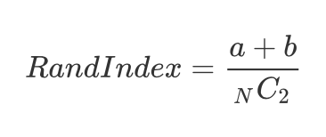

# 군집화 clustering

### Summary

- 군집화(clustering)란 주어진 데이터 집합을 유사한 데이터들의 그룹으로 나누는 것으로 비지도 학습이다.
- 조정 랜드지수(Adjusted Rand Index)는 무작위 클러스터링에서 생기는 랜드지수 기댓값을 원래 랜드지수 값에 빼서 기댓값과 분산을 재조정한 것이다. 정답표가 있다.
- 조정 상호정보량(Adjusted Mutual Information)은 두 확률변수 의존성이 강하거나 군집의 개수가 많아져 상호정보량이 증가하여 올바른 비교가 어려울 때 상호정보량의 기댓값을 빼서 재조정한 것이다. 정답표가 있다. (조정랜드지수와 비슷함)
- 실루엣계수(silhouette Coefficient)는 정답정보가 없을 경우 군집화 성능을 판단하기 위한 기준으로 사용된다. 실루엣 계수가 클수록 좋은 군집화이다. 군집의 개수를 사용자가 정해주어야 할 때 도움이 된다. 군집의 형상이 복잡하거나 크기의 차이가 많이나면 정상비교가 불가능하다. 
________________________________________

### 군집화 (clustering)

군집화(clustering)는 주어진 데이터 집합을 유사한 데이터들의 그룹으로 나누는 것이다. 군집(cluster)은 군집화으로 나누어진 유사한 데이터의 그룹이고 군집화는 예측 문제와 달리 특정한 독립변수와 종속변수의 구분도 없고 학습을 위한 목푯값도 필요로 하지 않는 비지도학습의 일종이다.

### 군집화 방법

- K-평균 군집화 (K-means Clustering)
- 디비스캔 군집화(DBSCAN Clustering)
- 유사도 전파 군집화(Affinity Propagation Clustering)
- 계층적 군집화(Hierarhical Clustering)
- 스펙트럴 군집화(Spectral Clustering)

군집화 방법은 사용법과 모수 등이 서로 다르다. K-평균법, 스펙트럴 군집화 등은 군집의 개수를 미리 지정해주어야 하지만 디비스캔, 유사도 전파법 등은 군집의 개수를 지정할 필요가 없다. 다만 이 경우에는 모형에 따라 특별한 모수를 지정해주어야 하는데 이 모수의 값에 따라 군집화 개수가 달라질 수 있다. 

### 군집화 성능기준

- 조정 랜드지수(Adjusted Rand Index) 
- 조정 상호정보량(Adjusted Mutual Information)
- 실루엣계수(silhouette Coefficient)

#### 일치행렬

랜드지수를 구하려면 데이터가 원래 어떻게 군집화되어 있어야 하는지를 알려주는 정답(groundtruth)이 있어야한다. $$N$$개의 데이터 집합에서 $$i, j$$ 두 개의 데이터를 선택하였을 때 그 두 데이터가 같은 군집에 속하면 1, 다른 군집에 속하면 0이라고 하자. 이 값은 $$N$$ x $$N$$ 행렬 $$T$$ 로 나타내면 다음과 같다.

$$
T_{ij} = 
\begin{cases} 
1 & \text{ i와 j가 같은 군집} \\
0 & \text{ i와 j가 다른 군집} \\
\end{cases}
$$

예를 들어 {0, 1, 2, 3, 4} 라는 5개의 데이터 집합에서 {0, 1, 2} 와 {3, 4}가 각각 같은 군집이면 행렬 T는 다음과 같다

~~~python
groundtruth = np.array([
  [1, 1, 1, 0, 0],
  [1, 1, 1, 0, 0],
  [1, 1, 1, 0, 0],
  [0, 0, 0, 1, 1],
  [0, 0, 0, 1, 1],
])
~~~

이제 군집화 결과를 같은 방법으로 행렬 $$C$$로 표시하자. 만약 군집화가 정확하다면 이 행렬은 정답을 이용해서 만든 행렬과 거의 같은 값을 가져야 한다. 만약 군집화 결과가 {0, 1}과 {2, 3, 4}가 같은 군집이라면 행렬 $$C$$ 는 다음과 같다.

~~~python
clustering = np.array([
  [1, 1, 0, 0, 0],
  [1, 1, 0, 0, 0],
  [0, 0, 1, 1, 1],
  [0, 0, 1, 1, 1],
  [0, 0, 1, 1, 1],
])
~~~

일치행렬(incidence matrix)은 위 두 행렬의 모든 원소에 대해 값이 같으면 1, 다르면 0으로 계산한 행렬이다. 즉, 데이터 집합에서 만들수 있는 모든 데이터 쌍에 대해 정답과 군집화 결과에서 동일한 값을 나타내면 1, 다르면 0이 된다.

$$
R_{ij} = 
\begin{cases} 
1 & \text{ if } T_{ij} = C_{ij} \\
0 & \text{ if } T_{ij} \neq C_{ij} \\
\end{cases}
$$

~~~python
incidence = 1 * (groundtruth == clustering)  # 1*는 True/False를 숫자 0/1로 바꾸기 위한 계산 
incidence
  
# 결과
array([[1, 1, 0, 1, 1],
        [1, 1, 0, 1, 1],
        [0, 0, 1, 0, 0],
        [1, 1, 0, 1, 1],
        [1, 1, 0, 1, 1]])
~~~

위의 일치 행렬은 두 데이터의 순서를 포함하므로 대칭행렬이다. 만약 데이터의 순서를 무시한다면 위 행렬에서 대각성분과 아래쪽 비대각 성분은 제외한 위쪽 비대각 성분만을 고려해야 한다. 위쪽 비대각 성분에서 1의 개수는 다음과 같아진다. 
- a = T(정답)에서 같은 군집에 있고 C(결과)에서도 같은 군집에 있는 데이터 쌍의 수 ; 1이 1인것도 맞고
- b = T(정답)에서 다른 군집에 있고 C(결과)에서도 다른 군집에 있는 데이터 쌍의 수 ; 0이 0인것도 맞다
- 일치행렬 위쪽 비대각 성분에서 1의 개수 = a + b

#### 랜드지수 Rand Index, RI

랜드지수는 가능한 모든 데이터 쌍의 개수에 대해 정답인 데이터 쌍의 개수의 비율로 정의한다. 0부터 1까지의 값을 가지고 1이 가장 좋은 성능을 뜻한다. 문제점은 무작위로 군집화를 한 경우에도 어느 정도 좋은 값이 나올 가능성이 높다. (무작위 군집화에서 생기는 랜드지수의 기댓값이 너무 크다)

