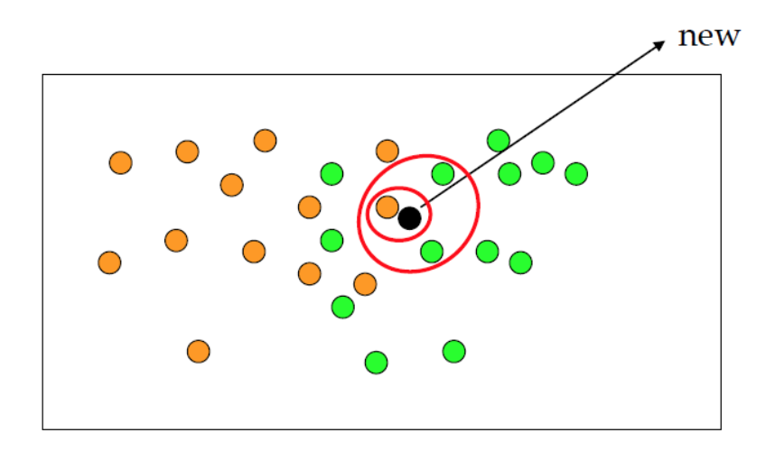

# K-Nearest Neighbor (KNN)

### Summary

- 새로운 데이터를 입력 받았을 때 가장 가까이 있는 것이 무엇인지를 중심으로 새로운 데이터 종류를 정해주는 알고리즘이다.
- 주변에 있는 몇개의 것들을 같이 봐서 가장 많은 것을 골라내는 방식을 사용한다. K는 주변의 개수를 의미한다. 
- 단점은 적절한 K을 확실히 알 수 없다. 최선의 k값을 선택하는 것은 데이터마다 다르게 접근해야합니다. 일반적으로 k 값이 커질수록 분류에서 이상치의 영향이 줄어들지만 분류자체를 못하게 되는 상황이 발생합니다. 일반적으로는 총데이터의 제곱근값을 사용하고 있다.
____________

### 모델 개요 

KNN은 새로운 데이터가 주어졌을 때 기존 데이터 가운데 가장 가까운 k개의 이웃의 정보로 새로운 데이터를 예측하는 방법이다. 아래 그림처럼 검은색 점의 범주 정보는 주변 이웃들을 가지고 추론해낼 수 있습니다. 만약 k가 1이라면 오렌지색, k가 3이라면 녹색으로 **분류(classification)**하는 것이지요. 만약 **회귀(regression)** 문제라면 이웃들 종속변수(y)의 평균이 예측값이 됩니다.

KNN은 새로운 데이터가 들어왔을 때, 그제야 기존 데이터 사이의 거리를 재서 이웃들을 뽑기 때문에 모델을 별도로 구축하지 않는다는 뜻으로 게으른 모델(Lazy model) 이라고도 부릅니다. 

KNN의 하이퍼파라미터(Hyper parameter)는 탐색할 이웃 수(k), 거리 측정 방법 두 가지입니다. k가 작을 경우 데이터의 지역적 특성을 지나치게 반영하게 됩니다(overfitting). 반대로 매우 클 경우 모델이 과하게 정규화되는 경향이 있습니다(underfitting). 아래 그림은 범주가 두 개인 데이터의 분류 경계면을 나타낸 것입니다. k의 크기에 따라 분류 경계면에 단순해지는 걸 확인할 수 있습니다.

### KNN 장단점

장점은 노이즈의 영향을 크게 받지 않는다. 학습데이터 수가 많다면 꽤 효과적인 알고리즘이다. 

단점은  최적 이웃의 수(k)와 어떤 거리척도가 분석에 적합한지 불분명해 데이터 각각의 특성에 맞게 연구자가 임의로 선정해야 한다. 새로운 관측치와 각각의 학습 데이터 사이의 거리를 전부 측정해야 하므로 계산 시간이 오래 걸리는 한계점이 존재합니다.