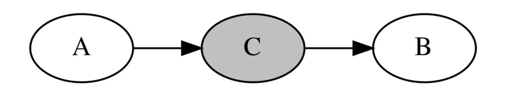
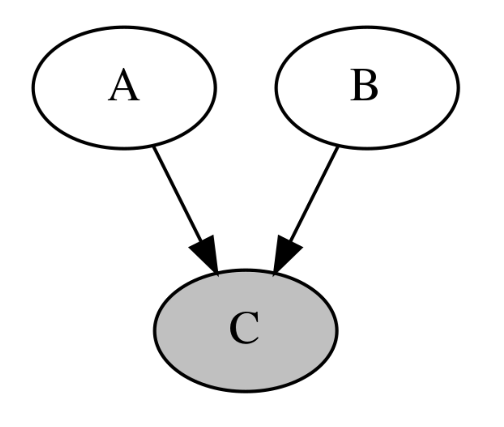

# 그래프 확률 모형 graphical probability model

### Summary

- 그래프 확률 모형은 여러개의 확률변수들 중에서 특정한 소수의 확률변수들이 가지는 관계를 그래프로 표현한 것이다. 
- 그래프 확률 모형 중에서도 인과관계가 확실하여 방향성 그래프를 표시할 수 있는 것을 베이지안 네트워크 모형이라고 한다. 
- 우리가 알고 있는 확률변수간의 정보를 그래프를 이용하여 추가하면 찾아야할 모수가 크게 감소해서 문제를 더 간단하게 만들 수 있다.  
- 방향성 그래프에서 두 노드가 조건부 독립인지 아닌지 알아보는 방법으로 방향성 분리 정리를 사용한다. 방향성 분리 정리에는 꼬리-꼬리 결합, 머리-꼬리 결합, 머리-머리 결합이 있다.  
  - 꼬리-꼬리 결합 : 확률변수 A, B가 공통의 부모 C를 가지는 경우 C에서 간선(화살표)의 꼬리가 2개 붙어 있는 결합
  - 머리-꼬리 결합 : 인과관계인 확률변수 A, B 사이에 C가 끼어 있는 경우
  - 머리-머리 결합 :  두 확률변수 A, B 를 부모로 가지는 C가 있는 경우
- 변수간의 인과관계가 순환 관계를 이룰 때는 무방향성 그래프인 마코프 네트워크를 사용한다. 마코프 네트워크는 클리크로 구성되었고 클리크를 구성하는 확률변수 분포는 포텐셜함수 또는 펙터로 표현할 수 있다. 
- 마코프 네트워크의 결합확률분포는 마코프 네트워크를 구성하는 모든 클리크의 팩터의 곱으로 나타난다.
------------

### 베이지안 네트워크 모형

현실에서는 모든 확률변수가 서로 영향을 미치는 복잡한 경우 보다 특정한 몇개의 확률분포들이 서로 영향을 미친다. 

예를 들어 A:건강상태, B:공부시간, C:시험성적 을 나타낸 것이라고 하자. 이 확률변수는 각각 {0, 1, 2}라는 값을 가질 수 있는다 하(0), 중(1), 상(2)의 상태를 나타낸다. 공부시간 B는 시험 성적 C에 영향을 미친다. 하지만 건강 상태 A는 공부 시간 B와 인과관계가 있지만 시험 성적 C와는 직접적인 인과 관계가 없다. 

이렇게 다수의 확률 변수 중 특정한 소수의 확률변수들이 가지는 관계를 그래프로 표현한 것을 **그래프 확률 모형(graphical probability model** 이라고 하고 그래프 확률모형 중에서도 이렇게 인과관계가 확실하여 방향성 그래프로 표시할 수 있는 것을 **베이지안 네트워크 모형** 이라고 한다. 

위의 그래프를 방향성 그래프(directed graph)라고 한다. 방향성 그래프에서 확률변수는 하나의 노드(node) 또는 정점(vertex)로 나타내고 인과관계는 화살표 간선(edge, link)으로 나타낸다. 

방향성 그래프는 화살표가 여러 확률변수를 거쳐 자기 자신에게 돌아오는 루프(loop)가 없는 DAG(Directed Acyclic Graph)모형이다. 

방향성 그래프 모델에서는 원인과 결과가 되는 두 확률변수의 관계를 조건부 확률분포로 표현한다. 위의 모형에서처럼 A가 B의 원인이 된다면 이 두 확률변수의 관계를 $$P(B|A)$$ 로 나타내고 B가 C의 원인이 되므로 $$P(C|B)$$ 로 나타낸다. 그리고 전체 확률변수들간의 관계는 이러한 조건부 확률분포를 결합하여 나타낼 수 있다. $$P(A,B,C)=P(A)P(B|A)P(C|B)$$ 

단, 여기에서 유의해야 할 점은 A와 C는 직접적인 인과관계가 없지만 상관관계는 있을 수 있다는 점이다. 예를 들어 A-B, B-C간의 관계가 모두 양의 상관관계이면 A가 커졌을 때 B도 커지고 따라서 C도 커지므로 A와 C가 양의 상관관계를 가지게 된다. A, B, C가 의미하는 바로 해석하면 건강상태와 시험성적은 직접적인 인과관계는 없지만 건강 상태가 좋을 때 공부 시간도 많아질 가능성이 높고 공부 시간이 많을 때 시험성적이 좋아진다면 건강상태와 시험성적은 양의 상과관계를 가질 수 있다. 

우리가 알고 있는 확률변수간의 정보를 그래프를 이용하여 추가하면 문제를 더 간단하게 만들 수 있다. 

### 베이지안 네트워크의 결합확률분포

베이지안 네트워크를 만들려면 조사 대상이 되는 확률변수를 노드(node)로 생성하고 인과관계가 있는 노드를 방향성 간선(directed edge)로 연결한다. 베이지안 네트워크를 구성하는 확률변수의 결합확률분토는 다음처럼 주어진다.
- $$Pa(X_i)$$ 는 $$X_i$$ 의 부모 노드이다.

$$
P(X_1, \cdots, X_N) = \prod_{i=1}^N P(X_i | Pa(X_i))
$$

$$
P(X_1, X_2, X_3, X_4, X_5, X_6, X_7) = P(X_1) P(X_2) P(X_3 | X_1) P(X_4| X_1, X_2, X_3) P(X_5|X_4) P(X_6|X_4) P(X_7|X_2)
$$

### 조건부 독립

베이지안 네트워크를 만들 때 중요한 것은 확률변수간의 조건부 독립 관계가 그래프에 나타나고 있어야 한다는 점이다. 조건부 독립(conditional independence)은 일반적인 독립과 달리 조건이 되는 확률변수가 존재해야 한다. 

일반적으로는 확률변수 A,B가 독립인 정의는 다음과 같다. 

$$
P(A,B)=P(A)P(B)
$$

조건부 독립은 조건이 되는 C라는 확률변수에 대한 조건부 결합확률분포에 대해 다음이 만족되어야 한다. 즉 C에 대한 조건부 결합확률분포가 조건부 확률분포의 곱으로 나타난다. 

$$
P(A,B|C) = P(A|C)P(B|C)
$$

A,B가 C에 대해 조건부 독립이면 다음도 만족한다.

$$
P(A|B,C) = P(A|C) \\
P(B|A,C) = P(B|C)
$$

주의할 점은 조건부 독립과 (무조건부) 독립은 관계가 없다는 점이다. 즉, 두 확률변수가 독립이라고 항상 조건부 독립이 되는 것도 아니고 조건부 독립이라고 꼭 독립이 되는 것도 아니다.

### 방향성 분리 d-separation, directed separation

방향성 분리는 방향성 그래프 모형에서 어떤 두 노드(확률변수)가 조건부 독립인지 아닌지 알아보는 방법이다. 
- 꼬리-꼬리 결합
- 머리-꼬리 결합
- 머리-머리 결합

#### 꼬리-꼬리 결합

확률변수 A,B가 공통의 부모 C를 가지는 경우에 C에서는 간선(화살표)의 꼬리가 2개 붙어 있기 때문에 C는 꼬리-꼬리(tail-to-tail) 결합이라고 한다.

이 때 A와 B는 독립은 아니지만 조건부 독립이 성립한다. 즉 C가 어떤 값인지 알고 있을 때 A의 확률은 B의 값과 아무런 관계가 없다.

$$
P(A,B|C) = \dfrac{P(A, B, C)}{P(C)} = \dfrac{P(A|C)P(B|C)P(C)}{P(C)} = P(A|C)P(B|C)
$$

#### 머리-꼬리 결합

인과관계인 확률변수 A,B사이에 C가 끼어 있는 경우 노드 C에서 간선의 머리와 꼬리가 만나기 때문에 머리-꼬리(head-to-tail) 결합이라고 한다. 

A와 B는 독립이 아니지만 조건부 독립이 성립한다. 즉 C가 어떤 값인지 알고 있을 때 A의 확률은 B의 값과 아무런 관계가 없다.

$$
P(A,B|C) = \dfrac{P(A, B, C)}{P(C)} = \dfrac{P(A)P(C|A)P(B|C)}{P(C)} = \dfrac{P(A,C)P(B|C)}{P(C)} = P(A|C)P(B|C)
$$

#### 머리-머리 결합

두 확률변수 A,B를 부모로 가지는 C가 있는 경우 이러한 구조는 V-구조(V-structure) 또는 머리-머리(head-to-head)결합이라고 한다.

이 경우에는 A와 B가 독립니다. 하지만 조건부 독립은 성립하지 않는다. 즉 C값을 알고 있다면 A와 B가 서로 종속관계가 된다. 

예를 들어 A가 늦잠을 자는 것을 나타내는 확률변수, B가 길이 막히는 것을 나타내는 확률변수, C가 지각하는 것을 나타내는 확률변수하고 할 때, 늦잠을 자는 것과 길이 막히는 것은 서로 독립니다. 하지만 일단 지각(C)이 발생한 상황에서는 A,B는 서로 독립이 아니며 이 경우에는 반-상관관계를 가진다. 즉 늦잠을 자지 않았다면 길이 막혔을 가능성이 높아지고 길이 막히지 않았다면 늦잠을 잤을 가능성이 높아진다. 이러한 것을 explanining-out이라고 한다. 이러한 상황은 C가 A,B의 직접적 자식이 아니라 후손(descendent)인 경우에도 성립한다. 

정리해보면 방향성 분리(d-separation)정리에 따르면 A와 B가 C에 대해서 조건부 독립인 경우는 다음 조건이 만족되어야 한다.
- C가 A,B 사이의 경로에 있는 꼬리-꼬리 결합이거나 머리-꼬리 결합이다.
- C가 A,B 사이의 경로상에 있는 머리-머리 결합이거나 혹은 이러한 노드의 자손이 아니여야 한다. 

### 마코프 네트워크 Markov network

때로는 변수간의 인과관계가 순환(cycle)관계를 이루기 때문에 방향성이 있는 베이지안 네트워크로 구현할 수 없는 경우도 있다. 이 때는 무방향성 그래프(undirected graph)인 마코프 네트워크(Markov network)를 사용한다. 마코프 무작위장(Markov random field)라고도 한다. 

예를 들어 3x3 이미지의 픽셀 9개의 값이 확률변수라고 하면 이 9개의 확률변수 중 어떤 2개가 서로 관련성을 가진다. 이 때는 마코프 네트워크를 사용할 수 있다.

### 클리크와 팩터

마코프 네트워크는 클리크(clique)로 구성되는데 클리크를 구성하는 확률변수의 분포는 포텐셜함수(potential function) 또는 팩터(factor)로 표현할 수 있다. 팩터는 가능한 모든 결과의 조합에 대한 결합확률분포 또는 조건부 확률분포에 비례하는 함수다. 하지만 팩터는 확률분포함수와 달리 값이 더해서 1이 되어야 한다는 조건이 없다.

$$
p(X, Y) = \dfrac{1}{Z}\psi_1(X, Y) \\
p(X | Y) = \dfrac{1}{Z}\psi_2(X, Y)
$$

### 마코프 네트워크의 확률분포

마코프 네트워크의 결합확률분포는 마코프 네트워크를 구성하는 모든 클리크의 팩터의 곱으로 나타난다.

$$
P(X) = \dfrac{1}{Z(X)} \prod_{\{C\}} \psi_C(X_C)
$$

이 식에서 C는 클리크, $$X_C$$ 는 그 클리크 안의 확률변수, $$\psi_C$$ 는 그 클리크의 팩터, {C}는 모든 클리크의 집합, Z는 파티션(partition)함수를 나타낸다. 예를 들어 3x3 이미지의 경우 9개의 확률변수의 결합확률분포는 다음처럼 표현할 수 있다. 

$$
P(X_{11}, \ldots, X_{33}) = 
\dfrac{1}{Z}
\prod 
\psi(X_{11}, X_{12}) 
\psi(X_{11}, X_{21}) 
\psi(X_{12}, X_{13}) 
\cdots
\psi(X_{23}, X_{33}) 
\psi(X_{32}, X_{33})
$$

### 에너지 함수

팩터(클리크의 확률변수의 분포표현) 함수는 다음과 같은 형태로 표시할 수 있다.

$$
\psi(X) = \exp(−E(X))
$$

이 식에서 E(X)를 에너지 함수(energe function)라고 한다. 확률이 높을수록 에너지 함수의 값은 작아진다. 예를 들어 0과 1이라는 값을 가지는 베르누이 확률변수 $$X_1, X_2$$ 가 다음과 같은 에너지 함수로 표현되는 경우

$$
E(X_1, X_2) = -3(2X_1 - 1)(2X_2 - 1)
$$

팩터의 값을 구하면

$$
\psi(X_1 = 1, X_2 = 1) = e^3 \\
\psi(X_1 = 0, X_2 = 0) = e^3 \\
\psi(X_1 = 1, X_2 = 0) = e^{-3} \\
\psi(X_1 = 0, X_2 = 1) = e^{-3}
$$

즉 $$X_1, X_2$$ 둘 다 같은 값을 가질 확률은 서로 다른 값을 가진 확률에 비해 높아진다. 즉 서로 양의 상관관계를 가지게 된다. 