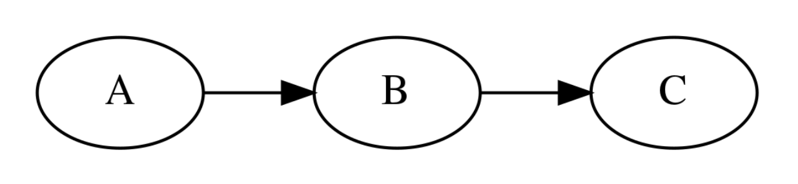

# 네트워크 추론

### Summary

- 확률모형에서 일부 확률변수의 값이 주어졌을 때 다른 확률변수의 값이 얼마인지 알아내는 것을 추론이라고 한다. 그래프 확률모형에서는 변수제거, 신뢰전파 방법이 있다. 
________________________

### 네트워크 추론

확률모형에서 일부 확률변수의 값이 주어졌을 때 다른확률변수의 값이 얼마인지를 알아내는 것을 추론(inference)라고 한다. 

조건부 확률분포함수 $$p(X_{\text{unknown}}|\{X\}_{\text{known}})$$를 알면 일부 확률변수의 값 $$\{X\}_{\text{known}}$$ 이 주어졌을 때 다른 확률 변수 $$X_{\text{unknown}}$$ 의 확률 $$p(X_{\text{unknown}})$$ 을 알 수 있으므로 추론은 조건부 확률분포함수 $$p(X_{\text{unknown}}|\{X\}_{\text{known}})$$ 알아내는 것과 같다. 

예시 

이 그래프 확률모형을 기반으로 다음과 같은 문제를 풀어보자
1. 이 학생의 시험 성적이 어떤 확률분포를 가질 것인가? 어떤 성적을 맞을 확률이 가장 높은가?
    - 무조건부 확률분포함수 P(C)를 찾는 것이다.
2. 이 학생의 건강상태가 좋았다. 어떤 성적을 맞을 확률이 가장 높은가?
    - 조건부 확률분포함수 P(C|A=2) 를 찾는 것이다.
3. 이 학생의 공부시간이 적었지만 시험 성적은 좋았다. 건강 상태가 어땠을까?
    - 조건부 확률분포함수 P(A|B=0, C=2)를 찾는 문제이다. 

베이지안 네트워크나 마코프 네트워크과 같은 그래프 확률모형에서 추론을 하려면 아래와 같은 방법을 사용한다. 
- 변수제거(variable elimination)
- 신뢰전파(belief propagation) 

### 변수제거 variable elimination
값을 알고 있는 확률변수 혹은 무조건부 확률변수분포를 알고 있는 확률변수부터 네트워크를 따라 차례대로 확률분포를 계산하는 방식이다.

### 신뢰전파 belief propagation, 메세지 전달 message passin 방법
이미 관측한 노드의 상태를 토대로 아직 관측하지 않은 노드의 주변분포를 각각 계산하는 알고리즘이다. 그래프 상에서 관측된 특정한 확률 변수의 분포가 주어졌을 때, 그로부터 직간접 적으로 영향을 받는 모든 관측되지 않은 확률 변수의 Belief를 추정하는 것이다. 즉, 완전히 간결하게 말하자면 Graphical Model에서 일부 노드에 대한 확률 분포 또는 값이 주어졌을 때, 그 외 다른 노드에 해당하는 확률 변수의 분포를 추정하는 문제라고 할 수 있다. 

  