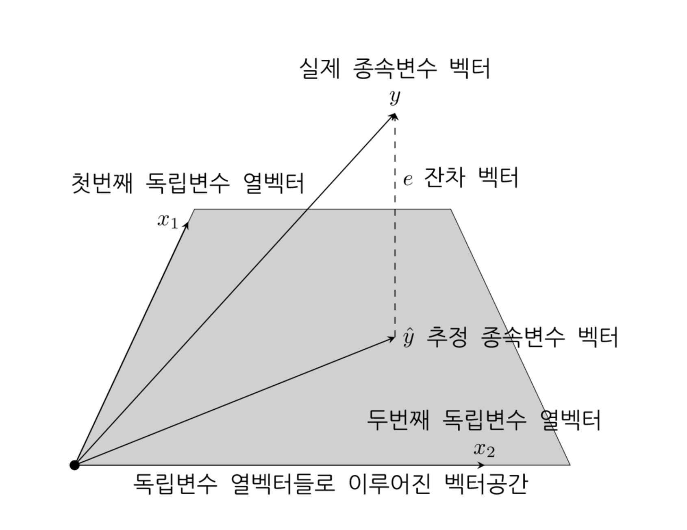

# 회귀분석의 기하학

### 회귀 벡터공간

선형 회귀분석으로 예측한 값 $$\hat{y}$$ 은 $$X$$ 의 각 열 $$c_1, … , c_M$$ 의 선형조합으로 표현된다.

$$
\hat{y} = w_1c_1 + ... + w_Mc_M
$$

모든 열이 선형독립이면 예측값 $$\hat{y}$$ 는 $$X$$ 의 각 열 $$c_1, … , c_M$$ 을 기저벡터(basis vector) 로 하는 벡터공간(vector space) 위에 존재한다는 것을 알 수 있다.

$$y$$ 와 $$\hat{y}$$ 의 차이가 잔차 벡터 $$e$$ 는 벡터 공간에 직교한다. 

### 잔차행렬과 투영행렬

벡터 $$a$$ 에서 다른 벡터  $$b$$ 를 변형하는 과정은 변형행렬(transforma matrix) $$T$$ 를 곱하는 연산으로 나타낼 수 있다.

$$
b = Ta
$$

**잔차행렬(residual matrix)** 은 종속값 벡터 $$y$$ 를 잔차벡터 $$e$$ 로 변형하는 변환 행렬

$$
e = My
$$

$$
\begin{aligned}
e 
&= y - \hat{y} \\
&= y - Xw \\
&= y - X(X^TX)^{-1}X^Ty \\
&= (I - X(X^TX)^{-1}X^T)y \\
&= My \\
\end{aligned}
$$

**투영행렬(projection matrix)** 은 종속값 벡터 $$y$$ 를 예측값 벡터 $$\hat{y}$$ 로 변형하는 변환 행렬로 햇(hat)행렬**, **영향도 행렬(influence matrix)이라고도 한다.

$$
\hat{y} = Hy
$$

$$
\begin{aligned}
\hat{y} 
&= y - e \\
&= y - My \\
&= (I - M)y \\
&= X(X^TX)^{-1}X^T y \\
&= Hy \\
\end{aligned}
$$

#### 잔차 행렬과 투영행렬 성질

- 대칭 행렬이다. 

$$
M^T = M \\
H^T = H
$$

- **멱등(idempotent)행렬** : 곱해도 자기 자신이 되는 행렬

$$
M^2 = M \\
H^2 = H
$$

- $$M$$ 과 $$H$$ 는 서로 직교한다.

$$
MH = HM = 0
$$

- $$M$$은 $$X$$와 직교한다.

$$
MX = 0
$$

- $$X$$ 에 $$H$$ 를 곱해도 변하지 않는다.

$$
HX = X
$$

위 성질들을 이용하면 $$y$$ 벡터의 제곱합은 잔차 벡터 $$e$$ 의 제곱합과 추정치 벡터 $$\hat {y}$$ 의 제곱합의 합이라는 것을 알 수 있다. 나중에 분산 분석(ANOVA)에 사용된다.
$$
\begin{aligned}
y^Ty 
&= ((H + M)y)^T((H + M)y) \\
&= y^T (H + M)^T (H + M)y \\
&= y^T (H + M) (H + M)y \\
&= y^T (H^2 + MH + HM + M^2)y \\
&= y^T (H + M) y \\
&= y^T H y + y^T M y \\
&= y^T H^2 y + y^T M^2 y \\
&= y^T H^T H y + y^T M^T M y \\
&= (Hy)^T (Hy) + (My)^T (My) \\
&= \hat{y}^T \hat{y} + e^T e \\
\end{aligned}
$$

