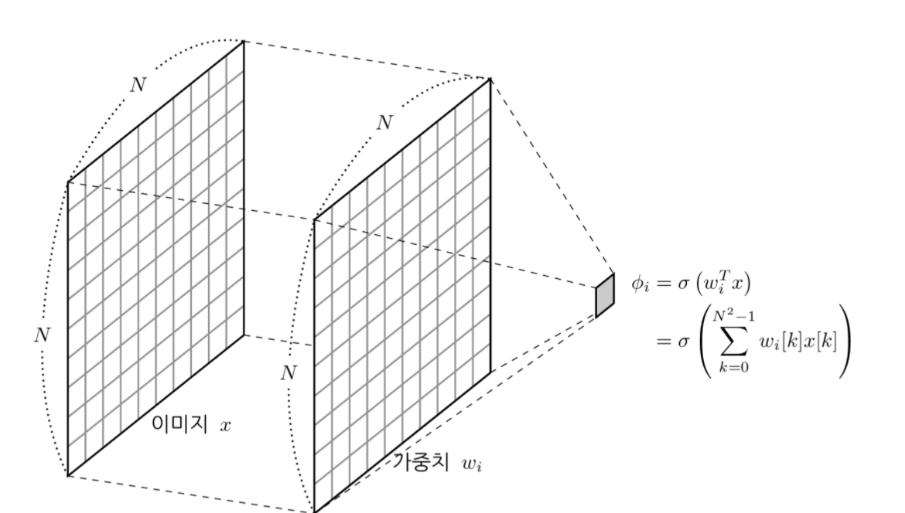
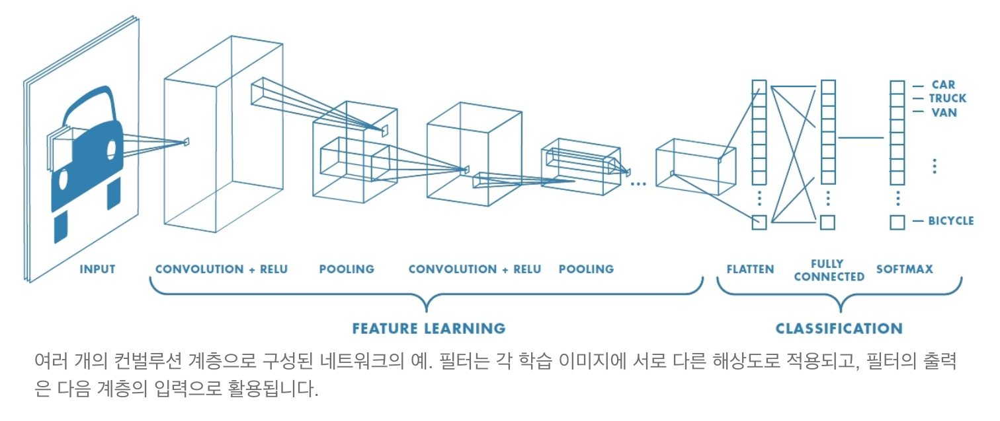
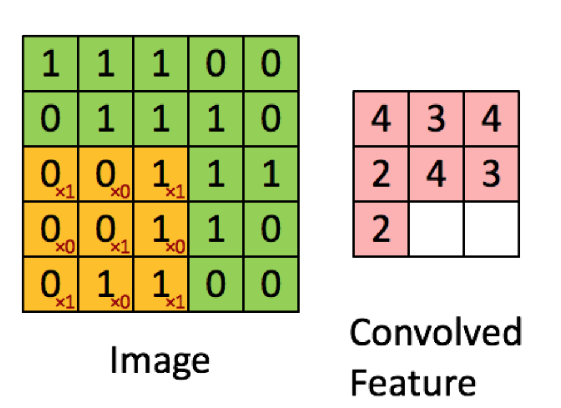
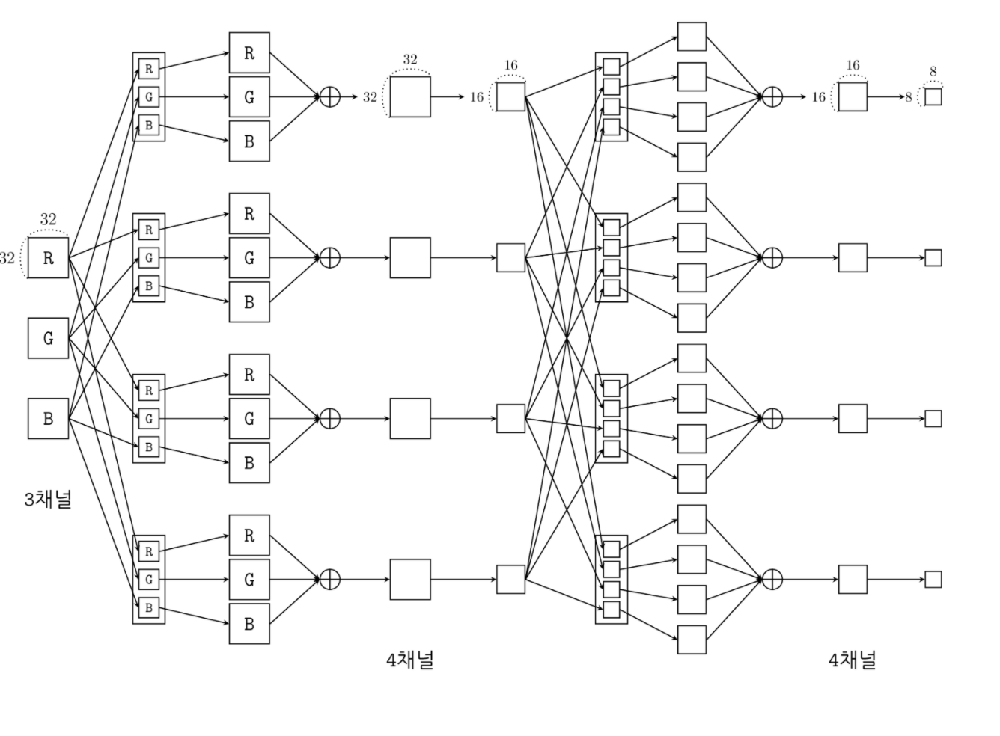
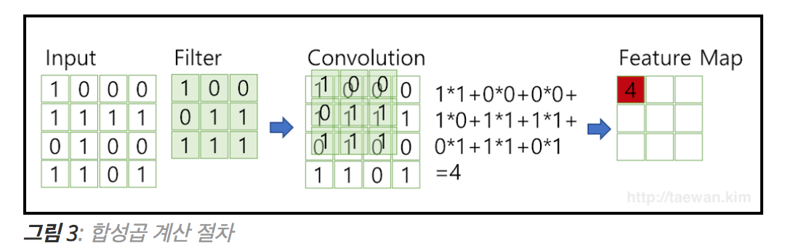
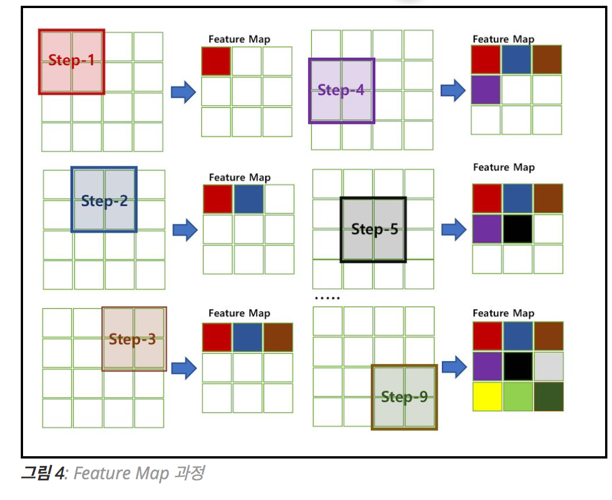
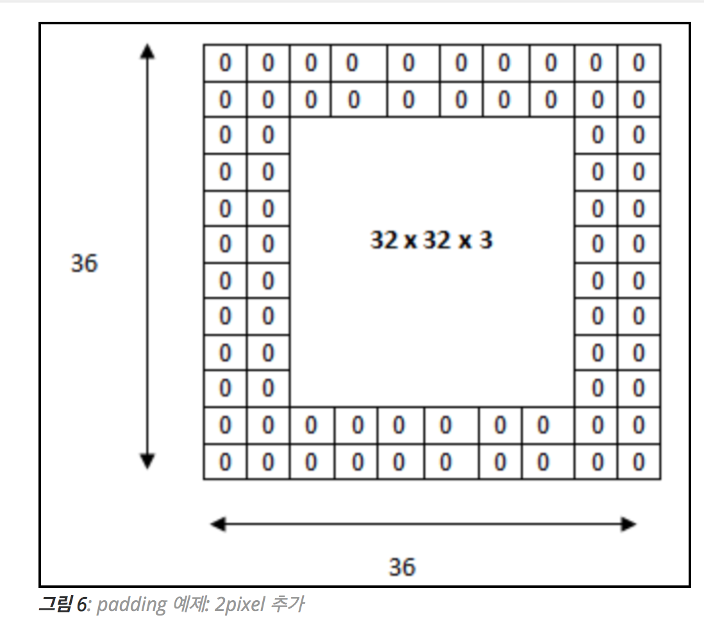
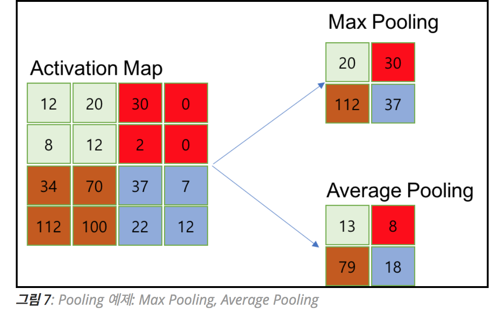

# Convolutional neural network (CNN)

### Summary

- CNN은 이미지 입력의 경우 파라미터의 수를 대폭 줄이면서 특징을 찾아내는 방법이다.
- 이미지를 날 것(raw input) 그대로 받아 공간적/지역적 정보를 유지한채 특성(feature)들을 학습 
- 이미지의 공간 정보를 유지하면서 인접 이미지와의 특징을 효과적으로 인식하고 강조하는 방식으로 이미지의 특징을 추출하는 부분과 이미지를 분류하는 부분으로 구성됩니다. 특징 추출 영역은 Filter를 사용하여 공유 파라미터 수를 최소화하면서 이미지의 특징을 찾는 Convolution 레이어와 특징을 강화하고 모으는 Pooling 레이어로 구성됩니다.
- CNN은 Filter의 크기, Stride, Padding과 Pooling 크기로 출력 데이터 크기를 조절하고, 필터의 개수로 출력 데이터의 채널을 결정합니다.
- CNN과 FCN 차이는 CNN은 학습 파라미터 수가 매우 작고 학습이 쉽고 네트워크 처리 속도가 빠릅니다.
 
___________

### CNN

신경망의 레이어수가 많아질수록 입력과 출력 사이의 비선형성을 잘표현하지만 찾아야할 파라미터 수가 많아져서 현실에선 최적화가 불가능하다.CNN은 이를 해결하기 위해 이미지 입력의 경우 파라미터의 수를 대폭 줄이면서 특징을 찾아내는 방법이다. 

- 파라미터 수를 줄이기 위해 전체 이미지가 아닌 일부 영역의 값만 선형조합하여 특징을 찾아낸다.
- 특징이 어느 위치에 있는지 모르기 때문에 영역을 이동시키면서(scanning) 특징을 찾는다. 다만 이동하는 동안 특징 계산 가중치값은 변하지 않는다.
- 한 종류의 특징만 사용하지 않고 여러 종류의 특징을 찾는다.

모델이 직접 이미지, 비디오, 텍스트 또는 사운드를 분류하는 머신 러닝의 한 유형인 딥러닝에 가장 많이 사용되는 알고리즘 이다. 이미지에서 객체, 얼굴, 장면을 인식하기 위해 패턴을 찾는데 특히 유용합니다. 데이터에서 직접 학습하며, 패턴을 사용하여 이미지를 분류하고 특징을 수동으로 추출할 필요가 없다.

### CNN이 유용한 이유

특징을 직접 학습하기 때문에 특징을 수동으로 추출해야 할 필요가 없다. 

가장 높은 수준의 인식 결과를 보인다.

기존 네트워크를 바탕으로 한 새로운 인식 작업을 위해 CNN을 재학습하여 사용하는 것이 가능하다. 

### CNN의 작동 방식

컨볼루션 뉴럴 네트워크를 구성하는 수십, 수백개의 계층이 각각 이미지의 서로 다른 특징을 감지하도록 학습할 수 이다. 필터는 각 학습 이미지에 서로 다른 해상도로 적용되고 필터의 출력은 다음 계층의 입력으로 활용된다. 필터는 밝기 및 가장자리 등과 같이 매우 단순한 특징에서 시작하여 객체만의 고유한 특징으로 더 복잡하게 발전할 수 있다.

이미지 특징 추출을 위하여 입력데이터를 필터가 순회하여 합성곱(convolution)을 계산하고 그 계산 결과를 이용하여 Feature map을 만든다. Convolution Layer는 Filter 크기, Stride, Padding 적용 여부, Max, Pooling 크기에 따라서 출력데이터와 Shape이 변경된다.

- 필터(커널)를 이미지 입력값에 전체적으로 훑어준다.
- 입력값 이미지의 모든 영역에 같은 필터를 반복 적용해 패턴을 찾아 처리하는 것이 목적이다. 
- 여러개의 feature을 뽑아내기 위해 여러개의 filter를 사용한다. 

### 완전연결망(fully-connected network)와 CNN모형

완전연결망(혹은 밀집망(dense network))은 전체 이미지로부터 $$i$$ 번째 특징 $$\phi_i$$ 를 구하려면 가중치 $$w_i$$ 를 이용하여 입력 이미지의 전체 데이터를 모두 조합해야 한다.

 

CNN은 입력이미지 중 $$M$$ x $$M$$ 크기의 영역만을 이용하여 특징 $$\phi_i$$ 를 계산한다. 여기에서는 입력데이터 $$x$$ 와 가중치 $$w$$를 1차원 벡터로 펼치지 않고 2차원인 행렬 형태로 계산한다. 이러한 계산방식을 이미지 필터링(image filtering)이라고 한다. 이미지 필터링에서 가중치는 커널(kernel), 필터(filter), 마스크(mask)라고도 부른다.  

### CNN의 구조

- 이미지의 특징을 추출하는 부분과 클래스를 분류하는 부분으로 나눌 수 있다.
- 특징추출 영역은 Convolution Layer과 Pooling Layer를 여러겹 쌓는 형태로 구성된다.
- 이미지의 특징을 추출하는 부분과 이미지를 분류하는 부분 사이에 이미지 형태의 데이터를 배열 형태로 만드는 Flatten 레이어가 위치합니다.
- 마지막 부분에는 이미지 분류를 위한 Fully Connected 레이어가 추가된다. 

#### 특징 학습, 계층 및 분류

입력계층, 출력계층 및 두 계층 사이의 여러 은닉계층으로 구성됩니다.

각 계층은 해당 데이터만이 갖는 특징을 학습하기 위해 데이터를 변경하는 계산을 수행합니다. 가장 자주 사용되는 계층으로는 컨벌루션, 활성화/ReLU, 풀링이 있습니다.
- **컨벌루션**은 각 이미지에서 특정 특징을 활성화하는 컨벌루션 필터 집합에 여러 이미지를 통과시킵니다.
- **ReLU**는 음수 값을 0에 매핑하고 양수 값을 유지하여 더 빠르고 효과적인 학습을 가능하게 합니다. 이 때 활성화된 특징만을 다음 계층으로 전달하기 때문에 활성화라고 부르기도 합니다.
- **풀링**은 비선형 다운 샘플링을 수행하고 네트워크에서 학습해야 하는 매개 변수 수를 줄여서 출력을 간소화 합니다.

이러한 작업이 수십개 또는 수백개의 계층에서 반복되어 각 계층이 여러 특징을 검출하는 방법을 학습하게 됩니다. 

### 분류 계층

CNN의 구조는 여러 계층에서 특징을 학습한 다음 분류로 넘어갑니다. 끝에서 두번째 계층은 K 차원의 벡터를 출력하는 완전 연결 계층입니다. 여기에서 K는 네트워크가 예측할 수 있는 클래스의 수입니다. 이 벡터에는 분류되는 이미지의 각 클래스에 대한 확률이 포함됩니다. 마지막 계층에서 softmax와 같은 분류 계층을 사용하여 분류 출력을 제공합니다. 

### CNN 주요 용어 정리

#### 1. 합성곱 Convolution

2차원 입력데이터(Shape(5,5))를 1개의 필터로 합성곱 연산을 수행하는 과정이다. 합성곱 처리 결과로 부터 Feature Map을 만듭니다.

#### 2. 채널 Channel

이미지 픽셀 하나하나는 실수이다. 컬러 사진은 천연색을 표현하기 위해서, 각 픽셀을 RGB 3개의 실수로 표현한 3차원 데이터입니다.(<그림 2> 참조) 컬러 이미지는 3개의 채널로 구성됩니다. 반면에 흑백 명암만을 표현하는 흑백 사진은 2차원 데이터로 1개 채널로 구성됩니다. 높이가 39 픽셀이고 폭이 31 픽셀인 컬러 사진 데이터의 shape은 (39, 31, 3)으로 표현합니다. 반면에 높이가 39픽셀이고 폭이 31픽셀인 흑백 사진 데이터의 shape은 (39, 31, 1)입니다.

컬러 이미지와 같이 입력 채널이 여러개이거나 feature map을 입력으로 받는 다음 단계의 CNN 레이어 각각의 채널에 대해 다른 이미지 필터를 하나의 세트로 사용하여 필터링한 결과를 합산

Convolution Layer에 유입되는 입력 데이터에는 한 개 이상의 필터가 적용됩니다. 1개 필터는 Feature Map의 채널이 됩니다. Convolution Layer에 **n개**의 필터가 적용된다면 출력 데이터는 **n개**의 채널을 갖게 됩니다.

#### 3. 필터(Filter) & Stride

필터는 이미지의 특징을 찾아내기 위한 공용 파라미터 입니다. kernel이라고도 합니다. 필터는 일반적으로 (4,4), (3,3)과 같은 정사각 행렬로 정의됩니다. CNN에서 학습의 대상은 필터 파라미터 입니다. 입력 데이터를 지정된 간격으로 순회하며 채널별로 합성곱을 하고 모든 채널(컬러의 경우 3개)의 합성곱의 합을 Feature Map로 만듭니다. 필터는 지정된 간격으로 이동하면서 전체 입력데이터와 합성곱하여 Feature Map을 만듭니다

필터는 입력 데이터를 지정한 간격으로 순회하면서 합성곱을 계산합니다. 여기서 지정된 간격으로 필터를 순회하는 간격을 Stride라고 합니다. <그림 4>는 strid가 1로 필터를 입력 데이터에 순회하는 예제입니다. strid가 2로 설정되면 필터는 2칸씩 이동하면서 합성곱을 계산합니다.

입력 데이터가 여러 채널을 갖을 경우 필터는 각 채널을 순회하며 합성곱을 계산한 후, 채널별 피처 맵을 만듭니다. 그리고 각 채널의 피처 맵을 합산하여 최종 피처 맵으로 반환합니다. 입력 데이터는 채널 수와 상관없이 필터 별로 1개의 피처 맵이 만들어 집니다.

하나의 Convolution Layer에 크기가 같은 여러 개의 필터를 적용할 수 있습니다. 이 경우에 Feature Map에는 필터 갯수 만큼의 채널이 만들어집니다. 입력데이터에 적용한 필터의 개수는 출력 데이터인 Feature Map의 채널이 됩니다.

Convolution Layer의 입력 데이터를 필터가 순회하며 합성곱을 통해서 만든 출력을 Feature Map 또는 Activation Map이라고 합니다. Feature Map은 합성곱 계산으로 만들어진 행렬입니다. Activation Map은 Feature Map 행렬에 활성 함수를 적용한 결과입니다. 즉 Convolution 레이어의 최종 출력 결과가 Activation Map입니다.

#### 4. 패딩 Padding

Convolution 레이어에서 Filter와 Stride에 작용으로 Feature Map 크기는 입력데이터 보다 작습니다. Convolution 레이어의 출력 데이터가 줄어드는 것을 방지하는 방법이 패딩입니다. 패딩은 입력 데이터의 외각에 지정된 픽셀만큼 특정 값으로 채워 넣는 것을 의미합니다. 보통 패딩 값으로 0으로 채워 넣습니다.

<그림 6>은 (32, 32, 3) 데이터를 외각에 2 pixel을 추가하여 (36, 36, 3) 행렬을 만드는 예제입니다. Padding을 통해서 Convolution 레이어의 출력 데이터의 사이즈를 조절하는 기능이 외에, 외각을 “0”값으로 둘러싸는 특징으로 부터 인공 신경망이 이미지의 외각을 인식하는 학습 효과도 있습니다.

#### 5. Pooling Layer

풀링 레이어는 컨볼류션 레이어의 출력 데이터를 입력으로 받아서 출력 데이터(Activation Map)의 크기를 줄이거나 특정 데이터를 강조하는 용도로 사용됩니다. 플링 레이어를 처리하는 방법으로는 Max Pooling과 Average Pooning, Min Pooling이 있습니다. 일반적으로 Pooing 크기와 Stride를 같은 크기로 설정하여 모든 원소가 한 번씩 처리 되도록 설정합니다.

Pooling layer와 Convolution layer 비교
- 학습대상 파라미터가 없다
- Pooling layer를 통과하면 행렬의 크기 감소한다
- Pooling layer를 통해서 채널 수 변경 없다.
- CNN에서는 주로 Max Pooling 사용한다.

### CNN 입출력, 파라미터 계산

`입력채널수X필터폭X필터높이X출력채널` (http://taewan.kim/post/cnn/ 참고)

### CNN과 Fully Connected Neural Network 비교

- 각 레이어의 입출력 데이터의 형상 유지
- 이미지의 공간정보를 유지하면서 인접 이미지와의 특징을 효과적으로 인식
- 복수의 필터로 이미지의 특징 추출 및 학습
- 추출한 이미지의 특징을 모으고 강화하는 Polling 레이어
- 필터를 공유 파라미터로 사용하기 때문에 일반 인공 신경망과 비교하여 학습 파라미터가 매우 적음 

Reference
- https://kr.mathworks.com/solutions/deep-learning/convolutional-neural-network.html 
- http://taewan.kim/post/cnn/
- https://datascienceschool.net/