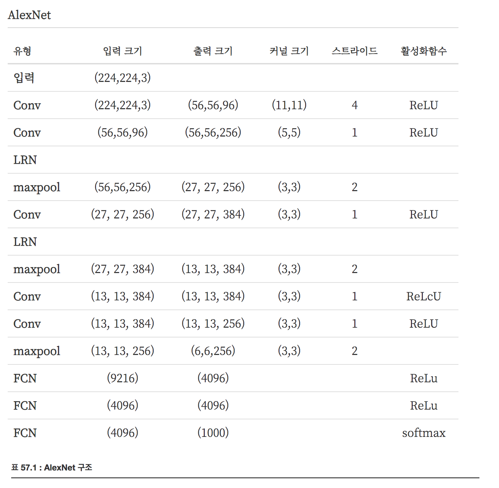

# Alex Net

AlexNet 구조는 5개의 컨볼루션 층(convolution layer), 3개의 fully connected layer로 이루어져있고 마지막 레이어의 소프트맥스 함수를 사용하여 예측을 하게 된다.

### AlexNet 특징

(1) ReLU 활성화 함수(activation function)를 사용

시그모이드, 하이퍼탄젠트 함수를 사용했을 때보다 학습속도가 빠르고 지수 연산처럼 연산량이 꽤 드는 작업이 없어 컴퓨터 자원을 절약하고 그레디언트가 더 잘 보존되었다. 마지막 층을 제외하고 모두 ReLu 함수 사용

(2) GPU를 활용한 병렬 처리

두대의 GPU를 병렬 처리 하여 사용하였다. 

(3) LRN(Local Response Normalization)

활성화 함수로 ReLu 함수를 사용했을 때 양수에 한해서는 막히지 않기 때문에 입력하는 데이터에 대한 정규화 과정이 꼭 필요하지 않다. 그럼에도 양수 방향으로 무한히 커질 가능성이 있어서 너무 큰 값이 주변 값들을 무시하게 할 수도 있기 때문에 정규화과정을 수행하는게 일반적인 관점(generalization)에서 좋다.

LRN

$$
b_{x,y}^i = \dfrac{a_{x,y}^i}{ \left (k + \alpha \displaystyle\sum^{min(N-1, i+n/2)}_{j=max(0,i-n/2)}(a_{x,y}^j)^2 \right )^{\beta}}
$$

위 식에서 $$a_{x,y}^i$$ 는 이미지의 x,y 좌표에서의 i 번째 필터를 의미한다. 그리고 N은 필터의 갯수를 의미한다. $$k,n,\alpha, \beta$$는 하이퍼 파라미터로 AlexNet에서는 각각 $$k=2, n=5, \alpha=10^{-4}, \beta=0.75$$로 설정했다.

(4) Overlapping pooling

기존의 풀링(pooling) 방식은 커널 크기를 2x2로 하고, 스트라이드(stride)를 2로 설정하여 이미지의 크기를 반으로 줄였다. AlexNet에서는 이 대신 3x3 크기의 커널을 사용하고 스트라이드를 2로 설정하여, 풀링이 겹치게 하였다.

(5) Data Augmentaion

AlexNet에서는 과적합 문제를 방지하기 위해서, 아래에서 설명할 Dropout과 함께 Data Augmentation 을 사용했다.

224x224로 잘라낸 이미지 그리고 원데이터를 좌우반전한 이미지
  - AlexNet에서는 Data Augmentation을 위해 원데이터와 원데이터를 좌우반전한 이미지에서 임의로 224x224 이미지를 추출하여 사용했다.(원 데이터의 크기는 다양했다.) 이렇게 해서 1개의 이미지로 2048개의 이미지를 만들어낼 수 있었다. 테스트 시에는 이미지에서 상하좌우 중앙 의 5개 이미지와 이를 반전한 5개 이미지 총 10장에 대한 예측치의 평균을 사용했다.
학습 이미지로 부터 RGB값을 변화
  - 모든 학습 이미지의 픽셀값에 대해 PCA를 수행하고 여기에 평균 0 표준편차 0.1의 정규분포에서 샘플링한 값($$\alpha$$)을 곱해주어 원래 픽셀에 더해줌으로써 다양한 이미지를 얻을 수 있었다

(6) Dropout

Dropout은 Fully Connected layers 의 앞 두 단계에서 사용되었다. Dropout이 없을 때 보다, 수렴하는 시간은 느리지만, 과적합 문제를 극복할 수 있었다고 한다.

(7) 최적화 과정

Stochastic Gradient Descent(SGD) ; batch size, momentum, weight decay, learning rate

Reference
- https://datascienceschool.net/