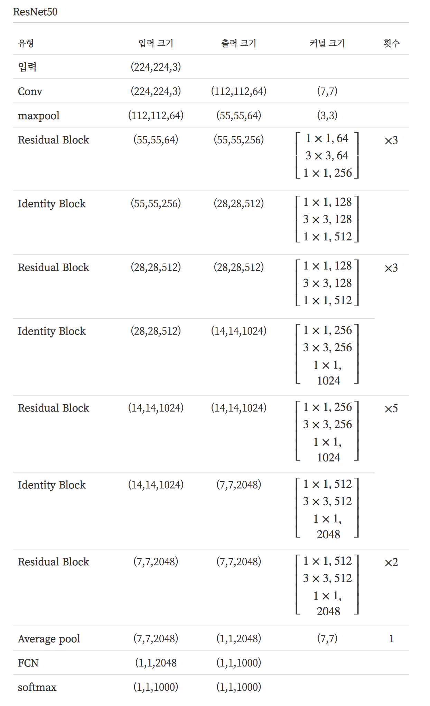
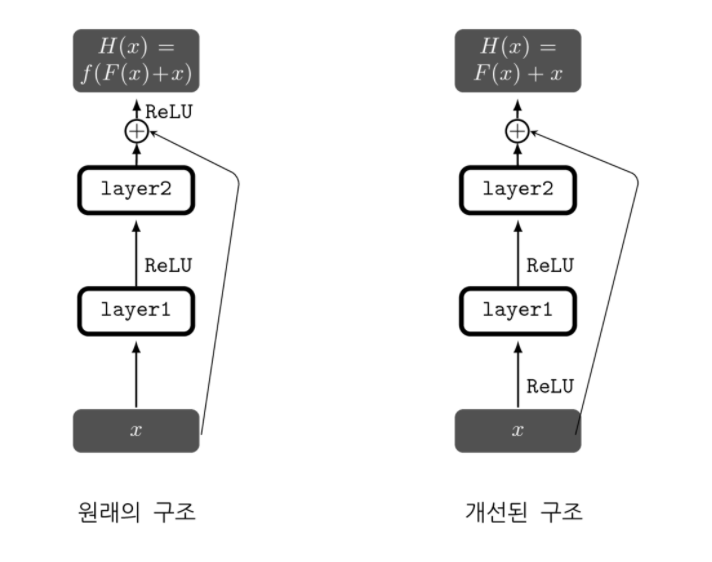

# ResNet

### Summary

- Residual Learning이란 개념이 고안된 이유는 VGGNet과 같은 기존 방식으로는 어느 일정 이상읜 layer 수를 넘어서게 되면 결과가 나빠지는 문제를 해결하기 위함이었다. 
- Degradation 문제는 학습이 수렴했다 하더라도 모델의 깊이가 깊어지다 보면 어느 순간 얕은 모델의 성능보다 더 나빠지는 현상이 발생하는 문제이다. 훈련용 데이터에 대한 성능의 문제이다. ResNet은 Degradation문제를 해결하기 위한 구조를 제시했다.
- Skip connention은 입력과 출력이 더해지는 것을 다음 레이어의 입력으로 사용하는 것이다.
____________

### Dagradation 문제

이전의 연구들로 모델의 깊이가 그 성능에 큰 영향을 미친다는 것을 알 수 있다. 그저 네트워크를 깊게 만들면, gradient vanishing/exploding 문제 때문에 학습이 잘 이루어지지 않고, 비용함수 값이 수렴하지 않는다. 다행히, 이에 대한 해결책으로 정규화 레이어 추가, 가중치 초기화 방법 등이 소개 되었고 꽤 깊은 모델이라도 학습을 수렴시킬 수 있게 되었다. 하지만 학습이 수렴했다 하더라도 모델의 깊이가 깊어지다 보면 어느 순간 더 얕은 모델의 성능보다 더 나빠지는 현상이 발생한다. 이를 Degradation 문제라고 한다. 이는 과적합 문제와는 다르다. 과적합 문제는 테스트 성능에 대한 문제이지만, Degradation은 훈련용 데이터에 대한 성능의 문제이다. ResNet의 저자들은 이 Degradation 문제를 해결하기 위한 구조를 제시했다.

### Skip connection

기존의 신경망의 학습 목적이 입력(x)을 타켓(y)으로 맵핑하는 함수 H(x)를 찾는 것이라고 한다면 신경망은 H(x)-y를 최소화하는 방향으로 학습을 진행한다. 이 때 x와 짝지어진 y는 사실 x를 대변하는 것으로 특히 이미지 분류 문제에서는 네트워크의 입출력을 의미상 같게끔 맵핑해야 한다. 

ResNet에서는 관점을 바꿔 네트워크가 H(x)-x를 얻는 것으로 목표를 수정하였다. 입력과 출력의 잔차를 F(x)=H(x)-x 라고 정의를 하고 네트워크는 이 F(x)를 찾는 것이다. F(x)는 잔차라고 할 수 있고, 이렇게 잔차를 학습하는 것을 Residual learning, Residual mapping 이라고 한다. 결과적으로 출력 H(x)=F(x)+x가 된다. 

이렇게 네트워크의 입력과 출력이 더해지는 것을 다음 레이어의 입력으로 사용하는 것을 스킵연결(skip conncetion) 이라고 한다. 

기존의 신경망은 H(x)가 어떻게든 정답과 같게 만드는 것이 목적이었나면 ResNet은 입력과 출력 사이의 잔차를 학습하는 것 즉, 최적의 경우 F(x)=0이 되어야 하므로 학습의 목표가 이미 정해져 있기 때문에 학습 속도가 빨라질 것이고 네트워크가 잔차를 학습하고 나면 입력값의 작은 변화에도 민감하게 반을할 것이라는 가설이다. 

스킵 연결을 구현 하는 것은 덧셈 연산의 추가 만으로 가능하다. 이는 추가적인 연산량이나 파라미터가 많이 필요하지 않다. 또한 역전파 시에 그레디언트가 잘 흘러갈 수 있게 해준다는 장점도 있다.

### ResNet의 구조

Residual Block과 Identity Block으로 이루어져 있다. 같은 연산 이지만 Indentity Block에서는 입력값과 출력값의 크기를 맞추어주는 작업이 필요할 뿐이다. 

ResNet에서는 첫번째 레이어(7x7 컨볼루션)를 제외하고는 모든 컨볼루션 연산에 3x3 이하 크기의 커널이 사용되었고, 피쳐맵의 크기가 같은 레이어는 출력 피쳐맵 갯수가 동일하다. 그리고 피쳐맵의 크기가 반으로 작아지는 경우 출력 피쳐맵의 갯수가 2배가 된다. pooling은 거의 사용되지 않고 컨볼루션 연산의 스트라이드(stride)를 2로 하여 피쳐맵의 크기를 줄였다. 이미지가 반으로 작아진 경우, Identity Block이 사용되며, 입력값을 바로 더하지 않고, 1x1 컨볼루션 연산을 스트라이드 2로 설정하여 피쳐맵의 크기와 갯수를 맞추어준 다음 더해준다. 이를 프로젝션 숏컷(projection shortcut)이라고도 한다.

### 병목 레이어

ResNet50 부터는 연산량의 줄이기 위해 Residual Block 내에, 1x1, 3x3, 1x1 컨볼루션 연산을 쌓았다. Inception에서 배웠던 것과 같은 개념이다. 1x1 컨볼루션 연산으로 피쳐맵의 갯수를 줄였다가 3x3을 거친 후, 1x1 컨볼루션 연산으로 차원을 늘려준다. 이 과정이 병목 같다 하여 병목레이어(bottleneck layer)라고 부른다.

##### Inception module

1x1 convolution 연산의 기능 두가지를 설명하겠다.

- 첫번째는 채널의 수를 조절하는 기능이다. 채널의 수를 조정한다는 의미는 다시 말해, 채널 간의 Correlation을 연산한다는 의미라고 할 수 있다. 기존의 convolution 연산은, 예를 들어 3x3의 커널을 이용해 연산을 할 경우, 3x3 크기의 지역 정보와 함께 채널 간의 정보 또한 같이 고려하여 하나의 값으로 나타낸다. 다르게 말하면, 하나의 커널이 2가지의 역할을 모두 수행해야 한다는 것이다. 대신 이전에 1x1 convolution을 사용한다면, 1x1은 채널을 조절하는 역할을 하기 때문에, 최적화 과정에서 채널 간의 특징을 추출 할 것이고, 3x3은 이미지의 지역정보에만 집중하여 특징을 추출하려 할 것이다. 역할을 세분화 해준 것이다. 채널간의 관계정보는 1x1 convolution에 사용되는 파라미터들 끼리, 이미지의 지역 정보는 3x3 convolution에 사용되는 파라미터들 끼리 연결된다는 점에서 노드 간의 연결을 줄였다고 볼 수 있다.
- 그리고 두번째는 1x1 convolution연산으로 이미지의 채널을 줄여준다면, 3x3과 5x5 convolution 레이어에서의 파라미터 개수를 절약 할 수 있다. 이 덕분에 망을 기존의 CNN 구조들 보다 더욱 깊게 만들고도 파라미터가 그리 크지 않다.

### Pre-activation Residual Unit

기존의 skip connection은 출력과 입력이 더해진 후 활성화 함수(ReLu)를 통과하였다. 활성화 함수를 $$f(\cdot)$$ 이라하고, 수식으로 표현하면 $$H(x)=f(F(x)+x)$$ 가 된다. 뒤에 따라오는 비선형 활성화 함수 때문에 다음 레이어의 입력 값에 이전 레이어의 입력이 그대로 반영되지는 않는다. 하나의 Residual Block 만 생각하면 큰 차이가 없겠지만, 이를 여러 개를 연결 하면 차이가 발생할 수도 있다. 그래서 F(x) 안에 활성화 함수를 반영한 다음 F(x)와 입력값을 더해준다. 수식으로 표현 하면 H(x) = F(x)+x이다. 

Reference
- https://datascienceschool.net/