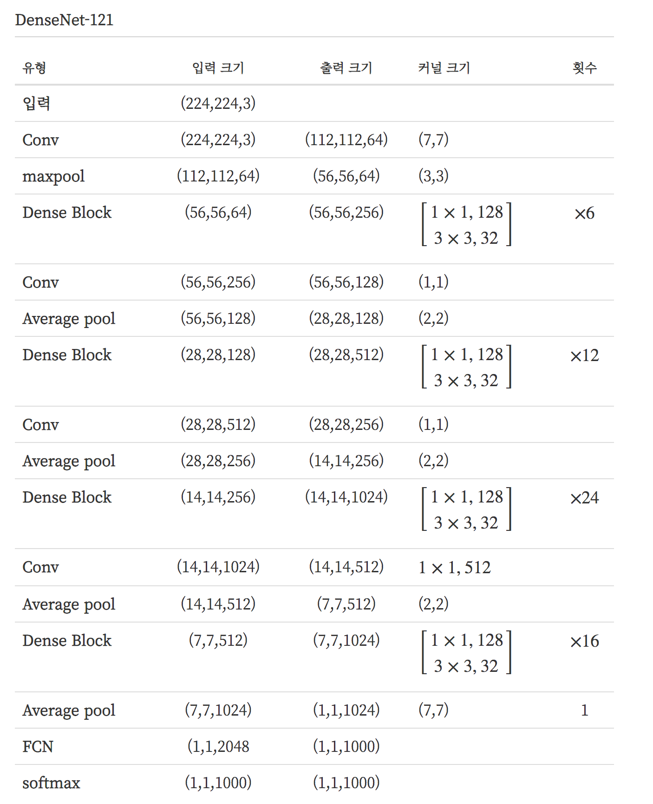

# DenseNet

### Summary

- 이미지에서 저수준의 특징들이 잘 보존되고, gradient가 수월하게 흘러 gradient vanishing 문제가 발생하지 않으며 깊이에 비해 파라미터 수가 적기에 연산량이 절약됨과 동시에 적은 데이터셋에서도 비교적 잘 학습이 된다는 점이다. 
- DenseNet은 Dense connectivity로 입력값을 계속해서 출력값의 방향으로 합쳐주기 때문에 최초의 정보가 비교적 온전히 남아있다.
______________

### Dense connectivity

DenseNet의 핵심은 Dense connectivity이다. Dense connectivity란 입력값을 계속해서 출력값의 채널 방향으로 합쳐주는 것(Concat)이다. 이를 ResNet과 수식으로 비교하면 다음과 같다.

$$
x_{l+1} = F(x_l) + x_l \\
x_{l+1} = F([x_0, x_1, \dots, x_l])
$$

ResNet 경우에는 입력이 출력에 더해지는 것이기 때문에 종단에 가서는 최초의 정보가 흐려질 수 밖에 없다. 그에 반해 DenseNet의 경우에는 채널 방향으로 그대로 합쳐지는 것이기 때문에 최초의 정보가 비교적 온전히 남아있게 된다. 

### DenseNet 구조

DenseNet의 구조를 표현한 것이다. 첫번째 convolution과 maxpooling 연산은 ResNet과 똑같다. 이 후 Dense Block과 Transition layer가 반복되고, 마지막의 fully connected layer와 softmax로 예측을 수행한다.

### Dense Block

Dense connectivity를 적용하기 위해서는 피쳐맵의 크기가 동일해야 한다. 같은 피쳐맵 크기를 공유하는 연산을 모아서 Dense Block을 구성하고 이 안에서 Dence Connectivity를 적용한다. 이 때, ResNet에서 배웠던 병목레이어를 사용한다. 이 또한 연산량을 줄이기 위해 적용한 것이다.

전체 convolution 연산의 출력 피쳐맵 갯수가 동일하다. 이 피쳐맵의 갯수를 `growth rate`라고 하고 k로 표현한다. 이는 하이퍼 파라미터이며, 논문에서는 k=32로 설정하였다. 따라서, Dense Block 내의 3x3 convolution 연산의 출력 피쳐맵의 갯수는 32이다. 1x1 convolution의 출력 피쳐맵의 갯수 또한 하이퍼 파라미터 이지만, 논문에서 4k를 추천한다. 따라서 Dense Block 내의 1x1 convolution 연산의 출력 피쳐맵 갯수는 128이다.

### Transition layer

Dense Block 사이에 있는 1x1 convolution 연산과 average pooling 연산을 묶어 Transition layer 라고 한다. 이 부분을 통과하면서 피쳐맵의 크기가 줄어들게 된다. 앞에 있는 1x1 convolution은 다음 Dense Block으로 전해지는 피쳐맵의 갯수를 조절하는 역할을 한다. 입력되는 피쳐맵의 갯수를 m이라고 했을 때, $$[\theta m], (0 < \theta \leq1)$$을 출력하는 피쳐맵의 갯수로 한다. $$\theta$$ 또한 하이퍼 파리미터로 논문에서는 0.5로 설정했다.

Reference
- https://datascienceschool.net/