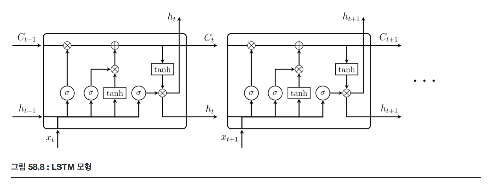
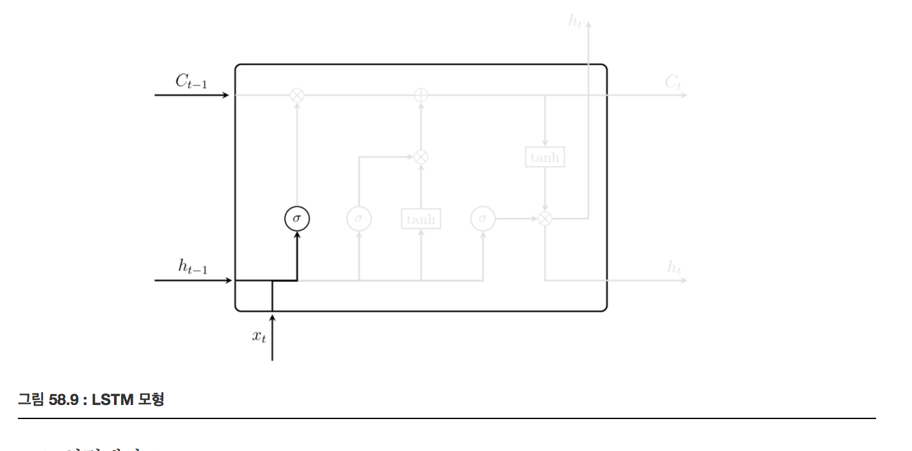
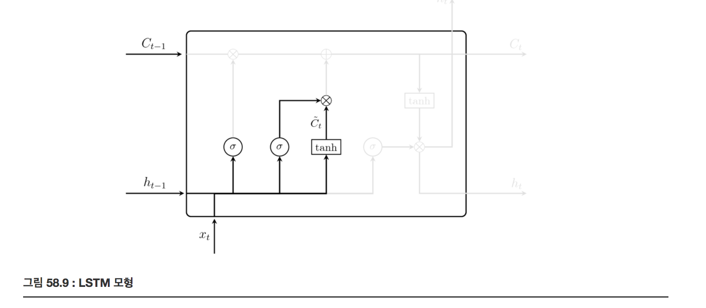
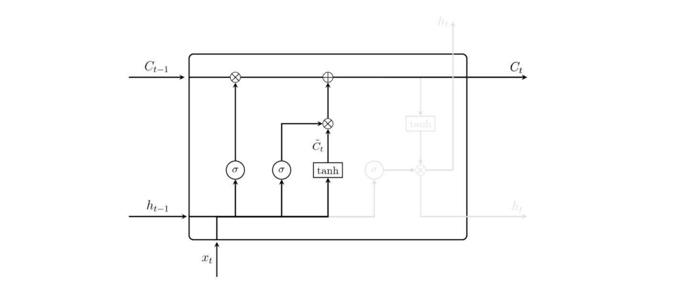
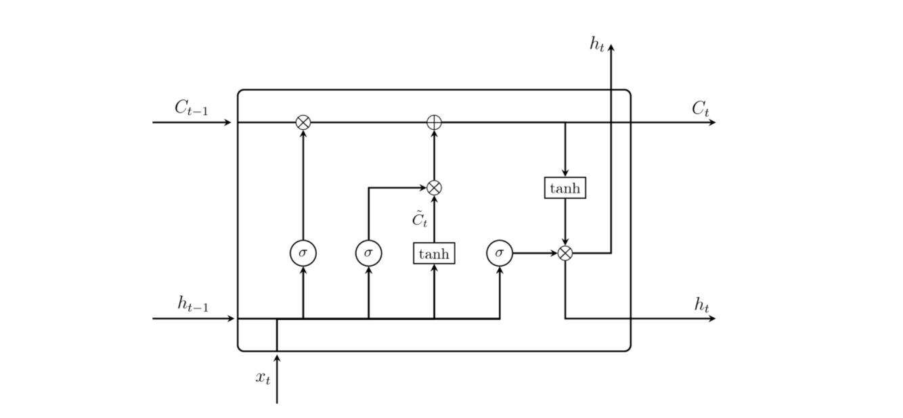

# LSTM (Long Short Term Memory)

### Summary

- RNN의 Long-term dependency의 문제를 해결하기 위해 고안된 것이다.
- LSTM은 멀리 떨어져 있는 정보 또한 활용하도록 학습할 수 있다. 
- LSTM 연산은 망각게이트, 입력게이트, Cell state 갱신, 현재 셀의 출려값 계산 단계로 나누어져 있다. 
- 망각게이트는 망각게이트 t 시점에서의 입력값($$x_t$$)과 이전 t-1 시점에서의 출력값($$h_{t-1}$$)을 입력받아 이전 셀의 정보를 망각할지 말지 결정한다.
- 입력게이트는 입력게이트는 t 시점에서의 입력값($$x_t$$)과 이전 t-1시점에서의 출력값($$h_{t-1}$$) 을 입력받고 현재의 정보를 다음 시점으로 전해질 cell state에 얼마나 반영할지를 결정한다.
- Cell state는 입력값($$x_t$$)과 이전 t-1시점에서의 출력값($$h_{t-1}$$) 을 입력받고 이번엔 하이퍼탄젠트 함수를 사용해 $$\tilde{C}_t$$ 를 생성하고 입력게이트의 출력과 Hadamard 곱$$(\odot)$$ 을 한다. 그리고 이 값과 망각게이트의 출력을 이용해 갱신한다. 
_______________

### LSTM

멀리 떨어져있는 정보 또한 활용하도록 학습할 수 있다. 

LSTM 연산은 다음처럼 여러 단계로 나누어져 있다.

1. 망각게이트

2. 입력게이트

3. Cell state 갱신

4. 현재 셀의 출력값 계산

##### 1. 망각게이트(forget gate)

망각게이트 t 시전에서의 입력값($$x_t$$)과 이전 t-1 시점에서의 출력값($$h_{t-1}$$)을 입력받아 이전 셀의 정보를 망각할지 말지 결정한다. 망각게이트의 출력값 $$f_t$$ 라고 할 때 수식으로 전개하면 다음과 같다. 다음 식에서는 $$\sigma$$ 는 시그모이드 함수를 의미하고, $$W_f$$ 와 $$b_f$$ 는 망각게이트의 가중치와 바이어스를 의미한다.

$$
f_t =\sigma(W_f[h_{t-1},x_t]+b_f)
$$

그리고 이 값은 이후에 cell state, $$C_{t-1}$$ 에 곱해진다. 시그모이드 함수를 거치기 때문에 $$f_t$$ 는 0~1사이의 값을 가진다. 이 값은 이전 cell state에 곱하지기 때문에 0에 다가갈수록 이전의 정보를 잊고 1에 다가갈수록 이전의 정보를 기억하도록 한다. 즉, 현재의 정보가 중요하면 이전의 정보를 잊게 할 것이고 현재의 정보가 필요없다면 이전의 정보를 기억하도록 할 것이다. 

##### 2. 입력게이트

입력게이트는 t 시점에서의 입력값($$x_t$$)과 이전 t-1시점에서의 출력값($$h_{t-1}$$) 을 입력받고 현재의 정보를 다음 시점으로 전해질 cell state에 얼마나 반영할지를 결정한다. 
$$i_t$$ 를 입력게이트의 출력값이라 했을 때 수식으로 정리하면 다음과 같다. 

cell state 에서 각 원소가 새로 추가되는 정보로써 가치가 얼마나 큰지를 판단한다. 적절히 취사선택하는 것이 이 게이트의 역할이다. input 게이트에 의해 가중된 정보가 새로 추가되는 셈이다. 

$$
i_t = \sigma(W_i[h_{t-1},x_t]+b_i)
$$

##### 3. cell state 갱신

입력값($$x_t$$)과 이전 t-1시점에서의 출력값($$h_{t-1}$$) 을 입력받고 이번엔 하이퍼탄젠트 함수를 사용해 $$\tilde{C}_t$$ 를 생성하고 입력게이트의 출력과 Hadamard 곱$$(\odot)$$ 을 한다. 그리고 이 값과 망각게이트의 출력을 이용해 cell state를 다음 수식과 같이 갱신한다. 

tanh 노드가 계싼한 결과가 이전 시각의 기억 셀 $$C_{t-1}$$ 에 더해진다. 새로운 정보가 추가된 것이다. tanh노드는 새로운 정보를 기억 셀에 추가하는 것이 목적이다. 

$$
\tilde{C}_t = tanh(W_C[h_{t-1},x_t]+b_C) \\
C_t = C_{t-1} \odot f_t + i_t \odot \tilde{C}_t
$$

##### 4. 현재 셀의 출력값 계산

현재 셀의 출력값 $$h_t$$ 은 다음 수식처럼 계산한다.

$$
o_t = \sigma(W_o[h_{t-1}+b_o]) \\
h_t = o_t \odot tanh(C_t)
$$

LSTM은 4개의 가중치 셋을 가진다. 

- 가중치 

$$
\begin{eqnarray}
W_f, \ b_f \\
W_i, \ b_i \\
W_C, \ b_C \\
W_o, \ b_o
\end{eqnarray}
$$

그리고 하나의 LSTM 셀은 두가지 출력 값을 가진다. 

- 출력값 

$$
\begin{eqnarray}
h_t &=& o_t \odot \tanh(C_t)\\
C_t &=& f_t \odot C_{t-1} + i_t \odot \tilde C_t \\ 
\end{eqnarray}
$$

### LSTM의 기울기 흐름

기억셀의 역전파에서는 '+', 'x' 노드만을 지나가게 된다 '+'노드는 상류에서 전해지는 기울기를 그대로 흘릴 뿐 기울기 변화(감소)는 일어나지 않는다. 

'x' 노드는 '행렬곱'이 아닌 '원소별곱(아마다르 곱)'을 계산한다. RNN에서는 역전파에서 똑같은 가중치 행렬을 사용하여 '행렬 곱'으로 반복했고 그래서 기울기 소실(또는 기울기 폭발)이 일어났다. LSTM의 역전파에서는 '원소별 곱'이 이뤄지고 매 시각 다른 게이트 값을 이용해 원소별 곱을 계산한다. 즉 매번 새로운 게이트 값을 이용하므로 곱셈의 효과가 누적되지 않아 기울기 소실 일어나지 않는(혹은 일어나기 어려운)것이다. 

'x' 노드의 계산은 forget 게이트가 제어한다. (그리고 매 시각 다른 게이트 값을 출력한다.) 그리고 forget 게이트가 '잊어야 한다'고 판단한 기억 셀의 원소에 대해서는 그 기울기가 작아진다. forget 게이트가 '잊어서는 안된다'고 판단한 원소에 대해서는 그 기울기가 약화되지 않은 채로 과거 방향으로 전해집니다. 

Reference
- https://datascienceschool.net/