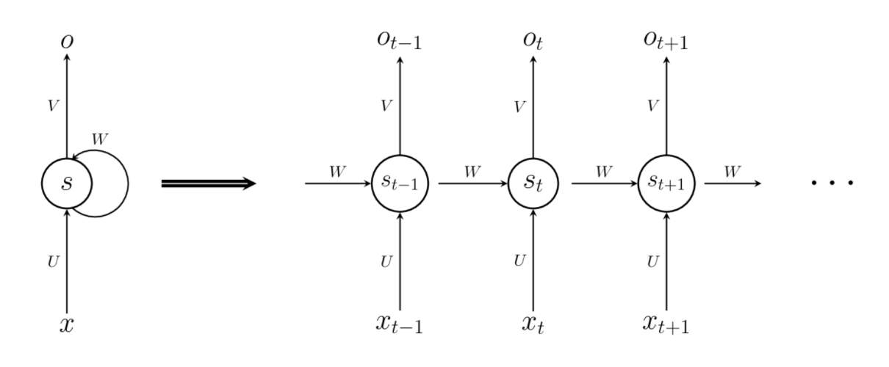
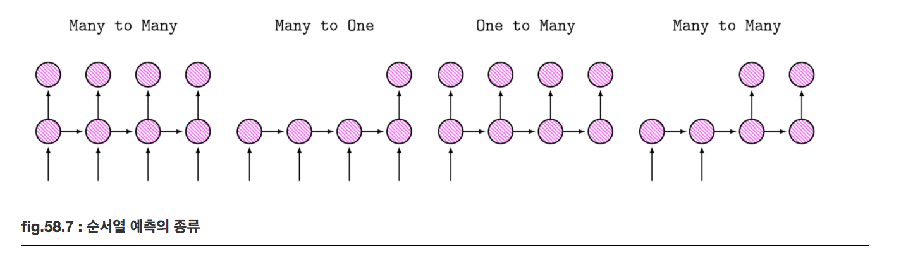

# RNN (Recurrent Neural Network)

### Summary

- RNN는 뉴런의 상태(state)를 저정하고 이를 다음 스텝에서의 입력으로 사용함으로서 긴 순서열에 대해서도 예측할 수 있는 신경망 구조이다. 
- RNN의 기본구조는 출력벡터 이외에도 상태벡터를 출력한다. 상태벡터는 입력 x 뿐 아니라 바로 전단계의 상태벡터값에도 의존한다. 출력벡터는 상태 벡터의 값에 의존한다. 
- RNN은 기존 신경망과 달리 순서열을 처리할 수 있다. 
- RNN의 한계는 현재 시점을 예측하는데 정보를 필요로하는 시점과, 필요한 정보가 멀리 떨어져 있다면 RNN은 잘 예측하지 못한다. 이 문제를 Long-term dependency라고 한다. 이 문제를 해결하기 위해 고안된 것이 LSTM이다. 
_____________

### RNN

신경망을 사용하여 문장(sentence)이나 시계열(time series)데이터와 같은 순서열(sequence)를 예측하는 문제를 푸는 경우, 예측하고자 하는 값이 더 오랜 과거의 데이터에 의존하게 하려면 시퀀스를 나타내는 벡터의 크기를 증가시켜야 한다. 예를 들어 10,000개의 단어로 구성된 단어장을 사용하는 언어 모형에서 과거 100개 단어의 순서열에 대해 출력을 예측하려면 1,000,000 차원의 입력 벡터가 필요하다.

RNN(Recurrent Neural Network)는 뉴런의 상태(state)를 저장하고 이를 다음 스텝에서의 입력으로 사용함으로서 긴 순서열에 대해서도 예측할 수 있는 신경망 구조이다. 

### RNN의 기본구조

출력 벡터 $$o$$ 이외에도  상태 벡터 $$s$$ 를 출력한다. 상태벡터는 일종의 은닉층 벡터와 비슷하지만 입력 x뿐 아니라 바로 전단계의 상태 벡터 값에도 의존한다. 출력벡터는 상태 벡터의 값에 의존한다. 여기에 첨자 t는 순서열의 순서를 나타낸다. RNN은 시간 스텝에 따라 연결해서 펼쳐높으면 무한개의 은닉층을 가진 MLP와 유사한 효과가 있다. 다만 MLP와 달리 상태 벡터의 변환 행렬이 고정되어 있다. 

$$
s_t = \sigma(Ux_t + Ws_{t-1}) \\
o_t = \sigma(Vs_t)
$$

### 순서열 예측

RNN에 입력 벡터 순수열 $$x_1, x_2, \dots, x_n$$ 을 차례대로 입력하면 상태 순서열 $$s_1, s_2, \dots, s_n$$ 이 내부적으로 생성되고 출력으로는 출력 순서열 $$o_1, o_2, \dots, o_n$$ 이 나온다. 

만약 원하는 결과가 출력 순서열 $$o_1, o_2, \dots, o_n$$ 이 target 순서열 $$y_1, y_2, \dots, y_n$$ 과 같아지는 것이라면 입력 순서열 길이와 출력 순서열 길이가 같은 특수한 경우의 seqeunce-to-seqeunce(many-to-many) 예측 문제가 되고 순서열의 마지막 출력 $$o_n$$ 값이 $$y_n$$ 값과 같아지는 것만 목표라면 단순한 seqeunce to value(many-to-one)문제가 된다. 

### Back-Propagation Through Time(BPTT)

RNN은 시간에 따라 펼쳐놓으면 구조가 MLP와 유사하기 때문에 Back-Propagation 방법으로 gradient를 계산할 수 있다. 다만 실제로 여러개의 은닉층이 있는 것이 아니라 시간 차원에서 존재하기 때문에 Back-Propagation Through Time (BPTT) 방법이라고 한다.

### RNN의 한계(Long-term dependency)

RNN은 현재의 문제를 해결하는데 이전의 정보를 함께 고려한다. 현재 시점을 예측하는데 필요한 문맥이 가까이 있고 많지 않다면 RNN은 이를 학습할 수 있지만 정보를 필요로하는 시점과, 필요한 정보가 멀리 떨어져 있다면 RNN은 잘 예측하지 못한다. 이 문제를 Long-term dependency라고 한다. 이 문제를 해결하기 위해 고안된 것이 LSTM이다. 

Reference
- https://datascienceschool.net/