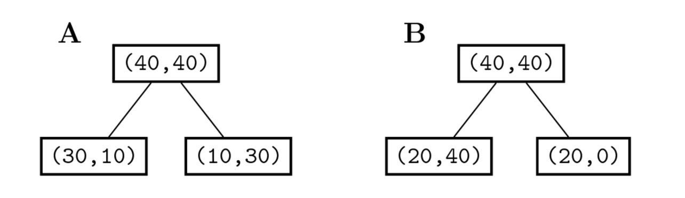

# 의사결정나무(decision tree)

### Summary
- 의사결정나무의 장점은 해석하기 쉽고 인사이트 얻기가 편하다.
- 의사결정나무의 분류학습은 여러개의 독립변수 중 인포메이션 게인을 계산하여 엔트로피를 가장 줄이는 최적의 기준값을 선택하여 데이터를 두개로 나눠 두개의 자식노드를 생성합니다. 각 노드에 대해서 반복합니다. 자식 노드에 한가지 클래스만 있는 경우 자식노드 생성을 멈춥니다. 테스트 데이터 예측은 가장 상위 노드부터 하위노드까지 분류규칙을 따라와 마지막 노드에 가장 많은 클래스에 속한다고 판단한다. 

_______________________________

### 의사결정나무

의사결정나무는 여러가지 규칙을 순차적으로 적용하면서 독립 변수 공간을 분할하는 분류모형이다. 분류와 회귀분석에 모두 사용될 수 있기 때문에 CART(Classification And Regression Tree) 라고도 한다.

### 의사결정나무를 이용한 분류학습 

1. 여러가지 독립 변수 중 하나의 독립 변수를 선택하고 그 독립 변수에 대한 기준값(Threshold)을 정한다. 이를 분류 규칙이라고 한다. 
2. 전체 학습 데이터 집합(부모 노드)을 해당 독립 변수의 값이 기준값보다 작은 데이트 그룹(자식 노드1)과 해당 독립 변수의 값이 기준값보다 큰 데이터 그룹(자식 노드2)으로 나눈다. 
3. 각각의 자식 노드에 대해 1~2 단계를 반복하여 하위의 자식 노드를 만든다. 단, 자식 노드에 한가지 클래스의 데이터만 존재한다면 더 이상 자식 노드를 나누지 않고 중지한다. 

### 의사결정나무를 사용한 분류예측

의사결정나무에 전체 트레이닝 데이터를 모두 적용해 보면 각 데이터는 특정한 노드를 타고 내려가기 된다. 각 노드는 그 노드를 선택한 데이터 집합을 가지게 된다. 이 때 노드에 속한 데이터의 클래스의 비율을 구하여 이를 그 노드의 조건부 확률 분포 $$P(Y=k|X)_{node}$$ 라고 정의한다. 
  
$$
P(Y=k|X)_{\text{node}} \approx \dfrac{N_{\text{node},k}}{N_{\text{node}}}
$$

테스트 데이터 $$X_{test}$$ 의 클래스를 예측할 때는 가장 상위의 노드부터 분류 규칙을 차례대로 적용하여 마지막에 도달하는 노드의 조건부 확률 분포를 이용하여 클래스를 예측한다.

$$
\hat{Y} = \text{arg}\max_k P(Y=k|X_{\text{test}})_{\text{last node}}
$$

### 분류규칙을 정하는 방법

부모 노드와 자식 노드 간의 엔트로피를 가장 낮게 만드는 최상의 독립 변수와 기준값을 찾는다. 이러한 기준을 정량화한 것이 정보획득량(imformation gain)이다. 기본적으로 모든 독립변수와 모든 가능한 기준값에 대해 정보획득량을 구하여 가장 정보획득량이 큰 독립 변수와 기준값을 선택한다. 

### 정보획득량 Information Gain

정보획득량은 $$X$$ 라는 조건에 의해 확률 변수 $$Y$$ 의 엔트로피가 얼마나 감소하였는가를 나타낸 값입니다. $$Y$$ 의 엔트로피에서 $$X$$ 에 대한 $$Y$$ 의 조건부 엔트로피를 뺀 값이다.

$$
IG[Y, X] = H[Y] - H[Y|X]
$$

우선 부모 노드의 엔트로피를 계산하면 다음과 같다.

$$
H[Y] = -\dfrac{1}{2}\log_2\left(\dfrac{1}{2}\right) -\dfrac{1}{2}\log_2\left(\dfrac{1}{2}\right) = \dfrac{1}{2} + \dfrac{1}{2}  = 1
$$

A 방법에 대해 IG를 계산하면 다음과 같다.

$$
H[Y|X=X_1] = -\dfrac{3}{4}\log_2\left(\dfrac{3}{4}\right) -\dfrac{1}{4}\log_2\left(\dfrac{1}{4}\right) = 0.81 \\
H[Y|X=X_2] = -\dfrac{1}{4}\log_2\left(\dfrac{1}{4}\right)  -\dfrac{3}{4}\log_2\left(\dfrac{3}{4}\right) = 0.81 \\
H[Y|X] = \dfrac{1}{2} H[Y|X=X_1] + \dfrac{1}{2} H[Y|X=X_2] = 0.81 \\
IG = H[Y] - H[Y|X] = 0.19
$$

B 방법에 대해 IG를 계산하면 다음과 같다.

$$
H[Y|X=X_1] = -\dfrac{1}{3}\log_2\left(\dfrac{1}{3}\right) - \dfrac{2}{3}\log_2\left(\dfrac{2}{3}\right) = 0.92 \\
H[Y|X=X_2] = 0 \\
H[Y|X] = \dfrac{3}{4} H[Y|X=X_1] + \dfrac{1}{4} H[Y|X=X_2] = 0.69 \\
IG = H[D] - H[Y|X] = 0.31
$$

결과를 보면 B 방법이 더 나은 방법임을 알 수 있다.

### Greedy 의사 결정

의사결정나무는 특징의 선택이 greedy한 방식으로 이루어지기 때문에 선택된 특징이 최적의 선택이 아닐 수 있다. 이것을 Greedy 의사결정이라고 한다.

Reference
- 김도형 박사님 강의를 수강하며 데이터사이언티스트스쿨(https://datascienceschool.net/) 강의자료를 토대로 공부하며 정리한 내용임을 말씀드립니다. 