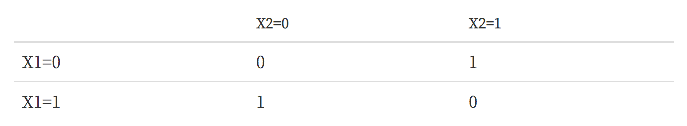

# 커널 서포트 벡터 머신

퍼셉트론이나 서포트 벡터 머신과 같은 선형판별함수 분류모형은 다음과 같은 XOR(exclusive OR)문제를 풀지 못한다는 단점이 있다. 이러한 경우에는 선형판별평면(decision hyperplane) 영역을 나눌 수 없기 때문이다.

### 변환함수를 사용한 비선형 판별 모형

원래의 $$D$$차원 독립 변수 벡터 $$x$$ 대신 비선형 함수로 변환한 $$M$$ 차원 벡터 $$\phi(x)$$ 를 독립 변수로 사용하는 방법이다.

$$
\phi(\cdot): {R}^D \rightarrow {R}^M
$$

$$
x=(x_1, x_2, \cdots, x_D) \;\;\; \rightarrow \;\;\; \phi(x) = (\phi_1(x), \phi_2(x), \cdots, \phi_M(x))
$$

위의 XOR 문제를 풀기 위해 상호 곱(cross-multiplication) 항을 추가한 변환함수를 사용하면 문제를 풀 수 있다. $$(x_1, x_2)  \rightarrow  \phi(x) = (x_1^2, \sqrt{2}x_1x_2, x_2^2)$$

### 커널 트릭

서포트 벡터 머신의 경우 목적 함수와 예측 모형은 아래와 같은 dual form으로 표현할 수 있다. 

$$
L =  \sum_{n=1}^N a_n - \dfrac{1}{2}\sum_{n=1}^N\sum_{m=1}^N a_n a_m y_n y_m x_n^T x_m \\
y = w^T x - w_0 = \sum_{n=1}^N a_n y_n x_n^T x - w_0
$$

위의 수식에서 $$x$$ 를 변환함수 $$\phi(x)$$ 로 바꾸면

$$
L =  \sum_{n=1}^N a_n - \dfrac{1}{2}\sum_{n=1}^N\sum_{m=1}^N a_n a_m y_n y_m \phi(x_n)^T \phi(x_m) \\
y = w^T x - w_0 = \sum_{n=1}^N a_n y_n \phi(x_n)^T \phi(x) - w_0
$$

모든 변환함수 $$\phi(x_i)^T \phi(x_j)$$ 의 형태로만 사용되며 독립적으로 사용되지 않는다. 따라서 두 개의 변환된 독립 변수 벡터를 내적(inner product) 한 값을 하나의 함수로 나타낼 수 있다. 이러한 함수를 커널(kernel)이라고 한다. 

$$
k(x_i, x_j) = \phi(x_i)^T \phi(x_j)
$$

대응하는 변환함수가 존재할 수만 있다면 변환함수를 먼저 정의하고 커널을 정의하는 것이 아니라 커널을 먼저 정의해도 상관없다.

### 커널의 의미

서포트 벡터 머신의 목적 함수와 예측 모형은 커널을 사용하여 표현하면 다음과 같다.

$$
L =  \sum_{n=1}^N a_n - \dfrac{1}{2}\sum_{n=1}^N\sum_{m=1}^N a_n a_m y_n y_m k(x_n, x_m) \\
y = w^T x - w_0 = \sum_{n=1}^N a_n y_n k(x_n, x) - w_0
$$

커널을 사용하지 않는 경우 $$k(x, y)=x^Ty$$ 라는 점을 고려하면 커널은 다음과 같은 특징을 보인다.
- $$x$$ 와 $$y$$ 가 동일한 벡터일 때 가장 크고
- 두 벡터간의 거리가 멀어질 수록 작아진다. 
- 즉, 두 표본 데이터 간의 유사도(similarity)를 측정하는 기준으로 볼 수도 있다.

### 커널 사용의 장점

베이시스 함수를 하나씩 정의하는 수고를 덜 수 있고 변환과 내적에 들어가는 계산량이 줄어든다. 

### 커널의 확장 생성

어떤 함수가 커널함수가 된다는 것을 증명하기 위해서는 변환함수의 내적으로 표현할 수 있다는 것만 증명하면 된다.

- 커널함수를 양수배한 함수는 커널함수이다.

$$
k(x_1, x_2) = ck_1(x_1, x_2)\;\;(c > 0)
$$

- 커널함수에 양수인 상수를 더한 함수는 커널함수이다.

$$
k(x_1, x_2) = k_1(x_1, x_2) + c\;\;(c > 0)
$$

- 두 커널함수를 더한 함수는 커널함수이다.

$$
k(x_1, x_2) = k_1(x_1, x_2) + k_2(x_1, x_2)
$$

- 두 커널함수를 곱한 함수는 커널함수이다.

$$
k(x_1, x_2) = k_1(x_1, x_2)k_2(x_1, x_2)
$$

- 커널함수를 $$x\geq0$$ 에서 단조증가(monotonically increasing) 하는 함수에 적용하면 커널함수이다. 

$$
k(x_1, x_2) = (k_1(x_1, x_2))^n \;\; (n=1, 2, \cdots) \\
k(x_1, x_2) = \exp(k_1(x_1, x_2)) \\
k(x_1, x_2) = \text{sigmoid}(k_1(x_1, x_2))
$$

- $$x_1, x_2$$ 각각의 커널함수값의 곱도 커널함수이다.

$$
k(x_1, x_2) = k_1(x_1, x_1)k_2(x_2, x_2)
$$

### 많이 사용되는 커널

아래의 커널들은 대부분 변환함수로 변환하였을 때 무한대의 차원을 가지는 변환함수가 된다. 따라서 대부분의 비선형성을 처리할 수 있다. 비교를 위해 선형 서포트 벡터 머신의 경우도 추가하였다.

- 선형 서포트 벡터 머신

$$
k(x_1, x_2) = x_1^Tx_2
$$

- 다항 커널(Polynomial Kernel)

$$
k(x_1, x_2) = (\gamma (x_1^Tx_2) + \theta)^d
$$

- RBF(Radial Basis Function) 또는 가우시안 커널(Gaussian Kernel)

$$
k(x_1, x_2) = \exp \left( -\gamma ||x_1-x_2||^2 \right)
$$

- 시그모이드 커널(Sigmoid Kernel)

$$
k(x_1, x_2) = \tanh(\gamma (x_1^Tx_2) + \theta)
$$

### 다항 커널

다항커널은 벡터의 내적으로 정의된 커널을 확장하여 만든 커널이다. 예로 $$\gamma=1, \theta=1, d=3$$ 이고 $$x$$ 가 스칼라인 경우가 있다.

$$
\begin{eqnarray}
k(x_1, x_2) 
&=& (x_1^Tx_2 + 1)^4 \\
&=& x_1^4x_2^4 + 4x_1^3x_2^3 + 6x_1^2x_2^2 + 4x_1x_2 + 1 \\
&=& (x_1^4, 2x_1^3, \sqrt{6}x_1, 2x_1, 1)^T (x_2^4, 2x_2^3, \sqrt{6}x_2, 2x_2, 1) \ \\
\end{eqnarray}
$$

변환함수의 내적이 된다. 변환함수는 다음 5개가 된다.

$$
\begin{eqnarray}
\phi_1(x) &=& x^4 \\
\phi_2(x) &=& 2x^3 \\
\phi_3(x) &=& \sqrt{6}x^2 \\
\phi_4(x) &=& 2x \\
\phi_5(x) &=& 1 \\
\end{eqnarray}
$$

### RBF (제일 많이 쓰는 커널)

가우시안 커널이라고도 한다. 문제를 간단하게 하기 위해 다음과 같이 가정한다.

$$
\gamma=\frac{1}{2} \\
\|x_1\| = \|x_2\| = 1
$$

$$
\begin{eqnarray}
k(x_1, x_2) 
&=& \exp{\left(-\frac{||x_1 - x_2||^2}{2}\right)} \\
&=& \exp{\left(-\frac{x_1^Tx_1}{2} - \frac{x_2^Tx_2}{2} + 2x_1^Tx_2 \right)} \\
&=& \exp{\left(-\frac{x_1^Tx_1}{2}\right)}\exp{\left(-\frac{x_2^Tx_2}{2}\right)}\exp{(x_1^Tx_2)} \\
&=& C \exp{(x_1^Tx_2)} \\
&\approx& C \left( 1 + (x_1^Tx_2) + \dfrac{1}{2!}(x_1^Tx_2)^2 +  \dfrac{1}{3!}(x_1^Tx_2)^3 + \cdots \right) \\
\end{eqnarray}
$$

차수가 무한대인 다항커널과 같다. 변환함수 갯수가 무한대 생성되기 때문에 하나는 얻어 걸린다. 그래서 무적!

### 커널 파라미터의 영향

gamma 이 너무 클경우 오버피팅이 될 수 있다.

Reference
- 김도형 박사님 강의를 수강하며 데이터사이언티스트스쿨(https://datascienceschool.net/) 강의자료를 토대로 공부하며 정리한 내용임을 말씀드립니다. 