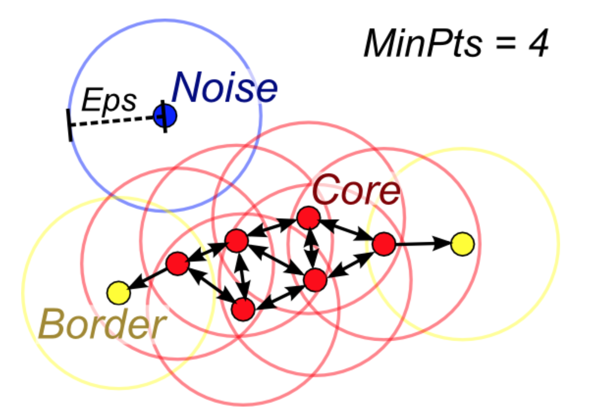

# 디비스캔 군집화 (DBSCAN: Density-Based Spatial Clustering of Applications with Noise)

### Summary

- 디비스캔 군집화는 데이터가 밀집한 정도 즉 밀도를 이용한다. 점이 세밀하게 몰려 있어서 밀도가 높은 부분을 클러스터링 하는 방식이다
- 어느 점을 기준으로 반경 x내에 점이 n개 이상 있으면 하나의 군집으로 인식하는 방식이다.
- 초기 데이터로부터 근접한 데이터를 찾아나가는 방법으로 군집을 확장한다. 장점은 군집의 형태에 구애받지 않고 군집의 갯수를 사용자가 지정할 필요가 없다. 아웃라이어를 탐지 할 수 있다. 
- 점을 중심으로 epsilon 반경내에 minPts 이상수의 점이 있으면 그 점을 중심응로 군집이 괴고 그 점을 core point라고 한다. core point가 서로 다른 core point의 군집의 일부가 되면 그 군집을 서로 연결되어 있다고 하고 하나의 군집으로 연결한다. 
- 군집에 속하지만 스스로 core point가 안되는 점을 border point라고 하고 주로 클리스터의 외곽을 이루는 점이 된다.
- 어느 클러스터에도 속하지 않는 점은 Noise point가 된다.

----------------

### 디비스캔 군집화

디비스캔 클러스터링은 데이터가 밀집한 정도 즉 밀도를 이용한다. 초기 데이터로부터 근접한 데이터를 찾아나가는 방법으로 군집을 확장한다. 
- 최소 거리 $$\epsilon$$ : 이웃(neighborhood)을 정의하기 위한 거리
- 최소 데이터 갯수(minimum points) : 밀집지역을 정의하기 위해 필요한 이웃의 개수

만약 $$\epsilon$$ 최소 거리 안의 이웃 영역 안에 최소 데이터 갯수 이상의 데이터가 있으면 그 데이터는 핵심(core) 데이터다. 이 핵심 데이터의 이웃 영역 안에 있는 데이터를 이 핵심데이터와 연결된 핵심 데이터로 정의한다. 핵심 데이터의 이웃영역안에 있는 데이터도 마찬가지로 연결된 핵심 데이터가 된다.

만약 고밀도 데이터에 더이상 이웃이 없으면 이 데이터는 경계(border) 데이터라고 한다. 

핵심 데이터, 경계 데이터가 아닌 데이터를 outlier라고 한다.  

디비스캔 클러스터링의 장점은 군집의 형태에 구애받지 않으며 군집의 갯수를 사용자가 지정할 필요가 없다.

