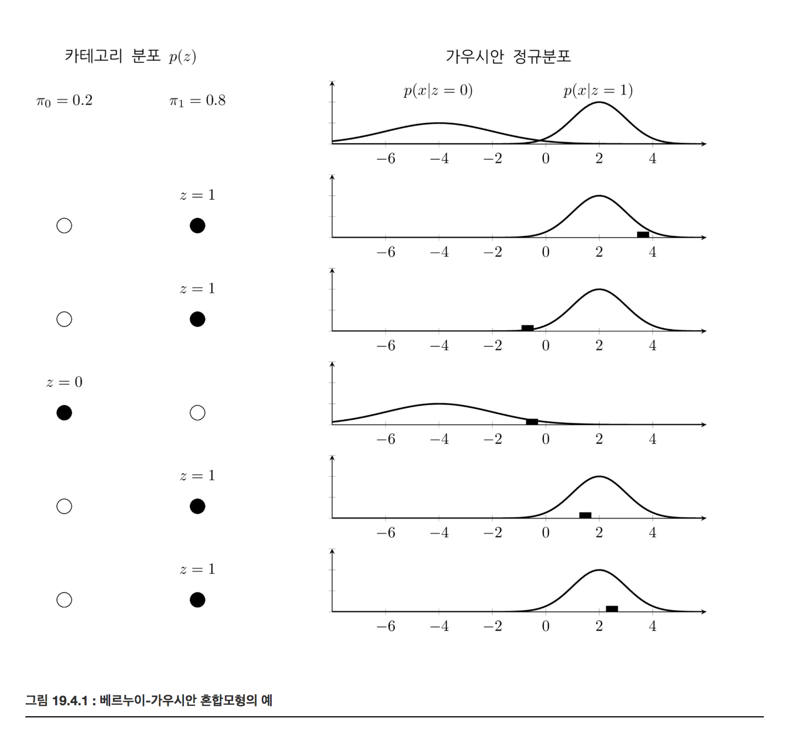
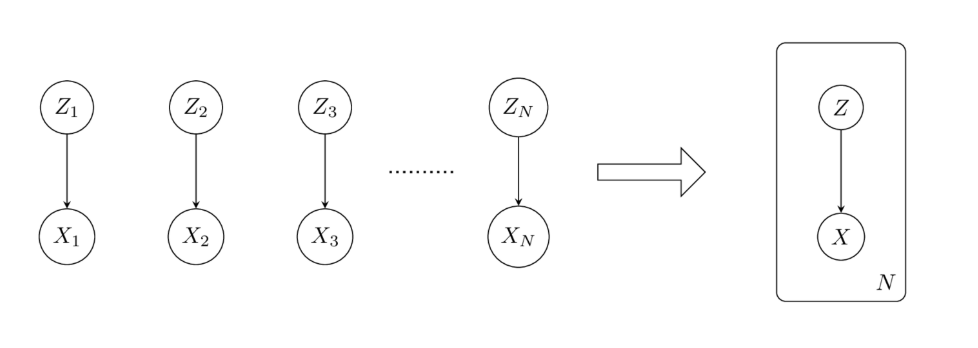

# 가우시안 혼합모형과 EM 방법

### Summary

- 가우시안 혼합모형은 실수값을 출력하는 확률변수가 클래스 카테고리 확률변수의 값에 따라 다른 기댓값과 분산을 가지는 복수의 가우시안 정규분포들로 이루어진 모형이다
- 가우시안 혼합모형의 모수추정 방법으로는 EM방법이 있다.
- EM 방법은 모수($$\theta : \pi_k, \mu_k, \Sigma_k$$)와 responsibility(hidden state, $$\pi_k$$)를 번갈아 추정하며 정확도를 높여가는 방법이다. 잠재변수 $$z$$에 의존하는 확률변수 $$x$$가 있고 $$z$$는 관측 불가능하며 $$x$$만 관측할 수 있는 경우 확률분포 $$p(x)$$를 추정하는 방법이다. 
______

### 가우시안 혼합 모형

K-클래스 카테고리 확률변수 Z가 있다고 하자. 확률 분포함수는 $$p(z=k)=\pi_k$$ 이다. 실수값을 출력하는 확률변수 X는 확률변수 Z의 표본값 k에 따라 기댓값 $$\mu_k$$ , 분산 $$\sigma_k$$ 이 달라진다. 
$$
p(x|z)=\mathcal{N}(x|\mu_k, \sigma_k)
$$

이를 결합하면 $$p(x) = \sum_Z p(z)p(x\mid z) = \sum_{k=1}^{K} \pi_k \mathcal{N}(x \mid \mu_k, \Sigma_k)$$이 된다. 

실수값을 출력하는 확률변수 X가 K-클래스 카테고리 확률변수 Z의 값에 따라 다른 기댓값과 분산을 가지는 복수의 가우시안 정규분포들로 이루어진 모형을 가우시안 혼합 모형(Gaussian Mixture) 모형이라고 한다. 

단 가우시안 혼합모형에서 카테고리 확률변수 Z의 값을 알 수가 없다. 즉 관측되지 않는다고 가정한다. 이렇게 관측 데이터가 보이지 않는 즉, 내부에 숨겨진(latent) 확률 변수를 포함하는 모형을 잠재변수모형(latent variable model)이라고 한다. 잠재변수는 혼합모형 처럼 카테고리값이 될 수도 있고 다른 모형에서는 실수값도 될 수 있다.

### 베르누이 - 가우시안 혼합 모형

카테고리가 두 개인 가우시안 혼합모형은 베르누이-가우시안 혼합모형이라고 한다.

### 가우시안 혼합모형의 모수추정

가우시안 혼합모형 모수추정은 관측되지 않는 카테고리 분포의 확률분포와 각각의 카테고리에서의 가우시안 정규분포 모수를 추정하는 것을 말한다. 

N개의 데이터에 대한 X의 확률분포는

$$
p(x) = \prod_{i=1}^N p(x_i) = \prod_{i=1}^N \sum_{z_i} p(x_i,z_i) = \prod_{i=1}^N \sum_{z_i} p(z_i)p(x_i\mid z_i)  = \prod_{i=1}^N \sum_{k=1}^{K} \pi_k \mathcal{N}(x_i\mid \mu_k, \Sigma_k)
$$

로그를 취하면

$$
\log p(x) = \sum_{i=1}^N \log \left( \sum_{k=1}^{K} \pi_k \mathcal{N}(x_i\mid \mu_k, \Sigma_k) \right)
$$

두 식 모두 미분값이 0이 되는 모수값을 쉽게 구할 수 없다. 

만약 데이터 $$x_i$$가 어떤 카테고리 $$z_i$$에 속하는지를 안다면 같은 카테고리에 속하는 데이터만 모아서 카테고리 확률분포 $$\pi_k$$도 알 수 있고 가우시안 정규분포의 모수 $$\mu_k, \Sigma_k$$도 쉽게 구할 수 있을 것이다. 하지만 실제로는 데이터 $$x_i$$가 가지고 있는 카테고리 값 $$z_i$$를 알 수가 없기 때문에 위 확률분포함수 $$p(x)$$를 최대화하는 $$\pi_k$$와 𝜇𝑘,$$\mu_k, \Sigma_k$$를 비선형 최적화를 통해 구해야 한다.

네트워크 확률모형 관점에서는 확률변수 $$Z_i$$가 확률변수 $$X_i$$에 영향을 미치는 단순한 모형이다. 다만 $$i=1,\dots,N$$인 모든 경우에 대해 반복적으로 영행을 미치므로 이를 다음과 같은 판넬 모형으로 표현한다.

### EM(Expectation-Maximization)

혼합모형의 모수추정에서 중요한 역할을 하는 것 중의 하나가 바로 각 데이터가 어떤 카테고리에 속하는가를 알려주는 조건부 확률 $$p(z∣x)$$ 값이다. 이 값을 responsibility라고 한다.

$$
\begin{eqnarray}
\pi_{ik} 
&=& p(z_i=k\mid x_i) \\
&=& \dfrac{p(z_i=k)p(x_i\mid z_i=k)}{p(x_i)} \\
&=& \dfrac{p(z_i=k)p(x_i\mid z_i=k)}{\sum_{k=1}^K p(x_i,z_i=k)} \\
&=& \dfrac{p(z_i=k)p(x_i\mid z_i=k)}{\sum_{k=1}^K p(z_i=k)p(x_i\mid z_i=k)} 
\end{eqnarray}
$$

가우시안 혼합모형의 경우 다음과 같이 정리할 수 있다.

$$
\pi_{ik} = \dfrac{\pi_k \mathcal{N}(x_i\mid \mu_k, \Sigma_k)}{\sum_{k=1}^K \pi_k \mathcal{N}(x_i\mid \mu_k, \Sigma_k)}
$$

이 식은 모수로부터 responsibility를 추정한다. 
- $$\pi_{i,k}$$ 는 i번째 데이터 $$x_i$$ 가 카테고리 $$k$$ 에서 만들어졌을 확률을 나타낸다. 

$$
(\pi_k, \mu_k, \Sigma_k) \;\; \implies \;\; \pi_{ik}
$$

이제 로그-결합확률분포함수를 최대화 한다. 우선 $$\mu_k$$ 로 미분하여 0이 되도록 하는 방정식을 만들면 다음과 같다. 

$$
0 = - \sum_{i=1}^N \dfrac{p(z_i=k)p(x_i\mid z_i=k)}{\sum_{k=1}^K p(z_i=k)p(x_i\mid z_i=k)} \Sigma_k (x_i - \mu_k )
$$

이를 정리하면

$$
\sum_{i=1}^N \pi_{ik} (x_i - \mu_k ) = 0 \\
\mu_k = \dfrac{1}{N_k} \sum_{i=1}^N \pi_{ik} x_i \\
N_k = \sum_{i=1}^N \pi_{ik}
$$

k 카테고리에 속하는 데이터의 수와 비슷한 의미를 가진다. 즉 $$\mu_k$$ 는 k카테고리에 속하는 데이터의 샘플 평균과 같은 의미이다. 

마찬가지로 로그-결합확률분포함수를 Σ𝑘Σk로 미분하여 최대화하는 모수값을 구하면 다음과 같다.

$$
\Sigma_k = \dfrac{1}{N_k} \sum_{i=1}^N \pi_{ik} (x_i-\mu_k)(x_i-\mu_k)^T
$$

마지막으로 로그-결합확률분포함수를 $$\pi_k$$로 미분하여 최대화하는 모수값을 구해야 하는데 이 때 카테고리값의 모수가 가지는 제한 조건으로 인해 Lagrange multiplier 를 추가해야 한다.

$$
\log p(x) + \lambda \left(\sum_{k=1}^K \pi_k - 1 \right)
$$

- 이를 $$\pi_k$$로 미분하여 0이 되는 값을 찾으면 다음과 같다.

$$
\pi_k = \dfrac{N_k}{N}
$$

이 세가지 식은 모두 responsibility로부터 모수를 구하고 있다.  $$\pi_{ik} \;\; \implies \;\; (\pi_k, \mu_k, \Sigma_k )$$

원래는 연립방정식의 해를 구하는 방법으로 responsibility를 포함한 모수값을 추정해야 한다. 그러나 만약 식의 형태가 responsibility를 알고 있다면 모수를 추정하는 것이 간단하도록 만들어져 있기 때문에 EM(Expectation-Maximization)이라고 하는 iterative 방법을 사용하면 연립방정식의 해를 구하는 것보다 더 쉽게 모수를 추정할 수 있다.

EM 방법은 모수와 responsibility를 번갈아 추정하며 정확도를 높여가는 방법이다.
- E step 에서는 우리가 현재까지 알고 있는 모수가 정확하다고 가정하고 이를 사용하여 각 데이터가 어느 카테고리에 속하는지 즉, resposibility를 추정한다. 

$$
(\pi_k, \mu_k, \Sigma_k) \;\; \implies \;\; \pi_{ik}
$$

- M step 에서는 우리가 현재까지 알고 있는 responsibility가 정확하다고 가정하고 이를 사용하여 모수값을 추정한다. 

$$
\pi_{ik} \;\; \implies \;\; (\pi_k, \mu_k, \Sigma_k)
$$

- 이를 반복하면 모수와 responsibility를 동시에 점진적으로 개선할 수 있다.

### 클러스터링

각각의 데이터에 대해 responsibility을 알게되면 responsibility가 가장 큰 카테고리를 찾아내어 그 데이터가 어떤 카테고리에 속하는지를 알 수 있다. 즉 클러스터링을 할 수 있다.

$$
k_i = \arg\max_{k} \pi_{ik}
$$

사실 K-means clustering은 EM 방법의 특수한 경우라고 볼 수 있다.

### 일반적 EM 알고리즘

EM 알고리즘은 잠재변수 $$z$$에 의존하는 확률변수 $$x$$가 있고 $$z$$는 관측 불가능하며 $$x$$만 관측할 수 있는 경우 확률분포 $$p(x)$$를 추정하는 방법이다. 다만 네트워크 모형에 의해 조건부확률분포 $$p(x∣z,θ)$$는 모수 $$\theta$$에 의해 결정되며 그 수식은 알고 있다고 가정한다.

혼합모형의 경우에는 $$z$$가 이산확률변수이므로
- $$p(x \mid  \theta) $$ 쌍봉이고, $$p(x\mid z, \theta)$$ 단봉이다. $$\theta$$ 는 x 분포가 어떤 모양을 나타내는 파라미터 이다. 

$$
p(x \mid  \theta) = \sum_z p(x, z \mid  \theta) = \sum_z q(z) p(x\mid z, \theta)
$$

주어진 데이터 $$x$$에 대해 가능도 $$p(x∣θ)$$를 가장 크게 하는 잠재변수에 대한 확률분포 $$q(z)$$와 $$\theta$$를 구하는 것이 EM 알고리즘의 목표이다.

$$
\log p(x) = 
\sum_z q(z) \log \left(\dfrac{p(x, z \mid  \theta)}{q(z)}\right) -
\sum_z q(z) \log \left(\dfrac{p(z\mid x,  \theta)}{q(z)}\right)
$$

$$
L(q, \theta) = 
\sum_z q(z) \log \left(\dfrac{P(x, z \mid  \theta)}{q(z)}\right) \\
KL(q \mid  p) = 
-\sum_z q(z) \log \left(\dfrac{p(z\mid x,  \theta)}{q(z)}\right) \\
\log p(x) = L(q, \theta) + KL(q \mid  p)
$$

$$logp(x)$$ 에서 $$p$$ 는 우리가 구라혀를 likelihood 이고 $$KL(q|p)$$ 에서 p는 z에 대한 likelihood 값이다. 

EM 알고리즘은 $$L(q,θ)$$를 최대화하기위해 $$q$$와 $$\theta$$의 최적값을 교대로 찾아낸다.

(1) E 단계에서는 $$\theta$$ 를 현재의 값 $$\theta old$$으로 고정시키고 $$𝐿(𝑞old,𝜃old)$$를 최대화하는 $$qnew$$를 찾는다. 맞게 찾았다면 $$L(q_{\text{new}}, \theta_\text{old})$$는 상한인 $$log⁡p(x)$$와 같아진다. 즉 쿨백-라이블러 발산은 0이된다.

$$
L(q_{\text{new}}, \theta_\text{old}) = \log p(x) \\ 
KL(q_{\text{new}} \mid  p) = 0 \\
q_{\text{new}} = p(z\mid x, \theta_{\text{old}})
$$
    
(2) M 단계에서는 $$q$$를 현재의 함수 $$qnew$$로 고정시키고 $$L(qnew,θ)$$를 최대화하는 $$θnew$$값을 찾는다. 최대화를 하였으므로 당연히 $$L(qnew,θnew)$$는 옛날 값보다 커진다.

$$
L(q_{\text{new}}, \theta_{\text{new}}) > L(q_{\text{new}}, \theta_{\text{old}})
$$

그리고 동시에 $$p(Z\mid X, \theta_{\text{new}})$$이 과거의 값 $$p(Z\mid X, \theta_{\text{old}})$$과 달라졌으므로 $$qnew$$는 $$p(Z\mid X, \theta_{\text{new}})$$와 달라진다. 그러면 쿨백 라이블러 발산의 값도 0보다 커지게 된다.

$$
q_{\text{new}} \neq p(Z\mid X, \theta_{\text{new}}) \\
KL(q_{\text{new}} \mid  p) > 0
$$