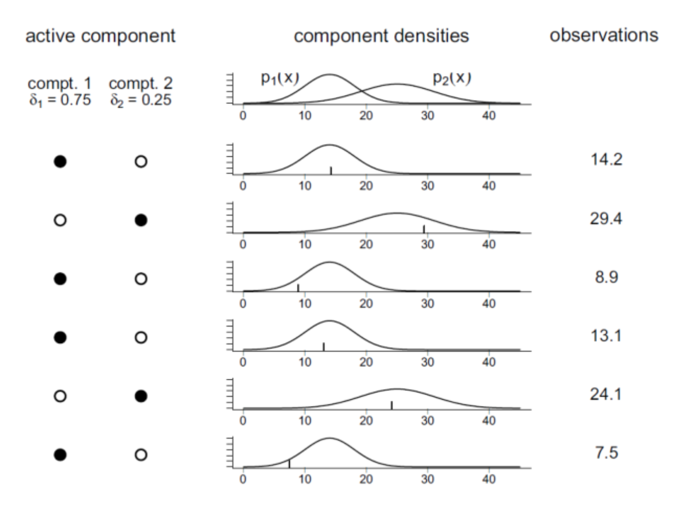
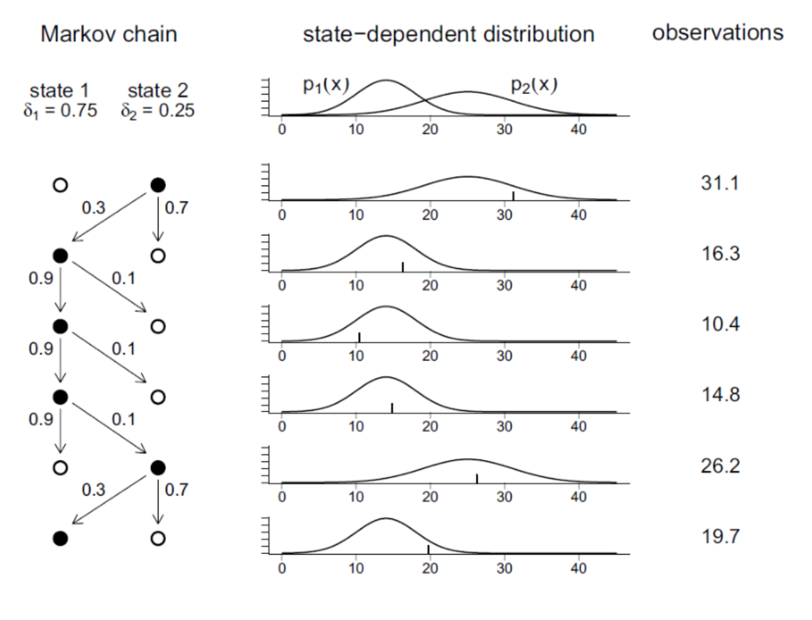

# 히든 마코프 모형

### Summary
- 독립혼합모형은 복수의 연속확률분포 중 하나를 확률적으로 선택하는 모형이다.
- 마코프 프로세스는 어떤 상태로 들어갈 확률이 바로 직전의 상태에만 의존하는 확률 과정입니다. 즉 미래의 프로세스가 현재의 상태에서만 결정되는 것입니다. 
- 마코프 체인은 마코프(Markov)특성을 가지는 이산시간 확률 프로세스를 말한다.
- 히든 마코프 모형은 연속 확률 분포를 선택하는 이산 확률 과정 $$C_t$$ 가 마코프 체인이고 연속 확률 분포 $$X_t$$ 가 그 시점의 이산 확률 과정의 값에만 의존하는 모형을 말한다
__________________________

### 독립 혼합 모형(Independent Mixuture Model)

독립 혼합 모형은 연속 확률 변수이지만 단일한 확률분포를 가지지 않고 복수의 연속 확률 분포 중 하나를 확률적으로 선택하는 모형을 말한다. 이 때 연속 확률 분포의 선택은 독립적인 이산 확률분포를 사용한다.

연속분포와 이산분포가 연결되어 있다.
- $$p(x)$$ : 전체 Independent Mixuture 분포
- $$p_i(x)$$ : Independent Mixture의 각 성분(component)이 되는 개별적인 연속 확률분포
- $$\delta_i$$ : mixing parameter. 특정시간에 대해 모든 성분 중 특정한 $$p_i(x)$$ 가 선택될 확률. 이산확률분포
- $$\sum\delta_i = 1$$ : mixing parameter에 대한 확률 제한 조건

$$
\begin{eqnarray*}
p(x) 
&=& \sum_{i=1}^m {P}(C=i)\cdot {P}(X=x|C=i) \\
&=& \sum_{i=1}^m \delta_i p_i(x)
\end{eqnarray*}
$$

#### 독립혼합모형 예 : 베르누이-정규 혼합 모형

베르누이-정규 혼합 모형(Bernoulli Normal-Mixuture Model)은 베르누이 확률 변수의 값에 따라 두 개의 서로 다른 연속 정규 분포 중 하나를 선택하는 확률 분포이다. 

### 마코프 체인 Markov Chain

예시. 동전을 던졌을 때 앞면이 나왔을 때 그 다음 던져도 앞면이 나온다. 처음 던진 동전과 두번째 던진 동전이 상관관계가 있다. 어떤 곡면이 지속이 되는 구간이 생긴다. 

마코프 체인은 마코프(Markov)특성을 가지는 이산시간 확률 프로세스를 말한다.

$$
P(C_{t+1} \mid C_t, \cdots, C_1) = P(C_{t+1} \mid C_t)
$$

이 때 특정 시간 t동안 특정한 상태 i에서 특정한 다른 상태 j로 전이할 확률을 전이확률(Transition Probability)라고 한다.

$$
\gamma_{ij}(t) = P(C_{s+t}=j|C_{s}=i)
$$

모든 상태 조합에 대한 전이 확률을 나타낸 것이 전이 확률 행렬(Transition Probability Matrix)이다.

$$
\Gamma(t) = \{ \gamma_{ij}(t) \}, \;\;\; \Gamma = \Gamma(1)
$$

체프먼-콜모고로프 방정식(Chapman-Kolmogorov Equation)에 의하면 시간 t+u 의 전이확률행렬은 시간 t의 전이확률행렬과 시간 u의 전이확률행렬의 곱으로 나타난다.

$$
\Gamma(t+u) = \Gamma(t)\Gamma(u)
$$

### 히든 마코프 모형 Hidden Markov Model

독립 혼합 모형에서 연속 확률 분포를 선택하는 이산 확률 과정 $$C_t$$가 마코프 체인이고 연속 확률 분포 $$X_t$$ 가 그 시점의 이산 확률 과정의 값에만 의존하는 모형을 말한다. 그러나 연속 확률 분포의 값 $$X_t$$만 측정 가능하고 이산 확률 과정의 값 $$C_t$$는 측정할 수 없다.

$$
P(C_t \mid |C_{t-1}, \cdots, C_1) = P(C_t \mid C_{t-1}) \\
P(X_t \mid X_t, \cdots, X_1, C_t, \cdots, C_1) = P(X_t \mid C_t)
$$

