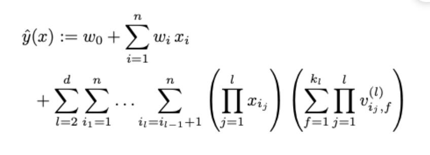

# Factorization Machine (FM)

### Summary

- 매트릭스 요소화를 통해 문제의 치수를 줄인다. 대형 sparse 데이터 셋에서 훨씬 더 효율적이다. 그래서 추천시스템에 널리 사용된다.
___________

FM은 2010년에 도입된 지도식 기계학습기법이다. FM은 매트릭스 요소화를 통해 문제의 치수를 줄이는 기능에서 이름을 얻었습니다. 

Factorization Machine은 분류 또는 회귀에 사용될 수 있으며 선형 회귀와 같은 기존의 알고리즘보다 대형 sparse 데이터셋에서 훨씬 더 효율적입니다. FM이 추천시스템에 널리 사용되는 이유입니다. 실제 추천 사항 수는 매우 적지만 사용자 수와 항목수는 일반적으로 매우 큽니다.

고해상 데이터셋에서 가장 잘 작동합니다.

대부분의 real-world는 (tags, categories, genres)등과 같은 풍부한 메타 데이터가 좋은 데이터셋으로 쓰일 수 있다. 그래서 이론적으로 rating이 매겨진 튜플셋을 우선적으로 고려하지만, 실제 추천시스템에서는 메타데이터를 고려하는 것이 더 중요하다. 

FM을 사용하면 이러한 feature-rich 데이터셋을 사용하기에 좋다. 그래서 이 모델을 통하여 더 많은 Extra 피쳐들을 모델에 집어 넣을 수 있게 되었고 변수간의 interaction(Matrix Factorization 에서의 latent product 처럼 auto generalization을 의미하는 것과 같다)을 파라미터 d로서 모델링할 수 있게 되었다. 

#### Model Equation

먼저 degree d=2인 Factorization Machine의 모델은 다음과 같이 정의된다. degree가 2라는 것은 latent vaetor를 조합하는 후보의 수를 2개로 하겠다는 것이다.

$$
\hat y(x) = w_0 + \sum_{i=1}^n w_ix_i + \sum_{i=1}^n \sum_{j=i+1}^n <v_i, v_j>x_ix_j
$$

이제 여기에서 추정되어야 하는 파라미터들은 다음과 같다.

$$
w_0 \in R, w \in R^n, V \in R^{n \times k}
$$

만약 x피처가 user와 item 두개의 non-zero position matrix만으로 이루어져 있다면 정확하게 MF와 FM이 같은 수식이라고 설명해 놓았다. 이 설명이 매우 함축적이지만 중요한 설명이다. 

Matrix Factorization의 개념을 다시 복시해보자. User x Item을 index로 하요 rating으로 value가 채워진 Matrix R이 있다. 이를 두개의 latent vactor로 분해하면 V1(u x k), V2(i x k) 로 나타낼 수 있다. 이 때 추정해야되는 변수는 global bias $$W_0, V1 \ bias\ W_u, V2 \ bias \ W_i, latent \ vector W$$ (혹은V)이다. 이 때 k가 늘어날 수록 W의 변수가 많아지기 때문에 $$R^2$$ 가 $$R$$ 에 근사할 수 있는 변수를 더 많이 계산하기 된다. 또한 W1, W2의 shape은 k가 1인 V1, V2와 동일한 shape을 가진다.

만약 코드로 표현하면

V1= random(len(User i), k), V2 = np.random(len(item u), k)로 선언할 수 있고, predict 계산시에는 V1 dot V2.transpose()로 나타낼 수 있다. 

즉 아래와 같은 MF의 equation이다.

$$
\hat y(x)=w_0+w_i+w_u+<v_i, v_j>
$$
위 식을 기반으로 한다면 MF의 데이터셋은 단순히 행렬 하나로만 구성될 것이다. 이제 FM의 equation을 이해하기 위해 FM의 데이터셋을 살펴보자

user와 item을 row, column index하는 데이터와는 구성이 약간 다르다. 위 데이터셋에서 User에 대한 sparse vector(one-hot encoding)을 x1, Item에 대한 vector를 x2, 그리고 추가적인 피처들을 x_n이라 하자. 그리고 x1에 대한 latent vector를 V1, x_n에 대한 latent vector를 V_n이라고 할 것이다. MF와 마찬가지로 V의 row v_i는 i-th variable with k factor를 의미한다. 이제 다시 FM의 equation을 보면 수식에 FM의 아이디어가 그대로 녹아있다는 것을 확인할 수 있다.

우선 $$\hat y(x)$$ 의 두번째 항을 살펴보자. MF에서는 $$W_u, W_i$$ 를 구하는 반면 FM에서는 $$W_i$$ x $$x_i$$ 를 구한다. MF에서의 두개 latent vector들의 각각의 row에 대한 고유한 bias가 FM에서도 마찬가지로 구해진 것이다. 달라진 것은 MF에서는 user, item으로 구성된 matrix 의 index 마다 이를 구했지만 FM에서는 $$x_i$$ 마다 이를 구한 것 뿐이다. 

다음으로 세번째 항을 보자. 수식이 의미하는 바는 MF에서 user latent X item latent를 통해 rating을 계싼해 주었던 것을 sum($$x_i latent\ vector$$ x $$x_{i+1} latent\ vector$$) 로 해주겠다는 것이다. 이 수식의 아이디어는 변수간의 latent vector 조합을 전부 고려하여 rating을 도출해내겠다는 것이다. 즉 Matrix Factorization계열 알고리즘의 핵심 아이디어와 polynomial regression 계열 알고리즘의 핵심 아이디엉를 결합했다고 볼 수 있다. (Wide and Deep 알고리즘과 아이디어가 매우 유사하다. 차이점은 polynomial product를 자동으로 하는 FM이 더 간단하게 느껴진다는 것이다.) 이렇게 함으로써 degree가 2인 FM은 모든 두 변수간의 pairwise interaction을 잡아낸다. 

일반적으로 sparse한 환경에서는 피쳐간의 interaction이 매우 연관적이거나 독립적으로 나타나는 경향이 있다. 하지만 FM을 통해 interaction을 구하면 피쳐간의 독립성을 깨기 때문에 매우 잘 작동한다고 한다. 만약 A라는 유저가 X라는 영화를 평가한 적이 없다고 하자. Polynomial product 관점의 접근이라면, A는 X를 평가한 적이 없기 때문에 interaction은 0이 나올 것이다. 하지만 Factorization을 통해 interaction을 계산하게 되면, X에 대한 잠재적인 평가를 얻어낼 수 있는 것이다. 이는 MF 계열의 모든 알고리즘의 장점이라고 할 수 있다. 조금 더 modeling 친화적인 관점에서 보자면 latent vector들의 interaction, 즉 dot product 과정은 cosine 함수와 같이 유사도를 구하는 개념이기 때문에 hidden feature간의 유사도를 평가한다고 할 수 있다.

#### Model complexity

만약 위의 equation대로 FM이 학습을 진행한다면, O($$k * n^2$$) 의 복잡도를 가질 것이다. 하지만 논문의 저자는 이를 linear time으로 줄여버렸다. 

#### d-way Factorization Machine

2-way(degree = 2) FM을 위에서 살펴보았다. 이를 일반화한 d-way FM의 수식은 다음과 같다.

하나의 2차원 행렬에서 MF를 통해 두 행렬로 분해한 것 처럼, 텐서를 PARAFAC을 통해 d개 행렬로 분해한다. 그리고 이에 대한 조합 개수 만큼 시행하며, 각 3개 행렬 조합의 product 계산값들을 더해준다. 수식은 매우 어려워 보이지만 2-way에서 확장하여 생각하기에 어렵지 않다. d-way FM 역시 마찬가지 방법으로 linear 하게 공식을 refomula 하였다. 이를 원 논문에서는 libFM 이라는 라이브러리를 직접 구현하여 제시하였고, 자세한 수학적 논의는 생략하였다.

#### 결론

FM 모델은 가능한 모든 피처간의 interaction을 full-parametrized one 대신에 사용한다. 이를 통해 매우 희소한 데이터에서도 관계를 추정할 수 있다. 또한 SVD, SVM등의 알고리즘보다 속도나 성능 측면에서도 월등하게 좋은 알고리즘이다.

#### FFM

FM의 variance 중에 하나인 FFM(Field aware Factorization Machine)은, FM의 order interaction의 약점을 보완한 방법이다. FM이 하나의 feature에 대해 하나의 latent vector만 갖고 있기 때문에, latent vector A,B,C 가 있다고 할 때 A-B, A-C의 영향력을 다르게 구분해주어야 하는 상황을 해결하지는 못한다. FFM은 latent vector에 차원을 하나 더 추가해서, A가 상황마다 다른 대처를 하도록 만들어준다. 

하나의 피처에 대응하는 FM의 latent vector 조합과는 달리, FFM은 field라는 차원을 하나 더 가지기 때문에 상황에 맞는 더욱 정교한 조합이 가능해진다. FFM이 성능적으로 조금 느리다는 것을 제외하면, 복잡한 피처를 구성하는 상황에서는 일반적으로 더 잘 동작하는 것 같다.

#### Matrix Factorization 과 Factorization Machine 차이점

MF는 유저-상품 데이터만 가지고 숨겨진 정보들(side-feature, latent feature->상품카테고리, 검색어, 이전에 본 상품 등)을 표현(학습)하는 알고리즘이라 입력데이터로 유저-상품(클릭여부)만 사용 가능하다. 

FM에서는 이러한 side-feature들을 직접 입력으로 넣어서 학습이 가능하다. 

FM은 MF보다 더 일반적이고 확장된 모델이여서 추천 뿐만 아니라 회귀, 이진분류와 같은 다양한 ML에서도 사용 가능하다. (MF는 불가능하다)

Reference

- https://yamalab.tistory.com/107
- https://getstream.io/blog/factorization-recommendation-systems/ 