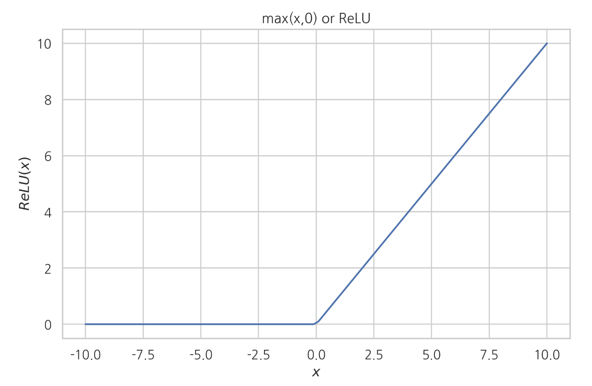
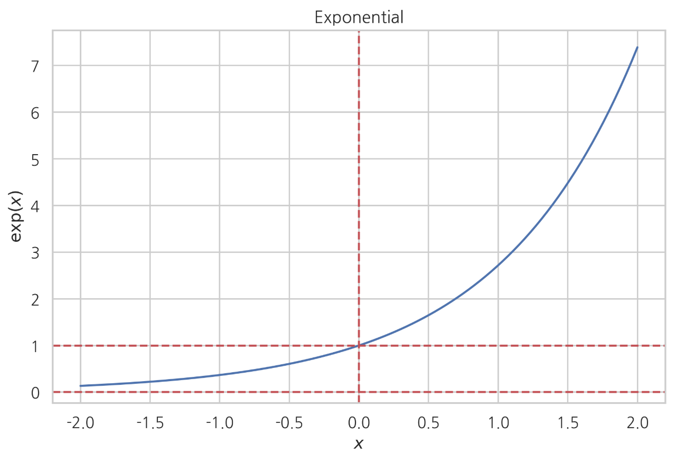
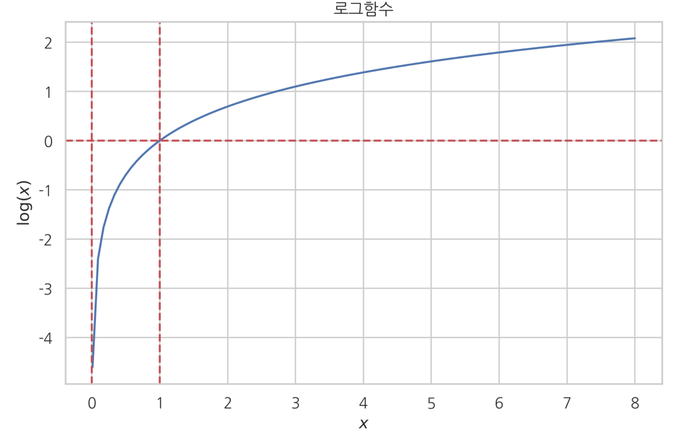
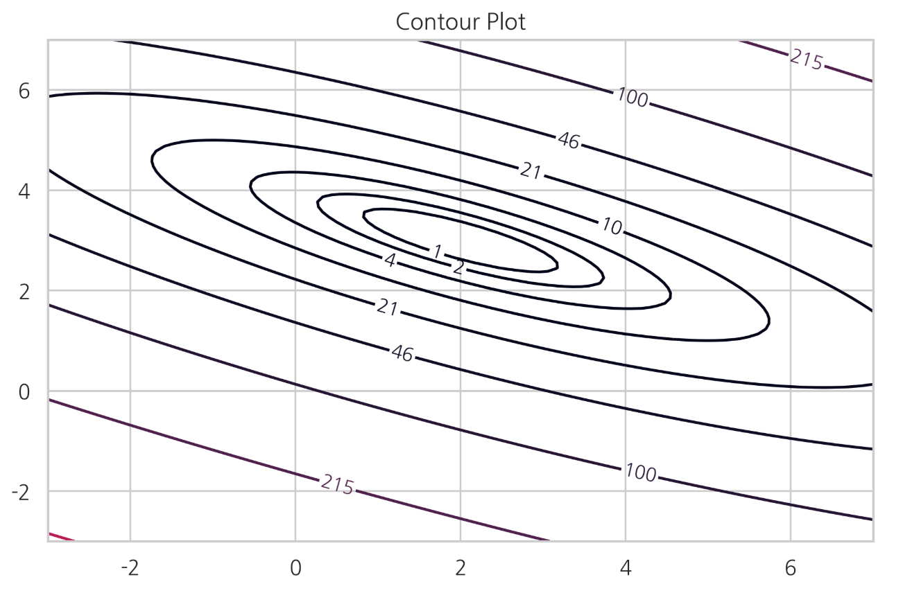
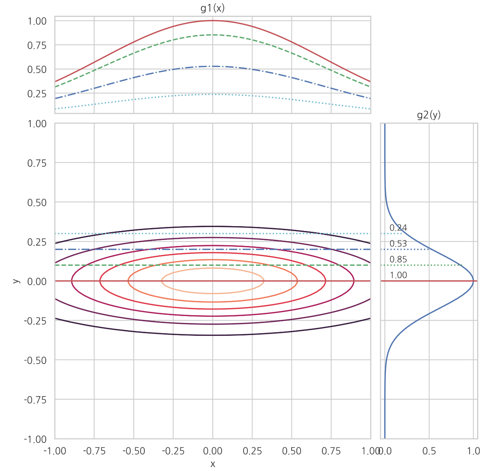

<script> MathJax.Hub.Queue(["Typeset",MathJax.Hub]); </script>

# 함수

### Summary

- 로그함수의 특징은 곱하기를 더하기로 변환한다. 어떤 함수에 로그를 적용해도 최고점, 최저점은 변하지 않는다. 0부터 1사이의 작은 값을 확대시켜 보여준다. 
- 로지스틱함수는 x에 대한 선형함수를 0부터 1사이의 값만 나오도록 변형한 것입니다. 
- 소프트맥스 함수는 다변수 입력을 확률(probability)처럼 보이게 출력한다 . 이러한 특성때문에 인공신경경망의 마지막단에서 출력을 조건부확률로 변형하는데 사용된다.
- 다항식(polynomial) 함수는 거듭 제곱 항의 선형 조합으로 이루어진 함수이다.

____________

### 함수

**함수(function)**는 **입력 값을 출력 값으로 바꾸어 출력하는 관계(relationship)**를 말한다.  맵(map), 매핑(mapping), 사전(dictionary)라는 용어로 사용하기도 한다. 함수에서 **입력 변수가 가질 수 있는 값의 집합**을 **정의역(domain)**이고, **출력 변수가 가질 수 있는 값의 집합**을 **공역(range)**이라고 한다. 서로 관계를 가지며 맺어지는 모든 숫자의 쌍은 함수라고 생각 할 수 있다.

### 표를 사용한 함수 구현

정의역이 유한개의 원소로만 이루어져 있다면 함수는 일종의 **표(lookup table)**가 된다. 정의역이 유한개여서 표로 나타낼 수 있는 함수는 **파이썬의 딕셔너리(dictionary)** 로 구현할 수 있다.

~~~python
# 함수 정의
f = {
    1: 2,
    2: 4,
    3: 6,
    4: 8,
    5: 10,
}
~~~

### 변수

정의역이 무한개의 원소로 이루어졌다면 더이상 표나 딕셔너리를 사용해서 함수를 구현 할 수 없다. 이 때는 변수와 수식을 사용하여 입력과 출력간의 관계를 정의해야 한다. 변수(variable) 란 어떤 숫자를 대표하는 기호이다. 함수에서 입력 값이나 출력 값을 기호 즉 변수로 나타내기도 한다. 

입력 값을 대표하는 변수를 **입력 변수(input variable)** 라 하고 출력 값을 대표하는 변수를 **출력 변수(ounput variable)** 라고 한다. 

변수는 보통 x, y, z 등의 알파벳 소문자로 표시한다. 함수에서 기호를 사용하는 이유는 입력 값과 출력 값의 관계를 수식으로 표한 하기 위해서 이다.

​                   					$$y = 2x$$  

함수를 여러개 사용할 때는  𝑓, 𝑔, ℎ 와 같이 알파벳 소문자로 이름을 붙여 구별한다. 함수를 표기할 때는 다음처럼 입력 변수를 붙여서 𝑓(𝑥)라고 표기한다. 이 기호는 "f of x" 라고 읽는다.파이썬의 함수 기능은 수학 함수의 개념을 구현한 것으로 볼 수 있다.

~~~python
def f(x):
    return 2 * x


x = 10
y = f(x)

print("f({}) = {}".format(x, y))

f(10)
~~~

### 연속

함수의 값이 중간에 갑자기 변하는 것을 **불연속(discontinous)**이라고 하고 그렇지 않으면 **연속(continous)**이라고 한다.

**부호 함수(sign function)** 는 입력이 양수이면 1, 음수이면 -1, 0이면 0을 출력하는 불연속 함수이다.
$$
\text{sgn}(x) =\begin{cases} 1, & x > 0, \\ 0, & x = 0, \\ -1, & x < 0 \end{cases}
$$

**단위계단함수(Heaviside step function)**도 x = 0에서 불연속인 함수이다.
$$
H(x) =\begin{cases} 1, & x \ge 0, \\ 0, & x < 0  \end{cases}
$$

지시함수(indicator function)는  함수 이름에 아래 첨자로 미리 지정된 값이 들어오면 출력이 1이 되고 아니면 출력이 0이 된다.지시함수는 데이터 중에서 특정한 데이터만 선택하여 갯수를 세는데 사용된다. 
$$
\begin{align}
\mathbb{I}(x=i)
=
\begin{cases}
1 & \text{ if } x = i \\ 
0 & \text{ if } x \neq i \\ 
\end{cases}
\tag{4.1.9}
\end{align}
$$

### 역함수

**역함수(inverse function)** 는 어떤 함수의 입력/출력 관계와 정반대의 입출력 관계를 가지는 함수

함수 𝑓의 역함수는 $$𝑓^{−1}$$ 기호로 표시한다.
$$
y = f(x), \;\;\; \rightarrow \;\;\; x = f^{-1}(y)
$$

함수의 "역함수"와 함수의 "역수"는 기호와 의미가 모두 다르다는 점에 주의한다.
$$
f^{-1}(x) \neq f(x)^{-1} = \dfrac{1}{f(x)}
$$
함수가 존재한다고 항상 역함수가 존재할 수 있는 것은 아니다. 

예를 들어 $$f(x) = x^2$$ 는 역함수가 존재하지 않는다. 이 함수의 역함수가 존재하러면 정의역을 양수로 제한해야 한다. 이 때는 다음과 같이 역함수가 존재한다. $$f^{-1}(x) = \sqrt{x}$$

### 함수의 그래프

함수의 형상을 직관적으로 파악하기 위해 **그래프(graph)** 또는 **플롯(plot)**를 사용하기도 한다. 파이썬에서는 matplotlib의 라인 플롯을 사용하여 그래프를 만들 수 있다. 단점은 matplotlib에서는 그래프를 작성할 영역을 작은 구간으로 나눈 독립 변수값 벡터 𝑥 를 생성하고 이 위치에 대한 함수값 벡터 𝑦를 하나하나 계산하여 이렇게 만들어진 점을 직선으로 연결하는 방식으로 플롯을 그린다. 따라서 구간의 간격이 너무 크면 그래프가 부정확해지고 구간의 간격이 너무 작으면 계산 시간이 증가하며 메모리 등의 리소스가 낭비된다.

### 역함수의 그래프

역함수의 그래프는 원래의 함수에서 𝑥축과 𝑦축과 바뀐 것이므로 **𝑦=𝑥가 나타내는 직선(원점을 통과하는 기울기 1인 직선)을 대칭축**으로 **대칭인 함수의 그래프**와 같다.


## 데이터 분석에서 많이 사용되는 함수들 

### 다항식 함수

- 다항식(polynomial) 함수는 상수항 $$c_0$$, 일차항 $$c_1x$$, 이차항 $$c_2x^2$$, ... 등의 거듭 제곱 항의 선형 조합으로 이루어진 함수이다. 다음은 단변수(uni-variate) 다항식 함수의 전형적인 형태이다.
  $$
  f(x) = c_0 + c_1 x + c_2 x^2 + \cdots + c_n x^n
  $$

### 최대/최소 함수

최대함수는 두 개의 인수 중에서 큰 값을 출력하는 함수이다.  $$max(x, y)$$

**입력 값이 양수이면 그대로 출력하고 음수일 때는 0으로 만들어 줄 때 주로 사용**한다. **$$max(x, 0)$$** 인공신경망에서는 이 함수를 ReLU(Rectified Linear Unit) 이라고 부른다.



최소함수는 두 개의 인수 중 작은 값을 출력하는 함수이다. $$min(x,y)$$

### 지수함수

정해진 어떤 값을 입력 값으로 거듭제곱하여 출력을 구하는 함수 $$y = a^x$$ 에서 거듭 제곱을 할 때 아래에 있는 수를 밑(base)라고 한다.  밑을 오일러 수 $$e$$(약 2.718)로 하여 거듭제곱을 하는 함수를 지수 함수(exponential funtion) 라고 한다. $$y = e^x$$ 

지수 함수는 다음처럼 표시할 수도 있다.

​							$$y = exp(x) = exp \;x$$

#### 지수함수의 특성

- 양수($$e$$)를 거듭제곱한 값이므로 항상 양수이다.
- $$x$$=0 일 때 1이 된다.
- $$x$$ 가 양의 무한대로 가면($$x \rightarrow \infty$$), 양의 무한대로 간다.
- $$x$$ 가 음의 무한대로 가면($$x \rightarrow -\infty$$), 0으로 다가간다.
- $$x_1$$>$$x_2$$ 이면 exp $$x_1$$ > exp $$x_2$$ 이다 (단조증가성질)

- NumPy 에서는 ```e``` 명령으로 오일러 수를, ```exp``` 명령으로 지수 함수를 계산한다. 

~~~python
np.e
np.exp(-10), np.exp(-1), np.exp(-0.1), np.exp(0), np.exp(0.1), np.exp(1), np.exp(10)
~~~

#### 지수함수의 그래프



두 지수 함수의 곱의 값은 입력 값의 합의 지수 함수 값과 같다. $$e^{x_1} e^{x_2} = e^{x_1 + x_2}$$								

**로지스틱(logistic)** 함수는 지수 함수를 응용한 함수로 회귀 분석이나 인공 신경망에서 자주 사용된다.     $$ \exp(-x)$$ 에서 $$-$$ 를 곱해서 부호를 바꿔준다. 단조증가함수 이다. $$x$$ 의 값이 증가하던 감소하던 무관하게 $$f(x)$$ 는 0과 1사이의 값을 갖는 값이 된다. 

$$
\dfrac{1}{1 + \exp(-x)}
$$


로지스틱 함수의 역함수는 로짓 함수(Logit function)이다. $$f(x) = log(\dfrac{x}{1 + -x})$$

### 로그 함수

$$e$$ 를 거듭제곱하여 특정한 수 $$a$$ 가 되도록 해주는 수를 $$log \;a$$ 라 표기하고 로그(log)라고 읽는다. 

NumPy에서 로그 함수 명령은 ```log``` 이다.

~~~python
np.log(10)
~~~

지수함수에서 밑이 $$e$$ 가 아닌 경우에는 다음처럼 로그를 이용하여 계산 할 수 있다.
$$
y = a^x = (e^{\log a})^x = e^{x \log a}
$$

**로그**는 지수함수의 출력이 특정한 값이 되게 하는 입력을 찾는 것이므로 **지수함수의 역함수**이다.

​								$$y = log\; x$$

#### 로그함수의 특징

- $$x$$ 값, 즉 입력변수값이 양수이어야 한다. 0이거나 음수이면 정의되지 않는다.
- $$x$$ > 1 이면 양수가 된다.
- $$x$$ = 1 일 때 $$y$$ = 0 이 된다.
- 0 < $$x$$ < 1이면 음수가 된다.
- $$x_1$$ > $$x_2$$ 이면 $$log\;x_1$$ > $$log\;x_2$$ 이다.

#### 로그함수 그래프



로그 함수는 확률론에서 가장 많이 사용되는 함수이다. 그 이유는 로그 함수가 가지는 다음과 같은 특이한 성질 때문이다

#### 로그함수의 성질 1.  로그 함수는 곱하기를 더하기로 변환한다.

$$
\log{(x_1 \cdot x_2)} = \log{x_1} + \log{x_2}
$$

$$
\log{\left(\prod_i x_i\right)} = \sum_i \left(\log{x_i}\right)
$$

위 식에서 $$x_1 = x_2 = … = x$$ 라면 $$\log x^n = n \log x$$ 이다. 

#### 로그함수의 성질 2. 어떤 함수에 로그를 적용해도 함수의 최고점, 최저점의 위치는 변하지 않는다.

만약 양수값만을 가지는 함수가 있을 대 이 함수에 다시 로그함수를 적용하면 높낮이는 바뀌지만 

**최고점이나 최저점의 위치는 바뀌지 않는다**. 따라서 최적화를 할 때 원래의 함수가 아니라 로그를 취한 함수에 대해 최적화를 실시하는 경우가 많다.


#### 로그 함수의 성질 3: 로그 함수는 0부터 1사이의 작은 값을 확대시켜 보여준다.

로그 함수는 0부터 1사이의 구간을 음의 무한대부터 0까지로 확장시켜주기 때문에 확률값처럼 0과 1사이에 있는 작은 값을 더 확실하게 비교할 수 있도록 한다.


**소프트플러스(softplus)** 함수는 지수 함수와 로그 함수를 결합하여 만든 함수로 0을 인수로 가지는 최대함수와 비슷하지만 $$x$$ = 0 근처에서 값이 부드럽게 변한다는 장점이 있다. 
$$
\zeta(x) = \log( 1 + \exp(x))
$$


### 다변수함수

다변수함수(multivariate function) : 복수의 입력 변수를 가지는 함수

$$z = f(x, y)$$ 는 $$f$$ 가 2개의 입력 변수 $$x, y$$ 를 받아서 변수 $$z$$ 를 출력하는 다변수함수라는 뜻이다.

2차원 함수는 평면상의 지형과 같기 때문에 3차원 **서피스 플롯(surface plot)**, **컨투어 플롯(contour plot)**으로 나타낼 수 있다. 




### 분리가능 다변수 함수

다변수함수 중에는 단변수함수의 곱으로 표현 가능한 다변수함수도 있다.

​						$$f(x, y) =f_1(x)f_2(y)$$

위의 다변수함수를 분리가능 다변수함수(separable multivariate function)이라고 하며 추후 확률변수에서 중요한 연락을 한다. 2차원 함수는 3차원 공간상의 지형에 비유할 수 있다. 2차원 함수를 $$x = x_0$$ 또는 $$y = y_0$$ 로 고정을 하면 1차원 단변수함수가 된다. 이 단변수함수의 모양은 3차원 공간상의 지형을 케이크 자르듯이 나눌 때 생기는 단면의 모양과 같다. 

분리가능 다변수함수는 단면의 모양이 모두 같은 함수를 높이만 다르게 조절한 것이다. 

$$x = x_0$$ 로 고정하면 단면함수는 $$g(x_0, y) = g(x_0)g(y) = k_0g(y)$$ 이르모 $$x_0$$ 의 값과 상관없이 $$g(y)$$ 의 높이만 조절한 모양이 된다.

아래의 그래프는 𝑦=0,0.1,0.2,0.3 로 고정하였을 때 생기는 단면의 모양을 나타낸 것이다.



### 다변수 다출력 함수

어떤 함수는 입력 변수 뿐 아니라 출력 변수도 여러개 일 수 있다. 이 경우에는 출력을 벡터나 행렬로 나타낼 수 있다.

예) **소프트맥스(softmax)** 함수는 다차원 벡터를 입력받아 다차원 벡터를 출력한다. 

다음은 3차원 소프트맥스 함수이다.

$$
y =
\begin{bmatrix}
y_1 \\ y_2 \\ y_3
\end{bmatrix}
=S(x_1, x_2, x_3) = 
\begin{bmatrix}
\dfrac{\exp(w_1x_1)}{\exp(w_1x_1) + \exp(w_2x_2) + \exp(w_3x_3)} \\
\dfrac{\exp(w_2x_2)}{\exp(w_1x_1) + \exp(w_2x_2) + \exp(w_3x_3)} \\
\dfrac{\exp(w_3x_3)}{\exp(w_1x_1) + \exp(w_2x_2) + \exp(w_3x_3)} \\
\end{bmatrix}
$$

출력 벡터 특성
  - 모든 원소는 0과 1사이의 값을 가진다. 
  - 모든 원소의 합은 1이다.
  - 입력 원소들의 크기 순서와 출력 원소들의 크기 순서가 같다. 

소프트맥스 함수는 **다변수 입력을 확률(probability)처럼 보이게 출력한다** . 이러한 특성때문에 인공신경경망의 마지막단에서 출력을 조건부확률로 변형하는데 사용된다.