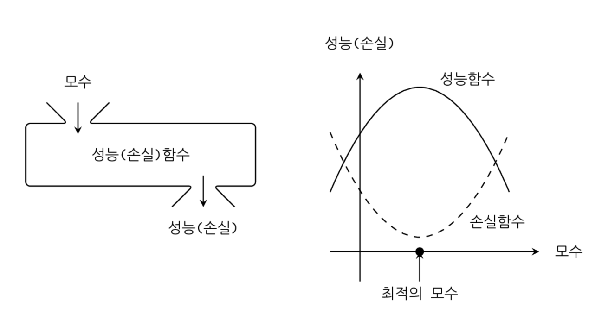

<script> MathJax.Hub.Queue(["Typeset",MathJax.Hub]); </script>

# 함수 미분

### Summary

- 최적화(optimization)는 목적함수의 값을 가장 크게 혹은 가장 작게 할 수 있는 모수를 구하는 것입니다. 
_____________

### 성능함수, 목적함수, 손실함수, 비용함수

데이터 분석의 목표는 가장 최적의(optimal) 모형을 구하는 일이다. 예측 모형은 입력 데이터 이외에도 모수(parameter) 라고 하는 숫자를 가진다. 선형 예측 모형에서는 입력 데이터에 대한 가중치(weight)가 모수가 된다. 모수를 어떤 숫자로 정하느냐에 따라 예측 모형의 성능이 달라진다. 모수를 함수의 입력이라고 한다면 성능은 함수의 출력이 된다.

**성능함수(performance function), 목적함수(objective function)** 는 모수를 입력받아 모형의 성능을 출력하는 함수이다.  $$x$$ 데이터를 받아 $$y$$ 데이터를 출력하는 예측함수와는 다른 함수이다.  성능함수나 목적함수의 값은 클수록 좋다.

**손실함수(loss function), 비용함수(cost function)** 는 모수를 입력받아 오차 혹은 오류의 크기를 출력하는 함수를 가장 작게 하는 것이다. 



### 최적화

최적화(optimization)는 목적함수의 값을 가장 크게 혹은 가장 작게 할 수 있는 모수를 구하는 것입니다. 

### 데이터 분석에서 미분이 필요한 이유

최적화를 하기 위해서는 입력값이 변했을 때 함수의 출력값이 어떻게 달라지는지를 정량적으로 계산하는 과정이 미분이다. 
데이터 분석에서 우리가 최종적으로 원하는 것은 최적화(optimization) 작업이다. 그런데 수치적 최적화는 미분(differentiation)없이는 불가능하다.이것이 데이터 분석에서 미분이 필요한 이유이다.

### 기울기

우리는 함수에 들어가는 입력이 달라졌을 때 출력이 어떻게 변하는지를 알아야 한다. 이 정보를 **기울기(slope)** 혹은 **민감도(secsitivity)** 라고 한다. 예로 입력변수의 값이 𝑥에서 $$𝑥_2$$로 달라졌다고 가정하자. 출력변수는 𝑓(𝑥)이라는 값에서 $$𝑓(𝑥_2)$$라는 값으로 달라질 것이다. 이를 비율로 나타내면 다음과 같다. 여기에서 $$𝑑𝑥=𝑥_2−𝑥$$이다.

$$
\dfrac{\text{y의 변화량}}{\text{x의 변화량}} = \dfrac{f(x_2) - f(x)}{x_2 - x} = \dfrac{f(x + dx) - f(x)}{dx}
$$

이러한 변화율은 $$x_2$$ 를 $$x_1$$ 에서 얼마나 멀리 떨어져 있는가 즉 $$dx$$ 의 값에 따라 달라진다. 이를 해결하기 위해 **기울기(slope)** 라는 개념을 사용한다. 기울기는 $$dx$$ 값이 0으로 근접할 때의 변화율을 말한다

$$
\text{기울기} = \lim_{dx\rightarrow 0} \dfrac{f(x + dx) - f(x)}{dx}
$$

함수의 그래프는 부드러운 곡선(curve)의 형태로 나타나는 경우가 많다. 이 곡선에 대해 한 점만 공통으로 가지는 **접선(tangent)**을 그릴 수 있는데 이 접선이 수평선과 이루는 **기울기는 접선이 𝑥방향으로 이동한 거리와 𝑦 방향으로 이동한 거리의 비율**을 말한다.


위의 그래프에서 에서 𝑥=0과 𝑥=1에서의 기울기는 각각 1, −2이다.

$$
x=0\text{에서의 기울기} =  \dfrac{1}{1} = 1 \\ x=1\text{에서의 기울기} =  \dfrac{-2}{1} = -2
$$

### 수치미분

scipy.misc 패키지의 ```derivative```  명령을 사용하면 수치적으로 대력적인 기울기를 계산할 수 있다. 인수로는 기울기를 구하고자 하는 함수 `f` , 기울기를 구할 위치 `x` , 기울기를 구하기 위해 이동할 거리 `dx` 를 받는다. 

수치미분(numerical differentiation) : 기울기를 구하는 방법 (대략적인 기울기를 구할 뿐이다)

~~~python
from scipy.misc import derivative
derivative(f, 0, dx=1e-6)
derivative(f, 1, dx=1e-6)
~~~

### 미분

**미분(differentiation)**은 어떤 함수로부터 그 함수와 연관성이 있는 새로운 함수를 만들어 내는 작업이다. 

**도함수(derivative)** 는 미분으로 만들어진 함수를 원래 함수의 도함수라고 한다. **미분을 통해 만들어진 도함수는 같은 입력에 대해 원래 함수의 기울기(slope)를 출력한다**. 도함수는 원래 함수에 프라임(prime) 기호($$'$$)를 붙이거나 원래 함수의 앞에 $$\dfrac{d}{dx}$$를 붙여서 표시한다. 분수처럼 표기하기도 하는데 **분모의 위치에는 미분하고자 하는 변수**가 오고 **분자의 위치에는 미분하는 함수 자체의 기호**나 혹은 **함수 계산의 결과로 얻어지는 출력 변수**를 넣는다. 예를 들어 𝑦=𝑓(𝑥)라는 함수를 미분하여 구한 도함수는 다음과 같이 여러가지 방법으로 표기할 수 있다. 도함수의 표기는 분수와 비슷하지만 분수의 기호만 빌려온 것일 뿐 분수가 아니라는 점에 주의한다.

$$
f' = \dfrac{d}{dx}(f) = \dfrac{d}{dx}f = \dfrac{df}{dx}  = \dfrac{d}{dx}(y) = \dfrac{d}{dx}y = \dfrac{dy}{dx}
$$

위의 식에서 $$f'$$는 "f 프라임(prime)"이라고 읽고 $$\dfrac{df}{dx}$$는 "df 오버(over) dx"라고 읽는다. 위치 𝑥에서 도함수의 값 $$f'(x)$$은 그 위치에서의 함수의 기울기와 같으므로 다음처럼 쓸 수 있다.
$$
f'(x) = f(x)\text{의 기울기}
$$

### 미분가능

함수에 따라서는 어떤 점에서는 기울기 값을 정의하기 어려울 수가 있다. 예를 들어 $$x = 0$$ 인 위치에서 기울기를 정의할 수 없다. 이런 경우에는 $$x = 0$$ 에서 미분 불가능(not differentiable) 이라고 한다. 반대로 기울기를 구할 수 있으면 미분 가능(differentiabel)이라고 한다.

예를 들어 ReLU함수는 x<0인 구간에서는 기울기가 0이고 x>0인 구간에서는 기울기가 1이지만 x=0인 위치에서는 접선이 존재하지 않아 미분불가능이다. 


### 미분공식

1) 기본 미분공식

- 상수 : 상수를 미분하면 0이 된다.  $$ \dfrac{d}{dx}(c) = 0 $$
- 거듭제곱 : n이 자연수이거나 음의 정수일 때 성립, n = 0 일 때는 성립하지 않는다. $$ \dfrac{d}{dx}(x^n) = n x^{n-1} $$
- 로그 : 로그함수를 미분하면 $$x^{-1}$$ 이 된다.  $$\dfrac{d}{dx}(\log x) = \dfrac{1}{x}$$
- 지수 : 밑이 오일러 수인 지수함수는 미분해도 변하지 않는다.  $$\dfrac{d}{dx}(e^x) = e^x$$

2) 선형조합법칙 

어떤 함수에 상수를 곱한 함수를 미분한 결과는 원래 함수의 도함수에 그 상수를 곱한 것과 같다.
$$
\dfrac{d}{dx}(cf) = c \cdot \dfrac{df}{dx}
$$

어떤 두 함수를 더한 함수를 미분한 결과는 원래 함수의 도함수를 더한 것과 같다.
$$
\dfrac{d}{dx}\left(f_1 + f_2\right) = \dfrac{df_1}{dx} +  \dfrac{df_2}{dx}
$$

위의 결과를 합치면 어떤 함수에 각각 상수를 곱한 후 더한 선형조합(linear combination)은 각 함수의 도함수를 선형조합한 것과 같다.
$$
\dfrac{d}{dx}\left(c_1 f_1 + c_2 f_2 \right) = c_1 \dfrac{df_1}{dx} + c_2 \dfrac{df_2}{dx}
$$

3) 곱셈법칙

어떤 함수의 형태가 두 개의 함수를 곱한 것과 같을 때는 다음과 같이 각 개별 함수의 도함수를 사용하여 원래의 함수의 도함수를 구한다. 이를 곱셈법칙이라고 한다.
$$
\dfrac{d}{dx}\left( f  \cdot g \right) = f \cdot  \dfrac{dg}{dx} + \dfrac{df}{dx} \cdot g
$$

4) 연쇄법칙

**연쇄법칙(chain rule)**은 미분하고자 하는 함수의 입력 변수가 다른 함수의 출력 변수인 경우 적용할 수 있다.

$$
f(x) = h(g(x))
$$

$$
\dfrac{df}{dx} = \dfrac{dh}{dg} \cdot \dfrac{dg}{dx}
$$

**가우시안 정규분포(Gaussian normal distribution)** 의 **확률밀도함수(probability density function)**는 기본적으로 다음과 같은 형태라고 볼 수 있다.   $$\sigma^2, \mu$$ 는 상수이다. 

$$
f = \exp \dfrac{(x-\mu)^2}{\sigma^2}
$$

위 함수의 도함수는 다음과 같이 구할 수 있다. 우선 위의 함수는 다음과 같이 세 개의 함수의 조합으로 생각할 수 있다. 여기에서 𝑦, 𝑧 라는 중간 변수를 임시로 정의하였다.  $$f = \exp(z) \;,\;\;\;\; z = \dfrac{y^2}{\sigma^2}   \;,\;\;\;\;   y = x-\mu$$

연쇄법칙을 적용하면 다음과 같다. 

​$$ \dfrac{df}{dx} = \dfrac{df}{dz} \cdot \dfrac{dz}{dy} \cdot \dfrac{dy}{dx} $$

연쇄법칙에 사용된 각각의 도함수는 다음과 같다. 이 때 임시로 사용된 중간 변수는 없앤다.

$$
\dfrac{df}{dz} = \exp(z) = \exp \dfrac{(x-\mu)^2}{\sigma^2} \\
\dfrac{dz}{dy} =  \dfrac{2y}{\sigma^2} = \dfrac{2(x-\mu)}{\sigma^2} \\
\dfrac{dy}{dx} =  1
$$

이  결과를 연쇄법칙에 따라 곱하면 최종적인 도함수를 구할 수 있다.

$$
\dfrac{df}{dx} =  \dfrac{2(x-\mu)}{\sigma^2} \exp \dfrac{(x-\mu)^2}{\sigma^2}
$$

연쇄법칙의 예 : 로그함수의 미분

$$
\dfrac{d}{dx} \log f(x) = \dfrac{f'(x)}{f(x)}
$$

### 2차 도함수

도함수를 한번 더 미분하여 만들어진 함수를 **2차 도함수(second derivative)** 라고 한다. 
$$
f'' = \dfrac{d^2}{dx^2}(f) = \dfrac{d^2}{dx^2}f = \dfrac{d^2f}{dx^2}  = \dfrac{d^2}{dx^2}(y) = \dfrac{d^2}{dx^2}y = \dfrac{d^2y}{dx^2}
$$

2차 도함수는 **도함수의 기울기** 를 나타낸다. 즉 도함수 값이 증가하면 2차 도함수 값은 양수이고, 도함수 값이 감소하면 2차 도함수 값은 음수이다.  2차 도함수 값이 양수인 경우를 볼록(convex)하다 하며 2차 도함수 값이 음수인 경우를 오목(concave) 하다고 한다. 이 때 볼록과 오목은 아래에서 바라본 관점이다. 2차 도함수 값을 **볼록도(convexity)** 라고도 부른다. 


### 편미분

만약 함수가 두 개 이상의 독립변수를 가지는 다변수 함수인 경우에는 미분 즉, 기울기는 하나의 변수에 대해서만 구할 수 있다. 이를 **편미분(partial differentiation)** 이라고 한다. 
$$
f_x(x,y) = \dfrac{\partial f}{\partial x} \\
f_y(x,y) = \dfrac{\partial f}{\partial y}
$$

편미분을 하는 방법은 변수가 하나인 함수의 미분과 같다. 어떤 하나의 독립 변수에 대해 미분할 때는 다른 독립변수를 상수로 생각하면 된다.

편미분의 예

$$
f(x,y) = x^2 + 4xy + 4y^2 \\
f_x(x,y) = \dfrac{\partial f}{\partial x} = 2x + 4y \\
f_y(x,y) = \dfrac{\partial f}{\partial y} = 4x + 8y
$$

### 다변수 함수의 연쇄법칙

다변수 함수의 미분을 구할 때도 함수가 연결되어 있으면 **연쇄법칙**이 적용된다. 예를 들어 변수 𝑥를 입력으로 가지는 함수가 $$𝑓_1,𝑓_2,…,𝑓_𝑁$$과 같이 𝑁개가 있고 각각의 출력을 $$𝑦_1,𝑦_2,…,𝑦_𝑁$$이라고 하자.

$$
\begin{align}
y_1 &= f_1(x) \\
y_2 &= f_2(x) \\
 & \vdots \\
y_N &= f_N(x) 
\end{align}
$$

그리고 이 $$𝑦_1,𝑦_2,…,𝑦_𝑁$$값에 의존하는 다른 함수 𝑔가 있다고 하자. 𝑔의 출력은 𝑧라고 한다.

$$
z = g(y_1, y_2, \ldots, y_N)
$$

이 때 변수 $$x$$ 값의 변화에 따른 $$z$$ 값의 변화는 다음처럼 계산한다

$$
\begin{align}
\dfrac{dz}{dx} 
&= \dfrac{\partial z}{\partial y_1}\dfrac{dy_1}{dx} + 
   \dfrac{\partial z}{\partial y_2}\dfrac{dy_2}{dx} + \cdots
 + \dfrac{\partial z}{\partial y_N}\dfrac{dy_N}{dx}   
\end{align}
$$

이번에는 함수 $$f_1, f_2, \ldots, f_N$$ 가 $$x_1, x_2, \ldots, x_M$$ 을 입력으로 가지는 다변수 함수라고 하자. 

$$
\begin{align}
y_1 &= f_1(x_1, x_2, \ldots, x_M) \\
y_2 &= f_2(x_1, x_2, \ldots, x_M) \\
 & \vdots \\
y_N &= f_N(x_1, x_2, \ldots, x_M) 
\end{align}
$$

이 때의 변수 $$x_1$$ 값의 변화에 따른 $$z$$ 값의 변화도 마찬가지로 계산할 수 있다.

$$
\begin{align}
\dfrac{\partial z}{\partial x_1} 
&= \dfrac{\partial z}{\partial y_1}\dfrac{\partial y_1}{\partial x_1} + 
   \dfrac{\partial z}{\partial y_2}\dfrac{\partial y_2}{\partial x_1} + \cdots
 + \dfrac{\partial z}{\partial y_N}\dfrac{\partial y_N}{\partial x_1}   
\end{align}
$$

### 2차 편미분

편미분에 대해서도 2차 도함수를 정의할 수 있다. 편미분의 2차 도함수를 구할 때는 각각의 미분에 쓰이는 독립 변수를 자유롭게 선택할 수 있다.

첫번째 미분과 두번째 미분에서 모두 $$x$$ 에 대해 미분하여 다음과 같이 표기한다.

$$
f_{xx}(x,y) = \dfrac{\partial^2 f}{\partial x^2} = 2
$$

첫번째 미분과 두번째 미분에서 모두 𝑦에 대해 미분하면 다음과 같이 표기한다.

$$
f_{yy}(x,y) = \dfrac{\partial^2 f}{\partial y^2} = 8
$$

첫번째 미분에서는 𝑥에 대해 미분하고 두번째 미분에서는 𝑦에 대해 미분하면 다음과 같이 표기한다.

$$
f_{xy}(x,y) = \dfrac{\partial^2 f}{\partial y \partial x} = 4
$$

첫번째 미분에서는 𝑦에 대해 미분하고 두번째 미분에서는 𝑥에 대해 미분하면 다음과 같이 표기한다.

$$
f_{yx}(x,y) = \dfrac{\partial^2 f}{\partial x \partial y} = 4
$$

위 결과에서 𝑥로 먼저 미분하고 나중에 𝑦로 미분한 2차 도함수 𝑓𝑥𝑦는 𝑦로 먼저 미분하고 나중에 𝑥로 미분한 2차 도함수 𝑓𝑦𝑥와 같다. 만약 함수가 연속이고 미분가능하면 미분의 순서는 상관없다. 이를 **슈와르츠 정리(Schwarz's theorem)**라고 한다.

### 테일러 전개

**함수의 기울기(1차 미분값)를 알고 있다면 함수의 모양을 다음처럼 근사화할 수 있다. ** 이를 **테일러 전개(Talor expansion)**라고 한다. $$𝑥_0$$는 함수값과 기울기를 구하는 𝑥 위치이며 사용자가 마음대로 설정할 수 있다.

($$x_0$$, $$f($$x_0$$))을 지나는 직선 

$$f(x)$$ 는 곡선이고 변수 이다.

$$f($$x_0$$)은 직선이고 숫자이다.

$$\dfrac{df(x_0)}{dx}$$ 는 $$x_0$$ 에서의 기울기이고 숫이다.

$$x - x_0$$ 에서 $$x$$ 는 문자이다. 

위의 내용을 합치면 직선의 방정식이다 

예) 2 + 3(x - 1) : (1, 2)를 지나는 직선이다. 
$$
f(x) \approx f(x_0) + \dfrac{df(x_0)}{dx}(x - x_0)
$$

다변수 함수의 경우에는 다음처럼 테일러전개를 한다.

$$\dfrac{\partial f(x_0, y_0)}{\partial x}$$ 는 도함수이다.

$$(x - x_0)$$ 는 이동한 위치이다.
$$
f(x, y) \approx f(x_0, y_0) 
+ \dfrac{\partial f(x_0, y_0)}{\partial x}(x - x_0)
+ \dfrac{\partial f(x_0, y_0)}{\partial y}(y - y_0)
$$

### SymPy

SymPy는 **심볼릭 연산(symbolic operation)** 을 지원하기 위한 파이썬 패키지이다. 


~~~python
import sympy

# Juypter 노트북에서 수학식의 LaTeX 표현을 위해 필요함
sympy.init_printing(use_latex='mathjax')
~~~

심볼릭 연산에서 사용하는 **심볼릭 변수(symbolic variable)**는 일반 프로그래밍에서 사용하는 변수와 다르다. 일반 프로그래밍에서 사용하는 변수는 이미 메모리에 씌여있는 어떤 숫자를 기호로 쓴 것에 지나지 않지만 심볼릭 변수는 아무런 숫자도 대입이 되어 있지 않다. 따라서 𝑥2의 미분 연산을 수행하기 위해서는 우선 SymPy의 `symbols` 명령을 사용하여 𝑥x라는 기호가 단순한 숫자나 벡터 변수가 아닌 심볼(symbol)임을 알려주어야 한다. 이렇게 정의된 심볼 변수는 `Symbol` 클래스 자료형이 된다.

~~~python
x = sympy.symbols('x')
x
~~~

수학 함수는 SymPy 전용 함수를 사용해야 한다.

~~~python
f = x * sympy.exp(x)
f
~~~

함수가 정의되면 `diff` 함수로 미분을 할 수 있다. 또한 `simplify` 함수를 써서 소인수분해 등을 통한 수식 정리가 가능하다.

~~~python
sympy.diff(f)
sympy.simplify(sympy.diff(f))
~~~

편미분을 하는 경우에는 어떤 변수로 미분하는지를 `diff` 함수에 명시해야 한다. `symbols` 명령을 사용할 때는 인수로 주는 문자열에 여러개의 심볼 변수를 동시에 넣을 수도 있다.

~~~python
x, y = sympy.symbols('x y')
f = x ** 2 + 4 * x * y + 4 * y ** 2
f
~~~

~~~python
sympy.diff(f, x)
~~~

~~~python
sympy.diff(sympy.diff(f, x),y)

sympy.diff(f, x, y)
~~~

상수 심볼을 포함하는 함수를 미분하는 경우, SymPy는 어떤 심볼이 상수이고 어떤 심볼이 변수인지 알 수 없기 때문에 편미분인 것처럼 입력 변수를 지정해야 한다.

~~~python
x, mu, sigma = sympy.symbols('x mu sigma')
f = sympy.exp((x - mu) ** 2 / sigma ** 2)
f
~~~

~~~python
sympy.diff(f, x)
sympy.simplify(sympy.diff(f, x))
~~~

이차 도함수는 다음처럼 구한다.

~~~python
sympy.diff(f, x, x)
~~~

