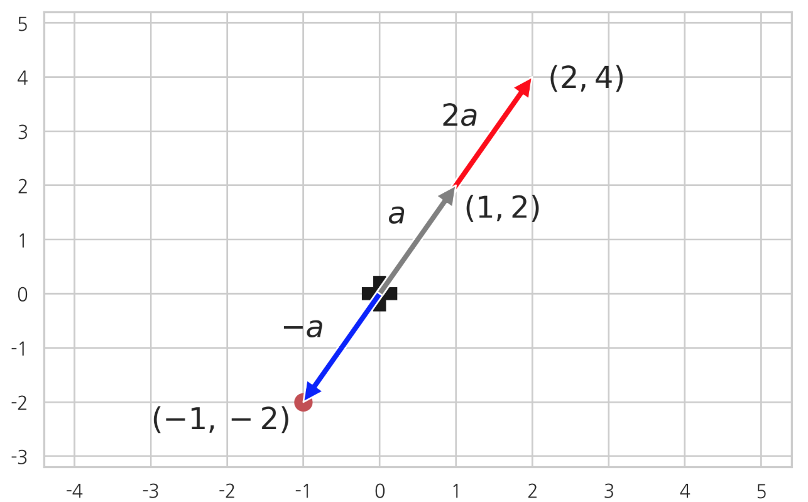
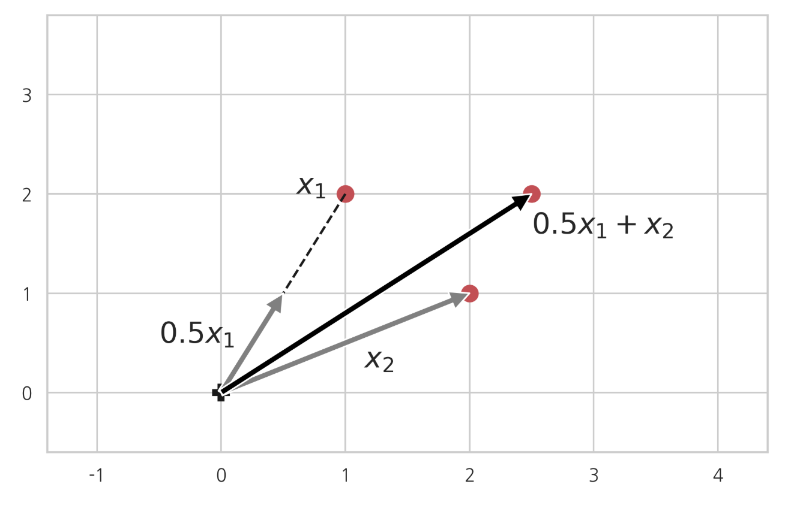
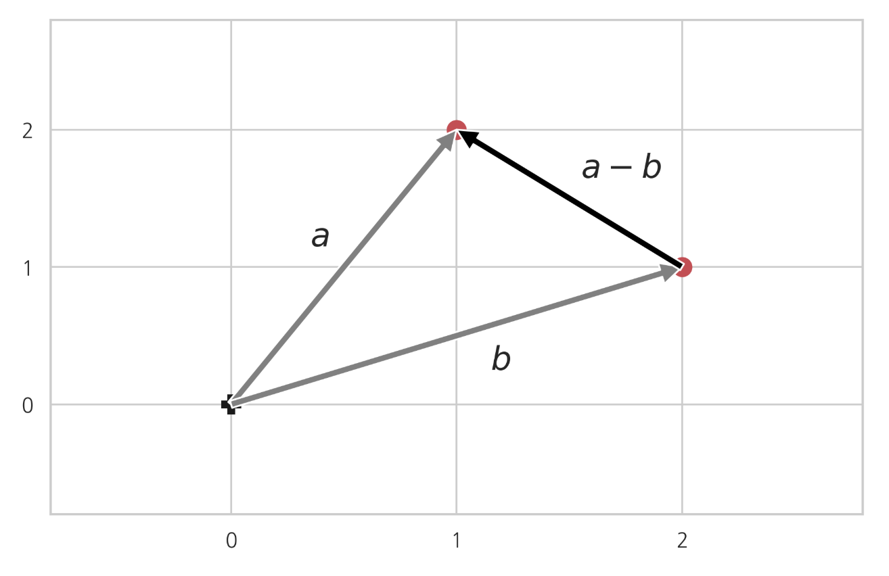
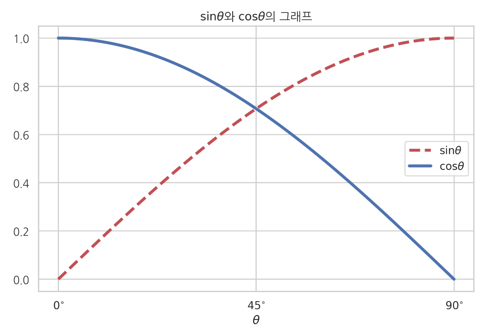
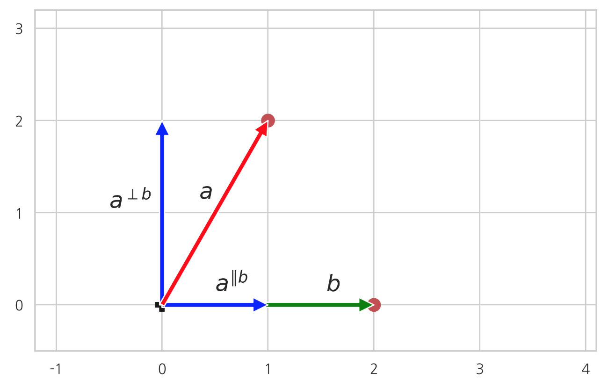
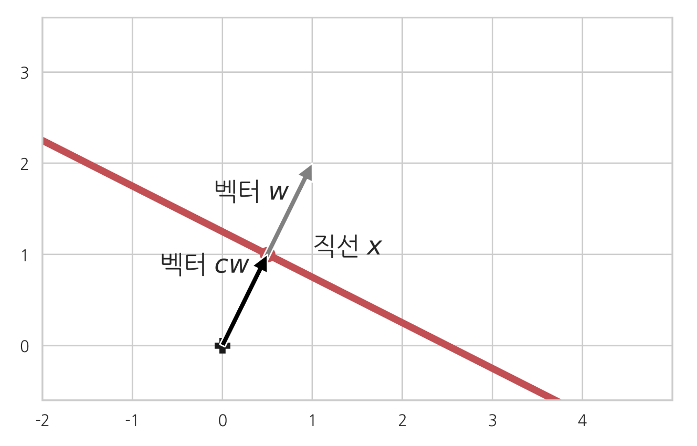

# 선형대수와 해석기하의 기초

### Summary

- 벡터의 길이는 놈으로 정의한다.
- 길이가 1인 벡터를 단위벡터라고 한다.
- 유클리드거리는 두벡터가 가리키는 점 사이의 거리이다. 벡터의 차로 길이를 구할 수 있다. $$\| a - b \|^2 = \| a \|^2 + \| b \|^2 - 2 a^T b$$
- $$cos \theta$$의 값은 $$\theta$$가 0도에 가까워질수록 1에 가까워지고 $$\theta$$가 90도에 가까워질수록 0에 가까워진다.
- 두 벡터 a와 b가 이루는 각이 90도이면 서로 직교(orthogonal)라고 하며 𝑎⊥𝑏로 표시한다. 단위벡터가 서로 직교하면 정규직교라고 한다. 
- 두 벡터의 방향이 비슷할 수록 벡터가 비슷하다고 간주하여 두 벡터 사이의 각의 코사인 값을 코사인 유사도(cosine similarity)라고 한다. 코사인 값이 1일때 코사인 유사도가 제일 크다
- 벡터 a를 다른 벡터 b에 직교하는 성분을 벡터 b에 대한 직교성분(rejection, $$a^{\perp b}$$)과 벡터 b에 평행한 성분을 벡터 b에 대한 투영성분(projection, $$a^{\Vert b}$$)이라고 한다. 

______________

### 벡터의 기하학적 의미

N차원 벡터(vector) a는 N차원의 공간상에서 벡터 a의 값으로 표시되는 점(point) 또는 원점과 벡터 a의 값으로 표시되는 점을 연결한 화살표(arrow) 이다.

예를 들어 2차원 벡터 $$a=[a_1  a_2]^T$$는 2차원 상의 공간에서 𝑥 좌표가 $$𝑎_1$$, 𝑦 좌표가 $$𝑎_2$$인 점으로 생각할 수도 있고 또는 원점에서 이 점을 가리키는 화살표로 생각할 수도 있다. 벡터를 화살표로 생각하는 경우에는 길이와 방향을 고정시킨채 **평행이동**할 수 있다.

### 벡터의 길이

벡터 a의 길이는 놈(norm) $$\| a \|$$ 으로 정의한다
$$
\| a \| = \sqrt{a^T a } = \sqrt{a_1^2 + \cdots + a_N^2}
$$

- numpy의 linalg 서브 패키지의 `norm` 명령으로 벡터의 길이를 계산할 수 있다. 위에서 예로 든 2차원 벡터 $$𝑎=[𝑎_1 𝑎_2]^T$$의 길이는 $$\sqrt{5} \approx 2.236$$이다.

~~~python
a = np.array([1, 2])
np.linalg.norm(a)
~~~

### 스칼라와 벡터의 곱

양의 실수와 벡터를 곱하면 벡터의 방향은 변하지 않고 실수의 크기만큼 벡터의 길이가 커진다. 만약 음의 실수를 곱하면 벡터의 방향이 반대가 된다.

### 단위 벡터

길이가 1인 벡터를 **단위 벡터(unit vector)** 라고 한다. 예를 들어 다음과 같은 벡터들은 모두 단위 벡터이다.

$$
a = \begin{bmatrix}1 \\ 0\end{bmatrix} ,\;\;
b = \begin{bmatrix}0 \\ 1\end{bmatrix} ,\;\;
c = \begin{bmatrix} \dfrac{1}{\sqrt{2}} \\ \dfrac{1}{\sqrt{2}} \end{bmatrix}
$$

영벡터가 아닌 임의의 벡터 x에 대해 다음 벡터는 x와 같은 방향을 가리키는 단위 벡터가 된다.

$$
\dfrac{x}{\| x \|}
$$

~~~python
a = np.array([1, 0])
b = np.array([0, 1])
c = np.array([1/np.sqrt(2), 1/np.sqrt(2)])
np.linalg.norm(a), np.linalg.norm(b), np.linalg.norm(c)
~~~

### 벡터의 합

벡터와 벡터의 합도 벡터가 된다. 이 때 **두 벡터의 합은 그 두 벡터를 이웃하는 변으로 가지는 평행사변형의 대각선 벡터**가 된다.

### 벡터의 선형조합

여러개의 벡터를 스칼라곱을 한 후 더하면 선형조합(linear combination)이 된다.

$$
c_1x_1 + c_2x_2 + \cdots + c_Nx_N
$$

이 식에서 $$𝑐_1,⋯,𝑐_𝑁$$은 스칼라 계수이다.

### 벡터의 차

벡터의 차 a - b = c 는 **벡터 b가 가리키는 점으로부터 벡터 a가 가리키는 점을 연결하는 벡터**이다.

그 이유는 벡터 b에 벡터 a - b를 더하면 즉 벡터 b와 벡터 a - b를 연결하면 벡터 a가 되어야 하기 때문이다. 
$$a - b = c $$  -> $$b + c = b + (a-b)=a$$

### Word2Vec

나중에 인공신경망 부분에서 공부하게 될 **word2vec** 방법을 이용하면 단어(word)를 공간상의 점 또는 벡터(vector)로 표현할 수 있다. word2vec으로 만들어진 벡터는 단어의 의미에 따라 다음처럼 평행사변형 관계를 가질 수도 있다.

$$
\text{woman} = \text{man} + (\text{queen} - \text{king}) 
$$

`queen - king`은 king에서 queen으로 향하는 벡터이다. 즉 의미론적으로 king에서 **왕권국가의 최고 권력자라는 의미는 남겨둔 채로 여성성을 추가하는 행위(action)**에 비유할 수 있다. 이러한 행위를 man에 대해서 적용한 결과가 `man + (queen - king)`이다. word2vec 학습 결과에서 이렇게 계산한 위치에 가장 가까이 있는 단어를 찾으면 `woman`이 나온다.

### 유클리드 거리

두 벡터가 가리키는 점 사이의 거리를 **유클리드 거리(Euclidean distance)**라고 한다. 두 벡터의 유클리드 거리는 **벡터의 차의 길이**로 구할 수 있다.

벡터의 놈의 정의와 벡터의 차의 정의에서 유클리드 거리는 다음처럼 구한다.

$$
\begin{eqnarray} 
\| a - b \|
&=& \sqrt{\sum_{i=1} (a_i - b_i)^2} \\
&=& \sqrt{\sum_{i=1} ( a_i^2 - 2 a_i b_i + b_i^2 )} \\
&=& \sqrt{\sum_{i=1} a_i^2 + \sum_{i=1} b_i^2 - 2 \sum_{i=1} a_i b_i} \\
&=& \sqrt{\| a \|^2 + \| b \|^2  - 2 a^Tb }
\end{eqnarray}
$$

즉, 

$$
\| a - b \|^2 = \| a \|^2 + \| b \|^2 - 2 a^T b
$$

### 벡터의 내적과 삼각함수

두 벡터의 내적은 다음처럼 벡터의 길이 ‖𝑎‖, ‖𝑏‖ 와 두 벡터 사이의 각도 𝜃의 코사인 함수값으로 계산할 수도 있다.

$$
a^Tb = \|a\|\|b\| \cos\theta
$$
여기에서 cos𝜃는 **코사인(cosine)**이라고 하는 함수이다. 코사인은 사인(sine)이라고 하는 함수와 함께 정의할 수 있다. 사인과 코사인을 합쳐서 삼각함수라고 한다.

사인 sin𝜃의 값은 𝜃라는 각을 가지는 직각 삼각형에서 빗변과 높이의 비율을 뜻한다. 코사인 cos𝜃의 값은 𝜃라는 각을 가지는 직각 삼각형에서 빗변과 밑변의 비율을 뜻한다.

$$
\sin\theta = \dfrac{\text{높이}}{\text{빗변}}  
$$

$$
\cos\theta = \dfrac{\text{밑변}}{\text{빗변}}  
$$

$$sin\theta$$의 값은 $$\theta$$가 0도에 가까워질수록 0에 가까워지고 $$\theta$$가 90도에 가까워질수록 1에 가까워진다.

$$
\sin 0^{\circ} = 0
$$

$$
\sin 90^{\circ} = 1
$$

$$cos \theta$$의 값은 $$\theta$$가 0에 가까워질수록 1에 가까워지고 $$\theta$$가 90도에 가까워질수록 0에 가까워진다.

$$
\cos 0^{\circ} = 1
$$

$$
\cos 90^{\circ} = 0 
$$

### 직교

두 벡터 a와 b가 이루는 각이 90도이면 서로 직교(orthogonal)라고 하며  𝑎⊥𝑏로 표시한다.

cos90∘=0이므로 서로 직교인 두 벡터의 내적은 0이된다.

$$
a^T b = b^T a = 0   \;\;\;\; \leftrightarrow \;\;\;\; a \perp b 
$$

예를 들어 다음 두 벡터는 서로 직교한다.

$$
a = \begin{bmatrix}1 \\ 1\end{bmatrix} ,\;\;
b = \begin{bmatrix}-1 \\ 1\end{bmatrix} \;\;\;\; \rightarrow \;\;\;\;
a^T b = \begin{bmatrix}1 & 1\end{bmatrix} \begin{bmatrix}-1 \\ 1\end{bmatrix} = -1 + 1 = 0
$$

~~~python
a = np.array([1, 1])
b = np.array([-1, 1])
a @ b
~~~

### 정규직교

만약 𝑁개의 단위 벡터 $$𝑣_1,𝑣_2, \dots,𝑣_𝑁$$가 서로 직교하면 **정규직교(orthonormal)**라고 한다.

$$
\|v_i\| = 1 \;\;\leftrightarrow \;\; v_i^Tv_i = 1 
$$

$$
v_i^T v_j = 0 \;\;(i \neq j)
$$

직교하는 두 𝑁차원 벡터 𝑎,𝑏에 대해 다음 식이 성립한다. 이 식은 피타고라스의 정리가 된다.

$$
\| a + b \|^2 = \| a \|^2 + \| b \|^2
$$
정규직교하는 행렬 $$V$$ 에 대해서 다음 등식이 성립한다.

- $$V^TV = I$$
- $$V^{-1} = V^T$$

### 코사인 유사도

두 벡터의 방향이 비슷할 수록 벡터가 비슷하다고 간주하여 두 벡터 사이의 각의 코사인 값을 **코사인 유사도(cosine similarity)**라고 한다. 코사인 값은 각도가 0일때 가장 커지므로 두 벡터가 같은 방향을 가리키고 있으면 코사인 유사도가 최대값 1을 가진다.

$$
\text{코사인 유사도} = \cos\theta = \dfrac{x^Ty}{\|x\|\|y\|}
$$

코사인 유사도는 나중에 공부할 **추천시스템(recommender system)**에서 사용자의 취향이 얼마나 비슷한지를 계산할 때 사용된다. 코사인 유사도를 이용하면 다음처럼 **코사인 거리(cosine distance)**도 정의할 수 있다.

$$
\text{코사인 거리} = 1 - \text{코사인 유사도} = 1 - \dfrac{x^Ty}{\|x\|\|y\|}
$$

### 벡터의 분해와 성분

어떤 두 벡터 𝑎, 𝑏의 합이 다른 벡터 𝑐가 될 때 𝑐가 두 벡터 **성분(vector component)** 𝑎, 𝑏으로 **분해(decomposition)**된다고 말한다.

### 투영성분

벡터 𝑎를 다른 벡터 𝑏에 직교하는 성분과 벡터 𝑏에 평행한 성분으로로 분해할 수 있는데, 평행한 성분을 **벡터 𝑏에 대한 투영성분(projection)**, 벡터 𝑏에 수직인 성분을 **벡터 𝑏에 대한 직교성분(rejection)**이라고 하며 각각 다음과 같이 표기한다.

$$
a^{\Vert b} 
$$

$$
a^{\perp b} 
$$

투영성분의 길이는 다음처럼 구할 수 있다.

$$
\| a^{\Vert b} \| 
= \|a\|\cos\theta 
= \dfrac{\|a\|\|b\|\cos\theta}{\|b\|}  
= \dfrac{a^Tb}{\|b\|} 
= \dfrac{b^Ta}{\|b\|}
= a^T\dfrac{b}{\|b\|} 
$$

만약 벡터 𝑏 자체가 이미 단위벡터이면 **단위벡터에 대한 투영길이는 내적**이 된다.

$$
\| a^{\Vert b} \| = a^Tb
$$

투영성분 성분 벡터는 투영성분 길이와 벡터 𝑏 방향의 단위 벡터의 곱이다.

$$
a^{\Vert b} = \dfrac{a^Tb}{\|b\|} \dfrac{b}{\|b\|}= \dfrac{a^Tb}{\|b\|^2}b
$$

직교성분 벡터는 원래의 벡터에서 투영성분 성분 벡터를 뺀 나머지이다.
$$

a^{\perp b} = a - a^{\Vert b}

$$

- 만약 𝑣가 원점을 지나는 직선의 방향을 나타내는 단위 벡터라고 하자. 이 때 그 직선위에 있지 않는 어떤 점 𝑥와 그 직선과의 거리의 제곱이 다음과 같음을 증명하라.

$$
\| x \|^2 - (x^Tv)^2 
$$

풀이)
점 x와 그 직선과의 거리는 $$||a^{\Vert b}||$$ 이다. 피타고라스 정의에 의해

$$||x^{\Vert b}|| = ||x||^2 - ||x^{\Vert b}||^2$$

이 때 평행 성분의 길이를 구하면 v가 단위벡터(||v||=1)라는 점을 이용하여 

$$\| x^{\Vert b} \| = x^Tb$$ 가 된다.

### 직선의 방정식

어떤 벡터 𝑤가 있을 때 다음 그림처럼

- 벡터 𝑤에 수직이면서
- 벡터 𝑤가 가리키는 점을 지나는

직선 𝑥의 방정식을 구해보자.

벡터 𝑥가 해당 직선의 점이라고 할 때, 위의 두 조건을 만족하려면 벡터 𝑥가 가리키는 점과 벡터 𝑤가 가리키는 점을 이은 벡터 𝑥−𝑤가 벡터 𝑤와 직교해야 한다. 따라서 다음 식이 성립한다.

$$
w^T(x - w) = 0 \\
w^T(x - w) = w^Tx - w^Tw = w^Tx - \| w \|^2
$$

$$
w^Tx - \| w \|^2 = 0
$$

이 직선과 원점 사이의 거리는 벡터 𝑤의 놈 ‖𝑤‖이다.

$$
\text{직선과 원점 사이의 거리} = \|w\|
$$

이번에는 벡터 𝑤가 가리키는 점을 지나야 한다는 조건을 없애고

- 벡터 𝑤에 수직인

직선 𝑥의 방정식을 구해보자.

이 때는 직선이 𝑤가 아니라 𝑤와 방향이 같고 길이가 다른 벡터 𝑤′=𝑐𝑤을 지날 것이다. 𝑐는 양의 실수이다.

위에서 했던 방법으로 다시 직선의 방정식을 구하면 다음과 같다.

$$
w'^Tx - \| w' \|^2 =  cw^Tx - c^2 \| w \|^2 = 0
$$

$$
w^Tx - c \| w \|^2 = 0 
$$

여기에서 $$𝑐‖𝑤‖^2$$는 임의의 수가 될 수 있으므로 단순히 벡터 $$w$$에 수직인 직선의 방정식은 다음과 같이 나타낼 수 있다.

$$
w^Tx - w_0 = 0
$$

이 직선과 원점사이의 거리는 다음과 같다.

$$
\text{직선과 원점 사이의 거리} = c \| w \| = \dfrac{w_0}{\|w\|} 
$$

### 직선과 점의 거리

이번에는 직선 $$𝑤^𝑇𝑥−‖𝑤‖^2=0$$과 이 직선 위에 있지 않은 점 $$x'$$사이의 거리를 구해보자.

벡터 𝑤에 대한 벡터 $$x'$$의 투영성분 $$x'^{\Vert w}$$의 길이는 다음과 같다.

$$
\|x'^{\Vert w}\| = \dfrac{w^Tx'}{\|w\|}
$$

직선과 점 $$x'$$사이의 거리는 이 길이에서 원점에서 직선까지의 거리 ‖𝑤‖를 뺀 값의 절대값이다

여기서 절대값인 이유는 x'의 위치가 직선 안쪽에도 있을 수 있기 때문이다.

$$
\left|  \|x'^{\Vert w}\| - \|w\| \right| = 
\left| \dfrac{w^Tx'}{\|w\|} - \|w\| \right| =
\dfrac{\left|w^Tx' - \|w\|^2 \right|}{\|w\|}
$$

직선의 방정식이 $$𝑤^𝑇𝑥−𝑤_0=0$$이면 직선과 점의 거리는 다음과 같다.

$$
\dfrac{\left|w^Tx' - w_0 \right|}{\|w\|}
$$

이 공식은 나중에 분류 방법의 하나인 **서포트 벡터 머신(SVM: Support Vector Machine)**에서 사용된다.

___________________________________
###### Reference
김도형 박사님 강의를 수강하며 데이터사이언티스트스쿨(https://datascienceschool.net/) 강의자료를 토대로 공부하며 정리한 내용임을 말씀드립니다. 