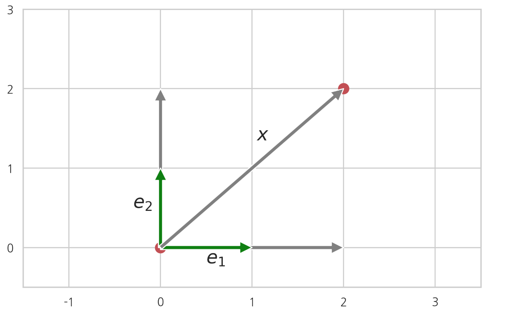

# 좌표와 변환

### Summary

- 정방행렬이 풀랭크이면 역행렬이 존재한다. 역도 성립한다. 
- 벡터 N개가 서로 선형독립일 경우, 이 벡터들을 선형조합하여 만들어지는 모든 벡터의 집합은 벡터공간(vector space)이고, 이 벡터들을 벡터공간의 기저벡터(basis vector)라고 한다.
    - 이 때 모든 N차원 벡터 x에 대해 기저벡터 $$v_1,v_2, \dots, v_M$$를 선형조합하여 만든 벡터 $$x^{\Vert v}$$와 원래 벡터 x의 차 $$x - x^{\Vert v}$$가 모든 기저벡터에 직교하면 그 벡터 $$ x^{\Vert v}$$를 $$v_1,v_2,⋯,v_M$$ 벡터공간에 대한 투영벡터라 하고 차이 벡터 $$x - x^{\Vert v} = x^{\perp v}$$를 벡터공간에 대한 직교벡터라 한다.
- 좌표(coordinate)는 기저벡터를 선형조합하여 그 벡터를 나타내기 위한 계수벡터를 말한다.
________________

### 선형종속과 선형독립

벡터 $$𝑥_1,𝑥_2,…,𝑥_𝑁$$들의 선형조합이 영벡터가 되도록 하는 스칼라 계수 $$𝑐_1,𝑐_2,…,𝑐_𝑁$$가 존재하면 이 벡터들이 **선형종속(linearly dependent)**이라고 한다. 단 $$𝑐_1=𝑐_2=⋯=𝑐_𝑁=0$$으로 계수가 모두 0인 경우는 제외한다.

$$
c_1 x_1 + c_2 x_2 + \cdots + c_N x_N = 0 
$$

벡터들의 선형조합이 0이 되면서 모두 0은 아닌 계수들이 존재하지 않으면 그 벡터들은 **선형독립(linearly independent)**이라고 한다. 즉 **"벡터 $$𝑥_1,𝑥_2,…,𝑥_𝑁$$들의 선형조합이 영벡터이면 반드시 모든 계수가 모두 0일 수 밖에 없는 경우"**를 선형독립이라고 한다. 선형독립인 상태를 논리 기호로 나타내면 다음과 같다

$$
c_1 x_1 + \cdots + c_N x_N = 0  \;\;\;\; \leftrightarrow \;\;\;\; c_1 = \cdots = c_N = 0  
$$

벡터들의 선형조합이 0이면 반드시 계수들이 모두 0이라는 뜻이다. 반대방향을 보면 모든 계수가 0일 때 선형조합이 0이 되는 것은 당연하므로 역도 성립한다.

예를 들어 다음 벡터 $$𝑥_1,𝑥_2$$는 선형독립이다.

$$
x_1 = \begin{bmatrix} 1 \\ 2 \end{bmatrix}, \;\;
x_2 = \begin{bmatrix} 3 \\ 3 \end{bmatrix}
$$

벡터 $$𝑥_1$$은 두 원소의 크기가 다른데, 벡터 $$𝑥_2$$은 두 원소의 크기가 같기 때문에 어떤 계수를 사용해도 $$𝑐_1𝑥_1+𝑐_2𝑥_2=0$$을 만들 수 없다.

다음 벡터 $$𝑥_1,𝑥_2,𝑥_3$$는 선형종속이다.
$$
x_1 = \begin{bmatrix} 1 \\ 2 \end{bmatrix}, \;\;
x_2 = \begin{bmatrix} 3 \\ 3 \end{bmatrix}, \;\;
x_3 = \begin{bmatrix} 5 \\ 7 \end{bmatrix}
$$

이는 다음과 같은 식으로 증명할 수 있다

$$
2x_1  + x_2 - x_3 = 0
$$

~~~python
import numpy as np

x1 = np.array([1, 2])
x2 = np.array([3, 3])
x3 = np.array([10, 14])
2 * x1 + x2 - 0.5 * x3
~~~

### 선형독립과 선형연립방정식

벡터의 선형조합은 다음과 같이 두 벡터의 내적으로 표기할 수도 있다. 이 식에서 $$𝑐_𝑖$$는 가중치 계수이고 𝑐는 가중치 벡터이며, 𝑋는 열벡터 $$𝑥_𝑖$$를 합쳐서(concatenate) 만든 행렬이다.

$$
c_1 x_1 + \cdots + c_N x_N =
\begin{bmatrix} x_1 & x_2 & \cdots & x_N \end{bmatrix} 
\begin{bmatrix} c_1 \\ c_2 \\ \vdots \\ c_N \end{bmatrix}
= X c
$$
어떤 벡터들이 선형독립인지 아닌지를 알아내는 문제는 선형 연립방정식을 푸는 문제와 같다.
$$
Xc=0 
$$

**𝑋행렬의 역행렬이 존재하면 0벡터가 유일한 해가 되어 모든 계수가 0일 수 밖에 없기 때문에 선형독립**이다.

$$
c = X^{-1}0 = 0
$$

|선형종속일 경우|
1. **행렬 𝑋의 행의 개수보다 열의 개수가 많으면** 미지수의 수가 방정식의 수보다 커서 해가 무한히 많기 때문에 영벡터가 아닌 해 𝑐도 존재한다. 따라서 **선형종속**이다. 반대로 행의 개수가 열의 개수와 같거나 크면 대부분 선형독립이다. 우리가 분석할 대부분의 데이터는 데이터(행)의 수가 특징(열)의 수보다 많기 때문에 여기에 해당한다. 

2. 같은 열이 중복되거나 어떤 열이 다른 열의 값으로 계산된다면 선형종속일 수도 있다. 

3. 어떤 벡터가 다른 벡터의 선형조합이면 반드시 선형종속이다. 이러한 경우를 **다중공선성(multicollinearity)**이라고 부른다. 

### 랭크

행렬의 열벡터 중 서로 독립인 열벡터의 최대 개수를 **열랭크(column rank)**라고 하고 행벡터 중 서로 독립인 행벡터의 최대 개수를 **행랭크(row rank)**라고 한다. 행렬 𝐴의 랭크는 rank𝐴와 같이 표시한다.

예를 들어 다음 행렬 $$𝑋_1$$의 두 열벡터는 선형독립이기 때문에 열랭크는 2이다.

$$
X_1 = \begin{bmatrix} 1 & 3 \\ 2 & 3 \end{bmatrix}
$$
다음 행렬 $$𝑋_2$$의 세 열벡터는 선형종속이므로 열랭크는 3보다 작아야 한다. 그런데 위에서 설명한 것처럼 이 열벡터 중 앞의 두개는 서로 독립이므로 $$𝑋_2$$의 랭크는 2이다.
$$
X_2 = \begin{bmatrix} 1 & 3 & 5 \\ 2 & 3 & 7 \end{bmatrix}
$$

행랭크와 열랭크에 대해서는 다음 성질이 성립한다.

**행랭크와 열랭크는 항상 같다.**

따라서 행 랭크나 열 랭크를 그냥 **랭크(rank)**라고 하기도 한다. 행랭크는 행의 개수보다 커질 수 없고 열랭크는 열의 개수보다 커질 수 없기 때문에 **행의 개수가 𝑁이고 열의 갯수가 𝑀인 행렬의 랭크는 행의 개수 𝑁과 열의 개수 𝑀 중 작은 값보다 커질 수 없다.**

$$
\text{rank}A \leq \min(M, N)
$$

위에서 예로 든 행렬 $$𝑋_1$$나 $$𝑋_2$$처럼 랭크가 행의 개수와 열의 개수 중 작은 값과 같으면 **풀랭크(full rank)**라고 한다.

$$
\text{rank}A = \min(M, N)
$$

numpy의 linalg 서브 패키지의 `matrix_rank` 명령으로 랭크를 계산할 수 있다.

~~~python
A = np.array([[1, 5, 6], [2, 6, 8], [3, 11, 14], [1, 4, 5]])
np.linalg.matrix_rank(A)
~~~

~~~python
B = np.array([[1, 5, 6], [2, 6, 8], [3, 11, 14], [1, 4, 8]])
np.linalg.matrix_rank(B)
~~~

### 랭크와 역행렬

**정방행렬이 풀랭크면 역행렬이 존재한다. 역도 성립한다. 즉, 정방행렬의 역행렬이 존재하면 풀랭크**이다.

**정방행렬이 풀랭크이다** ↔ **역행렬이 존재한다**

정방행렬이 풀랭크라는 것은 그 행렬의 열벡터 $$𝑥_1,⋯,𝑥_𝑁$$을 선형조합하는 가중치$$ 𝑐_1,⋯,𝑐_𝑁$$가 영 벡터가 아니고서는 선형조합이 0이 될 수 없다는 뜻이다. 따라서 다음과 같이 쓸 수 있다.

$$
Xc = 0 \; \leftrightarrow \; c=0
$$

즉, 𝑋𝑐=0이면 𝑐=0이고 역으로 𝑐=0이면 𝑋𝑐=0이다. 이렇게 되는 경우는 𝑋가 역행렬이 존재하는 경우밖에 없다.

반대로 역행렬 $$𝑋^{−1}$$이 존재하면 위 식의 양변에 역행렬을 곱해서 𝑐=0이 된다는 것을 보일 수 있다.

$$
\text{좌변} = X^{-1}Xc = c
$$

$$
\text{우변} = X^{-1}0 = 0
$$

$$
c = 0
$$

𝑐=0이면 항상 𝑋𝑐=0이므로 반대의 경우는 쉽게 증명할 수 있다.

### 예측모형 특징행렬의 랭크

예측모형을 만들기 위해 독립 변수(입력 변수)의 특징행렬 데이터를 수집하였는데 다음과 같은 경우가 발생하면 풀랭크가 아니다.

(1) 특징행렬에 중복된 데이터가 있다.
$$
\begin{bmatrix} 1 & 5 & 6 \\ 2 & 6 & 8 \\ 2 & 6 & 8 \end{bmatrix}
$$
(2) 어떤 열은 다른 열들의 선형조합이다. 예를 들어 어떤 특징은 다른 특징들의 가중합이다.
$$
\begin{bmatrix} 3 & 1 & 5 & 7 \\ 3 & 2 & 6 & 10 \\ 1& 3 & 11 & 17\\ 9 & 1 & 4 & 6 \end{bmatrix}
$$

위와 같은 특징 데이터 집합은 데이터분석에 나쁜 영향을 미친다. 

### 로우-랭크 행렬

𝑁차원 벡터 𝑥 하나를 이용하여 만들어지는 다음과 같은 행렬을 **랭크-1 행렬(rank-1 matrix)**이라고 한다.

$$
xx^T \in \mathbf{R}^{N \times N}
$$

이 행렬의 열벡터들은 𝑥라고 하는 하나의 벡터를 $$𝑥_1배, 𝑥_2배, ...$$ 한 벡터이므로 독립적인 열벡터는 1개이다. 따라서 **랭크-1 행렬의 랭크는 1**이다.

$$
\begin{eqnarray}
xx^T 
&=& x \begin{bmatrix} x_1 & x_2 & \cdots & x_n \end{bmatrix} \\
&=& \begin{bmatrix} x_1x & x_2x & \cdots & x_nx \end{bmatrix} 
\end{eqnarray}
$$

선형독립인 두개의 𝑁차원 벡터 $$𝑥_1,𝑥_2$$를 이용하여 만든 다음과 같은 행렬은 **랭크-2 행렬(rank-2 matrix)**이라고 한다. **부분행렬** 생각.

$$
\begin{bmatrix} x_1 & x_2 \end{bmatrix}
\begin{bmatrix} x_1^T \\ x_2^T \end{bmatrix}
= x_1x_1^T + x_2x_2^T
$$
______
부분행렬 : 앞에 곱해지는 행렬을 열벡터로, 뒤에 곱해지는 행렬을 행벡터로 나누어 스칼라처럼 계산해도 된다.

$$
AB 
=
\begin{bmatrix}
a_1 & a_2
\end{bmatrix}
\begin{bmatrix}
b_1^T \\ b_2^T
\end{bmatrix}
=
a_1b_1^T + a_2b_2^T
$$

벡터의 크기를 직사각형으로 표시하면 다음과 같다.

$$
AB 
=
\begin{bmatrix}
\boxed{\,a_1\!\phantom{\dfrac{\raise 0.7em \mathstrut}{\lower 0.7em \mathstrut}}} \!\!\!\!& 
\boxed{\,a_2\!\phantom{\dfrac{\raise 0.7em \mathstrut}{\lower 0.7em \mathstrut}}} \!
\end{bmatrix}
\begin{bmatrix}
\boxed{\;\;\;\; b_1^T \lower 0.3em \mathstrut \;\;\;\;} \\ 
\boxed{\;\;\;\; b_2^T \lower 0.3em \mathstrut \;\;\;\;} \\ 
\end{bmatrix}
=
\boxed{\,a_1\!\phantom{\dfrac{\raise 0.7em \mathstrut}{\lower 0.7em \mathstrut}}}
\boxed{\;\;\;\; b_1^T \lower 0.3em \mathstrut \;\;\;\;}
+
\boxed{\,a_2\!\phantom{\dfrac{\raise 0.7em \mathstrut}{\lower 0.7em \mathstrut}}}
\boxed{\;\;\;\; b_2^T \lower 0.3em \mathstrut \;\;\;\;}
$$
__________

앞에서와 비슷한 방법으로 **랭크-2 행렬의 랭크는 2**임을 보일 수 있다.

만약 𝑀개의 𝑁차원 벡터 $$𝑥_1,𝑥_2,⋯,𝑥_𝑀$$을 이용하면 **랭크-M 행렬(rank-M matrix)**이 된다.

$$
\begin{bmatrix} x_1 & x_2 & \cdots & x_M \end{bmatrix}
\begin{bmatrix} x_1^T \\ x_2^T \\ \vdots \\ x_M^T \end{bmatrix}
= x_1x_1^T + x_2x_2^T + \cdots + x_Mx_M^T
= \sum_{i=1}^M x_ix_i^T
$$

이러한 행렬들을 가리켜 **로우-랭크 행렬(low-rank matrix)**이라고 한다. 로우-랭크 행렬은 특이분해(singular value decomposition)와 PCA(principal component analysis)에서 사용된다.

### 벡터공간과 기저벡터

여러개의 벡터를 선형조합을 하면 다른 벡터를 만들 수 있다. **벡터 N개가 서로 선형독립**일 경우, 이 벡터들을 선형조합하여 만들어지는 모든 벡터의 집합을 **벡터공간(vector space)**이라고 한다. 이 벡터들을 벡터공간의 **기저벡터(basis vector)** 라고 한다.

$$
V = \{ c_1x_1 + \cdots + c_Nx_N \; \vert \; c_1, \ldots, c_N \in \mathbf{R} \}
$$
벡터공간의 차원(dimension)이 벡터의 차원(길이)가 아니라 **기저벡터의 개수**로 정의된다는 점에 유의해야 한다.

**만약 𝑁차원 벡터 𝑁개 $$𝑥_1,𝑥_2,⋯,𝑥_𝑁$$이 선형독립이어서 기저벡터를 이룬다면 이 기저벡터를 선형조합하여 모든 𝑁차원 벡터를 만들 수 있다.**

임의의 벡터 𝑥가 있다고 하자. 기저벡터 $$𝑥_1,𝑥_2,⋯,𝑥_𝑁$$와 이 벡터 𝑥를 열벡터로 사용하여 만든 행렬
$$
X = \left[ x_1, x_2, \cdots, x_N, x \right]
$$
는 크기가 𝑁×(𝑁+1)이므로 랭크값은 𝑁보다 커질 수는 없다. 그런데 𝑁개의 선형독립인 열벡터가 있기 때문에 랭크값은 𝑁이고 풀랭크이다. 따라서 어떠한 𝑁차원 벡터를 생각하더라도 기저벡터의 조합으로 표현할 수 있다.

예를 들어 다음 벡터의 집합은 선형독립이므로 2차원 벡터공간의 기저벡터이다.

$$
x_1 = \begin{bmatrix} 1 \\ 2 \end{bmatrix}, \;\;
x_2 = \begin{bmatrix} 2 \\ 1 \end{bmatrix}
$$

따라서 이 기저벡터 $${𝑥_1,𝑥_2}$$를 선형조합하면 어떠한 2차원 벡터도 만들 수 있다.

하지만 다음 벡터의 집합은 선형독립이 아니므로 벡터공간의 기저벡터라고 하지 않는다.

$$
x_1 = \begin{bmatrix} 1 \\ 2 \end{bmatrix}, \;\;
x_2 = \begin{bmatrix} 2 \\ 1 \end{bmatrix}, \;\;
x_3 = \begin{bmatrix} 5 \\ 7 \end{bmatrix}
$$

다음 벡터의 집합은 선형독립이므로 벡터공간의 기저벡터이다. 하지만 이 벡터공간은 3차원 벡터공간이 아니라 2차원 벡터공간이다.

$$
x_1 = \begin{bmatrix} 1 \\ 2 \\ 0 \end{bmatrix}, \;\;
x_2 = \begin{bmatrix} 2 \\ 1 \\ 0 \end{bmatrix}
$$

예를 들어 이 벡터 $$𝑥_1,𝑥_2$$를 어떻게 선형조합해도 다음 벡터는 만들 수 없다.

$$
c_1x_1 + c_2x_2 = 
\begin{bmatrix} 0 \\ 0 \\ 1 \end{bmatrix}
$$

벡터공간의 차원을 기저벡터의 차원과 다르게 정의하는 이유는 선형독립인 기저벡터를 선형조합했을 때 이렇게 만들어낼 수 없는 벡터들이 존재하기 때문이다.

### 벡터공간 투영

𝑀개의 𝑁차원 기저벡터 $$𝑣_1,𝑣_2,⋯,𝑣_𝑀$$ 가 존재한다고 하자. 𝑀은 𝑁보다 작다.

이 때 모든 𝑁차원 벡터 𝑥에 대해 기저벡터 $$𝑣_1,𝑣_2,⋯,𝑣_𝑀$$를 선형조합하여 만든 벡터 $$x^{\Vert v}$$와 원래 벡터 𝑥의 차 $$x - x^{\Vert v}$$가 모든 기저벡터에 직교하면 그 벡터 $$ x^{\Vert v}$$를 

$$𝑣_1,𝑣_2,⋯,𝑣_𝑀$$ **벡터공간에 대한 투영벡터**라 하고 차이 벡터 $$x - x^{\Vert v} = x^{\perp v}$$를 **벡터공간에 대한 직교벡터**라 한다.

$$
(x - x^{\Vert v}) \perp \{ v_1, v_2, \cdots, v_M \}
$$

다음 그림은 𝑁=3,𝑀=2 즉 3차원 벡터를 2차원 벡터공간에 투영하는 예를 보인 것이다.

**3차원 벡터를 2차원 벡터공간에 투영하는 예**

만약 기저벡터 $$𝑣_1,𝑣_2,⋯,𝑣_𝑀$$가 정규직교(orthonormal)이면 투영벡터 $$ x^{\Vert v}$$는 각 기저벡터에 대한 내적값으로 표현된다.
$$
x^{\Vert v} = (x^Tv_1)v_1 + (x^Tv_2)v_2 + \cdots + (x^Tv_M)v_M
$$

----

정규직교

만약 𝑁개의 단위 벡터 $$𝑣_1,𝑣_2,⋯,𝑣_𝑁$$가 서로 직교하면 **정규직교(orthonormal)**라고 한다.
$$
\|v_i\| = 1 \;\;\leftrightarrow \;\; v_i^Tv_i = 1 
$$

$$
v_i^T v_j = 0 \;\;(i \neq j) 
$$

직교하는 두 벡터 a, b에 대해 다음 식이 성립한다.(피타고라스의 정리)
$$
\| a + b \|^2 = \| a \|^2 + \| b \|^2
$$

------

그리고 투영벡터 길이의 제곱은 각 기저벡터와의 내적의 제곱합이다
$$
\Vert x^{\Vert v} \Vert^2 = \sum_{i=1}^M (x^Tv_i)^2
$$
벡터 𝑥에서 이 벡터 $$x^{\Vert v}$$를 뺀 벡터 $$x - x^{\Vert v}$$, 즉 직교벡터 $$x^{\perp v}$$가 기저벡터 $$𝑣_1,𝑣_2,⋯,𝑣_𝑀$$에 모두 직교한다는 것은 다음처럼 증명할 수 있다.
$$
\begin{eqnarray}
v_i^T(x - x^{\Vert v})
&=& 
v_i^Tx -
v_i^T \left( (x^Tv_1)v_1 + (x^Tv_2)v_2 + \cdots + (x^Tv_M)v_M  \right) \\
&=&
v_i^Tx - \left( (x^Tv_1)v_i^Tv_1 + (x^Tv_2)v_i^Tv_2 + \cdots + (x^Tv_M)v_i^Tv_M \right) \\
&=&
v_i^Tx - x^Tv_i \\
&=& 0
\end{eqnarray}
$$
따라서 **직교벡터 $$x^{\perp v}$$는 기저벡터 $$𝑣_1,𝑣_2,⋯,𝑣_𝑀$$으로 이루어진 벡터공간의 모든 벡터에 대해 직교한다**.

이 사실로부터 **벡터 𝑥의 프로젝션 $$x^{\Vert v}$$은 기저벡터 $$𝑣_1,𝑣_2,⋯,𝑣_𝑀$$으로 이루어진 벡터공간의 모든 벡터 중에서 가장 벡터 𝑥와 가까운 벡터**라는 것도 알 수 있다. ->수직인 거리 길이가 가장 짧으니까

기저벡터 $$𝑣_1,𝑣_2,⋯,𝑣_𝑀$$으로 이루어진 벡터공간의 어떤 벡터를 𝑦라고 하자. 그러면 $$x^{\Vert v}$$와 𝑦의 차이 벡터 $$x^{\Vert v} - y$$도 $$𝑣_1,𝑣_2,⋯,𝑣_𝑀$$으로 이루어진 벡터공간에 존재하므로 직교벡터 $$x^{\perp v}$$와 직교한다.
$$
\begin{eqnarray}
\Vert x - y \Vert^2 
&=& \Vert x - x^{\Vert v} + (x^{\Vert v} - y) \Vert^2 \\
&=& \Vert x^{\perp v} + (x^{\Vert v} - y) \Vert^2 \\
&=& \Vert x^{\perp v} \Vert^2 + \Vert (x^{\Vert v} - y) \Vert^2 \\
&\geq& \Vert x^{\perp v} \Vert^2
\end{eqnarray}
$$

### 표준기저벡터

기저벡터 중에서도 원소 중 하나만 값이 1이고 다른 값은 0으로 이루어진 다음과 같은 기저벡터를 **표준기저벡터**(standard basis vector)라고 한다.
$$
e_1 = \begin{bmatrix} 1 \\ 0 \\ \vdots \\ 0 \end{bmatrix}, \;\;
e_2 = \begin{bmatrix} 0 \\ 1 \\ \vdots \\ 0 \end{bmatrix}, \;\; 
\cdots,  \;\;
e_N = \begin{bmatrix} 0 \\ 0 \\ \vdots \\ 1 \end{bmatrix}
$$

### 좌표

어떤 벡터의 **좌표(coordinate)**는 기저벡터를 선형조합하여 그 벡터를 나타내기 위한 계수벡터를 말한다.
벡터를 나타내기 위해 1.기저벡터를 알고 2. 좌표를 나타낸다.

예를 들어 다음처럼 기저벡터 $${e_1,e_2}$$를 선형조합하여 벡터 x를 나타낼 수 있다고 가정하자.

$$
x = x_{e1} e_1 + x_{e2} e_2
$$

이 때 벡터 $$x_e$$(스칼라)

$$
x_e = \begin{bmatrix} x_{e1} \\ x_{e2} \end{bmatrix}
$$

를 벡터 x의 기저벡터 $$e_1, e_2}$$(이미 알고 있음, 벡터)에 대한 **좌표(coordinate)**라고 한다. 벡터와 기저벡터 그리고 좌표의 관계는 다음과 같다.

$$
x = [ e_1 e_2 ] \begin{bmatrix} x_{e1} \\ x_{e2} \end{bmatrix} = [ e_1 e_2 ] \; x_e
$$

표준기저벡터에 대한 벡터의 좌표는 원래 벡터와 같다. 예를 들어 다음 벡터 𝑥의 좌표는 표준기저벡터로 나타내면 원래의 벡터와 같다.

$$
x_e = \begin{bmatrix} 2 \\ 2 \end{bmatrix}
$$

하지만 같은 벡터라도 다른 기저벡터를 사용하면 좌표가 달라진다. 따라서 하나의 벡터도 기저벡터에 따라 여러가지 좌표를 가질 수 있다.

다음 기저벡터 $${𝑔_1,𝑔_2}$$를 사용하면,
$$
g_1 = \begin{bmatrix} 1 \\ 0 \end{bmatrix}, \; g_2 = \begin{bmatrix} -1 \\ 1 \end{bmatrix}
$$
위에 예로 든 벡터 𝑥는 기저벡터 $${𝑔_1,𝑔_2}$$를 다음처럼 선형조합하여 표현할 수 있다
$$
x = 4 g_1 + 2 g_2
$$

### 변환행렬

원래의 기저벡터가 아닌 새로운 기저벡터가 있다고 하자. 이 새로운 기저벡터들의 기존 기저벡터에 대한 좌표를 열벡터로 보고 이를 행렬로 묶은 행렬 𝐴를 생각하자.

예를 들어, 기존의 기저벡터가 $${𝑒_1, 𝑒_2}$$ 이고 새로운 기저벡터 $${g_1, g_2}$$ 간에 다음과 같은 관계가 성립한다면,

$$
\begin{eqnarray}
g_1 &=&  \dfrac{1}{\sqrt{2}} e_1 + \dfrac{1}{\sqrt{2}} e_2 \\
g_2 &=& -\dfrac{1}{\sqrt{2}} e_1 + \dfrac{1}{\sqrt{2}} e_2
\end{eqnarray}
$$

$$𝑒_1$$에 대한 $$𝑔_1$$의 좌표 벡터는 다음처럼 열벡터로 나타낼 수 있다.

$$
g_{1e} = 
\begin{bmatrix} 
\dfrac{1}{\sqrt{2}} \\ \dfrac{1}{\sqrt{2}} 
\end{bmatrix}, \;\;
g_{2e} = 
\begin{bmatrix} 
-\dfrac{1}{\sqrt{2}} \\ \dfrac{1}{\sqrt{2}} 
\end{bmatrix}
$$

두 좌표벡터들을 합쳐서 행렬로 표시하면 다음과 같다.

$$
\begin{bmatrix} g_1 & g_2 \end{bmatrix}= \begin{bmatrix} e_1 & e_2 \end{bmatrix} \begin{bmatrix} g_{1e} & g_{2e} \end{bmatrix}= \begin{bmatrix} e_1 & e_2 \end{bmatrix} A
$$

$$
A =
\begin{bmatrix} 
\dfrac{1}{\sqrt{2}} & -\dfrac{1}{\sqrt{2}} \\
\dfrac{1}{\sqrt{2}} & \dfrac{1}{\sqrt{2}} 
\end{bmatrix}
$$

### 좌표변환

새로운 기저벡터에 대해 좌표를 계산하는 것을 **좌표변환(coordinate transform)**이라고 한다.

2차원의 경우를 예로 들어보자. 벡터 𝑥의 기저벡터 $${𝑒_1,𝑒_2}$$에 대한 좌표 $$𝑥_𝑒$$를 새로운 기저벡터 $${𝑔_1,𝑔_2}$$에 대한 좌표 $$𝑥_𝑔$$로 변환하고자 한다.

새로운 기저벡터에 대한 좌표 값이 가리키는 실제 위치는 원래의 벡터가 가리키는 실제 위치와 같아야 되므로

$$
x = x_{e1}e_1 + x_{e2}e_2 = x_{g1} g_1 + x_{g2} g_2  
$$

$$
x 
= \begin{bmatrix} e_1 & e_2 \end{bmatrix} x_e 
= \begin{bmatrix} g_1 & g_2 \end{bmatrix} x_g 
$$

이 식에

$$
\begin{bmatrix} g_1 & g_2 \end{bmatrix}
= \begin{bmatrix} e_1 & e_2 \end{bmatrix} A
$$

를 대입하면

$$
x 
= \begin{bmatrix} e_1 & e_2 \end{bmatrix} x_e 
= \begin{bmatrix} e_1 & e_2 \end{bmatrix} A x_g
$$
이 된다. 이 식으로부터 다음 식이 성립한다.
$$
x_e = A x_g 
$$

$$
x_g = A^{-1}x_e = Tx_e
$$

이 때 𝐴의 역행렬 𝑇=$$𝐴^{−1}$$을 **변환행렬(transform matrix)**이라고 한다.

예를 들어 벡터 𝑥의 표준기저벡터에 대한 좌표가 다음과 같다고 하자.

$$
x = 2 e_1 + 2 e_2= \begin{bmatrix}2 \\ 2\end{bmatrix} = x_e
$$

표준기저벡터에 대한 새로운 기저벡터의 좌표가 다음과 같다면

$$
g_{1e} = \begin{bmatrix} \dfrac{1}{\sqrt{2}} \\ \dfrac{1}{\sqrt{2}} \end{bmatrix} ,\;\;
g_{2e} = \begin{bmatrix} -\dfrac{1}{\sqrt{2}} \\ \dfrac{1}{\sqrt{2}} \end{bmatrix}
$$

새로운 기저벡터에 대한 벡터 𝑎의 좌표는 위의 공식을 이용하여 다음처럼 계산할 수 있다.

$$
x_g = A^{-1}x_e = 
\begin{bmatrix} 
\dfrac{1}{\sqrt{2}} & -\dfrac{1}{\sqrt{2}} \\
\dfrac{1}{\sqrt{2}} &  \dfrac{1}{\sqrt{2}} 
\end{bmatrix}^{-1}
\begin{bmatrix}2 \\ 2\end{bmatrix}
=
\begin{bmatrix} 
\dfrac{1}{\sqrt{2}} & \dfrac{1}{\sqrt{2}} \\
-\dfrac{1}{\sqrt{2}} & \dfrac{1}{\sqrt{2}} 
\end{bmatrix}
\begin{bmatrix}2 \\ 2\end{bmatrix} 
= \begin{bmatrix}2\sqrt{2}\\0\end{bmatrix}
$$

### 이미지 변환

새로운 기저벡터에 대한 좌표변환을 응용하면 이미지를 자유롭게 변환할 수도 있다. 파이썬에서는 scipy.ndimage 패키지의 `affine_transform` 명령을 사용한다. 이 명령은 이미지를 이루는 픽셀을 새로운 좌표로 이동시킨다. 인수로는 이미지 데이터와 **변환행렬의 역행렬(위에서 𝐴로 표시한 행렬)**을 받는다. 단 파이썬 이미지에서는 다음과 같은 표준기저벡터를 사용하고($$𝑥_1$$이 세로축, $$𝑥_2$$가 가로축) 원점이 왼쪽 상단의 점이라는 점에 유의한다.

