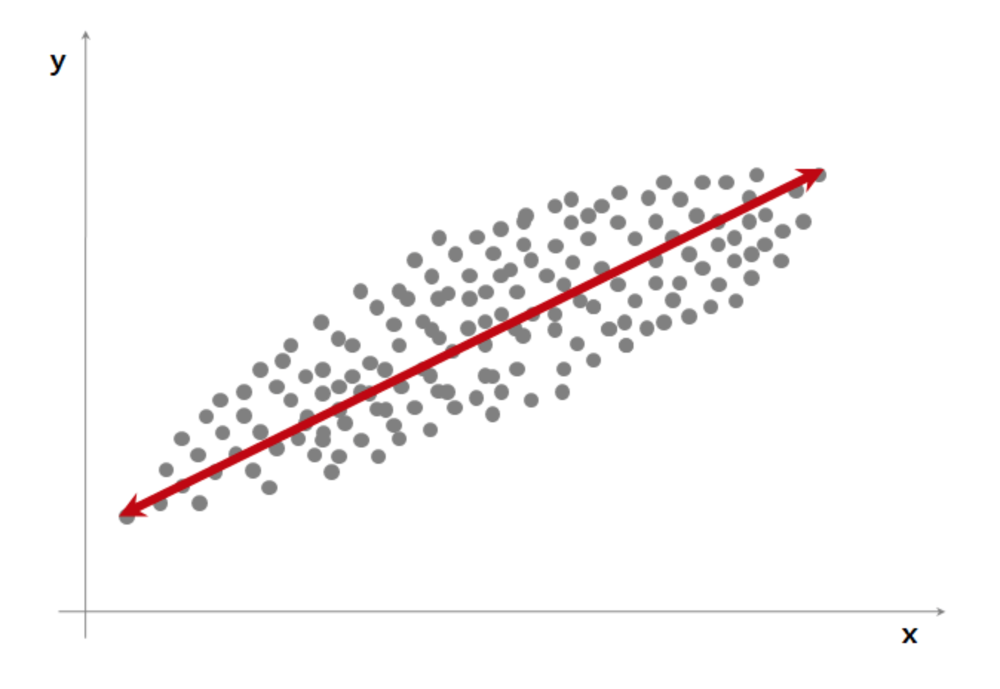

# PCA

### Summary

- PCA는 주성분 분석이라고 하며 고차원의 데이터 집합이 주어졌을 때 원래의 고차원 데이터와 가장 비슷하면서 더 낮은 차원의 데이터를 찾아내는 방법이다.
- 주성분 추출 방법 데이터에서 분산이 가장 크게 되는 축을 제 1주성분이라고 한다. 그 다음으로 분산이 큰 축은 제 1주성분과 직교하는 선이고 이 축이 제 2주성분이 된다. 이런 식으로 변수의 주 성분을 뽑게 된다. 
- 공분산행렬의 주요벡터는 최대 분산의 방향이 된다. (고유값이 큰 값과 매칭되는 고유벡터는 분산이 큰 방향이다.) 후속 고유벡터는 이전에 계산한 것과 직교를 이룬다는 제약하에 계산할 수 있다. 공분산의 교유벡터 세트는 새로운 feature 세트에 대응한다. 

- 𝑁개의 𝑀차원 데이터가 있으면 보통 그 데이터들은 서로 다른 값을 가진다. 하지만 이러한 데이터들 간의 변이(variation)는 무작위가 아니라 특정한 규칙에 의해 만들어지는 경우가 있다. 이러한 데이터간의 변이 규칙을 찾아낼 때 PCA를 이용할 수 있다.

- PCA(Principal Component Analysis)는 주성분 분석이라고도 하며 고차원의 데이터 집합이 주어졌을 때 원래의 고차원 데이터와 가장 비슷하면서 더 낮은 차원의 데이터를 찾아내는 방법이다. 차원축소(dimension reduction)라고도 한다.

- 바로 측정되지는 않지만 측정된 데이터의 기저에 숨어서 측정 데이터를 결정짓는 데이터**를 **잠재변수(latent variable)이라고 부른다. PCA에서는 잠재변수와 측정 데이터가 선형적인 관계로 연결되어 있다고 가정한다. 즉, 𝑖번째 표본의 측정 데이터 벡터 $$𝑥_𝑖$$의 각 원소를 선형조합하면 그 뒤에 숨은 𝑖번째 표본의 잠재변수 $$u_i$$의 값을 계산할 수 있다고 가정한다. 이를 수식으로 나타내면 다음과 같다. 이 식에서 𝑤는 측정 데이터 벡터의 각 원소를 조합할 가중치 벡터이다.

$$
u_i = w^Tx_i
$$

-----

###  차원축소와 투영

**차원축소문제**는 **다차원 벡터를 더 낮은 차원의 벡터공간에 투영**하는 문제로 생각하여 풀 수 있다. 즉, 특이분해에서 살펴본 로우-랭크 근사(low-rank approximation) 문제가 된다. 이 문제는 다음과 같이 서술할 수 있다.

𝑁 개의  𝑀 차원  데이터 벡터 $$ 𝑥_1,𝑥_2,⋯,𝑥_𝑁$$를 정규직교인  기저벡터  $$𝑤_1,𝑤_2,⋯,𝑤_𝐾 $$로 이루어진  𝐾 차원 벡터공간으로 투영하여 가장 비슷한  𝑁 개의  𝐾 차원 벡터 $$ a^{\Vert w}_1 ,a^{\Vert w}_2 ,⋯,a^{\Vert w}_N $$를 만들기 위한 정규직교 기저벡터 $$ 𝑤_1,𝑤_2,⋯,𝑤_𝐾 $$를 찾는다.

근사 성능을 높이기 위해 **직선이 원점을 지나야한다는 제한조건을 없애**야 한다. 따라서 문제는 다음과 같이 바뀐다

𝑁개의 𝑀차원 데이터 벡터 $$𝑥_1,𝑥_2,⋯,𝑥_𝑁$$에 대해 어떤 상수 벡터 $$ 𝑥_0$$를 뺀 데이터 벡터 $$𝑥_1−𝑥_0,𝑥_2−𝑥_0,⋯,𝑥_𝑁−𝑥_0$$를 정규직교인 기저벡터 $$𝑤_1,𝑤_2,⋯,𝑤_𝐾$$로 이루어진 𝐾차원 벡터공간으로 투영하여 가장 비슷한 𝑁개의 𝐾차원 벡터 $$a^{\Vert w}_1 ,a^{\Vert w}_2 ,⋯,a^{\Vert w}_N$$ 를 만들기 위한 정규직교 기저벡터 $$𝑤_1,𝑤_2,⋯,𝑤_𝐾$$와 상수 벡터 $$𝑥_0$$를 찾는다.

𝑁개의 데이터를 1차원 직선에 투영하는 문제라고 하면 원점을 지나는 직선을 찾는게 아니라 원점이 아닌 어떤 점 𝑥0을 지나는 직선을 찾는 문제로 바꾼 것이다.

이 문제의 답은 다음과 같다. 

**$$𝑥_0$$ 는 데이터 벡터 $$𝑥_1,𝑥_2,⋯,𝑥_𝑁$$ 의 평균벡터이고 $$𝑤_1,𝑤_2,⋯,𝑤_𝐾$$ 는 가장 큰  𝐾 개의 특잇값에대응하는  오른쪽 특이벡터  $$𝑣_1,𝑣_2,⋯,𝑣_𝐾$$ 이다.**

### PCA의 수학적 설명

𝐾 차원의 데이터 𝑥가 𝑁개 있으면 이 데이터는 특징 행렬 $$X \in \mathbf{R}^{N\times K}$$로 나타낼 수 있다. 이 데이터를 가능한한 쓸모있는 정보를 유지하면서 더 적은 차원인 𝑀(𝑀<𝐾) 차원의 차원축소 벡터 𝑥̂ 으로 선형변환하고자 한다. 예를 들면 3차원 상의 데이터 집합을 2차원 평면에 투영하여 새로운 데이터 집합을 만들 때 어떤 평면을 선택해야 원래의 데이터와 투영된 데이터가 가장 차이가 적을까? 이 평면을 찾는 문제와 같다. 여기에서는 설명을 단순하게 하기 위해 데이터가 원점을 중심으로 퍼져 있다고 가정한다. **데이터가 원점을 중심으로 존재하는 경우**에는 **벡터에 변환행렬을 곱하는 연산**으로 **투영 벡터를 계산**할 수 있다. 다음처럼 데이터 𝑥에 변환행렬 $$W \in \mathbf{R}^{M \times K}$$을 곱해서 새로운 데이터 $$\hat{x}_i$$를 구하는 연산을 생각하자.
$$
\hat{x}_i = W x_i
$$

$$
x \in \mathbf{R}^K,\; W \in \mathbf{R}^{M \times K},\; \hat{x} \in \mathbf{R}^M
$$

모든 데이터 𝑥𝑖(𝑖=1,⋯,𝑁)에 대해 이러한 변환을 할 경우에는 행렬식으로 바꿀 수 있다.
$$
\hat{X} = XW^{T}
$$

$$
X \in \mathbf{R}^{N \times K},\; \hat{X} \in \mathbf{R}^{N \times M}, W^T \in \mathbf{R}^{K \times M}
$$

이 식에서 행렬 𝑋는 벡터 $$x_i (i=1, \cdots, N)$$를 행으로 가지는 행렬이고 행렬 𝑋̂ 는 벡터 $$\hat{x}_i (i=1, \cdots, N)$$를 행으로 가지는 행렬이다.

**PCA의 목표**는 **변환 결과인 차원축소 벡터 $$\hat{x}_i$$정보**가 **원래의 벡터 $$𝑥_𝑖$$가 가졌던 정보와 가장 유사**하게 되는 **변환행렬 𝑊 값을 찾는 것**이다.

그러나 $$\hat{x}_i$$는 𝑀(<𝐾)차원 벡터로 원래의 𝐾차원 벡터 $$𝑥_𝑖$$와 차원이 다르기 때문에 직접 두 벡터의 유사도를 비교할 수 없다. 따라서 $$\hat x_i$$를 도로 𝐾차원 벡터로 선형 변형하는 역변환행렬 $$U \in \mathbf{R}^{K \times M}$$도 같이 찾아야 한다. 그러면 원래의 데이터 벡터 𝑥를 더 낮은 차원의 데이터 𝑥̂ =𝑊𝑥으로 변환했다가 다시 원래의 차원으로 되돌릴 수 있다. 도로 𝐾차원으로 변환된 벡터를 $$\hat{\hat{x}}$$라고 하자.
$$
\hat{\hat{x}} = U \hat{x}
$$

$$
\hat{x} \in \mathbf{R}^M,\; U \in \mathbf{R}^{K \times M},\; \hat{\hat{x}} \in \mathbf{R}^K
$$

물론 이렇게 변환과 역변환을 통해 원래의 차원으로 되돌린 벡터 𝑈𝑥̂ 은 원래의 벡터 𝑥와 비슷할 뿐 정확히 같지는 않다. 다만 이 값을 다시 한번 차원 축소 변환하면 도로 𝑥̂ 가 된다. 즉
$$
W \hat{\hat{x}} = W U \hat{x} = \hat{x}
$$

따라서 𝑊와 𝑈는 다음 관계가 있다.
$$
WU = I
$$

역변환행렬 𝑈을 알고 있다고 가정하고 역변환을 했을 때 원래 벡터 𝑥와 가장 비슷해지는 차원축소 벡터 𝑥̂ 를 다음과 같이 최적화를 이용하여 찾는다.
$$
\arg\min_{\hat{x}} || x - U \hat{x} ||^2
$$

증명 생략 
$$
WW^{T} = I
$$
남은 문제는 최적의 변환 행렬 𝑊을 찾는 것이다. 이 경우의 최적화 문제는 다음과 같이 된다.
$$
\arg\min_{W} \sum_{i=1}^N || x_i - W^{T} W x_i ||^2
$$

모든 데이터에 대해 적용하면 목적함수는 다음처럼 바뀐다.
$$
\arg\min_{W} || X - X W^{T} W ||^2
$$

랭크-𝐾 근사문제이므로 **W**는 **가장 큰 𝐾 개의 특잇값**에 대응하는 **오른쪽 특이벡터**로 만들어진 행렬이다.

## 주성분 추출 방법

위 그래프에서 가장 폭 넓게 데이터를 표현할 수 있는 축은 x축, y축도 아닌 대각선으로 그려진 빨간선일 것이다. 가장 폭이 넓다는 것은 통계량으로 표현하자면 분산이 가장 크게 되는 축이라고 말할 수 있다. (분산 = 넓게 펴진 정도)

데이터를 가장 폭 넓게 설명할 수 있는 축을 PC1, 제 1주성분이라고 한다. 이 축은 x축, y축도 아니고 두 변수의 값을 조합해서 만든 새로운 축 = 새로운 변수이기 때문에 PCA를 변수 추출의 한 방법이라고 하는 것이다.

제 2 주성분, PC2는 제 1 주성분의 영향을 뺀 후, PC1을 찾을 때 처럼 그 다음으로 가장 주요한 성분을 찾는 것이다. 제 1주성분을 x축이 되도록 돌리면 제 1주성분의 영향이 0이 된다.

이 상태에서 가장 분산이 큰 축은 x축이 된 제 1주성분과 직교하는 선일 것이다. 이 축이 PC2, 제 2 주성분이 된다. 

이런 식으로 변수의 주성분을 뽑게 된다. 차원이 많은 데이터의 경우 PCA, 주성분 분석을 이용해서 적은 수의 변수로도 이 데이터를 표현할 수 있기 때문에 시각화를 위해서 많이 사용하게 된다.

### Scikit-Learn의 PCA 기능

Scikit-Learn 의 decomposition 서브패키지는 PCA분석을 위한 `PCA` 클래스를 제공한다. 사용법은 다음과 같다.

- 입력 인수:
  - `n_components` : 정수
- 메서드:
  - `fit_transform` : 특징행렬을 낮은 차원의 근사행렬로 변환
  - `inverse_transform` : 변환된 근사행렬을 원래의 차원으로 복귀
- 속성:
  - `mean_` : 평균 벡터
  - `components_` : 주성분 벡터

예시_1.

 다음 코드는 붓꽃 데이터를 1차원으로 차원축소(근사)하는 예제 코드이다.

`fit_transform` 메서드로 구한 `X_low`는 1차원 근사 데이터의 집합이다. 이 값을 다시 `inverse_transform` 메서드에 넣어서 구한 `X2`는 다시 2차원으로 복귀한 근사 데이터의 집합이다.

~~~python
from sklearn.decomposition import PCA

pca1 = PCA(n_components=1)
X_low = pca1.fit_transform(X)
X2 = pca1.inverse_transform(X_low)
~~~

데이터의 평균값은 `mean_` 속성으로 볼 수 있다.

~~~python
pca1.mean_
~~~

주성분 벡터 즉, 가장 근사 데이터를 만드는 단위기저벡터는 `components_` 속성에서 구할 수 있다.

~~~python
pca1.components_
~~~

주성분 벡터 값은 평균을 제거한 특징행렬의 첫번째 오른쪽 특이벡터 또는 그 행렬의 공분산행렬의 첫번째(가장 큰 고윳값에 대응하는) 고유벡터에 해당한다. 고유벡터의 부호 즉 방향은 반대가 될 수도 있다.

1) NumPy로 첫번째 오른쪽 특이벡터 구하기

~~~python
X0 = X - X.mean(axis=0)
U, S, VT = np.linalg.svd(X0)
VT
~~~

~~~python
VT[:, 0]
~~~

2) 고유값 분해 - NumPy가 고유값의 순서에 따른 정렬을 해주지 않으므로 사용자가 정렬해야 한다.

~~~python
XCOV = X0.T @ X0
W, V = np.linalg.eig(XCOV)
~~~

~~~python
W
~~~

~~~python
V
~~~

~~~python
V[:, np.argmax(W)]
~~~

-----

### 이미지 PCA

주성분이 나타내는 얼굴을 **아이겐페이스(Eigen Face)**라고도 한다.

###### Reference
- https://kkokkilkon.tistory.com/169
- https://datascienceschool.net/
