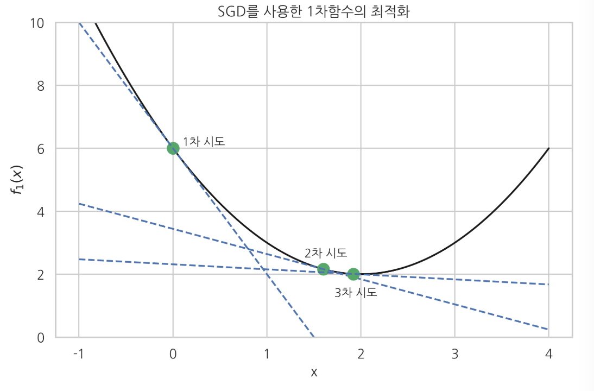
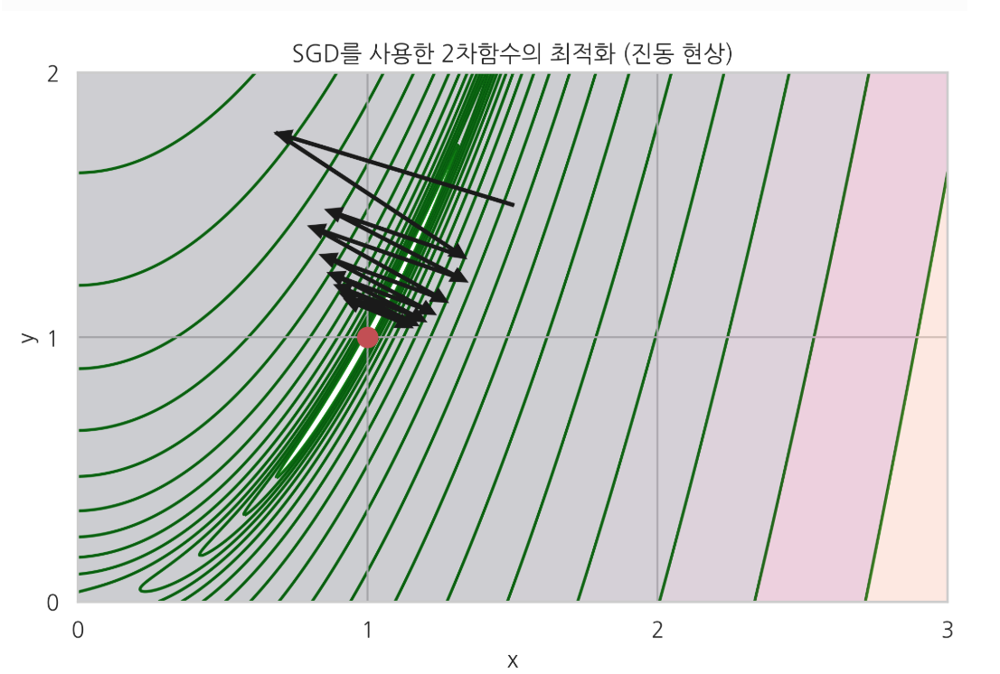
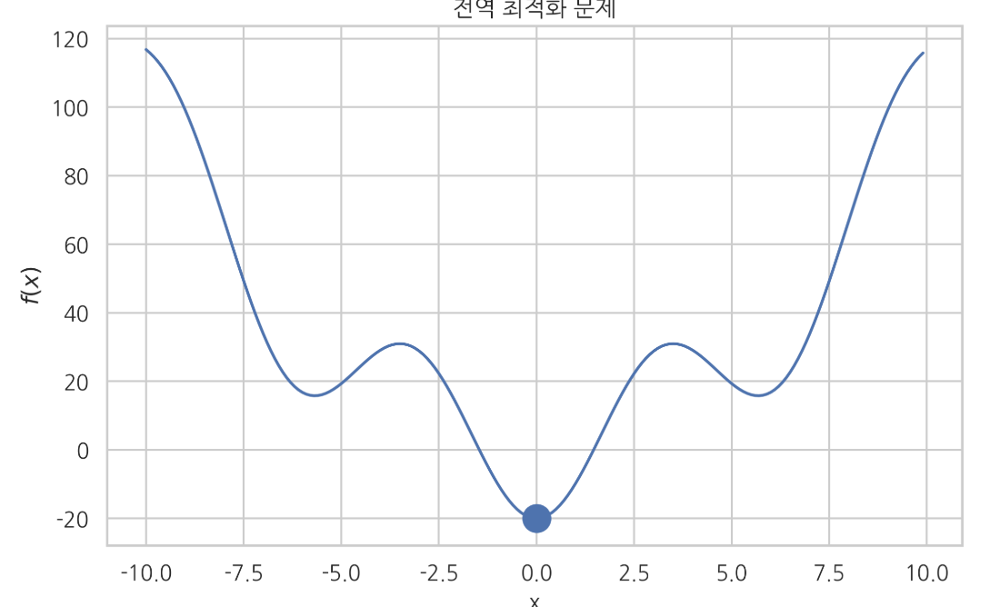
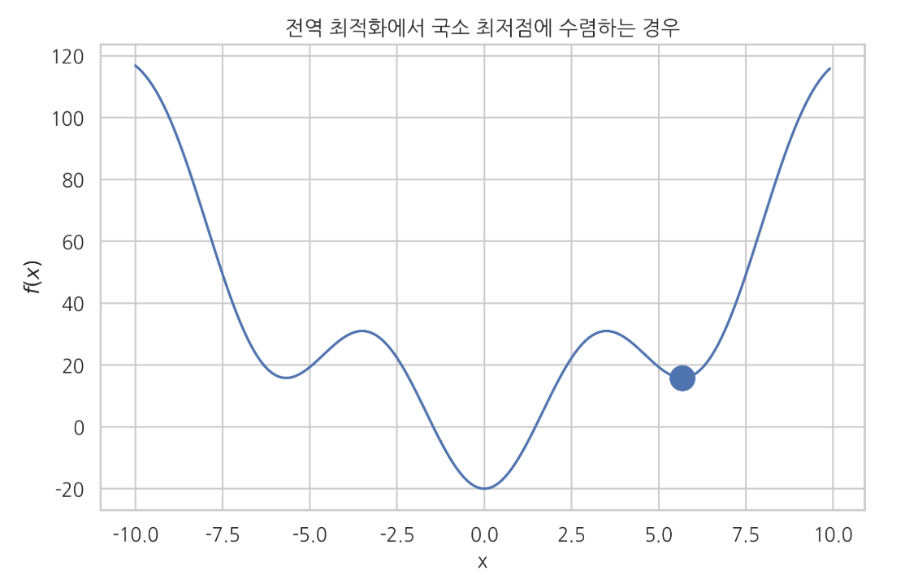

# 최적화 기초

### Summary

- 최적화는 목적함수를 가장 크게 혹은 가장 작게 할 수 있는 모수를 찾는 것입니다.
- 그리드서치(grid search)는 가능한 x의 값을 여러개 넣어보고 그 중 가장 작은 값을 선택
- 기울기가 0이고 2차도함수가 양수이면 최소점이다. 반대로 기울기가 0이고 2차 도함수가 음수이면 최대점이 된다
- 수치적최적화(numerical optimization)은 반복적시행착오(trial and error)을 통해 함수 위치가 최적점이 될 때까지 가능한 한 적은 횟수만큼 x위치를 옮기는 방법이다.
- Gredient Decent 방법은 gradient의 반대방향으로 일정크기만큼 이동해내는 것을 반복하여 오차함수의 값을 최소화하는 값을 찾는것이다.
- Newton 방법은 목적함수가 2차 함수라는 가정하에 한번에 최적점을 찾는 방법이다. 그레디언트 벡터에 헤시안 행렬의 역행렬을 곱해서 방향과 거리가 변형된 그레디언트 벡터를 사용한다. 
____________

### 최적화 문제

최적화 문제는 함수 $$f$$ 의 값을 최대화 혹은 최소화하는 변수 $$x$$ 의 값 $$x^*$$ 를 찾는 것이다. 
$$
x^{\ast} = \arg \max_x f(x) \;\;(\text{최대화의 경우}) \\x^{\ast} = \arg \min_x f(x) \;\;(\text{최소화의 경우})
$$

이 값 $$x^*$$ 를 최적화 문제의 해(solution)라고 한다. 

최대화 문제는 $$f(x)$$ 를 $$-f(x)$$ 로 바꾸면 풀 수 있으므로 보통 최소화의 경우만 고려한다. 

최소화 하고자 하는 함수 $$f(x)$$ 를 **목적함수(objective function), 비용함수(cost function) 또는 손실함수(loss function)** 등으로 부른다. 기호는 각각 $$J, C, L$$ 로 표기하는 경우가 많다.

### 그리드 서치와 수치적 최적화

목적함수의 값을 가장 작게 하는 𝑥 위치를 찾는 최적화 문제를 푸는 가장 간단한 방법은 가능한 𝑥의 값을 여러개 넣어 보고 그 중 가장 작은 값을 선택하는 **그리드 서치(grid search)** 방법이다.

함수 $$𝑓_1(𝑥)$$의 그래프를 그려 최저점을 찾은 방법도 그리드 서치 방법의 일종이다. 그리드 서치는 가장 간단한 방법이지만 많은 𝑥 위치에 대해 목적함수 값을 계산해야 한다.

예측 모형을 만들 때 목적함수 값, 즉 예측 오차를 구하려면 모든 트레이닝 데이터 집합에 대해 예측 값과 타겟 값의 차이를 구해야 하므로 상당히 많은 계산량을 요구한다.따라서 그리드 서치보다 목적함수 계산을 적게 할 수 있는 방법이 필요하다.

반복적 시행 착오(trial and error)에 의해 최적화 필요조건을 만족하는 값 $$𝑥^∗$$를 찾는 방법을 **수치적 최적화(numerical optimization)**라고 한다. 수치적 최적화 방법은 함수 위치가 최적점이 될 때까지 가능한 한 적은 횟수만큼 𝑥위치를 옮기는 방법을 말한다.

- 수치적 최적화 방법은 다음 두 가지 알고리즘을 요구한다.
  - 현재 위치 $$𝑥_𝑘$$가 최적점인지 판단하는 알고리즘
  - 어떤 위치 $$𝑥_𝑘$$를 시도한 뒤, 다음 번에 시도할 위치 $$𝑥_{𝑘+1}$$을 찾는 알고리즘

### 기울기 필요조건

어떤 독립 변수 값 $$𝑥^∗$$ 가 최소점이 되기 위해서는 일단 다음과 같이 값 $$𝑥^∗$$에서 함수의 기울기(slope), 도함수 $$\dfrac{df}{dx}$$ 의 값이 0이라는 조건을 만족해야 한다. 이를 **기울기 필요조건**이라고 한다.

- 단일 변수에 대한 함수인 경우, **미분값이 0**  ,   $$ \dfrac{df(x)}{dx} = 0$$ 
- 다변수 함수인 경우 **모든 변수에 대한 편미분값이 0** 

$$
\dfrac{\partial f(x_1, x_2, \cdots , x_N)}{\partial x_2} = 0 \\ 
\dfrac{\partial f(x_1, x_2, \cdots , x_N)}{\partial x_2} = 0 \\
. \\
. \\ 
. \\ 
\dfrac{\partial f(x_1, x_2, \cdots , x_N)}{\partial x_N} = 0
$$

즉 $$\nabla f = 0$$ 이 때 그레디언트(gradient) 벡터 $$\nabla f = 0$$ 를 $$g$$ 라는 기호로 간단하게 나타내기도 한다. $$g = 0$$ 

이 조건을 필요조건이라고 하는 이유는 기울기가 0이라고 반드시 최소점이 되지는 않지만, 모든 최소점은 기울기가 0이기 때문이다. **일반적인 수치적 최적화 알고리즘에서는 기울기 필요조건을 이용하여 최적점에 도달하였는지 판단한다**.

기울기가 0이어도 최소점이 아니라 최고점일 수도 있다. **기울기가 0인 위치가 최소점임을 확인하기 위해서는 2차 도함수의 부호도 계산**해야 한다. 기울기가 0이고 2차도함수가 양수이면 최소점이다. 반대로 기울기가 0이고 2차 도함수가 음수이면 최대점이 된다.

### 최급강하법(SGD)

**최급강하법(SGD; Steepest Gradient Descent) 방법** 은 단순히 현재 위치 $$x_k$$ 에서의 기울기 값 $$g(x_k)$$ 만을 이용하여 다음번 위치 $$x_{k+1}$$ 를 결정하는 방법이다. 
$$
x_{k+1} = x_{k} - \mu \nabla f(x_k) = x_{k} - \mu g(x_k)
$$

만약 현재 위치 $$𝑥_𝑘$$에서 기울기가 음수이면 즉 곡면이 아래로 향하면 $$𝑔(𝑥_𝑘)<0$$이므로 앞으로 진행하고 현재 위치 $$𝑥_𝑘$$에서 기울기가 양수이면 $$𝑔(𝑥𝑘)>0$$ 이므로 뒤로 진행하게 되어 점점 낮은 위치로 옮겨간다.

$$𝑥_𝑘$$ 가 일단 최적 점에 도달하였을 때는 $$𝑔(𝑥_𝑘)=0$$ 이 되므로 더 이상 위치를 옮기지 않는다.

이 때 위치를 옮기는 거리를 결정하는 비례상수 𝜇를 **스텝 사이즈(step size)**라고 한다.

예로 1차원 목적함수($$f(x) = (x - 2)^2 + 2$$)를 최급강하법으로 최적화하면 다음과 같다. 우선 사람이 직접 목적함수를 미분하여 도함수를 파이썬으로 구현해야 한다. 

  ~~~python
  def f1d(x):
      """derivative of f1(x)"""
      return 2 * (x - 2.0)
  ~~~

  - x = 0 에서 시작하여 SGD로 최적점을 찾아나가는 과정은 아래와 같다. 
  - SGD에서는 스텝사이즈의 크기를 적절히 조정하는 것이 중요하다.

2차원 Rosenbrock 함수에 대해 SGD를 적용해보자. 목적함수를 미분하여 도함수를 구한 다음 그레디언트 벡터를 파이썬 함수로 구현하였다.  $$f(x, y) = (1 − x )^2 + 100(y − x^2)^2$$ 

~~~python
def f2g(x, y):
"""gradient of f2(x, y)"""
return np.array((2.0 * (x - 1) - 400.0 * x * (y - x**2), 200.0 * (y - x**2)))
~~~

다음 그림에 $$𝑥=−1,𝑦−1$$에서 시작하여 SGD로 최적점을 찾아나가는 과정을 그레디언트 벡터 화살표와 함께 보였다.

다음 그림에서 볼 수 있듯이 SGD 방법은 곡면의 모양이 **계곡(valley)**과 같이 생긴 경우, 즉 그레디언트 벡터가 최저점을 가리키고 있지 않는 경우에는 **진동(oscillation) 현상**이 발생한다. 따라서 수렴하는데 시간이 오래 걸릴 수 있다.

이러한 진동 현상을 없앨 수 있는 방법으로는 2차 도함수, 즉 헤시안 행렬을 이용하는 방법이나 모멘텀 방법(momentum)이 있다. 일반적인 경우에는 2차 도함수를 이용하는 방법을 사용하고 2차 도함수를 계산하기 어려운 인공신경망 등에서는 모멘텀 방법을 선호한다.

### Normal Equation

Gradient Descent는 경사면을 하강하면서 최저점을 찾는 방식이기에 한걸음씩 내려오면서 여러번을 수행하게 된다.

Normal Equationd은 반복없이 $$\theta$$ 를 바로 구하는 방법이다. 반복이 없기에 그만큼 빠르고 $$\alpha$$ 를 찾을 필요가 없다.

$$
\theta = (X^TX)^{-1}X^Ty
$$

### 2차 도함수를 사용한 Newton 방법

**Newton 방법** 은 목적함수가 2차 함수라는 가정하에 한번에 최저점을 찾는 방법이다.

그레디언트 벡터에 헤시안 행렬의 역행렬을 곱해서 방향과 거리가 변형된 그레디언트 벡터를 사용한다. 

$$
{x}_{n+1} = {x}_n - [{H}f({x}_n)]^{-1} \nabla f({x}_n)
$$

예를 들어 다음 단변수 2차 함수 $$f(x) = a(x-x_0)^2 + c = ax^2 -2ax_0x + x_0^2+c$$  는 $$x = x_0$$ 에서 최소값을 가진다. 

단변수함수 Newton 방법은 다음과 같다. 즉 최적의 스텝사이즈가 $$\frac{1}{f''(x_n)}$$이라는 것을 보여준다.

$$
{x}_{n+1} = {x}_n - \dfrac{f'(x_n)}{f''(x_n)}
$$

$${f'(x_n)}$$ 는 그레디언트벡터, $${f''(x_n)}$$ 는 헤시안행렬

2차 함수에 대해 도함수와 2차 도함수는 아래와 같다.

$$
f'(x) = 2ax - 2ax_0 \\
f''(x) = 2a
$$
Newton 방법에 적용하면 어떤 점 $$x_n$$ 에서 시작해도 바로 최저점으로 이동한다. 
$$
{x}_{n+1} = {x}_n - \dfrac{2ax_n - 2ax_0}{2a} = x_n - (x_n - x_0) = x_0
$$

### Quasi_Newton 방법

Newton 방법은 목적함수가 2차 함수와 비슷한 모양을 가진 경우에 빠르게 수렴할 수 있다는 장점이 있지만 2차도함수인 헤시안 행렬 함수를 사람이 미리 구현해 주어야 하고 함수의 모양에 따라서는 잘 수렴하지 않을 수도 있다. **Quasi-Newton 방법**에서는 사람이 구한 헤시안 행렬 함수를 사용하는 대신 현재 시도하고 있는 $$𝑥_𝑛$$ 주변의 몇몇 점에서 함수의 값을 구하고 이를 이용하여 2차 도함수의 근사값 혹은 이에 상응하는 정보를 수치적으로 계산한다. 실제로는 BFGS(Broyden–Fletcher–Goldfarb–Shanno) 방법이 많이 사용된다.

CG(conjugated gradient) 방법은 Quasi-Newton 방법처럼 헤시안 행렬을 필요로 하지 않고 변형된 그레디언트 벡터를 바로 계산한다.

### SciPy를 이용한 최적화

SciPy의 optimize 서브 패키지는 최적화 명령 `minimize`를 제공한다. 세부적인 알고리즘은 `method` 인수로 선택할 수 있다. 디폴트 알고리즘은 앞에서 설명한 BFGS 방법이다. `minimize` 명령은 최적화하고자 하는 함수와 최적화를 시작할 초기값을 인수로 받는다. 보다 자세한 내용은 SciPy 문서를 참조한다. 

~~~python
result = minimize(func, x0, jac=jac)
~~~

`func`: 목적함수

`x0`: 초기값 벡터

`jac`: (옵션) 그레디언트 벡터를 출력하는 함수

`minimize` 명령의 결과는 `OptimizeResult` 클래스 객체로 다음 속성을 가진다.

- `x`: 최적화 해
- `success`: 최적화에 성공하면 `True`를 반환
- `status`: 종료 상태. 최적화에 성공하면 0을 반환
- `message`: 메세지 문자열
- `fun`: x 위치에서의 함수의 값
- `jac`: x 위치에서의 자코비안(그레디언트) 벡터의 값
- `hess_inv`: x 위치에서의 헤시안 행렬의 역행렬의 값
- `nfev`: 목적함수 호출 횟수
- `njev`: 자코비안 계산 횟수
- `nhev`: 헤시안 계산 횟수
- `nit`: x 이동 횟수
- 함수 호출 계산량을 줄이기 위해서는 사람이 직접 그레디언트 벡터 값을 반환하는 함수를 만들어 `jac` 인수로 넣어주면 된다.
- 다변수 함수를 최적화하는 경우에는 목적함수가 벡터 인수를 가져야 한다.

### 전역 최적화 문제

만약 최적화하려는 함수가 **복수의 국소 최저점(local minima)을 가지고 있는 경우에는 수치적 최적화 방법으로 전역 최저점(global minimum)에 도달한다는 보장이 없다**. 결과는 초기 추정값 및 알고리즘, 파라미터 등에 의존한다.

### 컨벡스 문제

목적함수의 2차 도함수의 값이 항상 0 이상이 되는 영역에서만 정의된 최적화 문제를 **컨벡스(convex) 문제**라고 한다.

$$
\dfrac{\partial^2 f}{\partial x^2} \geq 0
$$

다변수 목적함수의 경우에는 주어진 영역에서 헤시안 행렬이 항상 양의 준정부호(positive semidefinite)이라는 조건이 된다.
$$
x^THx \geq 0 \;\;\text{for all } x
$$

**convex 문제에서는 유일한 전역 최저점이 존재한다.**

