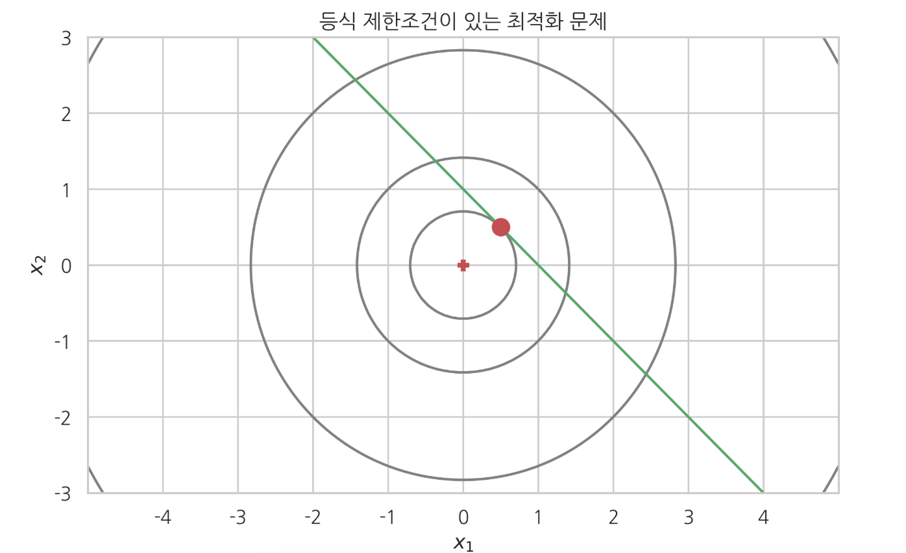
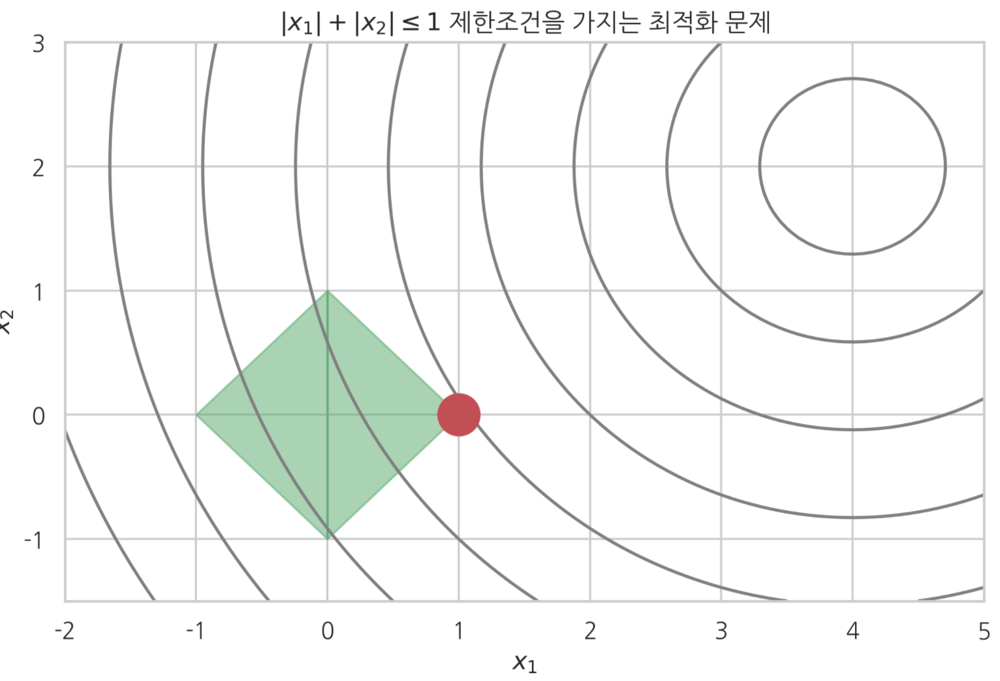

# 제한조건이 있는 최적화 문제

### Summary

- 라그랑주 승수 방법은 원래의 목적함수 $$f(x)$$ 를 사용하지 않고 제한조건 등식에 $$\lambda$$ 라는 새로운 변수를 곱해서 더한 함수를 목적함수로 간주하여 최적화한다. 

- KKT(Karush-Kuhn-Tucker) 조건

  - 모든 독립 변수 $$x_1, x_2, \ldots , x_N$$ 에 대한 미분값이 0이다. (제한조건 경우와 같으나 변수 $$x$$ 에 대한 미분값만 0이어야 한다. 라그랑지 승수 $$\lambda$$ 에 대한 미분은 0이 아니어도 된다)
    $$
    \dfrac{\partial h(x, \lambda)}{\partial x_i} = 0
    $$

  - 모든 라그랑지 승수 $$\lambda_1, \ldots , \lambda_M$$  와 제한조건 부등식($$\lambda$$ 에 대한 미분값)의 곱이 0이다. (등식 제한조건의 경우처럼 라그랑지 승수 $$\lambda$$ 에대한 미분값이 0이어도 되고 아니면 라그랑지 승수 $$\lambda$$ 값 자체가 0이 되어도 된다. )

  $$
  \lambda_j \cdot \dfrac{\partial h(x, \lambda)}{\partial \lambda_j} = \lambda_j \cdot g_j = 0
  $$

  - 라그랑지 승수는 음수가 아니어야 한다. (KKT 조건이 실제로 부등식 제한조건이 있는 최적화 문제와 같은 문제임을 보장(striong duality) 하기 위한 조건이다.) $$\lambda_j \geq 0$$

- 만약 $$𝑔_𝑖=0$$이면 이 조건은 부등식 제한조건이 아닌 **등식** 제한조건이 된다. 그리고 등식 제한조건에서 말한 바와 같이 (이 제한조건이 있으나 없으나 해가 바뀌지 않는 특수한 경우를 제외하면) **라그랑주 승수는 0이 아닌 값**을 가진다.

  - $$g_i = 0 \;\; \rightarrow \;\; \lambda_i \neq 0 \; (\lambda_i > 0)$$

  반대로 $$𝑔_𝑖≠0(𝑔_𝑖<0)$$이면 해가 $$𝑔_𝑖$$가 표현하는 곡선으로부터 떨어져 있기 때문에 부등식 제한조건이 아무런 의미가 없어진다. 즉, 제한조건이 있을 때와 없을 때의 해가 같다. 따라서 목적함수 ℎ(𝑥,𝜆)는 $$𝜆_𝑖𝑔_𝑖(𝑔_𝑖≠0)$$항이 있으나 없으나 상관없이 같은 해를 가진다.  따라서 $$𝜆_𝑖=0$$이 된다.

_____________

### 등식 제한조건이 있는 최적화 문제

현실의 최적화 문제에서는 여러가지 **제한조건이 있는 최적화(constrained optimization)** 문제가 많다. 가장 간단한 경우는 다음과 같이 등식 제한조건이 있는 경우이다.
$$
x^{\ast} = \text{arg} \min_x f(x)
$$

$$
x \in \mathbf{R}^N
$$

$$
g_j(x) = 0 \;\; (j=1, \ldots, M)  
$$

식 4.2.1만 보면 단순히 목적함수 $$f(x)$$ 를 가장 작게하는 $$N$$ 차원 벡터 $$x$$ 값을 찾는 문제이다. 하지만 식 4.2.2에 있는 $$M$$ 개의 등식 제한 조건이 있으면 $$M$$ 개 연립 방정식을 동시에 모두 만족시키면서 목적함수 $$f(x)$$ 를 가장 작게하는 $$x$$ 값을 찾아야 한다. 

$$
g_1(x) &= 0 \\
g_2(x) &= 0 \\
&\vdots \\
g_M(x) &= 0 \\
$$

예제 

목적함수 $$f$$ 와 등식 제한조건 $$g$$ 이 다음과 같은 경우 이 문제는 다음 그림처럼 $$g(x_1, x_2) = 0$$ 으로 정의되는 직선상에서 가장 $$f(x_1, x_2)$$ 값이 작아지는 점 $$(x_1^*, x_2^*)$$ 를 찾는 문제가 된다.

$$
f(x_1, x_2) = x_1^2 + x_2^2 
\tag{4.2.3}
$$

$$
g(x_1, x_2) = x_1 + x_2 - 1 = 0 
$$

### 라그랑주 승수법

등식 제한조건이 있는 최적화 문제는 **라그랑주 승수법(Lagrange multiplier)** 을 사용하여 최적화 할 수 있다. 

라그랑주 승수 방법에서는 목적함수를 원래의 목적함수 $$f(x)$$ 를 사용하지 않는다. 대신 제한조건 등식에 $$\lambda$$ 라는 새로운 변수를 곱해서 더한 함수를 목적함수로 간주하여 최적화한다. 

$$
\begin{aligned}
h(x, \lambda) 
&= h(x_1, x_2, \ldots , x_N, \lambda_1, \ldots , \lambda_M) \\
&= f(x) + \sum_{j=1}^M \lambda_j g_j(x)
\end{aligned}
$$

이 때 제한조건 등식 하나마다 새로운 $$\lambda_i$$ 를 추가해주어야 한다. 만약 제한조건이 $$M$$ 개 이면 $$\lambda_1, \cdots , \lambda_M$$ 개의 변수가 새로 생긴 것과 같다. 이렇게 확장된 목적함수 $$h$$ 는 입력변수가 더 늘어났기 때문에 그레디언트 벡터를 영벡터로 만드는 최적화 필요 조건이 다음처럼 $$N + M$$ 개가 된다.

$$
\dfrac{\partial h}{\partial x_1} 
&= \dfrac{\partial f}{\partial x_1} + \sum_{j=1}^M \lambda_j\dfrac{\partial g_j}{\partial x_1} = 0 \\
\dfrac{\partial h}{\partial x_2} 
&= \dfrac{\partial f}{\partial x_2} + \sum_{j=1}^M \lambda_j\dfrac{\partial g_j}{\partial x_2} = 0 \\
& \vdots  \\
\dfrac{\partial h}{\partial x_N} 
&= \dfrac{\partial f}{\partial x_N} + \sum_{j=1}^M \lambda_j\dfrac{\partial g_j}{\partial x_N} = 0 \\
\dfrac{\partial h}{\partial \lambda_1} 
&= g_1 = 0 \\
& \vdots  \\
\dfrac{\partial h}{\partial \lambda_M} 
&= g_M = 0 
$$

$$N + M$$ 개의 연립 방정식을 풀면 $$N + M$$ 개의 미지수 $$x_1, x_2, \ldots, x_N, , \lambda_1, \ldots , \lambda_M$$ 를 구할 수 있다. 구한 결과에서 $$x_1, x_2, \cdots, x_N$$ 가 우리가 찾는 최소값 $$x$$ 이다. 나머지 라그랑주 승수값은 필요 없다. 

예제 

라그랑지 승수법을 적용하여 그레디언트 벡터가 영벡터인 위치를 구한다. 

$$
h(x_1, x_2, \lambda)  = f(x_1, x_2) + \lambda g(x_1, x_2)  = x_1^2 + x_2^2 + \lambda ( x_1 + x_2 - 1 ) 
$$

$$
\dfrac{\partial h}{\partial x_1} 
&= 2{x_1} + \lambda = 0 \\
\dfrac{\partial h}{\partial x_2} 
&= 2{x_2} + \lambda = 0 \\
\dfrac{\partial h}{\partial \lambda} 
&= x_1 + x_2 - 1 = 0 
$$

$$
x_1 = x_2 = \dfrac{1}{2}, \;\;\; \lambda = -1
$$

### Scipy를 사용하여 등식 제한조건이 있는 최적화 문제 계산하기

SciPy의 optimize 서브패키지는 제한조건이 있는 최적화 문제를 풀기위한 `fmin_slsqp`명령을 제공한다.

~~~python
fmin_slsqp(func_objective, x0, eqcons=[func_constraint1, func_constraint2])
~~~

`fmin_slsqp` 명령은 목적함수와 초기값, 그리고 제한조건 함수의 리스트를 인수로 받는다. 목적함수는 배열인 인수를 받도록 구현되어야 하고 제한조건 함수의 경우에는 항상 `eqcons`인수를 명시해야 한다.

~~~python
def f1array(x):
    return x[0] ** 2 + x[1] ** 2

def eq_constraint(x):
    return x[0] + x[1] - 1

sp.optimize.fmin_slsqp(f1array, np.array([1, 1]), eqcons=[eq_constraint])
~~~

### 라그랑주 승수의 의미

만약 최적화 문제에서 등식 제한조건 $$𝑔_𝑖$$이 있는가 없는가에 따라 해의 값이 달라진다면 이 등식 제한조건에 대응하는 라그랑주 승수 $$𝜆_𝑖$$는 0이 아닌 값이어야 한다.
$$
\lambda_i \neq 0 
$$

$$𝜆_𝑖=0$$일 때만 원래의 문제와 제한조건이 있는 문제의 최적화 조건이 같아지므로 최적화 해의 위치도 같게 나오기 때문이다.

예제

목적함수가 $$f(x) = x_1^2 + x_2^2$$ 인 최소화 문제의 답은 $$x_1 = x_2 = 0$$ 이다. 여기에 다음 최적화 조건이이 있다고 하자. 

$$
g(x_1, x_2) = x_1 + x_2 = 0
$$

라그랑주 승수법에서 새로운 목적함수 

$$
h(x_1, x_2, \lambda) 
= f(x_1, x_2) + \lambda g(x_1, x_2) 
= x_1^2 + x_2^2 + \lambda ( x_1 + x_2) 
$$

최적화 조건은
$$
\dfrac{\partial h}{\partial x_1} 
&= 2{x_1} + \lambda = 0 \\
\dfrac{\partial h}{\partial x_2} 
&= 2{x_2} + \lambda = 0 \\
\dfrac{\partial h}{\partial \lambda} 
&= x_1 + x_2 = 0 
$$

이를 풀면 $$x_1 = x_2 = \lambda = 0$$ 으로 제한조건이 있으나 없으나 해는 같고 라그랑지 승수가 0이다.

#### 부등식(inequality) 제한조건이 있는 최적화 문제

$$
x^{\ast} = \text{arg} \min_x f(x)  \\ 
x \in \mathbf{R}^N \\
g_j(x) \leq 0 \;\; (j=1, \ldots, M)  
$$

만약 부등식이 $$g_j(x) \geq 0$$ 과 같다면 양변에 -1을 곱하여 부등호의 방향을 바꾼다.

이렇게 부등식 제한조건이 있는 최적화 문제도 라그랑지 승수 방법과 목적함수를 다음처럼 바꾸어 푼다.
$$
h(x, \lambda) = f(x) + \sum_{j=1}^M \lambda_j g_j(x)
$$

최적화 해의 필요조건은 방정식 제한조건이 있는 최적화 문제와 다르게 **KKT(Karush-Kuhn-Tucker) 조건**  이라고 하며 다음처럼 3개의 조건으로 이루어진다.

모든 독립 변수 $$x_1, x_2, \ldots , x_N$$ 에 대한 미분값이 0이다. (제한조건 경우와 같으나 변수 $$x$$ 에 대한 미분값만 0이어야 한다. **라그랑지 승수 $$\lambda$$ 에 대한 미분은 0이 아니어도 된다**)

$$
\dfrac{\partial h(x, \lambda)}{\partial x_i} = 0
$$

모든 라그랑지 승수 $$\lambda_1, \ldots , \lambda_M$$  와 제한조건 부등식($$\lambda$$ 에 대한 미분값)의 곱이 0이다. (등식 제한조건의 경우처럼 라그랑지 승수 $$\lambda$$ 에대한 미분값이 0이어도 되고 아니면 **라그랑지 승수 $$\lambda$$ 값 자체가 0이 되어도 된다.** )

$$
\lambda_j \cdot \dfrac{\partial h(x, \lambda)}{\partial \lambda_j} = \lambda_j \cdot g_j = 0
$$

라그랑지 승수는 음수가 아니어야 한다. (KKT 조건이 실제로 부등식 제한조건이 있는 최적화 문제와 같은 문제임을 보장(striong duality) 하기 위한 조건이다.) $$\lambda_j \geq 0$$

예제로 부등식 제한조건을 가지는 최적화의 예를 풀어보자.

​			1)목적함수 $$f(x_1, x_2) = x_1^2 + x_2^2$$

​			2)제한조건1. $$g(x_1, x_2) = x_1 + x_2 - 1 \leq 0 $$ 

제한조건1은 부등식 제한조건이 있기는 하지만 원래의 최적화 문제의 해가 부등식 제한조건이 제시하는 영역안에 있기 때문에 최적점의 위치가 달라지지 않는다.

​			3)제한조건2. $$g(x_1, x_2) = -x_1 - x_2 + 1 \leq 0 $$

제한조건2은 원래의 최적화 문제의 해가 부등식 제한조건이 제시하는 영역 바깥에 있기 때문에 최적점의 위치가 달라졌다. 하지만 최적점의 위치가 영역의 경계선(boundary line)에 있다는 점에 주의해야한다.  

부등식 제한조건이 있는 최적화 문제를 풀면 그 제한조건은 다음 두 가지 경우의 하나가 되어버린다.  

- 최적화 결과에 전혀 영향을 주지 않는 **쓸모없는** 제한조건
- 최적화 결과에 영향을 주는 **등식(equality)인** 제한조건

어느 경우이든 부등식 제한조건 문제로 시작했지만 결과는 제한조건이 없거나 등식 제한조건 문제를 푸는 것과 같아진다. KKT조건 중 두번째 조건이 뜻하는 바는 다음과 같다. 

다음 식에서 $$𝑥^∗,𝜆^∗$$는 KKT 조건을 풀어서 구한 최적해의 값이다.

$$\lambda^{\ast} = 0 \;\; \text{or} \;\;  g(x^{\ast}) = 0 $$ 

만약 $$𝑔_𝑖=0$$이면 이 조건은 부등식 제한조건이 아닌 **등식** 제한조건이 된다. 그리고 등식 제한조건에서 말한 바와 같이 (이 제한조건이 있으나 없으나 해가 바뀌지 않는 특수한 경우를 제외하면) **라그랑주 승수는 0이 아닌 값**을 가진다.

$$g_i = 0 \;\; \rightarrow \;\; \lambda_i \neq 0 \; (\lambda_i > 0)$$

반대로 $$𝑔_𝑖≠0(𝑔_𝑖<0)$$이면 해가 $$𝑔_𝑖$$가 표현하는 곡선으로부터 떨어져 있기 때문에 부등식 제한조건이 아무런 의미가 없어진다. 즉, 제한조건이 있을 때와 없을 때의 해가 같다. 따라서 목적함수 ℎ(𝑥,𝜆)는 $$𝜆_𝑖𝑔_𝑖(𝑔_𝑖≠0)$$항이 있으나 없으나 상관없이 같은 해를 가진다.  따라서 $$𝜆_𝑖=0$$이 된다.

$$g_i \neq 0 \;\; \rightarrow \;\; \lambda_i = 0  $$

복수의 부등식 제한조건이 있는 또다른 2차원 최적화 문제의 예시를 살펴보자.

$$
\text{arg} \min_x \; (x_1-4)^2 + (x_2-2)^2 \\
g_1(x) = x_1 + x_2 - 1\leq 0 \\
g_2(x) = -x_1 + x_2 - 1\leq 0 \\
g_3(x) = -x_1 - x_2 - 1\leq 0 \\
g_4(x) = x_1 - x_2 - 1\leq 0
$$
4개의 제한조건은 다음과 같은 하나의 부등식으로 나타낼 수도 있다.
$$
g(x) 
= \left\vert\, x_1 \right\vert + \left\vert\, x_2 \right\vert - 1 
= \sum_{i=1}^{2} \left\vert\, x_i \right\vert - 1 \leq 0
$$

### SciPy를 사용하여 부등식 제한조건이 있는 최적화 문제 계산하기

 `fmin_slsqp` 명령은 이렇게 부등식 제한조건이 있는 경우에도 사용할 수 있다. 제한조건 인수의 이름이 `ieqcons`로 달라졌다.

~~~python
fmin_slsqp(func_objective, x0, ieqcons=[func_constraint1, func_constraint2])
~~~

단 `ieqcons` 인수에 들어가는 부등호의 부호는 우리가 지금까지 사용한 방식과 달리 0 또는 양수이어야 한다.   $$g \geq 0$$

사실 `fmin_slsqp` 명령은 등식 제한조건과 부등식 제한조건을 동시에 사용할 수 있다.

~~~python
def f2(x):
    return np.sqrt((x[0] - 4) ** 2 + (x[1] - 2) ** 2)

# 제한 조건 상수
k = 1
def ieq_constraint(x):
    return np.atleast_1d(k - np.sum(np.abs(x)))

sp.optimize.fmin_slsqp(f2, np.array([0, 0]), ieqcons=[ieq_constraint])
~~~

