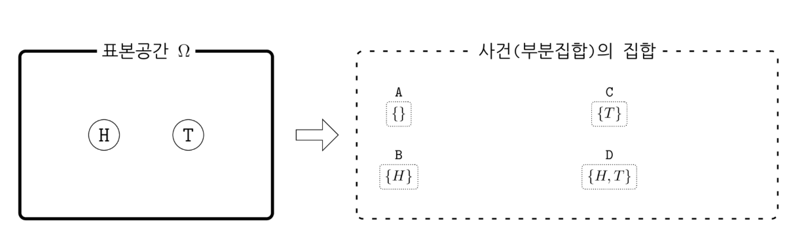

# 확률의 수학적 정의와 의미

### Summary

- 확률은 사건을 입력하면 숫자가 출력되는 함수이다. 모든 각각의 사건(부분집합)에 어떤 숫자를 할당하는 함수이다. 
- 빈도주의는  반복적으로 선택된 표본이 사건(부분 집합) 𝐴의 원소가 될 경향(propensity)을 그 사건의 확률이라고 한다. 베이지안 관점은  선택된 표본이 특정한 사건(부분 집합)에 속한다는 가설(hypothesis), 명제(proposition) 혹은 주장(assertion)의 신뢰도(degree of belief)라고도 볼 수 있다. 여기에 반복이라는 개념은 사용되지 않는다.
- 빈도주의는 참된 확률값이 point estimate(점추정)으로 존재하고 가설 검증을 통해 채택/기각한다. 베이지안은 주사위가 1이 나올 확률이 어떤 확률분포를 가지고 있다 생각하고 사전확률분포(믿음)을 발생되는 데이터를 통해 사후확률분포(새로운 믿음)를 업데이트 해나갑니다. 

___________________

### 표본공간과 확률분포

**확률표본(probabilistic sample, random sample)** 또는 **표본(sample) **은 풀고자 하는 확률적 문제에서 **발생(realize)할 수 있는 하나의 현상**, 혹은 **선택(sampled)될 수 있는 하나의 경우**를 말한다. 

**표본공간(sample space)** 은 가능한 모든 표본의 집합. 보통 $$\Omega$$ 라는 그리스 문자로 표기한다. 표본 공간을 정의한다는 것은 우리가 고려하는 범위에서 어떤 표본(경우, 현상)이 가능하고 어떤 표본이 가능하지 않은가를 정의하는 작업이다. 

### 사건

**사건(event)**은  **표본공간 Ω의 부분집합**이다. 전체 표본공간 중에서 우리가 관심을 가지고 있는 일부 표본의 집합을 뜻한다. 보통 𝐴,𝐵,𝐶,⋯ 식으로 대문자 알파벳으로 표기한다.

### 확률

**확률(probability)**: **사건(부분집합)을 입력하면 숫자(확률값)가 출력되는 함수**이다.
$$
\text{event(subset)} \xrightarrow {\text{probability}} \text{number}
$$

확률이라는 함수의 입력값의 집합 즉, 정의역(domain)은 표본공간의 모든 사건(부분집합)의 집합이다. **모든 각각의 사건(부분집합)에 어떤 숫자를 할당(assign, allocate)하는 함수가 확률**이다. 보통 대문자 알파벳 𝑃 로 나타낸다. 확률 𝑃는 함수이고 𝑃(𝐴)는 𝐴라는 사건(부분집합)에 할당된 숫자를 뜻한다.

#### 콜모고로프의 공리(Kolmogorov's axioms)

(1) 모든 사건에 대해 확률은 실수이고 0 또는 양수이다.
$$
P(A)\geq 0 
$$
(2) 표본공간(전체집합)이라는 사건(부분집합)에 대한 확률은 1이다.
$$
P(\Omega) = 1
$$
(3) 공통 원소가 없는 두 사건의 합집합의 확률은 각각의 사건의 확률의 합이다.
$$
A \cap B = \emptyset \;\;\; \rightarrow \;\;\; P(A \cup B) = P(A) + P(B)
$$

### 확률은 표본이 아닌 사건을 입력으로 가지는 함수

확률은 표본이 아닌 **사건(부분집합)에 대해** 정의하기 때문이다. 올바른 식은 다음과 같다.
$$
P(\{1\}) = \dfrac{1}{6}
$$

표본의 갯수가 유한하고 각 사건에 대해 원소의 갯수 이외의 아무런 정보가 없다면 각 사건의 확률을 다음과 같다고 보는 것이 타당하다.
$$
P(A) = \dfrac{\text{card}(A)}{\text{card}(\Omega)}
$$

만약 다른 곳에서 얻은 정보(예: 자연법칙 또는 도메인 지식)이나 표본에 대한 데이터가 존재하는 경우에는 보다 믿을 수 있는 확률값을 계산할 수 있다.

### 파이썬을 이용한 확률의 구현

파이썬에서는 사건을 키(key)로 가지고 숫자를 값(value)으로 가지는 딕셔너리를 사용하여 확률 함수를 구현할 수 있다. 이 때 딕셔너리의 키는 가능한 모든 부분집합이 되어야 한다. 동전의 경우에는 가능한 부분집합의 수가 𝐴=∅, 𝐵={𝐻}, 𝐶={𝑇}, 𝐷={𝐻,𝑇} 4개이므로 파이썬으로 구현하면 다음과 같다.

~~~python
P = {A: 0, B: 0.4, C: 0.6, D: 1}
P
# 결과
#{frozenset(): 0,
# frozenset({'H'}): 0.4,
# frozenset({'T'}): 0.6,
# frozenset({'H', 'T'}): 1}
~~~

### 확률의 의미

빈도주의는  **반복적으로 선택된 표본이 사건(부분 집합) 𝐴의 원소가 될 경향(propensity)**을 그 사건의 확률이라고 한다.

베이지안 관점은  **선택된 표본이 특정한 사건(부분 집합)에 속한다는 가설(hypothesis), 명제(proposition) 혹은 주장(assertion)의 신뢰도(degree of belief)**라고도 볼 수 있다. 여기에 반복이라는 개념은 사용되지 않는다.