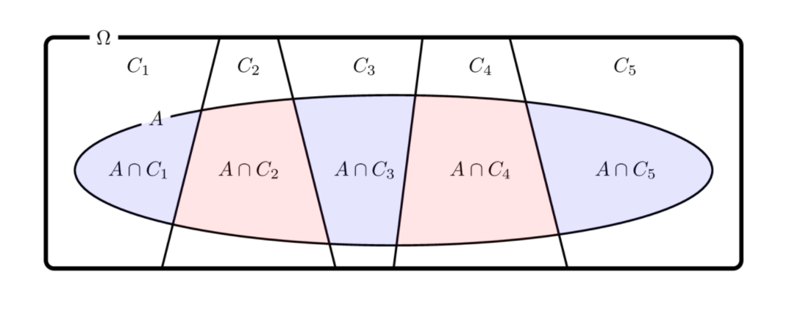

# 확률의 성질

### Summary

### 공집합의 확률

$$
P(\emptyset) = 0
$$

### 여집합의 확률

$$
P(A^C) = 1 - P(A) \\
0 \leq P(A) \leq 1
$$

### 포함-배제 원리

$$
P(A \cup B) = P(A) + P(B) – P(A \cap B)
$$

####전체 확률의 법칙

$$
C_i \cap C_j = \emptyset \;\;\; (i \neq j) \\
C_1 \cup C_2 \cup \cdots  = \Omega \\
P(A) = \sum_i P(A, C_i) \\
$$

교집합의 확률은 다음처럼 쉼표로 표시하기도 한다.

$$
P(A \cap B) = P(A, B)
$$

