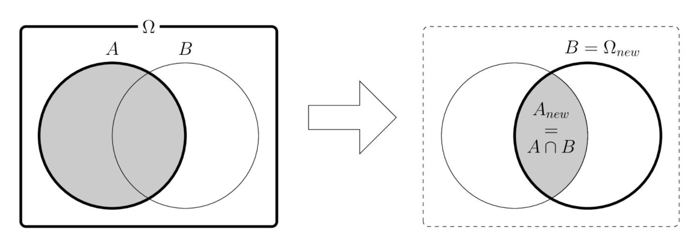
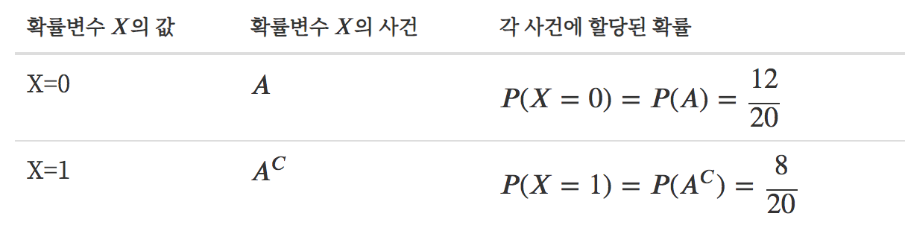
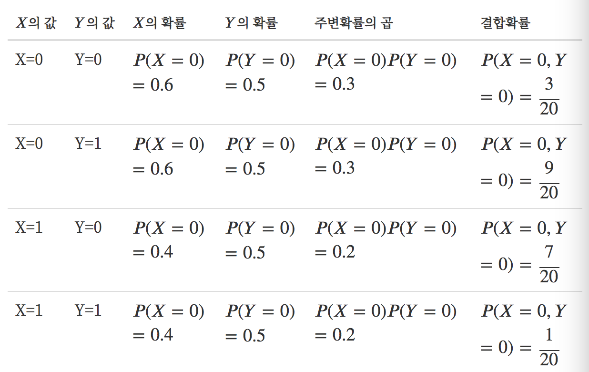

# 결합확률과 조건부확률

### Summary

- 결합확률(joint probability)은 사건 A,B가 동시에 발생할 확률이다. $$P(A,B)$$ 
- 주변확률(marginal probability)은 결합되지 않는 개별사건 P(A), P(B)이다.
- 조건부확률(conditional probability)은 B가 사실일 경우 사건 A대한 확률이다. P(A|B)
- 확률변수는 확률분포에서 발생한 데이터이다.

_____________

**결합확률(joint probability)** 은 사건 A와 B가 동시에 발생할 확률이다. 사건(명제/주장) A도 진실이고 사건(명제/주장) B도 진실이므로 사건 A와 B의 교집합의 확률을 계산하는 것과 같다. 
$$
P(A \cap B) \text{ or } P(A, B)
$$

**주변확률(marginal probability)** 은 결합확률과 대비되는 개념으로 결합되지 않는 개별 사건의 확률 P(A) 또는 P(B)이다. 

**조건부확률(conditional probability) **는 B가 사실일 경우의 사건 A에 대한 확률를 사건 B에 대한 사건 A의 조건부확률이라고 한다.
$$
P(A | B)
$$

기호 `|` 는 if를 뜻한다. 
$$
P(A | B) \equiv \text{ new } P(A) \text{ if } P(B) = 1
$$
조건부확률의 값은 다음처럼 정의한다.

$$
  P(A|B) = \dfrac{P(A,B)}{P(B)}
$$

사건 B가 사실이므로 모든 가능한 표본은 사건 B에 포함되어야 한다. 즉 새로운 실질적 표본 공간은 $$\Omega_\text{new} \rightarrow B$$ 가 된다. 

사건 A의 원소는 모두 사건 B의 원소도 되므로 사실상 사건 $$A \cap B$$ 의 원소가 된다. 즉 새로운 실질적 $$A_\text{new} \rightarrow A \cap B$$ 가 된다.

따라서 사건 A의 확률 즉, 신뢰도는 원래의 신뢰도(결합확률)를 새로운 표본 공간의 신뢰도(확률)로 정규화(normalize) 한 값이라고 할 수 있다.

$$
  P(A|B) = \dfrac{P(A_\text{new})}{P(\Omega_\text{new})} = \dfrac{P(A,B)}{P(B)}
$$

###  조건부확률 $$P(A | B)$$ 

사건 B가 발생한 경우의 사건 A의 확률이다. 표본이 이벤트 B에 속한다는 새로운 **사실** 을 알게 되었을 때,이 표본이 사건 A에 속한다는 사실의 정확성(신뢰도)이 어떻게 변하는지를 알려준다. 새로운 정보가 주어지든 주어지지 않았든 확률이 변함이 없으면 사건 A와 사건 B는 서로 독립(independent)이라고 한다. 

### 독립

수학적으로 사건 A와 사건 B의 결합확률의 값이 $$P(A, B) = P(A)P(B)$$ 관계가 성립하면 **두 사건 A와 B는 서로 독립(independent)** 라고 정의한다. 
$$
P(A, B) = P(A)P(B)
$$

**독립인 경우 조건부확률과 원래의 확률이 같아짐을 알 수 있다.** 즉, B라는 사건이 발생하든 말든 사건 A에는 전혀 영향을 주지 않는다는 것이다.
$$
P(A|B) = \dfrac{P(A,B)}{P(B)} = \dfrac{P(A)P(B)}{P(B)} = P(A)
$$

### 원인과 결과, 근거와 추록, 가정과 조건부 결론

조건부확률 $$P(A|B)$$ 에서 사건(주장/명제) B, A는 각각 아래와 같이 생각할 수 있다.

- "가정과 그 가정에 따른 조건부 결론"
- "원인과 결과"
- "근거와 추론" 

결합확률의 정의를 바꿔 쓰면 다음과 같이 된다. 
$$
P(A,B) =P(A|B)P(B)
$$

이 식은 다음과 같은 관점에서 볼 수 있다. 

**A, B가 모두 발생할 확률은 B라는 사건이 발생할 확률과 그 사건이 발생한 경우 다시 A가 발생할 경우의 곱** 

  예제

  - $$P(A, B, C) = P(A|B,C)P(B,C)$$  
  - 확률표기에서 쉼표(comma)가 교집합을 뜻한다는 것을 기억한다. 
  - $$P(A,B,C)=P(A\cap B\cap C) =P(A\cap(B\cap C)) = P(A|B\cap C)P(B\cap C) = P(A|B, C)$$ 

### 사슬법칙

**사슬 법칙(chain rule)** 이란 조건부확률과 결합확률의 관계를 확장하면 복수의 사건 $$X_1, X_2, … , X_N$$ 에 대한 조건부 확률을 다음처럼 쓸 수 있다. 이를 사슬 법칙(chain rule) 이라고 한다.
$$
\begin{aligned}
P(X_1, X_2)           &= P(X_1) P(X_2 | X_1) \\
P(X_1, X_2, X_3)      &= P(X_3 | X_1, X_2) P(X_1, X_2) \\
                      &= P(X_1) P(X_2 | X_1) P(X_3 | X_1, X_2) \\
P(X_1, X_2, X_3, X_4) &= P(X_4 | X_1, X_2, X_3) P(X_1, X_2, X_3) \\
                      &= P(X_1) P(X_2 | X_1) P(X_3 | X_1, X_2) P(X_4 | X_1, X_2, X_3) \\
                      & \vdots  \\
P(X_1, \dots, X_N)    &= P(X_1) \prod_{i=2}^{N} P( X_{i} | X_1, \dots X_{i-1})
\end{aligned}
$$

### 확률변수

**확률변수(random variable) **는 확률적인 숫자 값을 가지는 변수이다. $$X, Y$$ 처럼 알파벳 대문자로 표기한다. 확률변수는 확률분포를 그 안에 내포하고 있어서 그 확률분포에 따라 숫자를 출력할 수 있다. 확률변수 $$X$$ 가 가진 확률을 확률변수의 확률 $$P(X)$$ 라고 한다. 

- 예시

**결합확률의 확률분포** 는 각 확률변수가 가질 수 있는 값의 조합으로 나타난다. 

- 예시

두 확률변수 $$X, Y$$ 가 가질 수 있는 모든 사건의 조합에 대해 독립이 성립하면 두 확률변수 $$X, Y$$ 가 **독립** 이라고 한다. **주변확률의 곱을 구해서 결합확률과 비교**해보면 확률변수 $$X, Y$$ 는 독립여부를 알 수 있다.

### pgmpy 패키지

pgmpy(Probabilistic Graphical Models in Python) 패키지를 사용하면 이산확률모형을 쉽게 구현할 수 있다. 

pgmpy 패키지의 `JointProbabilityDistribution` 클래스는 결합확률 모형을 만들기 위한 클래스이다. 사용법은 다음과 같다.

`JointProbabilityDistribution(variables, cardinality, values)` 

- `variables`: 확률변수의 이름 문자열의 리스트. 정의하려는 확률변수가 하나인 경우에도 리스트로 넣어야 한다.
- `cardinality`: 각 확률변수의 표본 혹은 배타적 사건의 수의 리스트
- `values`: 확률변수의 모든 표본(조합)에 대한 (결합)확률 값의 리스트

예시

~~~python
from pgmpy.factors.discrete import JointProbabilityDistribution as JPD

px = JPD(['X'], [2], np.array([12, 8]) / 20)
print(px)

#결과
+-----+--------+
| X   |   P(X) |
+=====+========+
| X_0 | 0.6000 |
+-----+--------+
| X_1 | 0.4000 |
+-----+--------+
~~~

확률변수 $$𝑋$$와 확률변수 $$𝑌$$의 결합확률은 다음처럼 정의한다.

~~~python
pxy = JPD(['X', 'Y'], [2, 2], np.array([3, 9, 7, 1]) / 20)
print(pxy)
#결과
+-----+-----+----------+
| X   | Y   |   P(X,Y) |
+=====+=====+==========+
| X_0 | Y_0 |   0.1500 |
+-----+-----+----------+
| X_0 | Y_1 |   0.4500 |
+-----+-----+----------+
| X_1 | Y_0 |   0.3500 |
+-----+-----+----------+
| X_1 | Y_1 |   0.0500 |
+-----+-----+----------+
~~~

`JointProbabilityDistribution` 클래스는 결합확률로부터 주변확률을 계산하는 `marginal_distribution` 메서드, `marginalize` 메서드와 조건부확률을 계산하는 `conditional_distribution` 메서드를 제공한다.

`marginal_distribution(values, inplace=True)`

  - `values`: 주변확률을 구할 확률변수의 이름 문자열 리스트
  - `inplace`: `True`이면 객체 자신을 주변확률 모형으로 변화시킨다. `False`면 주변확률 모형 객체를 반환한다.
  - `marginal_distribution` 메서드는 인수로 받은 확률변수에 대한 주변확률분포를 구한다. 다음 코드는 결합확률로부터 주변확률 $$𝑃(𝐴)$$, $$𝑃(𝐴^𝐶)$$를 계산한다.

  ~~~python
  pmx = pxy.marginal_distribution(['X'], inplace=False)
  print(pmx)
  #결과
  +-----+--------+
  | X   |   P(X) |
  +=====+========+
  | X_0 | 0.6000 |
  +-----+--------+
  | X_1 | 0.4000 |
  +-----+--------+
  ~~~

  

`marginalize(values, inplace=True)`

  - `values`: 어떤 확률변수의 주변확률을 구하기 위해 **없앨 확률변수**의 이름 문자열 리스트
  - `inplace`: `True`이면 객체 자신을 주변확률 모형으로 변화시킨다. `False`면 주변확률 모형 객체를 반환한다.
  - `marginalize` 메서드는 인수로 받은 확률변수를 주변화(marginalize)하여 나머지 확률변수에 대한 주변확률분포를 구한다. 다음 코드도 앞과 마찬가지로 결합확률로부터 주변확률 $$𝑃(𝐴$$),$$ 𝑃(𝐴^𝐶)$$를 계산한다.

  ~~~python
  pmx = pxy.marginalize(['Y'], inplace=False)
  print(pmx)
  #결과
  +-----+--------+
  | X   |   P(X) |
  +=====+========+
  | X_0 | 0.6000 |
  +-----+--------+
  | X_1 | 0.4000 |
  +-----+--------+
  ~~~

`conditional_distribution(values, inplace=True)`

  - `values`: 주변확률을 구할 확률변수의 이름 문자열과 값을 묶은 튜플의 리스트
  - `inplace`: `True`이면 객체 자신을 조건부확률 모형으로 변화시킨다. `False`면 조건부확률 모형 객체를 반환한다.
  - `conditional_distribution` 메서드를 사용하면 어떤 확률변수가 어떤 사건이 되는 조건에 대해 조건부확률값을 계산한다. 다음 코드는 결합확률로부터 조건부확률 $$𝑃(𝐵|𝐴)$$,$$ 𝑃(𝐵^𝐶|𝐴)$$를 계산한다.

  ~~~python
  py_on_x0 = pxy.conditional_distribution([('X', 0)], inplace=False)  # 사건 A에 대한 조건부확률
  print(py_on_x0)
  #결과
  +-----+--------+
  | Y   |   P(Y) |
  +=====+========+
  | Y_0 | 0.2500 |
  +-----+--------+
  | Y_1 | 0.7500 |
  +-----+--------+
  ~~~

  - 다음 코드는 결합확률로부터 조건부확률 $$𝑃(𝐵|𝐴^𝐶)$$, $$𝑃(𝐵𝐶^|𝐴^𝐶)$$를 계산한다.

  ~~~python
  py_on_x1 = pxy.conditional_distribution([('X', 1)], inplace=False)
  print(py_on_x1)
  #결과
  +-----+--------+
  | Y   |   P(Y) |
  +=====+========+
  | Y_0 | 0.8750 |
  +-----+--------+
  | Y_1 | 0.1250 |
  +-----+--------+
  ~~~

  - 다음 코드는 결합확률로부터 조건부확률 $$𝑃(A|B)$$, $$𝑃(A^C|B)$$를 계산한다.

  ~~~python
  px_on_y0 = pxy.conditional_distribution([('Y', 0)], inplace=False)  # 사건 B에 대한 조건부확률
  print(px_on_y0)
  #결과
  +-----+--------+
  | X   |   P(X) |
  +=====+========+
  | X_0 | 0.3000 |
  +-----+--------+
  | X_1 | 0.7000 |
  +-----+--------+
  ~~~

독립여부 확인 : `check_independence` 메서드를 이용하면 두 확률변수간의 독립도 확인할 수 있다.

~~~python
pxy.check_independence(['X'], ['Y'])

#결과 False
~~~

두 개의 `JointProbabilityDistribution` 객체끼리 곱하면 두 분포가 독립이라는 가정하에 결합확률을 구한다. 이 값과 원래의 결합확률을 비교하면 독립이 아니라는 것을 알 수 있다.

~~~python
print(px * py)
print(pxy)

#결과
+-----+-----+----------+
| X   | Y   |   P(X,Y) |
+=====+=====+==========+
| X_0 | Y_0 |   0.3000 |
+-----+-----+----------+
| X_0 | Y_1 |   0.3000 |
+-----+-----+----------+
| X_1 | Y_0 |   0.2000 |
+-----+-----+----------+
| X_1 | Y_1 |   0.2000 |
+-----+-----+----------+
+-----+-----+----------+
| X   | Y   |   P(X,Y) |
+=====+=====+==========+
| X_0 | Y_0 |   0.1500 |
+-----+-----+----------+
| X_0 | Y_1 |   0.4500 |
+-----+-----+----------+
| X_1 | Y_0 |   0.3500 |
+-----+-----+----------+
| X_1 | Y_1 |   0.0500 |
+-----+-----+----------+
~~~

