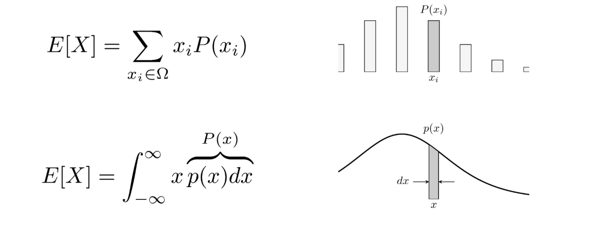
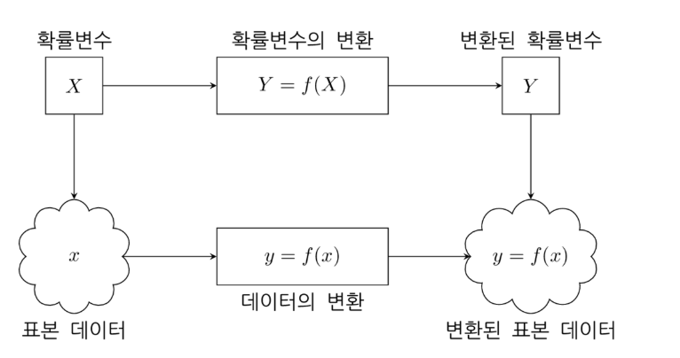
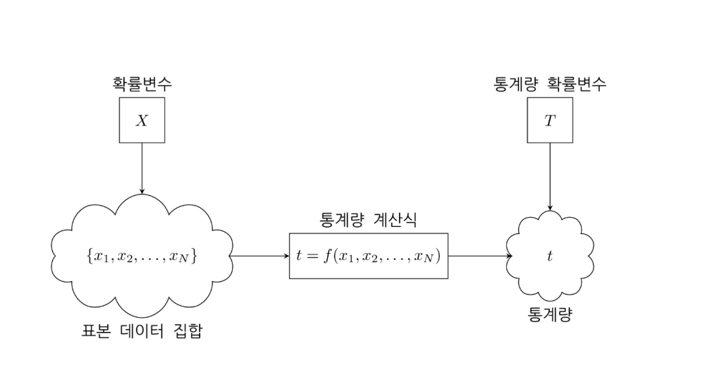
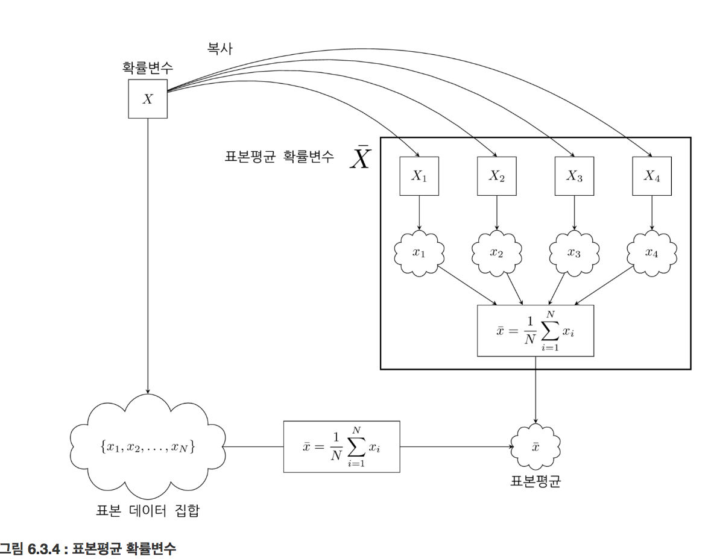
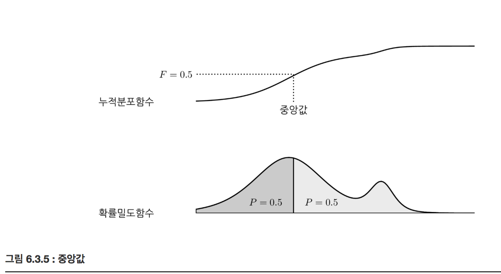

# Expectation (기댓값)

### Summary

- 기댓값은 여러가지 가능한 $$x$$ 값들을 확률(또는 확률밀도)값에 따라 가중합을 한 것이므로 가장 확률(또는 확률밀도)가 높은 $$x$$ 값 근처의 값이 된다. 즉, 확률(또는 확률밀도)가 모여있는 곳의 위치를 나타낸다.
- 통계량(statistics)은 표본 데이터 집합을 정해진 공식에 넣어서 하나의 숫자를 구한 것이다. 표본의 합, 표본평균, 표본중앙값, 표본분산 등은 모두 통계량이다. 통계량도 확률변수의 변환에 포함된다. 
________________________

### 확률변수의 기댓값

기댓값(expectation)은 확률변수의 확률밀도함수를 알면 확률변수의 이론적 평균값을 구할 수 있다.

확률변수 $$X$$ 의 기댓값 $$E[X]$$ 또는 $$\mu_X$$ 로 표기한다. 이산확률변수의 기댓값은 표본공간의 원소 $$x_i$$ 의 가중평균이다. 가중치는 $$x_i$$ 가 나올 수 있는 확률(확률질량함수) $$p(x_i)$$ 이다.

$$
\mu_X = \operatorname{E}[X] = \sum_{x_i \in \Omega} x_ip(x_i)
$$

데이터 공간에서 기댓값에 해당하는 값인 표본평균을 구하는 공식은 다음과 같다.

$$
m = \bar x = \dfrac{1}{N} \sum_{i=1}^N x_i
$$

기댓값 공식과 표본평균 공식에서 $$x_i$$의 의미가 다르다는 점에 유의하라. 기댓값 공식에서 $$x_i$$는 표본공간의 원소를 뜻하지만 표본평균 공식에서 $$x_i$$는 무작위로 만들어진 표본 중 하나를 뜻한다.

##### 연속확률변수의 기댓값은 확률밀도함수 p(x)를 가중치로 x를 적분한 값이다.

$$
\mu_X = \operatorname{E}[X] = \int_{-\infty}^{\infty} x p(x) dx
$$

기댓값은 여러가지 가능한 x값들을 확률(또는 확률밀도)값에 따라 가중합을 한 것이므로 가장 확률(또는 확률밀도)이 높은 x값 근처의 값이 된다. 즉, **확률(또는 확률밀도)가 모여있는 곳의 위치** 를 나타낸다.

### 확률변수의 변환

확률변수의 변환(transform)은 기존의 확률변수를 연산하여 새로운 확률변수를 만드는 것이다.

$$
Y = f(X)
$$

### 기댓값의 성질

확률변수가 아닌 상수 c에 대해 

$$
E[c] = c
$$

선형성
$$
E[cX] = cE[X] \\
E[X+Y]=E[X]+E[Y]\\
E[c_1X+c_2Y]=c_1E[X]+c_2E[Y]
$$

### 통계량

통계량(statistics)은 표본 데이터 집합을 정해진 공식에 넣어서 하나의 숫자를 구한 것이다. 표본의 합, 표본평균, 표본중앙값, 표본분산 등은 모두 통계량이다. 통계량도 확률변수의 변환에 포함된다. 

다만 확률변수 X에서 표본을 N번 뽑아서 그 값에 대해 연산을 하는 경우에는 다음처럼 원래 확률변수의 복사본을 만든 다음 이 확률변수의 표본값을 더한 형태로 변환식을 써야 한다.

$$
Y = X_1 + X_2 + \cdots X_N
$$

### 표본평균 확률변수

확률변수로부터 N개의 표본을 만들어 이 표본집합의 표본평균을 구하면 이렇게 구한 표본평균 값도 확률변수가 된다. 

$$
\bar{X} = \dfrac{1}{N}\sum_{i=1}^{N} X_i
$$

위 식에서 $$X_i$$는 i번째로 실현된 표본값을 생성하는 확률변수를 의미한다. 이 확률변수 $$X_i$$는 원래의 확률변수 𝑋의 복사본이다.

### 기댓값과 표본평균의 관계

표본평균의 기댓값은 원래의 확률변수의 기댓값과 같다.

$$
E[\bar X] = E[X]
$$

$$
\begin{aligned}
\text{E}[\bar{X}] 
&= \text{E}\left[\dfrac{1}{N}\sum_{i=1}^{N}X_i \right]  \\
&= \dfrac{1}{N}\sum_{i=1}^{N}\text{E}[X_i]  \\
&= \dfrac{1}{N}\sum_{i=1}^{N}\text{E}[X] \\
&= \dfrac{1}{N} N \text{E}[X] \\ 
&= \text{E}[X]  \\
\end{aligned}
$$

표본평균은 확률변수의 기댓값 근처의 값이 된다. 

### 중앙값

확률변수의 중앙값(median)은 중앙값보다 큰 값이 나올 확률과 작은 값이 나올 확률이 0.5로 같은 값이다. 

누적확률분포 F(x)에서 중앙값을 계산할 수 있다.

$$
0.5 = F(median) \\
median = F^{-1}(0.5)
$$

### 최빈값(most frequent value)

이산확률분포에서 가장 확률 값이 큰 수가 최빈값(most frequent value) 이다.

연속확률분포의 최빈값(mode)은 확률밀도함수 p(x) 의 값이 가장 큰 확률변수의 값이다(확률 밀도함수의 최댓값의 위치)

$$
\text{mode} = \arg \max_x p(x)
$$

___________________________________
###### Reference
김도형 박사님 강의를 수강하며 데이터사이언티스트스쿨(https://datascienceschool.net/) 강의자료를 토대로 공부하며 정리한 내용임을 말씀드립니다.