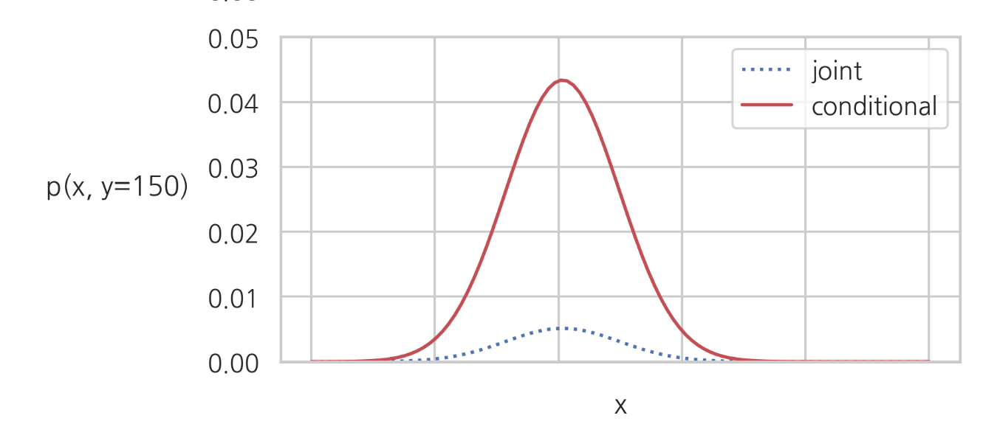

# 다변수 확률변수

### Summary

- 결합확률질량함수는 하나하나의 숫자 쌍에 대해 확률을 알려주는 확률질량함수만 있으면 전체 확률분포를 알 수 있다.
- 주변확률질량함수(marginal probability mass function)는 두 확률변수 중 하나의 확률변수 값에 대해서만 확률분포를 표시한 함수이다.
- 조건부확률질량함수(conditional probability mass function)는 다변수 확률변수 중 하나의 값이 특정 값으로 고정되어 상수가 되어 버린 경우, 나머지 변수에 대한 확률질량함수를 말한다. 조건부 확률질량함수의 합은 1이 된다.  
- 결합확률밀도함수는 결합 누적확률분포함수를 미분한 것이다. 결합 확률 밀도 함수를 특정 구간에 대해 적분하면 해당 구간에 대한 확률이 된다.
- 주변확률밀도함수는 결합 확률밀도함수를 특정한 하나의 변수에 대해 가중평균한 값이다. 
- 조건부확률밀도함수는 다변수 확률 변수 중 하나의 값이 특정 값이라는 사실이 알려진 경우, 이러한 조건(가정)에 의해 변화한 나머지 확률변수에 대한 확률밀도함수를 말한다. 면적이 1이 되도록 스케일을 키워주는 것이다.
_________

### 결합 확률질량함수(joint probability mass function)

**결합 확률질량함수(joint probability mass function)** 는 임의의 숫자 쌍 집합 즉 임의의 사건에 대해서도 확률을 계산할 수 있으므로 **하나 하나의 숫자 쌍에 대해 확률을 알려주는 확률질량함수**만 있으면 전체 확률분포를 알 수 있다. 이러한 확률 질량함수를 결합확률질량함수라고 한다. 

$$
p_{XY}(x, y)
$$

독립변수가 x, y 두개가 된다. 

종속변수는 그 숫자 쌍이 나타날 확률이다. 예) $$p_{XY}(2, 3)$$ = $${x=2, y=3}$$ 특정한 숫자 쌍으로만 이루어진 사건의 확률이다.

### 주변 확률질량함수(marginal probability mass function)

**주변 확률질량함수(marginal probability mass function)** 는 두 확률변수 중 하나의 확률변수 값에 대해서만 확률분포를 표시한 함수이다. 전체 확률의 법칙에 의해 다른 변수가 가질 수 있는 모든 값의 결합확률질량함수를 합한 확률이 된다.

$$
\nonumber  p_X(x) = \sum_{y_i} p_{XY}(x,y_i) \\
\nonumber  p_Y(y) = \sum_{x_i} p_{XY}(x_i,y) \\
$$

### 조건부 확률질량함수(conditional probability mass function)

**조건부 확률질량함수(conditional probability mass function)** 는 다변수 확률변수 중 하나의 값이 특정 값으로 고정되어 상수가 되어 버린 경우, 나머지 변수에 대한 확률질량함수를 말한다.

$$
p_{X \mid Y}(x \mid y) = \dfrac{p_{XY}(x, y)}{p_{Y}(y)} \\
p_{Y \mid X}(y \mid x) = \dfrac{p_{XY}(x, y)}{p_{X}(x)}
$$

조건부 확률질량함수의 모양은 결합질량함수 $$p_{XY}(x, y)$$ 에서 $$y$$ 값이 고정된 함수이다. **결합질량함수의 단면과 같아진다**. 다만 조건부 확률질량함수의 합은 1이 된다.  

### 다변수 연속확률변수

연속확률변수는 누적확률분포함수를 먼저 정의한 후에 이를 미분하여 확률밀도함수를 정의한다

### 결합 누적확률분포함수

두 연속 확률 변수 $$X, Y$$ 에 대한 **결합 누적확률분포함수 $$p_{XY}(x, y)$$ **

$$
F_{XY}(x, y) = P(\{ X < x \} \cap \{ Y < y \}) = P(\{X < x, Y < y\})
$$

결합 누적확률분포함수 $$p_{XY}(x, y)$$ 는 다음과 같은 특성을 가진다.

$$
F_{XY}(\infty, \infty)=1 \\
F_{XY}(-\infty, y)=F_{XY}(x,-\infty)=0
$$

### 결합 확률밀도함수(joint probability density function)

**결합 확률밀도함수(joint probability density function)** 는 결합 누적확률분포함수를 미분한 것이다.

독립 변수가 2개이므로 각각에 대해 모두 편미분(partical differentication) 해야 한다.

$$
p_{XY} = \dfrac{\partial^2 F_{XY}(x, y)}{\partial x \partial y}
$$

결합 확률 밀도 함수를 특정 구간에 대해 적분하면 해당 구간에 대한 확률이 된다.

$$
\int_{x_1}^{x_2} \int_{y_1}^{y_2} p_{XY}(x,y)dxdy = P\big(\{ x_1 \leq X \leq x_2, \; y_1 \leq Y \leq y_2 \}\big)
$$

### 주변 확률밀도함수(marginal probability density function)

**주변 확률밀도함수(marginal probability density function)** 는 결합 확률밀도함수를 특정한 하나의 변수에 대해 가중평균한 값이다. 즉 결합확률밀도함수를 하나의 확률변수에 대해서만 적분하여 구한다. 

가중평균(적분)으로 인해 차원이 한 개 줄어들기 때문에 2차원 확률 변수의 주변 확률 밀도 함수는 1차원 함수가 된다.

$$
\begin{align}%\label{}
\nonumber  p_X(x) = \int_{-\infty}^{\infty} p_{XY}(x,y)dy \\
\nonumber  p_Y(y) = \int_{-\infty}^{\infty} p_{XY}(x,y)dx
\end{align} 
$$

### 조건부 확률밀도함수

**조건부 확률밀도함수(conditional probability density function)** 는 다변수 확률 변수 중 하나의 값이 특정 값이라는 사실이 알려진 경우, 이러한 조건(가정)에 의해 변화한 나머지 확률변수에 대한 확률밀도함수를 말한다.

조건부 확률밀도함수는 면적이 1이 되도록 스케일을 키워주는 것이다.

$$
p_{X \mid Y}(x \mid y) = \dfrac{p_{XY}(x, y)}{p_{Y}(y)}
$$

### 독립과 상관

상관관계는 표본 값이 달라지면 다른 확률변수의 조건부 분포가 달라질 때 상관관계가 있다고 한다.

독립(independent)은 두 확률변수 $$X , Y$$ 의 결합확률밀도함수(joint pdf)가 주변확률밀도함수(marginal pdf)의 곱과 같다

$$
p_{XY}(x, y) = p_X(x)p_Y(y)
$$

### 반복시행

**같은 확률변수에서 복수의 표본 데이터를 취하는 경우에는 이 표본들은 서로 독립인 확률변수들에서 나온 표본**으로 볼 수 있다.

$$
\begin{align}
p(x_1, x_2, x_3, \cdots, x_N ) = \prod_{i=1}^N p(x_i)
\tag{7.4.23}
\end{align}
$$

### 조건부 확률분포

$$
p_{X \mid Y} (x | y) = \dfrac{p_{XY}(x, y)}{p_{Y}(y)} = \dfrac{p_{X}(x) p_{Y}(y)}{p_{Y}(y)} = p_{X}(x) \\
p_{Y \mid X} (y | x) = \dfrac{p_{XY}(x, y)}{p_{X}(x)} = \dfrac{p_{X}(x) p_{Y}(y)}{p_{X}(x)} = p_{Y}(y)
$$

### 독립 확률변수의 기댓값

$$
E[XY] = E[X]E[Y] \\
E[(X- \mu_X)(Y-\mu_y)] = 0
$$

### 독립 확률변수의 분산

$$
Var[X + Y] = Var[X] + Var[Y]
$$

___________________________________
###### Reference
김도형 박사님 강의를 수강하며 데이터사이언티스트스쿨(https://datascienceschool.net/) 강의자료를 토대로 공부하며 정리한 내용임을 말씀드립니다.