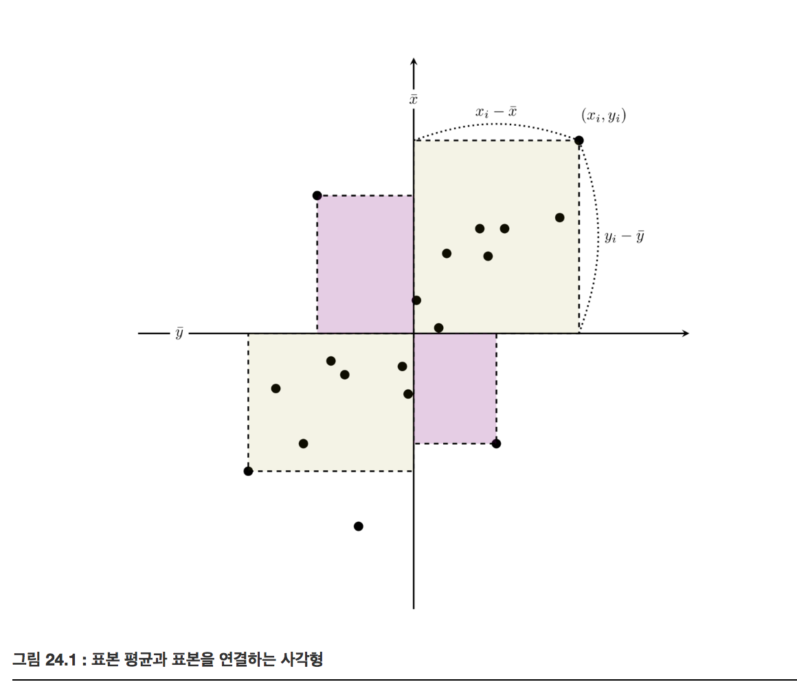
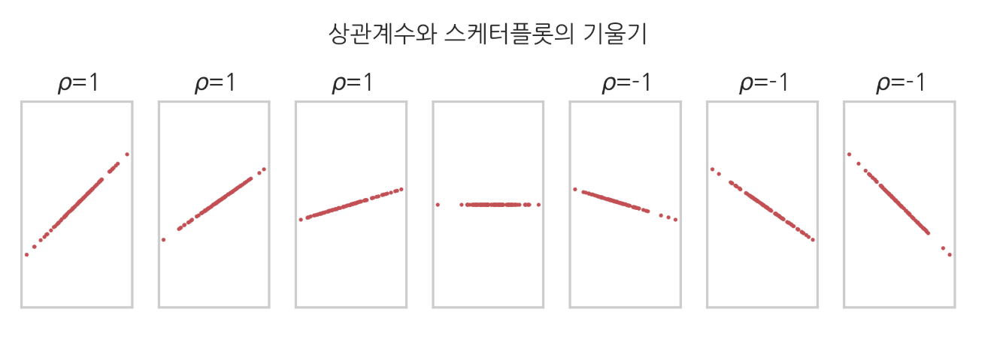

# 공분산과 상관계수

### Summary

- 표본공분산은 자료가 평균 값으로부터 얼마나 떨어져 있는지를 나타내고 평균을 중심으로 각 자료들이 어떻게 분포되어있는지 크기와 방향성을 같이 보여준다. 
- 상관계수는 자료 분포의 방향성만 분리하였다. 공분산을 각각의 표본표준편차값으로 나눈 값이다. 
- 크기는 분산으로도 알 수 있게 때문에 굳이 표본공분산의 크기, 방향성이 둘 다 필요하지 않아서 상관계수는 방향성만 분리하였기 때문에 상관계수를 사용한다. 
- 표본공분산행렬은 서로 다른 확률변수의 모든 조합에 대해 공분산을 한꺼번에 표기한 것이다. 대각성분은 각각의 확률변수의 분산, 비대각성분은 서로 다른 두 확률변수의 공분산으로 정의되는 행렬이다.
_____________

### 표본공분산

표본공분산(sample covariance)은 자료가 평균 값으로부터 얼마나 떨어져 있는지를 나타낸다. 평균을 중심으로 각 자료들이 어떻게 분포되어 있는지 **크기** 와 **방향성** 을 같이 보여준다.

$$x_i$$ 와 $$y_i$$ 는 각각 $$i$$ 번째의 $$x$$ 자료와 $$y$$ 자료의 값을 가리키고, $$\bar x$$ 와 $$\bar y$$ 는 $$x$$ 자료와 $$y$$ 자료의 표본평균을 가리킨다. 

$$
s_{xy} = \dfrac{1}{N}\sum_{i=1}^{N} (x_i-\bar{x})(y_i-\bar{y})
$$

공분산은 평균값 위치와 표본 위치를 연결하는 사각형의 면적을 사용한다. 공분산의 경우 자료의 위치에 따라 이 값의 부호가 달라진다. 1, 3사분면은 양수, 2, 4사분면은 음수

공분산의 부호는 $$X, Y$$ 데이터가 같은 부호를 가지는지 다른 부호를 가지는지에 대한 지표

### 공분산
공분산은 두 변수 간에 양의 상관관계가 있는지 음의 상관관계가 있는지 정도 알려준다. 하지만 상관관계가 얼마나 큰지는 제대로 반영하지 못한다. 
공분산의 문제는 확률변수의 단위 크기에 영향을 많이 받는다. 이를 보완할 수 있는 것이 상관계수입니다. 

### 상관계수
상관계수는 확률변수의 절대적 크기에 영향을 받지 않도록 공분산을 단위화시킨 것입니다. 즉, 공분산에 각 확률변수의 분산을 나눠준 것입니다. 
상관계수는 양의 상관관계가 있는지 음의 상관관계가 있는지 알려줄 뿐 아니라 그 상관성이 얼마나 큰지도 알려줍니다. 

### 표본상관계수

표본상관계수(sample correlation coefficient)는 자료 분포의 방향성만 분리하여 나타낸다. 

공분산을 각각의 표본표준편차값으로 나누어 정규화(normalize)하여 정의

$$
r_{xy} = \dfrac{s_{xy}}{\sqrt{s^2_{x} \cdot s^2_{y}}}
$$

다른 종류의 상관계수와 비교하여 말하는 경우에는 **피어슨(Pearson) 상관계수** 라고 한다.

### 확률변수의 공분산과 상관계수

두 확률변수 $$X , Y$$ 의 공분산은 기댓값 연산자를 사용하여 다음과 같이 정의

$$
\text{Cov}[X, Y] = \text{E}[(X - \text{E}[X])(Y - \text{E}[Y])]
$$

두 확률변수 $$X, Y$$ 의 상관계수

$$
\rho[X,Y] =  \dfrac{\text{Cov}[X, Y]}{\sqrt{\text{Var}[X] \cdot \text{Var}[Y]}}
$$

확률변수의 상관계수는 다음과 같은 성질을 가진다

$$
-1 \leq \rho \leq 1
$$

**$$\rho$$ 가 -1, 0, 1인 경우**

- $$\rho = 1$$ : 완전선형 상관관계
- $$\rho = 0 $$ : 무상관(독립과는 다름) 
- $$\rho = -1$$ : 완전선형 반상관관계 

- 상관계수는 스캐터 플롯의 기울기와는 아무런 상관이 없다.

### 비선형 상관관계

비선형 상관관계는 피어슨 상관계수가 0이지만 비선형으로 상관관계가 있다

### 다변수 확률변수의 표본공분산

이번에는 스칼라가 아닌 벡터 표본값을 가지는 다변수 확률변수의 공분산에 대해 알아보자. $$𝑋_1,𝑋_2,⋯,𝑋_𝑀$$이라는 $$𝑀$$개의 서로 다른 확률변수가 있다고 하자. 이 확률변수들의 표본 데이터가 각각 $$𝑁$$개가 있으면 $$𝑗(𝑗=1,…,𝑀)$$번째 확률변수의 $$𝑖(𝑖=1,…,𝑁)$$번째 데이터를 $$𝑥_{𝑖,j}$$,로 표기한다. 이를 하나의 행렬로 묶으면 다음과 같은 특징행렬이 된다.

$$
X = 
\begin{bmatrix}
x_{1, 1} & x_{1, 2} & \cdots   & x_{1, M} \\
x_{2, 1} & x_{2, 2} & \cdots   & x_{2, M} \\
\vdots   & \vdots   & \ddots   & \vdots   \\
x_{N, 1} & x_{N, 2} & \cdots   & x_{N, M} \\
\end{bmatrix}
$$

$$M$$ 개의 서로 다른 확률변수의 모든 조합에 대한 공분산을 한꺼번에 표기하기 위해 **표본공분산 행렬(Sample Covariance Matrix)** 을 정의한다. 

대각성분은 각각의 확률변수의 분산, 비대각성분은 서로 다른 두 확률변수의 공분산으로 정의되는 행렬이다.

$$
S =
\begin{bmatrix}
\begin{eqnarray}
s_{x_1}^2     \;\;  &  s_{x_1x_2} \;\;&  s_{x_1x_3} \;\;&  \cdots &  s_{x_1x_M} \\
s_{x_1x_2}   \;\;    &  s_{x_2}^2 \;\;&  s_{x_2x_3} \;\;&  \cdots &  s_{x_2x_M} \\
\vdots       &  \vdots &  \vdots &  \ddots &  \vdots \\
s_{x_1x_M}   \;\;    &  s_{x_2x_M} \;\;&  s_{x_3x_M} \;\;&  \cdots &  s_{x_M}^2 \\
\end{eqnarray}
\end{bmatrix}
$$

### 다변수 확률변수의 공분산

다변수 확률변수의 이론적 공분산 행렬은 $$\Sigma$$  로 표기하며 다음처럼 정의한다.

$$
\begin{eqnarray}
\Sigma = \text{Cov}[X] 
&=&
\text{E} 
\begin{bmatrix}
(X_1 - \text{E}[X_1])^2 & (X_1 - \text{E}[X_1])(X_2 - \text{E}[X_2]) & \cdots & (X_1 - \text{E}[X_1])(X_M - \text{E}[X_M]) \\
(X_1 - \text{E}[X_1])(X_2 - \text{E}[X_2]) & (X_2 - \text{E}[X_2])^2 & \cdots & (X_2 - \text{E}[X_2])(X_M - \text{E}[X_M]) \\
\vdots &  \vdots  & \ddots &  \vdots  \\
(X_1 - \text{E}[X_1])(X_M - \text{E}[X_M]) & (X_2 - \text{E}[X_2])(X_M - \text{E}[X_M]) & \cdots & (X_M - \text{E}[X_M])^2 \end{bmatrix}
\\
&=&
\begin{bmatrix}
\sigma_{x_1}^2  &  \sigma_{x_1x_2} &  \sigma_{x_1x_3} &  \cdots &  \sigma_{x_1x_M} \\
\sigma_{x_1x_2} &  \sigma_{x_2}^2  &  \sigma_{x_2x_3} &  \cdots &  \sigma_{x_2x_M} \\
\vdots          &  \vdots          &  \vdots          &  \ddots &  \vdots          \\
\sigma_{x_1x_M} &  \sigma_{x_2x_M} &  \sigma_{x_3x_M} &  \cdots &  \sigma_{x_M}^2 \\
\end{bmatrix} \\
\end{eqnarray}
$$

다음과 같이 표기할 수 있다.

$$
\begin{eqnarray}
\Sigma 
&=& \text{E} \left[ (X - \text{E}[X])(X - \text{E}[X])^T \right] \\
&=& \text{E} 
\left[ 
\begin{bmatrix}
X_1 - \text{E}[X_1] \\
X_2 - \text{E}[X_2] \\
\vdots \\
X_M - \text{E}[X_M] \\
\end{bmatrix}
\begin{bmatrix}
X_1 - \text{E}[X_1] &
X_2 - \text{E}[X_2] &
\cdots &
X_M - \text{E}[X_M]
\end{bmatrix}
\right]
\end{eqnarray}
$$

