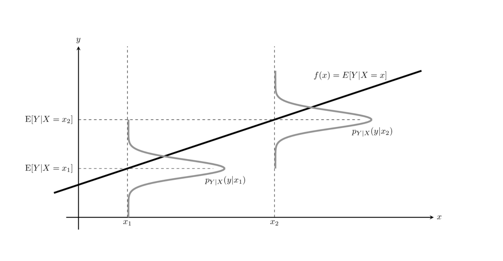
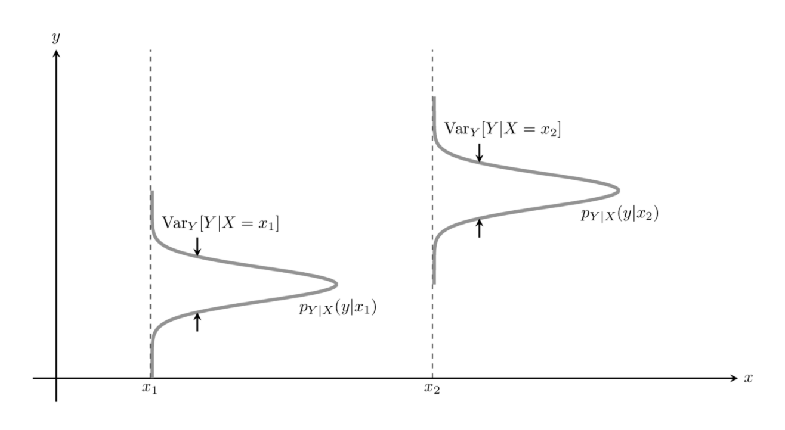

# 조건부 기댓값(Conditional expectation)과 예측 문제

### Summary

- 조건부 기댓값은 조건이 되는 확률변수의 값에 따라서 분포가 달라지는 확률변수이다.
- Bias-Variance Trade off(편향-분산상충 법칙)은 전체 분산의 법칙에서 예측 오차의 크기(bias)와 예측값의 변동(variance)의 합이 일정하므로 예측 오차(bias)를 줄면 variance(분산)가 커지고 모형이 복잡해지며 과최적화가 된다. 모형의 과최적화를 막기위해  variance를 작게하면 예측 오차(bias)가 증가하고 단순하게 모델을 만들어 언더피팅 된다.  
______________

확률변수 $$Y$$ 의 기댓값을 구할 때 조건부 확률밀도함수 $$f_{Y\vert X}(y|x)$$ 를 이용하여 가중치를 계산하면 **조건부 기댓값(conditional expectation) or 조건부 평균(conditional mean)** 이 된다.

$$
\text{E}_Y[Y \vert X] 
= \int_{y=-\infty}^{y=\infty} y \, f_{Y \vert X}(y|x) dy
$$

또는

$$
\text{E}[Y \vert X] 
= \int y \, f(y|x) dy
$$

조건이 되는 확률변수 $$X$$ 의 값 $$x$$ 는 조건부 기댓값을 사용하는 사용자가 지정해야 하는 독립변수이다. **조건부 기댓값은 조건이 되는 확률변수의 값에 따라서 분포가 달라지는 확률변수** 이다. 

$$E[Y|X]$$ 는 조건이 되는 확률변수의 값을 독립변수(입력변수)로 가지는 **함수** 이다.

$$
\text{E}[Y \vert X=x] 
= h(x) \\
or \\
\text{E}[Y \vert X] = h(X)
$$

$$ℎ(𝑥)$$는 조건이 되는 확률변수 $$𝑋$$의 값을 입력받아서 결과가 되는 확률변수 **$$𝑌$$의 기댓값을 출력하는 함수**이다. 조건부 기댓값 $$E[𝑌|𝑋]$$가 $$𝑋$$의 함수,즉 변환(transform)이므로 **조건부 기댓값 $$E[𝑌|𝑋]$$도 확률변수**이다.

확률변수 $$Y$$ 가 확률변수 $$X$$ 의 값을 독립변수로 하는 결정론적 함수값이라면 사용자가 $$X$$ 의 값을 어떤 값 $$x$$ 로 정하는 순간 $$Y$$ 의 값도 결정되어 버리기 때문에 $$Y = g(X)$$ 는 더이상 확률적인 값이 아니라 상수가 되어 버린다.

$$
\text{E}[Y \vert X] = \text{E}[g(X) \vert X] = g(X)
$$
확률변수 $$X, Y$$ 가 결정론적 함수 관계가 아닐 때도 다음 등식이 성립한다.
$$
\text{E}[g(X) Y \vert X] = g(X) \text{E}[Y \vert X]
$$

### 예측문제

두 확률변수 $$X, Y$$ 에서 $$X$$ 의 값을 알고 있을 때 $$Y$$ 의 값을 알아내는 것을 **예측(prediction)** 문제이다.

$$Y$$ 가 연속확률변수이면 회귀분석(regression analysis)

$$Y$$ 가 이산확률변수이면 분류(classification) 

### 전체 기댓값의 법칙

조건부 기댓값의 기댓값은 원래 확률변수의 보통 기댓값과 같다.

$$
\text{E}_X[\text{E}_Y[Y \vert X]] = \text{E}_Y[Y] \\
or \\
\text{E}[\text{E}[Y \vert X]] = \text{E}[Y]
$$

**전체 기댓값의 법칙(law of total expectation)** 또는 **반복 기댓값의 법칙(law of iterated expectation)** 이다. 

### 조건부분산

$$
\text{Var}_Y[Y \vert X] 
= \text{E}_Y[(Y - \text{E}_Y[Y \vert X])^2 \vert X] 
= \int (Y - \text{E}_Y[Y \vert X])^2 f_{Y \vert X}(y \vert x) dy
$$

조건부분산은 x의 값을 알고 있을 때 이에 대한 조건부확률분포의 분산이다. 예측문제의 관점으로 보면 조건부분산은 예측의 불확실성, 즉 예측으로 맞출 수 없는 범위를 뜻한다.

### 전체 분산의 법칙

**전체 분산의 법칙(law of total variance)**은 확률변수의 분산은 조건부 분산의 기댓값과 조건부 기댓값의 분산의 합과 같다.

$$
\begin{align}
\text{Var}[Y] = \text{E}[\text{Var}[Y\vert X]] + \text{Var}[\text{E}[Y\vert X]]
\end{align}
$$

$$\text{E}[Y\vert X] = \hat{y}$$ 이면 $$\text{Var}[Y] = \text{E}[(\hat{y}-y)^2] + \text{Var}[\hat{y}]$$ 이다.

예측문제의 관점에서 조건부분산의 기댓값 $$E[(\hat{y} - y)^2] $$ 은 예측 오차(편향(bias)의 평균적인 크기)이다. 조건부기댓값의 분산 $$Var[\hat{y}]$$ 은 예측값의 변동 크기다.  예측값의 변동 크기가 증가하면 예측모형이 복잡하고 비선형적이며 데이터의 과최적화가 되기 쉽다는 의미이다. 

#### Bias-Variance Trade off 편향-분산상충 법칙

전체 분산의 법칙에서 예측 오차의 크기(bias)와 예측값의 변동(variance)의 합이 일정하므로 예측 오차(bias)를 줄면 variance(분산)가 커지고 모형이 복잡해지며 과최적화가 된다. 모형의 과최적화를 막기위해 단순하게 variance를 작게하면 하면 예측 오차(bias)가 증가하여 언더피팅 된다.  

