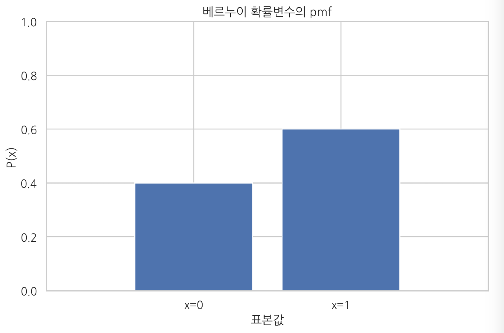
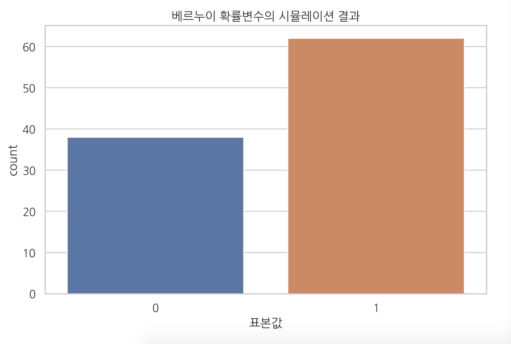

<script> MathJax.Hub.Queue(["Typeset",MathJax.Hub]); </script>

# Bernoulli distribution(베르누이 분포) & Binomial distribution(이항 분포)

### Summary

- 모수추정(parameter estimation)은 데이터에서 모수의 값을 찾아내는 것이다. 
- 베르누이분포는 베르누이 시행 결과를 실수 0 또는 1로 바꾼 것을 베르누이 확률변수라 하고 그 분포를 베르누이 분포라고 한다. 이산확률변수이고 확률질량함수로 정의된다. $$Bern(x;\theta) = \theta^x(1-\theta)^{1-x}$$ , $$X \sim Bren(x;\mu)$$
- 이항 분포(binomial distribution)는 성공확률이 $$\mu$$인 베르누이 시도를 $$𝑁$$번 반복하는 경우이다.  $$X \sim \text{Bin}(x;N,\mu)$$  
____________

## Bernoulli distribution (베르누이 분포)

### 베르누이 시도

베르누이 시도(Bernoulli trial)는 결과가 두 가지 중 하나로만 나오는 실험이나 시도이다. 

### 베르누이 확률변수

베르누이 확률변수(Bernoulli random variable)는 베르누이 확률변수의 결과를 실수 0 또는 1로 바꾼 것이다. 베르누이 확률변수는 두 가지 값 중 하나만 가질 수 있으므로 이산확률변수(discrete random bariable) 이다.

베르누이 확률변수의 확률질량함서(pdf)는 다음과 같다.

$$
\text{Bern}(x;\mu) = 
\begin{cases} 
\mu   & \text{if }x=1, \\
1-\mu & \text{if }x=0
\end{cases}
$$

베르누이 확률변수는 **1이 나올 확률** 을 의미하는 **$$\mu$$ 라는 모수(parameter)** 가진다. 

$$
\text{Bern}(x;\mu) = \mu^x(1-\mu)^{(1-x)}
$$

만약 베르누이 확률변수가 1과 -1 이라는 값을 가질 때 수식

$$
\text{Bern}(x; \mu) = \mu^{(1+x)/2} (1-\mu)^{(1-x)/2}
$$

어떤 확률변수 $$X$$ 가 베르누이 분포의 의해 발생된다면 **"확률변수 $$X$$ 가 베르누이 분포를 따른다"** 라고 말하고 수식은 다음과 같다.
$$
X \sim \text{Bern}(x;\mu)
$$

#### SciPy를 사용한 베르누이 확률변수의 시뮬레이션

Scipy의 stats 서브 패키지에 있는 `bernoulli` 클래스는 베르누이 확률변수를 구현하였다. `p`인수로 분포의 모수 $$\mu $$을 설정한다.

```python
# p=0.6 
mu = 0.6
rv = sp.stats.bernoulli(mu)

# 확률질량함수 `pmf` 메서드 사용
xx = [0, 1]
plt.bar(xx, rv.pmf(xx))
plt.xlim(-1, 2)
plt.ylim(0, 1)
plt.xticks([0, 1], ["x=0", "x=1"])
plt.xlabel("표본값")
plt.ylabel("P(x)")
plt.title("베르누이 확률변수의 pmf")
plt.show()
```



표본값을 무작위로 생성하려면 `rvs` 메서드를 사용한다. 다음 코드는 100개의 표본을 생성한다. 이는 위에서 만든 동전을 100번 던져 나온 결과를 나타낸 것과 같다. 그래서 확률변수의 표본을 생성하는 작업을 **시뮬레이션(simulation)**이라고도 부른다.

```python
x = rv.rvs(100, random_state=0)
# 생성 결과를 seaborn의 countplot 명령으로 시각화
sns.countplot(x)
plt.title("베르누이 확률변수의 시뮬레이션 결과")
plt.xlabel("표본값")
plt.show()
```



이론적인 확률분포와 표본의 확률분포를 동시에 보여주고 싶을 때

```python
y = np.bincount(x, minlength=2) / float(len(x))

df = pd.DataFrame({"이론": rv.pmf(xx), "시뮬레이션": y})
df.index = [0, 1]

df2 = df.stack().reset_index()
df2.columns = ["표본값", "유형", "비율"]

# seaborn의 barplot 명령으로 시각화
sns.barplot(x="표본값", y="비율", hue="유형", data=df2)
plt.title("베르누이 분포의 이론적 분포와 시뮬레이션 분포")
plt.show(
```

### 베르누이 분포의 모멘트

#### 기댓값

$$
\text{E}[X]  = \mu
$$

#### 분산

$$
\text{Var}[X] = \mu(1-\mu)
$$

기술통계값들은 SciPy의 `describe` 명령으로 계산할 수도 있다.

```python
s = sp.stats.describe(x)
#평균 , 분산
s[2], s[3]
```

### 베르누이 분포의 모수추정

**모수추정(parameter estimation)**은 데이터에서 모수의 값을 찾아내는 것이다. 
$$
\hat{\mu} = \dfrac{\sum_{i=1}^N x_i}{N}= \dfrac{N_1}{N}
$$

$$N$$ 은 전체 데이터의 수, $$N_1$$ 은 1이 나온 횟수

### 베르누이 분포의 활용

1. 분류예측 문제의 출력 데이터가 두 개의 값으로 구분되는 카테고리 값인 경우에 분류 결과 즉, 두 값 중 어느 값이 가능성이 높은지를 표현하기 위해 사용된다. (베이지안 관점)
2. 입력 데이터가 0 또는 1 혹은 참 또는 거짓, 두 개의 값으로 구분되는 카테고리 값인 경우, 두 종류의 값이 나타나는 비율을 표현하기 위해 사용된다. (빈도주의적 관점)

입력 데이터에서 베르누이 분포를 활용하는 방법은 키워드가 여러 개라면 다음과 같이 BOW(Bag of Words) 인코딩된 벡터로 나타낼 수 있다.

## Binomial distribution(이항분포)

### 이항분포

이항 분포(binomial distribution)는 성공확률이 $$\mu$$인 베르누이 시도를 $$𝑁$$번 반복하는 경우이다. 

$$N$$ 번 중 성공한 횟수를 확률변수 $$X$$ 라고 한다면 $$X$$ 의 값은 0부터 $$N$$ 까지의 정수 중 하나가 될 것이다. 이런 확률변수를 이항분포를 따르는 확률변수라고 한다. 

$$
X \sim \text{Bin}(x;N,\mu)
$$

이항 분포 확률변수 $$X$$ 의 확률질량함수

$$
\text{Bin}(x;N,\mu) = \binom N x  \mu^x(1-\mu)^{N-x}
$$
$$\binom N x$$ 기호는 **조합(combination)** : $$N$$ 개의 원소 중에 $$x$$ 개의 원소를 순서와 상관없이 선택할 수 있는 경우의 수를 뜻한다.
$$
\binom N x =\dfrac{N!}{x!(N-x)!}
$$

! 기호는 **팩토리얼(factorial)** 이라고 한다.
$$
N! = N\cdot (N-1) \cdots 2 \cdot 1
$$

#### SciPy를 사용한 이항 분포의 시뮬레이션

이항 분포 확률변수는 Scipy의 stats 서브 패키지에 `binom` 클래스로 구현되어 있다. `n` 인수로 전체 시도 횟수 𝑁를 넣고 `p` 인수로 베르누이 확률 분포의 기댓값 𝜇를 넣는다.

~~~python
N = 10
mu = 0.6
rv = sp.stats.binom(N, mu)
~~~

### 이항 분포의 모멘트

#### 기댓값

$$
\text{E}[X] = N\mu
$$

#### 분산

$$
\text{Var}[X] = N\mu(1-\mu)
$$

### 베르누이분포와 이항분포의 모수추정

데이터에서 모수의 값을 찾아내는 것을 **모수추정(parameter estimation)** 
$$
\begin{align}
\hat{\mu} = \dfrac{\sum_{i=1}^N x_i}{N}= \dfrac{N_1}{N}
\end{align}
$$
$$N$$ 전체 데이터의 수, $$N_1$$ 1이 나온 횟수