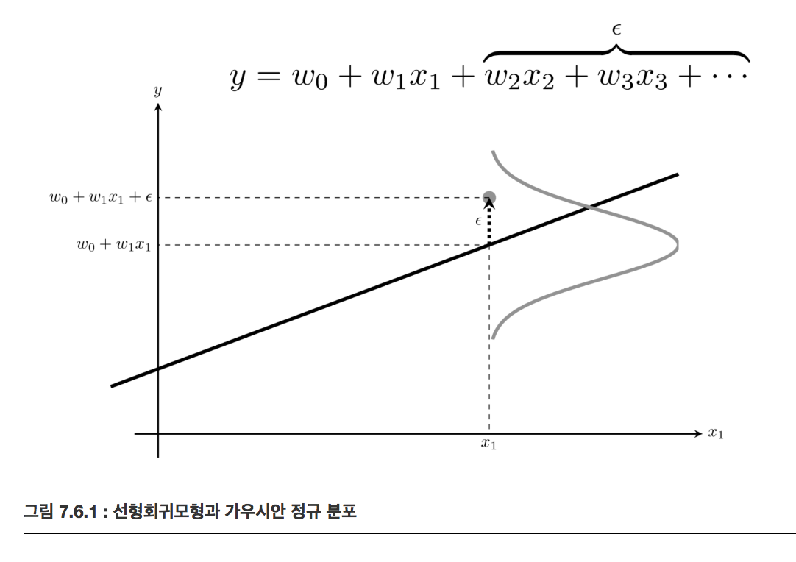

<script> MathJax.Hub.Queue(["Typeset",MathJax.Hub]); </script>

# Normal distribution(정규 분포) 

### Summary

- 중심극한정리는 모집단이 어떤 분포이고 샘플평균을 많이 샘플링 할 수록 정규분포에 수렴한다는 성질입니다. 두 집단의 측정치가 정규분포를 띤다고 가정하면 평균을 비교함으로써 두 집단간의 차이를 비교할 수 있습니다. 
- Q-Q(Quantile-Quantile)플롯은 분석한 데이터가 정규분포를 따르는지 시각화한 방법입니다. 동일분위수에 해당하는 정규분포 값과 샘플 분포의 값을 한쌍으로 스캐터플롯을 그린 것입니다.
- 정규분표의 표본 평균을 정규화한 것은 z통계량이다.
_____________

### 가우시안 정규 분포(Gaussian normal distribution), 정규분포(normal distribution)

자연 현상에서 나타나는 숫자를 확률 모형으로 모형화 할 때 많이 사용된다. 평균 $$\mu$$ 와 분산 $$\sigma^2$$ 라는 두 개의 모수만으로 정의된다.

확률밀도함수(pdf:probability density function) 

$$
\mathcal{N}(x; \mu, \sigma^2) = \dfrac{1}{\sqrt{2\pi\sigma^2}} \exp \left(-\dfrac{(x-\mu)^2}{2\sigma^2}\right)
$$

분산의 역수를 **정밀도(precision)** $$\beta$$ 라고 부르기도 한다.

$$
\beta = \dfrac{1}{\sigma^2}
$$

표준 정규 분포(standard normal distribution)는 정규 분포 중에서도 평균이 0 이고 분산이 1인($$\mu = 0, \sigma^2 = 1$$) 정규 분포이다. 

정규 분포의 확률밀도함수 성질
- $$x = \mu$$ 일 때 확률밀도가 최대가 된다.
- $$x = \infty $$ 로 다가가거나 $$x = -\infty $$ 로 다가갈수록 확률밀도가 작아진다.

#### SciPy를 사용한 정규 분포의 시뮬레이션

Scipy의 stats 서브 패키지에 있는 `norm` 클래스가 정규 분포 클래스이다. `loc` 인수로 기댓값 $$\mu$$를 설정하고 `scale` 인수로 표준편차 $$\sqrt{\sigma^2}$$를 설정한다.

~~~python
mu = 0
std = 1
rv = sp.stats.norm(mu, std)
~~~

pdf 메서드를 사용하면 확률밀도함수를 계산할 수 있다.

~~~python
xx = np.linspace(-5, 5, 100)
plt.plot(xx, rv.pdf(xx))
plt.ylabel("p(x)")
plt.title("정규 분포의 확률 밀도 함수(pdf)")
plt.show()
~~~

시뮬레이션을 통해 표본을 얻으려면 `rvs` 메서드를 사용한다.

~~~python
x = rv.rvs(20)
sns.distplot(x, kde=True, fit=sp.stats.norm)
plt.title("랜덤 표본 생성 결과")
plt.xlabel("표본값")
plt.ylabel("$$p(x)$$")
plt.show()
~~~

### 로그정규분포(log-normal distribution)

데이터에 로그를 한 값 또는 변화율이 정규분포가 되는 분포이다. 항상 양수이다

### Quantile-Quantile plot (Q-Q 플롯)

정규 분포 검정(normality test)는 어떤 확률변수의 분포가 정규 분포인지 아닌지 확인하는 가장 중요한 통계적 분석이다.

Q-Q(Quantile-Quantile)플롯은 분석하고자 하는 표본 데이터의 분포와 정규 분포의 분포 형태를 비교하여 표본 데이터가 정규 분포를 따르는지 검사하는 간단한 시각적 도구이다. 동일 분위수에 해당하는 정상 분포의 값과 주어진 데이터 값을 한 쌍으로 만들어 그린 스캐터(scatter plot) 이다. 

Q-Q 플롯을 그리는 방법

- 표본 데이터를 정렬(sort)한다


```python
x_sorted = np.sort(x)
x_sorted
```

- 하나하나의 표본 데이터가 전체 데이터 중의 몇 % 정도에 해당하는지 위치 값을 구한다. SciPy에서는 특정 순위의 값이 나타날 가능성이 높은 값을 뜻하는 순서 통계량(order statistics)이라는 값을 이용한다.

```python
from scipy.stats.morestats import _calc_uniform_order_statistic_medians

position = _calc_uniform_order_statistic_medians(len(x))
position
```

- 각 표본 데이터의 위치 값이 정규 분포의 누적확률함수(cdf) 값이 되는 표준 정규 분포의 표본값을 구한다. 즉 확률값에 대한 누적확률함수의 역함수 값을 구한다. 이를 표본 정규 분포의 분위함수(quantile function)값이라고 한다. 예를 들어 표본 정규 분포의 1%의 분위함수값은 $$𝐹^{−1}(0.01)$$, 약 -2.326이다.


```python
qf = rv.ppf(position)
qf
```

- 표본 데이터와 그에 대응하는 분위수를 하나의 쌍으로 간주하여 2차원 공간에 하나의 점(point)으로 그린다.

- 모든 표본에 대해 2부터 4까지의 과정을 반복하여 스캐터 플롯을 완성한다.


```python
plt.scatter(qf, x_sorted)
plt.title("QQ plot")
plt.xlabel("Theoretical quantiles")
plt.ylabel("Ordered values")
plt.axis("equal")
plt.show()
```

- SciPy 패키지의 stats 서브 패키지는 Q-Q 플롯을 계산하고 그리기 위한 `probplot` 명령을 제공한다.

  - `probplot`은 기본적으로 인수로 보낸 데이터 표본에 대한 Q-Q 정보만을 반환하고 챠트는 그리지 않는다. 만약 차트를 그리고 싶다면 `plot` 인수에 matplotlib.pylab 모듈 객체 혹은 `Axes` 클래스 객체를 넘겨주어야 한다.

  ~~~python
  np.random.seed(0)
  plt.figure(figsize=(7, 7))
  sp.stats.probplot(x, plot=plt)
  plt.axis("equal")
  plt.show()
  ~~~

**정규 분포를 따르지 않는 데이터 표본**을 **Q-Q 플롯**으로 그리면 직선이 아닌 **휘어진 형태로 나타**난다.

### 중심 극한 정리

중심 극한 정리(Central Limit Theorem)는 실세계에서 발행하는 현상 중 많은 것들이 정규 분포로 모형화 가능한 이유이다. 여러 확률 변수의 합이 정규 분포와 비슷한 분포를 이루는 현상이다.

**$$N$$ 개의 임의의 분포로부터 얻은 표본의 평균은 $$N$$ 이 증가할 수록 기댓값이 $$\mu$$, 분산이 $$\dfrac{\sigma^2}{N}$$ 인 정규 분포로 수렴한다.  **
$$
\bar{X}_N \xrightarrow{d}\ \mathcal{N}\left(x;\mu,\dfrac{\sigma^2}{N}\right)
$$

**N개의 임의의 분포로부터 얻은 표본의 평균을 정규화하면 N이 증가할 수록 표준 정규 분포로 수렴한다.**
$$
\dfrac{\bar{X}_N - \mu}{\dfrac{\sigma}{\sqrt{N}}} \xrightarrow{d}\ \mathcal{N}(x;0,1)
$$

중심극한정리의 맹점은 중심극한정리를 맹신하여 모든 상황이 정규분포에 수렴한다는 가정을 하는 것. 모집단의 데이터가 충분하지 않거나 특수한 도메인의 경우에는 정규분포에 수렴하지 않을 수 있다.

큰 수의 법칙이란 어떤 확률을 가진 시행을 큰 수로 반복했을 때, 그 사건의 결과는 평균의 값으로 수렴하게 된다는 것. 예를 들어 앞면 뒷면을 가진 동전을 여러번 던졌을때, 그 비율은 1:1로 수렴하게 되는것이다.

Universal Approximation Theorem은 Deep Learning에서의 중심극한정리라고 말할 수 있는 개념이다. 존재할 수 있는 모든 함수 f(x)는 인공신경망으로 반드시 수렴시킬 수 있다는 간단한 이론이다. 딥 러닝을 연구하는 여러 유명인사들이 자주 강조하는 개념이다. 

### 정규 분포의 통계량 분포

**N개의 가우시안 정규 분포로부터 얻은 표본의 합은 N과 상관없이 기댓값이 $$N\mu$$, 분산이 $$N\sigma^2$$인 정규 분포다.**
$$
x_i \sim \mathcal{N}(\mu, \sigma^2) \;\; \rightarrow \;\; \sum_{i=1}^N x_i \sim \mathcal{N}(N\mu, N\sigma^2)
$$

가우시안 정규 분포의 표본에 상수를 빼거나 곱해도 가우시안 정규 분포이다. 이 경우에도 위와 같이 기댓값이 0, 표준편차가 1이 되도록 정규화를 하면 다음과 같이 쓸 수 있다.
$$
x_i \sim \mathcal{N}(\mu, \sigma^2) \;\; \rightarrow \;\;  z = \dfrac{\bar{x} - \mu}{\dfrac{\sigma}{\sqrt{N}}} \sim \mathcal{N}(x;0,1)
$$

가우시안 정규 분포 표본의 평균을 정규화한 통계량을 $$z$$ 통계량이라고 한다. 중심 극한 정리와 다른 점에 주의해야 한다. **중심 극한 정리에서는 표준 정규 분포로 점점 다가갈 뿐이고 표본의 갯수가 무한대가 되기 전에는 정확한 정규 분포가 아니지만 z 통계량은 갯수 N에 상관없이 항상 정확하게 표준 정규 분포**이다.

### 선형회귀모형과 정규분포

정규 분포는 선형회귀모형에서 잡음(disturbance)을 모형화하는데 사용된다.
$$
y = w_1 x_1 +  \ldots + w_N x_N + \epsilon
$$

**$$\epsilon$$ 은 잡음(disturbance)이라고 하며 우리가 값을 측정할 수 없는 입력변수** 이다. 잡음 𝜖이 기댓값이 0인 가우시안 정규분포라고 가정하는 것은 합리적이다.

$$
\epsilon \sim \mathcal{N}(0, \sigma^2)
$$



___________________________________
###### Reference
김도형 박사님 강의를 수강하며 데이터사이언티스트스쿨(https://datascienceschool.net/) 강의자료를 토대로 공부하며 정리한 내용임을 말씀드립니다.