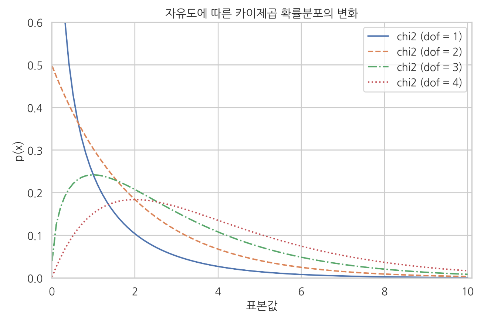
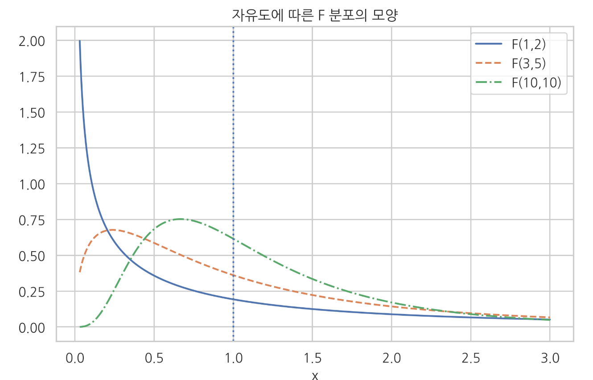
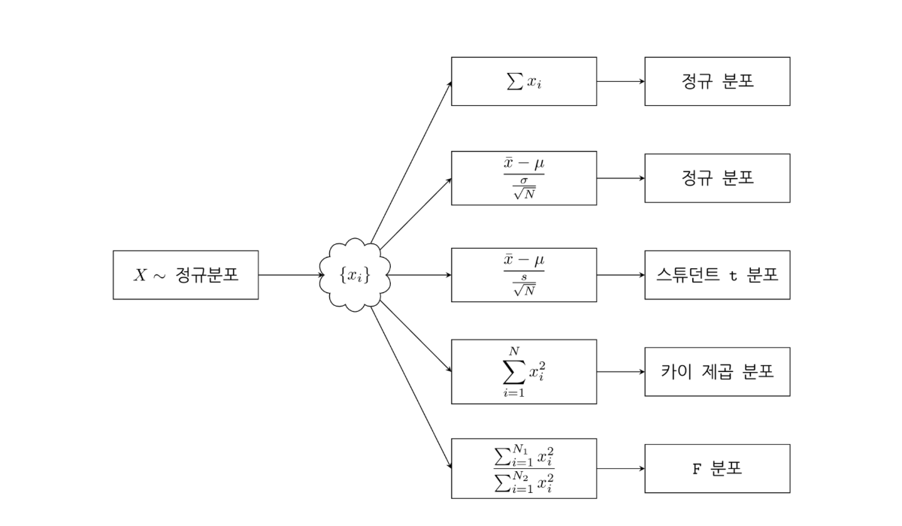

# Z분포 & 스튜던트 t 분포 & 카이제곱 분포 & F분포

### Summary

- 스튜던트 t분포는 정규모집단에서 모분산을 모를때 모평균 추정시 t분포를 사용합니다. t 통계량은 정규분포에서 얻은 N개의 표본 데이터의 표본 평균을 표본표준편차로 정규화한 값이다. 자유도가 N-1인 스튜던트 t 분포를 따른다.
- 카이제곱 분포(chi-squared)는 가우시안 정규 분포를 따르는 확률 변수에서 $$N$$개의 샘플들을 제곱하고 더하여 양수값만을 가지는 분포이다. 
- F 분포는 카이제곱분포를 따르는 두 확률변수에서 나온 확률분포표본을 각각 자유도 모수로 나눈 비율을 F분포라고 한다. F분포는 2개 이상의 표본평균들이 동일한 모평균을 가진 집단에서 추출되었는지 판단할 때 사용한다. 진단간변량/집단내변량의 비율을 계산해 값이 크면 집단내변량이 작다는 것으로 다른 모평균을 가졌을 확률이 높다. ANOVA(분산분석) 분석하는 방법이다. 
_________________

### Z 분포

Z-분포는 모집단의 정규분포를 의미합니다. 모집단이란 내가 알고 싶어하는 그 대상입니다. (모집단의 특성을 파악한다고 하면 정규분포의 주요 인자인 평균과 분산을 의미)
모집단이기 때문에 실제 대상의 평균과 분산을 모르는 경우가 많아 샘플링된 평균과 분산이 모집단의 특성을 잘 반영한다고 가정합니다. 

### 스튜던트 t분포

T-분포는 정규분포는 아니지만 정규분포에 근사시켜 모집단의 값을 추정할 때 활용됩니다. 

스튜던트 t분포(student-t distribution)는 팻-테일(분포의 모양을 볼 때 양 끝(꼬리) 부분이 정규 분포보다 두껍다)을 보이는 데이터의 모형에 적합하다.
꼬리 부분 면적이 더 넓은 이유는 분산을 샘플 추정량에 의존하기 때문입니다. 

Q-Q 플롯으로 정규성을 확인했을 때 정규분포보다 더 극단적인 경우가 많이 발생하는(펫 테일을 보이는) 데이터 모형은 스튜던트 t분포가 적합하다.

스튜던트 t분포 확률밀도함수는 정수값을 가지는 자유도(degree of freedom)라는 모수 $$v$$를 추가적으로 가진다. 모수 $$v$$는 보통 2 이상의 자연수를 사용한다

모수 $$v$$ 가 1인 경우는 코시분포(Cauchy distribution)이다, 코시분포에서 양수인 부분만 사용하는 경우에는 하프코시분포(Half-Cauchy distribution)라고 부른다.

$$
t(x;\mu, \lambda, \nu) = \frac{\sqrt{\lambda}}{\sqrt{\nu\pi}}\frac{\Gamma\left(\frac{\nu+1}{2}\right)} {\Gamma\left(\frac{\nu}{2}\right)} \left(1+\lambda\frac{(x-\mu)^2}{\nu} \right)^{-\frac{\nu+1}{2}}
$$

이 식에서 $$\lambda$$는 가우시안 정규분포의 정밀도 $$(\sigma^2)^{−1}$$에 대응하는 개념이고 $$Γ(𝑥)$$는 감마(Gamma) 함수라는 특수 함수이다.
$$
\Gamma(x) = \int_0^\infty  u^{x-1} e^{-u} du
$$

스튜던트 t 분포의 확률 밀도 함수를 그리려면 SciPy 패키지의 `t` 명령을 사용한다. 이 때 인수 `df`는 자유도, `loc`는 기댓값, `scale`은 표준편차를 설정한다. 그림에서 자유도 $$𝜈$$가 작으면 가우시안 정규 분포보다 분산이 크고 fat tail을 보이지만 자유도가 증가할수록 가우시안 정규 분포로 수렴하는 것을 볼 수 있다.

#### 스튜던트 t 분포의 기댓값과 분산

- 기댓값 $$\text{E}[X] = \mu$$

- 분산 ($$v$$ > 2 인 경우만 적용됨, $$v$$ = 1, 2 일 때는 분산이 무한대) $$\text{Var}[X] = \dfrac{\nu}{\lambda(\nu-2)}$$

#### t 통계량

**t 통계량**은 가우시안 정규 분포로부터 얻은 $$N$$ 개의 표본 $$x_1, … , x_N$$ 에서 계산한 **표본평균을 표본표준편차로 정규화한 값** 입니다. 

**t 통계량은 자유도가 N−1인 스튜던트 t 분포**를 이룹니다.
$$
t = \frac{\bar{x} - \mu}{\dfrac{s}{\sqrt{N}}} \sim t \, (x; 0, 1, N - 1)
$$

이 식에서 $$\bar{x}, s$$은 각각 표본평균, 표본표준편차입니다.

$$
\bar{x} = \frac{x_1+\cdots+x_N}{N} \\
s^2 = \frac{1}{N-1}\sum_{i=1}^N (x_i - \bar{x})^2
$$

이 정리는 추후 정규 분포의 기댓값에 관한 각종 검정(testing)에서 사용됩니다.

### 카이제곱 분포

카이제곱 분포(chi-squared)는 가우시안 정규 분포를 따르는 확률 변수 $$X$$ 의 $$N$$ 개의 샘플 $$x_1, … ,x_N$$ 에서 제곱을 하여 더하면 양수값만을 가지는 분포이다. 

$$
x_i \sim \mathcal{N}(x) \\
\downarrow \\
\sum_{i=1}^N x_i^2 \sim \chi^2(x;\nu=N)
$$

카이제곱 분포의 확률 밀도 함수

$$
\chi^2(x; \nu) = \frac{x^{(\nu/2-1)} e^{-x/2}}{2^{\nu/2} \Gamma\left(\frac{\nu}{2}\right)}
$$

SciPy 의 stats 서브 패키지의 `chi2` 클래스를 사용하여 확률 밀도 함수의 모양 그릴 수 있다.

카이제곱 분포에서 특이한 점은 제곱합을 하는 샘플의 수가 2보다 커지면 0근처의 값이 가장 많이 발생할 것이라는 직관과 달리 **0보다 큰 어떤 수가 더 흔하게 발생한다는 점**이다(중심극한정리 때문에 점점 정규분포가 된다). 시뮬레이션을 통해 실제로 제곱합의 분포를 살펴보면 다음과 같다. 왼쪽은 정규 분포의 샘플을 단순히 제곱한 값의 분포이고 오른쪽은 정규 분포의 샘플 4개를 제곱하여 합한 값의 분포이다. 오른쪽 분포는 0이 아닌 1 근처의 값이 가장 많이 나오는 것을 볼 수 있다. 

### F 분포

F 분포는 카이 제곱 분포를 따르는 독립적인 두 개의 확률 변수. $$\chi^2_1(x;N_1)$$와 $$\chi^2_2(x;N_2)$$의 확률 변수 표본을 각각 $$𝑥_1$$, $$𝑥_2$$이라고 할 때 이를 각각 $$𝑁_1$$, $$𝑁_2$$로 나눈 뒤 비율을 구하면 $$F(x;N_1, N_2)$$ 분포가 된다. $$N_1, N_2$$ 는 $$F $$ 분포의 자유도 모수라고 한다.

F 분포는 2개 이상의 표본 평균들이 동일한 모평균을 가진 집단에서 추출되었는지 판단할 때 사용됩니다. 집단간변량/집단내변량의 비율을 계산해 값이 크면 집단내변량이 작다는 것이니 다른 모평균을 가졌을 확률이 높습니다. 분산분석(ANOVA)가 분석하는 방법입니다.

$$
x_1 \sim \chi^2(N_1),\, x_2 \sim \chi^2(N_2) \;\; \rightarrow \;\; \frac{\frac{x_1}{N_1}}{\frac{x_2}{N_2}} \sim F(x; N_1, N_2)
$$

F 분포의 확률 밀도 함수

$$
f(x; N_1,N_2) = \dfrac{\sqrt{\dfrac{(N_1\,x)^{N_1}\,\,N_2^{N_2}} {(N_1\,x+N_2)^{N_1+N_2}}}} {x\;\text{B}\left(\frac{N_1}{2},\frac{N_2}{2}\right)}
$$

$$B(x)$$ 는 베터(Beta) 함수라는 특수 함수이다.

SciPy stats 서브패키지의 `f` 클래스는 F 분포를 지원한다. 

F 분포에서 특이한 점은 $$𝑁_1$$과 $$𝑁_2$$의 값이 같을 경우 1근처의 값이 가장 많이 발생할 것이라는 직관과 달리 1 이 아닌 다른 수가 더 흔하게 발생한다는 점이다.

### 스튜던트 t분포와 F 분포의 관계

스튜던트 t 분포의 표본 값을 제곱한 값은 F-분포를 따른다.
$$
t(N)^2 = F(1, N)
$$

### 활용

스튜던트 t 분포, 카이 제곱 분포, F 분포는 모두 가우시안 정규 분포의 통계량 분포(statistics distribution)의 일종이다.

선형회귀분석에서 이 통계량 분포들은 각각 다음 값에 대한 확률모형으로 사용된다.

- 스튜던트 t 분포: 추정된 계수 𝑤에 대한 확률 분포
- 카이 제곱 분포: 오차 제곱합(residual sum of squre)에 대한 확률 분포
- F 분포: 비교 대상이 되는 선형모형의 오차 제곱합에 대한 비율의 확률 분포