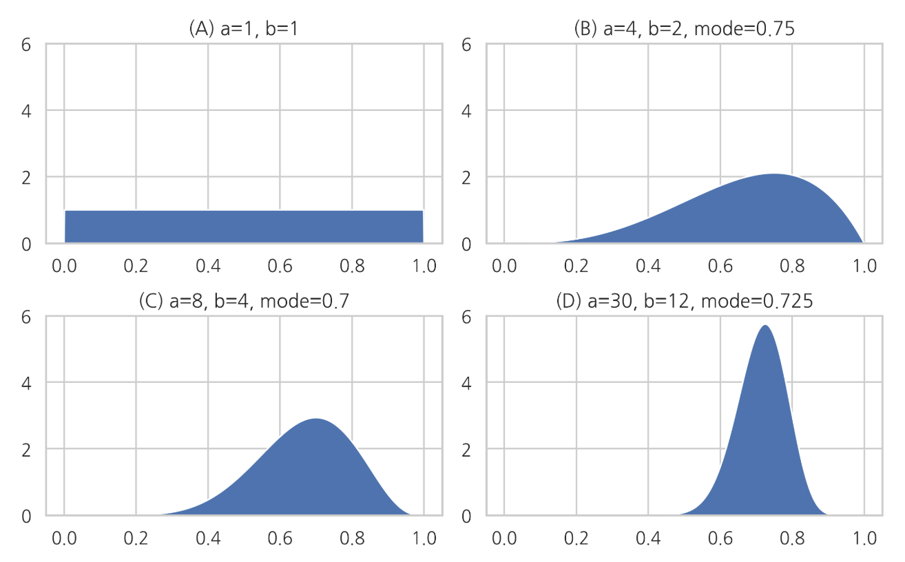
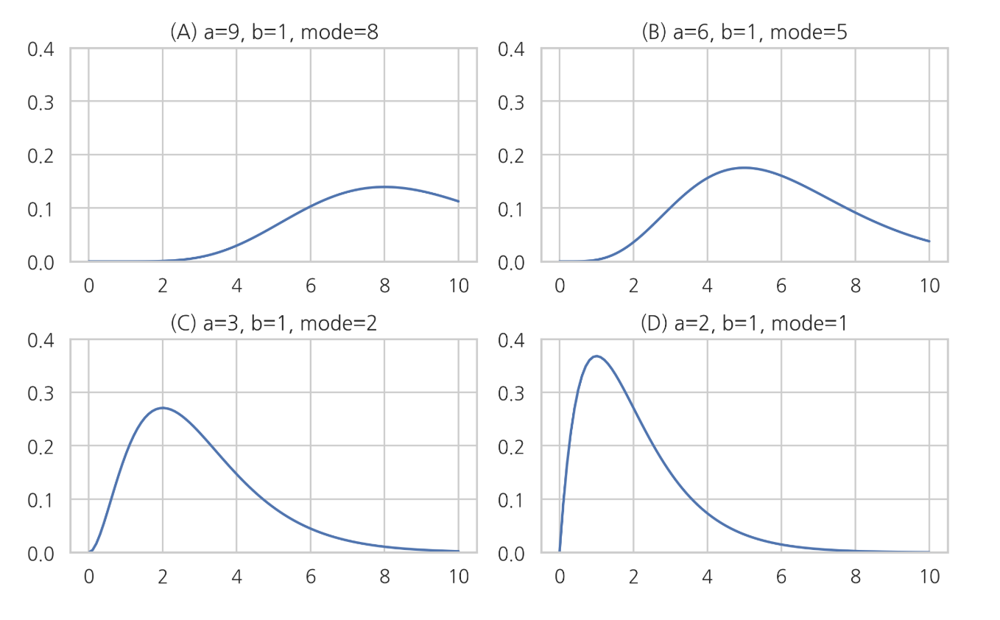

# 베타 분포, 감마 분포, 디리클레분포

### Summary

- 베타분포, 감마분포, 디리클레분포는 모숫값을 조정하여 분포의 모양을 내가 원하는대로 쉽게 바꿀 수 있다. 
- 모숫값은 분포 모양을 조절하는 조절값
- 베타분포는  0부터 1까지의 값을 가질 수 있는 베르누이 분포의 모수 $$𝜇$$의 값을 추정한 결과를 표현한 것이다. 자연계에 존재하는 분포보다는 모수의 베이지안 추정에 사용되는 분포입니다. 모수가 하나의 값이 아닌 분포로 묘사됩니다. 
- 감마 분포(Gamma distribution)는 모수의 베이지안 추정에 사용 된다. 0부터 무한대의 값을 가지는 양수 값을 추정하는데 사용된다.
- 디리클레 분포(Dirichlet distribution)는 0과 1사이의 값을 가지는 다변수(multivariate) 확률변수의 베이지안 모형에 사용된다.
- 베이지안 추정은 모수가 가질 수 있는 모든 값에 대해 가능성을 확률분포로 나타낸 것을 말한다.
- 베이지안 확률론의 관점 에서 어떤 값에 대해 확신 혹은 신뢰의 정도를 표현하는데 주로 사용 
____________________

### 베타 분포(Beta distribution)

베타 분포는 a와 b라는 두 개의 모수를 가지며 표본 공간은 0과 1 사이의 실수이다. 즉 0과 1 사이의 표본값만 가질 수 있다.

$$
\text{Beta}(x;a,b), \;\; 0 \leq x \leq 1
$$

**베타 분포의 확률밀도함수**

$$
\begin{align}
\text{Beta}(x;a,b) 
& = \frac{\Gamma(a+b)}{\Gamma(a)\Gamma(b)}\, x^{a-1}(1-x)^{b-1} 
\end{align}
$$

$$\Gamma(a)$$ 는 감마 함수(Gamma funtion)이라는 특수 함수

$$
\Gamma(a) = \int_0^\infty  x^{a-1} e^{-x}\, dx
$$

**모수 $$𝑎,𝑏$$**가 **베타 분포의 모양을 결정**하는 형상 인자(shape factor)라는 것을 알 수 있다. 베타 분포의 기댓값, 최빈값, 분산은 각각 다음과 같다.

**기댓값** 

$$
E[x] = \dfrac{a}{a+b}
$$

**최빈값** : 확률분포가 가장 커지는 위치

$$
\dfrac{a - 1}{a+b - 2}
$$

**분산** : 확률분포의 폭

$$
\text{Var}[x] = \dfrac{ab}{(a+b)^2(a+b+1)}
$$

최빈값 수식을 보면 $$𝑎=𝑏$$일 때 $$𝑥=0.5$$에서 가장 확률밀도가 커지는 것을 알 수 있다. 또한 분산 수식에서 분모가 3차식, 분자가 2차식이기 때문에 $$𝑎,𝑏$$의 값이 커질 수록 분산 즉, 확률분포의 폭이 작아진다.

베타 분포(Beta distribution)는 다른 확률 분포와 달리 자연계에 존재하는 데이터의 분포를 묘사하는 것 뿐 아니라 **다른 확률분포함수의 모수를 베이지안 추정(Bayesian estimation)한 결과**를 표현하기 위해 사용된다. **베이지안 추정은 모수가 가질 수 있는 모든 값에 대해 가능성을 확률분포로 나타낸 것**을 말한다.

베타 분포는 0부터 1까지의 값을 가질 수 있는 베르누이 분포의 모수 $$𝜇$$의 값을 추정한 결과를 표현한 것이다.

위 그림이 베이지안 추정 결과라면 각각은 베르누이 분포의 모수 $$𝜇$$에 대해 다음과 같이 추정한 것과 같다.

- (A): 베르누이 분포의 모수 𝜇μ를 추정할 수 없다. (정보가 없음)
- (B): 베르누이 분포의 모수 𝜇μ값이 0.75일 가능성이 가장 크다. (정확도 낮음)
- (C): 베르누이 분포의 모수 𝜇μ값이 0.70일 가능성이 가장 크다. (정확도 중간)
- (D): 베르누이 분포의 모수 𝜇μ이 0.725일 가능성이 가장 크다. (정확도 높음)

### 감마 분포

감마 분포(Gamma distribution)는 모수의 베이지안 추정에 사용 된다. 0부터 무한대의 값을 가지는 양수 값을 추정하는데 사용된다.

감마 분포의 확률 밀도 함수

$$
\text{Gam}(x;a,b) = \frac{1}{\Gamma(a)} b^a x^{a-1}e^{-bx}
$$

SciPy의 stats 서브패키지에서 제공하는 `gamma` 클래스는 모수 $$𝑏=1$$로 고정되어 $$𝑎$$ 값만 설정할 수 있다. $$𝑏$$를 바꾸려면 $$𝑥$$값 스케일과 계수를 수동으로 설정하여야 한다

~~~python
xx = np.linspace(0, 10, 100)
plt.subplot(221)
plt.plot(xx, sp.stats.gamma(9).pdf(xx))
plt.ylim(0, 0.4)
plt.title("(A) a=9, b=1, mode=8")
plt.subplot(222)
plt.plot(xx, sp.stats.gamma(6).pdf(xx))
plt.ylim(0, 0.4)
plt.title("(B) a=6, b=1, mode=5")
plt.subplot(223)
plt.plot(xx, sp.stats.gamma(3).pdf(xx))
plt.ylim(0, 0.4)
plt.title("(C) a=3, b=1, mode=2")
plt.subplot(224)
plt.plot(xx, sp.stats.gamma(2).pdf(xx))
plt.ylim(0, 0.4)
plt.title("(D) a=2, b=1, mode=1")
plt.tight_layout()
plt.show()
~~~

위 그림이 베이지안 추정 결과라면 각각은 모수에 대해 다음과 같이 추정한 것과 같다.

- A): 모수값이 8일 가능성이 가장 크다. (정확도 아주 낮음)
- (B): 모수값이 5일 가능성이 가장 크다. (정확도 낮음)
- (C): 모수값이 2일 가능성이 가장 크다. (정확도 높음)
- (D): 모수값이 1일 가능성이 가장 크다. (정확도 아주 높음)

감마의 분포의 기댓값, 최빈값, 분산은 아래와 같다.

기댓값 $$\text{E}[X] = \dfrac{a}{b}$$

최빈값 $$\dfrac{a-1}{b}$$

분산 $$\text{Var}[X] = \dfrac{a}{b^2}$$

##### N(Nomal) - N(Nomal) - I(Inverse)G(Gamma) Model (=NNIG model)

베이지안 추정의 $$\mu$$ 와 $$\sigma^2$$ 에서 $$\mu$$ 는 정규 분포로  $$\sigma^2$$ 는 감마 분포로 나타낼 수 있다.

### 디리클레 분포

디리클레 분포(Dirichlet distribution)는 0과 1사이의 값을 가지는 다변수(multivariate) 확률변수의 베이지안 모형에 사용된다.

다변수 확률변수들의 합이 1이 되어야 한다는 제한 조건을 가진다.

$$
0 \leq x_i \leq 1, \;\;\; \sum_{i=1}^{K} x_i = 1
$$

디리클레 분포의 확률 밀도 함수

$$
\text{Dir}(x_1, x_2, \cdots, x_K; \alpha_1, \alpha_2, \cdots, \alpha_K) 
= 
\frac{1}{\mathrm{B}(\alpha_1, \alpha_2, \cdots, \alpha_K)} \prod_{i=1}^K x_i^{\alpha_i - 1}
$$

$$(\alpha_1, \alpha_2, \ldots, \alpha_K)$$ 는 디리클레 분포의 모수 벡터이고 $$B(\alpha_1, \alpha_2, \ldots, \alpha_K)$$ 는 베타 함수라는 특수 함수이다
$$
\mathrm{B}(\alpha_1, \alpha_2, \cdots, \alpha_K) = \frac{\prod_{i=1}^K \Gamma(\alpha_i)} {\Gamma\bigl(\sum_{i=1}^K \alpha_i\bigr)}
$$

### 베타 분포와 디리클레 분포의 관계

베타 분포는 $$K = 2$$ 인 디리클레 분포라고 볼 수 있다.

즉 $$x_1 = x, x_2 = 1 - x, \alpha_1 = a, \alpha_2 = b$$ 로 하면

$$
\begin{eqnarray}
\text{Beta}(x;a,b) 
&=& \frac{\Gamma(a+b)}{\Gamma(a)\Gamma(b)}\, x^{a-1}(1-x)^{b-1} \\
&=& \frac{\Gamma(\alpha_1+\alpha_2)}{\Gamma(\alpha_1)\Gamma(\alpha_2)}\,  x_1^{\alpha_1 - 1} x_2^{\alpha_2 - 1} \\
&=& \frac{1}{\mathrm{B}(\alpha_1, \alpha_2)} \prod_{i=1}^2 x_i^{\alpha_i - 1}
\end{eqnarray}
$$

### 디리클레 분포의 모멘트

디리클레 분포의 기댓값, 모드, 분산은 다음과 같다. 

$$
\alpha=\sum\alpha_k
$$

기댓값 $$\text{E}[x_k] = \dfrac{\alpha_k}{\alpha}$$

모드 $$\dfrac{\alpha_k - 1}{\alpha - K}$$

분산 $$\text{Var}[x_k] =\dfrac{\alpha_k(\alpha - \alpha_k)}{\alpha^2(\alpha + 1)}$$

기댓값 공식을 보면 모수인 $$(𝛼_1,𝛼_2,…,𝛼_𝐾)$$는 $$(𝑥_1,𝑥_2,…,𝑥_𝐾)$$중 어느 수가 더 크게 나올 가능성이 높은지를 결정하는 형상 인자(shape factor)임을 알 수 있다. 모든 $$𝛼_𝑖$$값이 동일하면 모든 $$𝑥_𝑖$$의 분포가 같아진다.

분산 공식을 보면 $$(𝛼_1,𝛼_2,…,𝛼_𝐾)$$의 절대값이 클수록 분산이 작아진다. 즉, 디리클리 분포의 표본값 $$𝑥$$가 어떤 특정한 값 주변이 나올 가능성이 높아진다.

