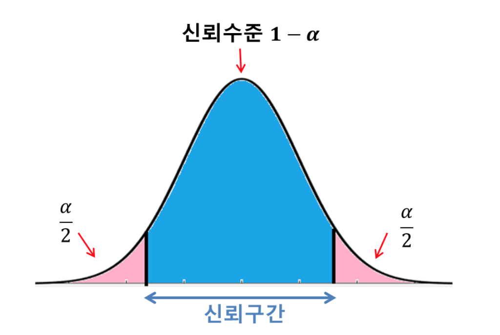
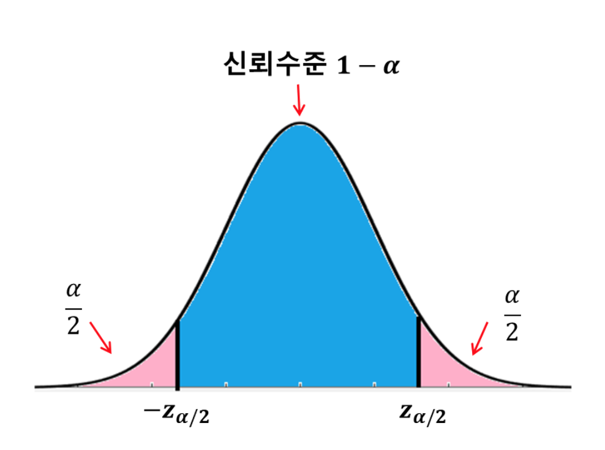
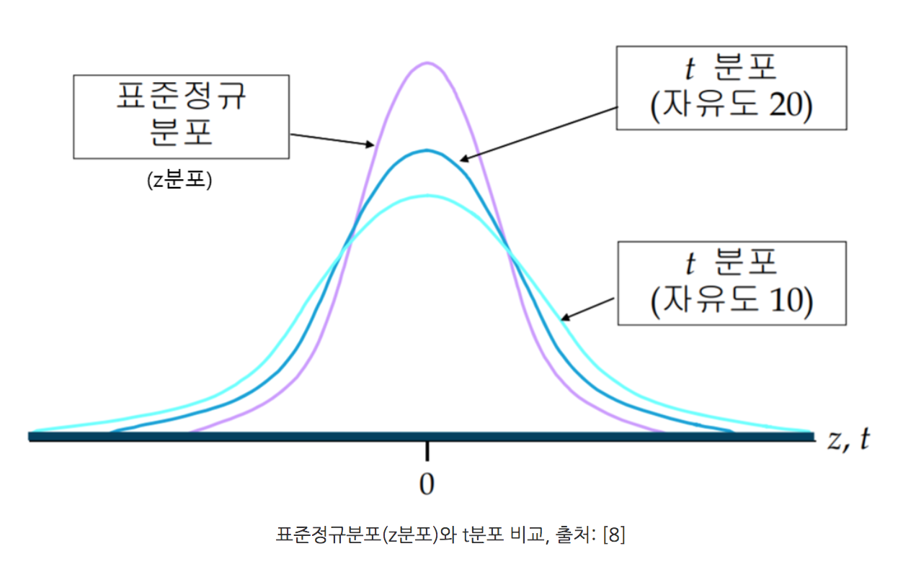

# 신뢰구간 Confidence interval

### 점추정(point estimation), 구간 추정(interval estimation)

추정에는 점추정(point estimation)과 구간 추정(interval estimation) 이 있다. 

점추정(point estimation)은 모수가 얼마일 것이라고 하나의 수치를 추정하는 것이다. 여기서 모수는 모평균, 모분산, 모표준편차, 모비율 등 모집단의 특성에 관한 수치들을 의미한다. 

구간추정(interval estimation)은 모수가 어느 값 a 와 어느 값 b 사이, 즉 어떤 구간 내에 몇 %의 확률로 존재할 것이라고 추정하는 것이다. 

### 신뢰구간 confidence interval

구간 내의 확률을 신뢰수준(cofidence level) 또는 신뢰도라고 한다.

신뢰구간(cofidence interval)은 구간 내에 실제 모수가 존재할 것으로 예측되는 구간이다.

$$
a \leq \mu \leq b
$$

모수가 신뢰구간 안에 포함되지 않을 확률을 보통 $$\alpha$$ 로 표현한다. 

모수가 신뢰구간에 포함될 확률, 즉 신뢰수준은 $$1-\alpha$$ 이다. 

$$
P(a \leq \mu \leq b) = 1 - \alpha
$$

만약 신뢰수준 $$1-\alpha$$ 이 0.95 즉, 95% 이면 $$\alpha=0.05$$ 이다. 

모수가 신뢰구간에 속하지 않을 확률이 양쪽 꼬리부분에 각각 $$\dfrac {\alpha}{2}$$ 만큼씩 있다.

신뢰구간을 추정할 때는 상황에 따라 다른 확률분포를 사용해야한다. 
- 만약 모분산 $$\sigma^2$$ 을 알고 있다면, 표본의 크기와 관계없이 정규분포를 사용한다. (모분산을 아는 경우는 드물다)
- 만약 모분산 $$\sigma^2$$ 을 모를때, 표본의 크기가 충분히 크면 정규분포를, 표본의 크기가 작으면 t분포를 사용한다. 
- t분포를 사용하려면 모집단이 정규분포를 따라야한다는 한계가 있다. 

#### 모분산 $$\sigma^2$$ 을 알 때 모평균의 신뢰구간 추정

모분산을 안다는 것은 모표준편차를 안다는 것과 마찬가지다.

모평균 $$\mu$$ , 모분산 $$\sigma^2$$, 모표준편차를 $$\sigma$$ 할 때, 크기가 n인 표본의 표본평균 $$\bar X$$ 을 표준화하면 $$z$$ 통계량이 된다.
- 이유 ; 표본평균은 정규분포 $$N(\mu, \dfrac {\sigma^2}{n})$$ 을 따르기 때문이다.

$$
Z = \dfrac {\bar X - \mu} {\dfrac {\sigma} {\sqrt n}}
$$

만약 95%의 신뢰수준으로 모평균이 신뢰구간 내에 존재한다고 하면, 표준정규분포에 의해 다음과 같이 쓸 수있다. 

$$
P(-1.96 \leq Z \leq 1.96) = 0.95
$$

이 말은 a가 -1.96, b가 1.96 이라는 것이다. 마찬가지로 신뢰수준이 $$1-\alpha$$ 일때도 그에 해당하는 a와 b의 값이 존재할 것이다. a와 b를 각각 $$-z_{\alpha/2}, z_{\alpha/2}$$ 라고 한다. $$z_{\alpha/2}$$ 는 표준정규분포의 오른쪽 꼬리 $$\alpha/2$$ 에 해당하는 면적을 가지는 z 값을 의미한다. 

$$
P(-z_{\alpha/2} \leq Z \leq z_{\alpha/2}) = 1 - \alpha
$$

따라서, 신뢰수준 $$1-\alpha$$ 인 신뢰구간은 다음과 같이 유도해낼 수 있다.

$$
P(-z_{\alpha/2} \leq Z \leq z_{\alpha/2}) = 1 - \alpha \\
P(-z_{\alpha/2} \leq \dfrac {\bar X - \mu} {\dfrac {\sigma} {\sqrt n}} \leq z_{\alpha/2}) = 1 - \alpha \\
P(-z_{\alpha/2} \dfrac {\sigma} {\sqrt n} \leq \bar X - \mu \leq z_{\alpha/2} \dfrac {\sigma} {\sqrt n} ) = 1 - \alpha \\
P(-\bar X -z_{\alpha/2} \dfrac {\sigma} {\sqrt n} \leq  - \mu \leq -\bar X + z_{\alpha/2} \dfrac {\sigma} {\sqrt n} ) = 1 - \alpha \\
P(\bar X -z_{\alpha/2} \dfrac {\sigma} {\sqrt n} \leq   \mu \leq \bar X + z_{\alpha/2} \dfrac {\sigma} {\sqrt n} ) = 1 - \alpha \\
$$

$$
모평균의 신뢰구간 \\
P(\bar X -z_{\alpha/2} \dfrac {\sigma} {\sqrt n} \leq   \mu \leq \bar X + z_{\alpha/2} \dfrac {\sigma} {\sqrt n} )
$$

$$\alpha$$ 에 따른 $$z_{\alpha/2}$$ 의 값은 표준정규분포표를 참조하면 알 수 있다.

95% 신뢰구간보다 99% 신뢰구간이 좀 더 넓다.

#### 모분산을 모를 때 모평균의 신뢰구간 추정

모분산을 모를 때는 t분포를 사용한다. 

t분포를 정규분포와 상당히 비슷한데 중심부는 낮아지고 양쪽 꼬리는 좀 더 높은 종 형태이다. 자유도가 작을 수록 꼬리부분이 높아지고 자유도가 높을수록 표준정규분포에 가까워진다. 이 자유도는 표본의 크기에 따라 결정된다. (자유도 = n - 1)

모분산, 즉 모표준편차를 모르기 때문에 모표준편차 $$\sigma$$ 대신에 표본표준편차 $$s$$ 을 사용한다. 

$$
t = \dfrac {\bar X - \mu}  {\dfrac {s}{\sqrt n}} 
$$

모분산을 모를 때 모평균의 신뢰구간은 다음과 같이 바뀐다. 

- 모분산을 모를 때 모평균의 신뢰구간 ( n < 30 ), $$t_{\alpha/2}$$ 은 t분포표를 참조하면 알 수 있다.

  $$
  \bar X -t_{\alpha/2} \dfrac {\sigma} {\sqrt n} \leq   \mu \leq \bar X + t_{\alpha/2} \dfrac {\sigma} {\sqrt n}
  $$

- 모분산을 모르더라도 표본의 크기가 충분히 크다면($$n \geq 30 $$) 정규분포를 사용할 수 있다. 표본의 크기가 30이상이면 t분포는 정규분포와 비슷해지기 때문이다(표본의 크기가 커질수록 더 비슷해진다.). 이때는 $$z$$ 변량에서 모표준편차 자리에 표본표준편차를 사용한다. 

  - 모분산을 모를 때 모평균의 신뢰구간 ($$n \geq 30$$) 

  $$
  \bar X -z_{\alpha/2} \dfrac {\sigma} {\sqrt n} \leq   \mu \leq \bar X + z_{\alpha/2} \dfrac {\sigma} {\sqrt n}
  $$

  

