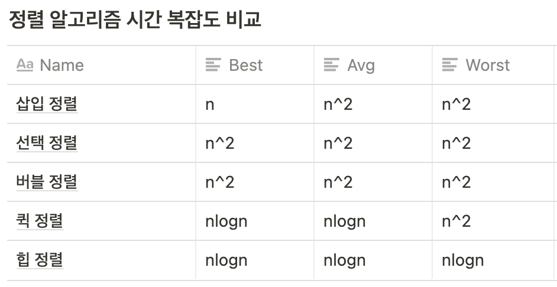

# 알고리즘

## sorting 알고리즘

### insertion sort(삽입 정렬)
앞에서부터 차례대로 이미 정렬된 배열 부분과 비교하여 자신의 위치를 찾아 삽입

~~~python
def insertion_sort(ls):
    sort = False
    while sort == False:
        sort = True
        for i in range(len(ls)-1):
            if ls[i] > ls[i+1]:
                ls[i], ls[i+1] = ls[i+1], ls[i]
                sort = False
    return ls
~~~

- 시간 복잡도 : 최선의 경우 $$O(n)$$, 최악의 경우 $$O(n^2)$$
- 사용 상황 : 레코드의 수가 적을 때, 대부분의 레코드가 이미 정렬 되어 있을 때 효율적이다.

### selection sort(선택 정렬)
- 과정 설명
1. 주어진 배열 중에서 최소값을 찾는다. 
2. 그 값을 맨 앞에 위치한 값과 교체한다.
3. 맨 처음 위치를 뺀 나머지 리스트를 같은 방법으로 교체 한다.
4. 하나의 원소만 남을 때까지 1~3 과정을 반복한다. 

~~~python
def selection_sort(ls):
    for i in range(len(ls)-1):
        idx = i + 1
        for j in range(idx, len(ls)-1):
            if ls[j] < ls[idx]:
                idx = j
        if ls[i] > ls[idx]:
            ls[i], ls[idx] = ls[idx], ls[i]
    return ls
~~~
- 시간 복잡도 :  $$O(n^2)$$

### Bubble Sort(버블 정렬)
서로 인접한 두 원소를 검사하여 크기가 순서대로 되어 있지 않으면 서로 교환한다.

~~~python
def bubble_sort(ls):
    swap = True
    while swap:
        swap = False
        for i in range(len(ls)-1):
            if ls[i] > ls[i+1]:
                ls[i], ls[i+1] = ls[i+1], ls[i]
    				swap = True
    return ls
~~~
- 시간 복잡도 : $$O(n^2)$$
  
### Quick Sort
- 다른 원소와의 비교만으로 정렬을 수행하는 비교 정렬에 속한다.
- 분할 정복 알고리즘의 하나로 평균적으로 매우 빠른 수행 속도를 자랑하는 정렬 방법
- 과정 :
    1. 리스트 안에 있는 한 요소를 선택한다. (피벗)
    2. 피벗을 기준으로 피벗보다 작은 요소들은 모두 피벗의 왼쪽으로 큰 요소들은 피벗의 오른쪽으로
    3. 피벗을 제외한 왼쪽/오른쪽 리스트를 다시 정렬한다. 
    4. 분할이 불가능할 때까지 반복한다.

~~~python
def quick_sort(ls):
    if len(ls) <= 0:
        return ls
        
    pivot = ls[0]
    small = []
    same = []
    big = []
        
    for i in ls:
        if i > pivot:
            big.append(i)
        elif i < pivot:
            small.append(i)
        else:
            same.append(i)
                
    return quick_sort(small) + same + quick_sort(big)
~~~
- 시간 복잡도 : $$nlog_2 n$$

### Heap Sort
- 완전 이진 트리의 일종으로 우선순위 큐를 위하여 만들어진 자료구조
- 최댓값, 최솟값을 쉽게 추출할 수 있는 자료구조
- 과정
    1. 정렬해야 할 n개의 요소들로 최대 힙(완전 이진 트리 형태)을 만든다. 
        - 내림차순 기준으로 정렬
    2. 그 다음으로 한 번에 하나씩 요소를 힙에서 꺼내서 배열의 뒤부터 저장하면 된다.
    3. 삭제되는 요소들(최댓값부터 삭제)은 값이 감소되는 순서로 정렬되게 된다. 
- 사용 상황 : 가장 큰 값 몇개만 필요할 때
- 시간 복잡도 : $$O(nlog_2n)$$

### 정렬 알고리즘 시간복잡도 비교

### 정렬 알고리즘 선택 기준

- 단순(구현 간단)하지만 비효율적인 방법 : 삽입  정렬, 선택정렬, 버블 정렬
- 복잡하지만 효율적인 방법 : 퀵 정렬, 힙 정렬

## 검색 알고리즘

### Binary Search
- 정렬 리스트에서 특정한 숫자 index를 찾을 때 사용
- 시간 복잡도 : $$log N$$

~~~python
def binary_search(ls, target):
    start = 0
    end = len(ls)-1
    while start < end:
        mid = int(end - start / 2) + start
        if target == ls[mid]:
            return mid
        elif target > ls[mid]:
            start = mid - 1
        else:
            end = mid - 1
    return -1
~~~

~~~python
def binary_search2(ls, target, start, end):
    if start > end:
        return ls
        
    mid = int(end - start / 2) + start
    if target == ls[mid]:
        return mid
    elif target > ls[mid]:
        return binary_search2(ls, target, mid-1, end)
    else:
        return binary_search2(ls, target, start, mid-1)
~~~

### Depth First Search(깊이 우선 탐색)
- 사용하는 경우 : 모든 노드를 방문 하고자 하는 경우 사용
- 단순 검색 속도 자체는 너비 우선 탐색에 비해서 느리다.
- 너비 우선 탐색보다 간단하다.
- 자기 자신을 호출하는 순환 알고리즘의 형태를 가지고 있다.

~~~python
def dfs(graph, start):
    visit = []
    stack = []
    stack.append(start)
    while stack:
        node = stack.pop()
        if not node in visit:
            visit.append(node)
            stack.extend(graph[node])
    return visit
~~~

- 시간 복잡도 : 정점의 수 N, 간선의 수 E
    - 인접 리스트로 표현된 그래프 :  $$O(N+E)$$
    - 인접 행렬로 표현된 그래프 : $$O(N^2)$$
    - 그래프 내에 적은 숫자의 간선만을 가지는 회소 그래프(Sparse Graph)의 경우 인접 행렬보다 인접 리스트를 사용하는 것이 유리하다.

### Breath First Search(BFS)
- 루트 노드에서 시작해서 인접한 노드를 먼저 탐색하는 방법
- 사용하는 경우 : 두 노드 사이의 최단 경로, 임의의 경로를 찾고 싶을 때 사용
- 재귀적으로 동작하지 않는다.

~~~python
def bfs(graph, start):
    visit = []
    queue = []
    queue.append(start)
    while queue:
        node = queue.pop(0)
        if not node in visit:
            visit.append(node)
            queue.extend(graph[node])
    return visit
~~~
- 시간 복잡도
    - 인접 리스트로 표현된 그래프 :  $$O(N+E)$$
    - 인접 행렬로 표현된 그래프 : $$O(N^2)$$
    - 그래프 내에 적은 숫자의 간선만을 가지는 회소 그래프(Sparse Graph)의 경우 인접 행렬보다 인접 리스트를 사용하는 것이 유리하다.

Reference
- https://gmlwjd9405.github.io/2018/08/13/data-structure-graph.html
